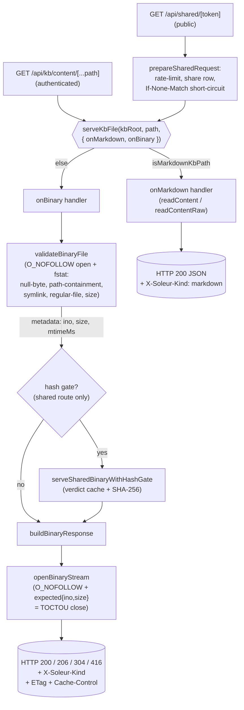

# ADR-021: KB binary-serving pattern — point-of-use re-validation and extension-fork routing

## Context

PR #2282 extended KB share beyond markdown to PDFs, images, CSVs, TXTs, and DOCX. The change introduced a public-unauthenticated endpoint (`/api/shared/[token]`) that serves arbitrary user-uploaded binaries from the workspace filesystem and reused the same helper from the authenticated owner endpoint (`/api/kb/content/[...path]`).

Two cross-cutting patterns emerged from the implementation that deserve to be a documented standard for every future KB-adjacent route (export, download-all, attachment streaming, etc.):

1. **Point-of-use re-validation.** Even when a path was validated upstream (at share-create time, via `kb_share_links.document_path`), `validateBinaryFile` in `apps/web-platform/server/kb-binary-response.ts` re-runs path containment, null-byte rejection, `O_NOFOLLOW` symlink rejection, regular-file check, and size check at every read. The validate fd is closed before return; `openBinaryStream` then opens a *fresh* fd with `O_NOFOLLOW` and validates the inode/size tuple via `expected: { ino, size }` to close the TOCTOU window between validate-time stat and serve-time stat. This is the service-role-IDOR learning applied to binaries; the path was hardened in PR #2282 across review-driven follow-ups #2307 (RFC 6266 filename encoding), #2314 (null-byte rejection), and #2320 (`O_NOFOLLOW` + fstat-via-fd to close the `lstat`→`readFile` TOCTOU).
2. **Extension-fork routing.** `serveKbFile(kbRoot, path, { onMarkdown, onBinary })` (in `apps/web-platform/server/kb-serve.ts`) dispatches by extension via `isMarkdownKbPath`. Both the owner route and the shared route call it with their own `onMarkdown`/`onBinary` handlers — a two-branch fork. As more file types gain rich rendering (DOCX → HTML, CSV → table, etc.), the fork could grow; the question is whether to keep it a two-branch fork or escalate to a dispatch table.

Per AGENTS.md and AP-011, cross-boundary architecture changes should be captured as ADRs. This pattern is now consumed by two routes and will be consumed by more. Related learnings: `2026-04-15-kb-share-binary-files-lifecycle.md`, `2026-04-17-kb-share-mcp-parity-lstat-toctou-and-mock-cascade.md`, `2026-04-17-stream-response-toctou-across-fd-boundary.md`, `2026-04-17-kb-route-helper-extraction-cluster-drain.md` (all under `knowledge-base/project/learnings/`). Documenting the pattern lets future contributors stay inside the lines.

## Considered Options

- **Option A: Document the established pattern as-is (two-branch fork + point-of-use re-validation).** Codify what shipped in PR #2282 as the standard for all KB-adjacent routes. Pros: zero migration cost, the implementation is already battle-tested across two routes, the two-branch fork is YAGNI-compliant — there are only two kinds (markdown JSON vs. binary stream) and that distinction is unlikely to subdivide. Cons: when a third "kind" emerges (e.g., HTML-rendered DOCX), the fork has to evolve, and a future reader has to re-derive the dispatch decision.
- **Option B: Escalate to a dispatch table immediately (Map<extension, handler>).** Replace the two-branch fork with a registry of extension → handler pairs, keyed off `kb-file-kind.ts`. Pros: extensible without touching `serveKbFile`, the dispatch surface is data not code. The signature concern is solvable — a table can return a `BinaryFileMetadata`-shaped intermediate and let callers compose response shape, so handler uniformity is not a hard blocker. Cons: speculative at N=2 — the only shipped fork branches are markdown vs. binary, which already have fundamentally different response shapes (JSON body vs. byte stream); a registry adds a layer of indirection that is harder to read and debug than a one-line `if`/`else` for negligible flexibility gain. The fork *is* the dispatch table at N=2.
- **Option C: Inline the validation per route (no shared helper).** Drop `kb-binary-response.ts` and let each route do its own validation. Pros: maximum local clarity. Cons: duplicates the security-critical TOCTOU guard, null-byte check, and `O_NOFOLLOW` open in two places where they will inevitably drift; this is exactly the failure mode the helper exists to prevent.

## Decision

**Option A.** The two patterns ship as the documented standard.

**Point-of-use re-validation rule.** Every KB-adjacent route that serves filesystem bytes MUST go through `validateBinaryFile` + `openBinaryStream` (or `readContent` / `readContentRaw` (markdown only) for markdown). Upstream validation (at share-create time, at upload time, in a database row) is treated as a hint, not as a security guarantee. The helpers in `apps/web-platform/server/kb-binary-response.ts` and `apps/web-platform/server/kb-reader.ts` are the only sanctioned entry points to KB filesystem reads from a route handler. New routes that bypass them require an ADR amendment.

**Extension-fork routing rule.** `serveKbFile(kbRoot, path, { onMarkdown, onBinary })` stays a two-branch fork. New "kinds" (HTML-rendered DOCX, table-rendered CSV, etc.) are layered inside `onBinary` via the `SharedContentKind` discriminator returned by `classifyByContentType` and the `X-Soleur-Kind` response header — they are response-shape variants of the binary branch, not new dispatcher branches. The fork escalates to a dispatch table only when (a) a new kind needs a fundamentally different request lifecycle (e.g., neither JSON nor a byte stream), or (b) the number of *route-level branches* — `if`/`switch` arms inside the route's `onBinary` closure that select a different response builder, not classifier branches inside `classifyByContentType` — exceeds three. Worked example: a route that branches `if (ext === ".docx") return renderDocxAsHtml(...); else return buildBinaryResponse(...);` counts as one route-level branch; adding `.csv` → `renderCsvAsTable(...)` and `.xlsx` → `renderSheet(...)` would hit three and trigger the escalation review. Both triggers require a follow-up ADR.

**Consumer contract.** All future KB-adjacent routes (export, download-all, attachment serving, the KB viewer's tree-content fetch) MUST call `serveKbFile`. They MUST NOT re-implement the markdown-vs-binary fork inline. They MUST handle the same `instanceof` chain (`KbAccessDeniedError`, `KbNotFoundError`, `KbFileTooLargeError`, `BinaryOpenError`) so error semantics never drift.

**Implementing a third route — checklist.** A new KB-adjacent route (e.g., a `/api/kb/export/[...path]` endpoint) wires up by: (1) calling `serveKbFile(kbRoot, relativePath, { request, onMarkdown, onBinary })`; (2) inside `onMarkdown`, calling `readContent` or `readContentRaw` and shaping a JSON response; (3) inside `onBinary`, calling `serveBinary(kbRoot, relativePath, { request, onError })` for owner-style routes (no hash gate), or calling `validateBinaryFile` + `serveSharedBinaryWithHashGate` for share-style routes (hash gate against a stored content hash); (4) reusing `mapSharedError`/equivalent for the `instanceof` chain. The HEAD handler mirrors GET via `buildBinaryHeadResponse` — see `app/api/kb/content/[...path]/route.ts` for the owner pattern and `app/api/shared/[token]/route.ts` for the public pattern.

## Consequences

**Easier:**

- New routes that need to serve a KB file inherit the full security posture (path containment, null-byte rejection, `O_NOFOLLOW`, TOCTOU close, size cap) by importing one helper.
- Hash-gating (`serveSharedBinaryWithHashGate`), Range support (HTTP 206), conditional GET (HTTP 304), and HEAD short-circuiting compose on top of `validateBinaryFile`/`openBinaryStream` without each route re-deriving them.
- The `SharedContentKind` discriminator is the single classifier — server, client viewer, and `X-Soleur-Kind` header all read from `classifyByContentType` so kind drift is impossible.
- Future audits have one place to look (`kb-binary-response.ts`) when tightening filesystem-read security.

**Harder:**

- The point-of-use re-validation is non-trivially expensive: every read does `open(O_NOFOLLOW)` + `fstat` + a second open with inode-equality check. For a hot path (e.g., a viewer that polls), this is a measurable cost. Mitigation: HTTP 304 short-circuit (`build304Response`) and `shareHashVerdictCache` skip the second open when the client's `If-None-Match` matches.
- The two-branch fork forces every new "kind" to fit inside `onBinary` until a third dispatch branch is justified. Contributors who want a new top-level branch must either justify the dispatch-table escalation in a follow-up ADR or restructure their feature to live under `onBinary`.
- The `onMarkdown`/`onBinary` callback shape forces routes to thread per-route concerns (request, logger, share token, expected hash) through closures. The shared route's `onBinary` is a closure over four fields, and `serveSharedBinaryWithHashGate` takes a five-field args object — the cost of keeping the dispatcher route-agnostic. A third route hits this immediately; the dispatch-table escalation criterion (a) above accepts this as one of the triggers if request-lifecycle divergence forces the closure surface to grow further.
- `O_NOFOLLOW` only refuses a symlink at the *final* path component — intermediate directory components in the joined path are still followed. Containment of intermediate symlinks rests entirely on `isPathInWorkspace`'s string-level check, not on a `realpath` resolution. A future contributor adding a code path that constructs paths from user-supplied directory segments must either keep `isPathInWorkspace` as the first guard or add a `realpath`-based check; this is a footgun the helper does not catch on its own.
- Inlining a route-specific shortcut ("this path is from a trusted DB column, skip validation") is now a documented anti-pattern. Reviewers should flag it.
- The "MUST go through the helpers" rule has no automated enforcement today — no ESLint rule restricts `node:fs` imports outside `kb-binary-response.ts` / `kb-reader.ts`, and codeowner gates do not cover it. A contributor who reaches for `fs.createReadStream` directly bypasses every guarantee silently. A follow-up to add `eslint-no-restricted-imports` for `node:fs` outside the helper modules is worth filing if a third route lands without one.

## Cost Impacts

None. This is a documentation decision over an already-shipped pattern. No new infrastructure, no new vendor, no new API usage.

## NFR Impacts

- **NFR-024 (Attack Prevention):** Improves from Partial to Implemented for *KB filesystem reads through `kb-binary-response.ts` and `kb-reader.ts`*. Point-of-use re-validation closes the validate-then-trust gap that an upstream-validated path could otherwise expose, and the inode-equality check on the second open closes the TOCTOU window between validate and serve. Other filesystem-touching surfaces (upload handlers, export jobs, attachment streamers, future routes that read user-supplied paths via different helpers) are out of scope and remain governed by their own validation.
- **NFR-041 (Link-Level Access Control):** Reinforces existing controls. The shared-token path runs the same validation as the owner path, so a public-unauthenticated link cannot bypass the security posture an authenticated request goes through.
- **NFR-008 (Low Latency):** Mild negative impact on the cold-cache path (extra `open` + `fstat`). Compensated on the warm path by HTTP 304 short-circuit and `shareHashVerdictCache` skip; a 304 response opens zero file descriptors.
- **NFR-001 (Logging):** Unchanged. Errors continue to flow through the `instanceof` chain and Pino logger.

## Principle Alignment

- **AP-011 (ADRs for architecture decisions): Aligned** — this ADR captures a cross-boundary pattern consumed by two routes and standardizes the contract for all future KB-adjacent routes.
- **AP-010 (Convention over configuration for paths): Aligned** — extension-based routing (`isMarkdownKbPath`, `getKbExtension`, `CONTENT_TYPE_MAP`) is a convention, not per-route configuration. The two-branch fork keeps the convention legible.
- **AP-006 (All knowledge in committed repo files): Aligned** — pattern is captured in the committed ADR and the two helper modules, not in tribal knowledge.

## Diagram

