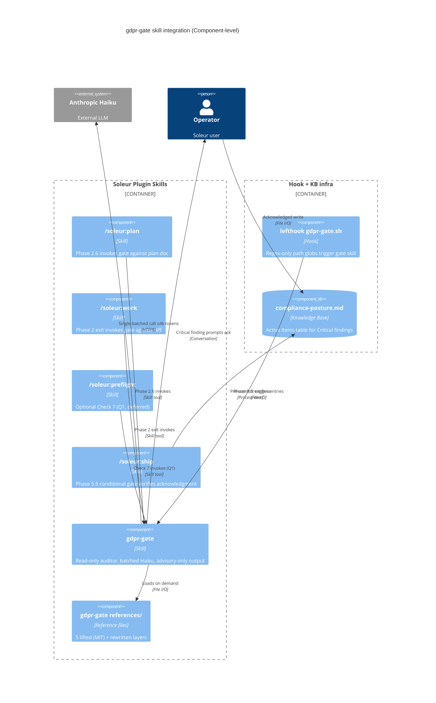

# ADR-026: PII gate as plan/work-phase skill with diff hook

## Context

Soleur's compliance posture is mature at the document layer (`legal-audit`, `legal-generate`, 9 active legal documents, vendor DPAs verified per `knowledge-base/legal/compliance-posture.md`) but absent at the code layer. When `/soleur:plan` and `/soleur:work` design schemas, migrations, auth flows, forms, API routes, and PII-touching code, there is no inline pre-generation gate that catches regulated-data design gaps before code is written. Existing scattered guardrails (secret-scan hook on fixtures per `cq-test-fixtures-synthesized-only`, Sentry payload scrubbing per `cq-silent-fallback-must-mirror-to-sentry`, regex scrubber invariants) are post-hoc; they catch leaks after the design is committed.

For an EU-deployed product with `single-user incident` brand-survival threshold (per `hr-weigh-every-decision-against-target-user-impact`), this gap is unacceptable. Soleur's deployment posture is GDPR-first (EU data residency: Hetzner Finland, Supabase Ireland; DPF/SCCs for US vendors). A code-level pre-generation gate is the missing layer.

The 2026-05-09 brainstorm (`knowledge-base/project/brainstorms/2026-05-09-gdpr-gate-skill-brainstorm.md`) evaluated `gosprinto/compliance-skills/pii-detector` (MIT, USA-focus) and decided to build a Soleur-native `gdpr-gate` skill that lifts 5 specific files under MIT attribution. This ADR records the architectural decisions for *how* the gate integrates into the existing Soleur surface — distinct from *what* it covers (recorded in the spec's FR1-FR7).

The decision cross-cuts three existing skills (`/soleur:plan`, `/soleur:work`, `/soleur:preflight`), the lefthook hook layer, and AGENTS.md rule surface. CTO flagged this at brainstorm Phase 0.5 as ADR-required because no single skill owns the gate's integration shape.

## Considered Options

- **Option A: Streaming gate on every Edit tool call.** Run the gate after each file edit, blocking on Critical findings. Pros: catches regressions immediately, no batch latency at phase exits. Cons: adds 3-8k tokens per edit (estimated from Sprinto layer-loading cost), reverses `/work` Phase 2 token-cost optimizations from PR #3492, breaks editor flow for harmless fixture edits, false-positive rate scales linearly with edit count.
- **Option B: Plan-phase skill + work-phase batch hook (chosen).** Two batched invocations: (1) `/soleur:plan` Phase 2.6 reads the plan doc and audits FR/TR sections; (2) `/soleur:work` Phase 2 exit (after TDD GREEN, before REFACTOR) runs one Haiku pass on the diff. Lefthook pre-commit fires the hook layer (regex-only path globs: `migrations/**`, `*schema*`, `*auth*`, `forms/**`, `app/api/**`, `**/*.prisma`, `**/*.sql`). Pros: token budget ≤4k per invocation, no per-Edit cost, single Haiku pass at known phase boundaries, deterministic and auditable. Cons: misses transient design regressions between commits.
- **Option C: Conditional review agent (mirror `user-impact-reviewer`).** Spawn a `gdpr-gate` agent only when plan heuristics hit. Pros: zero cost when not relevant. Cons: no diff-time enforcement — only fires at review time, after the design has shipped to PR. Misses the work-phase gate the brainstorm called for.
- **Option D: Pure keyword auto-trigger (Sprinto-style).** Use the SKILL.md `description:` trigger phrases and field-name match to auto-fire on any prompt mentioning regulated terms. Pros: zero explicit invocation needed. Cons: Soleur plan templates use language ("user table", "session sync") that over-matches; false-positive rate erodes the gate's authority within a week per CTO assessment.

## Decision

**Choose Option B**, with three trigger layers, no pure-keyword auto-trigger:

1. **Explicit invocation** during `/soleur:plan` Phase 2.6 (alongside the existing user-impact gate) and `/soleur:work` Phase 2 exit. Deterministic and auditable.
2. **Hook-enforced diff detection** via lefthook pre-commit on the path globs above. Hook layer is regex-only (zero LLM cost) and only triggers the skill invocation; Haiku LLM call happens inside the skill, not the hook.
3. **brainstorm-domain-config routing** so a CPO/CTO leader pulls the gate when a user message contains regulated-data signal during brainstorm Phase 0.5.

**Architectural invariant:** the gate is a **read-only auditor** of the canonical `/soleur:plan` template — it never injects its own required-controls checklist. The single source of truth for required controls is the canonical plan template. The gate reads + flags drift. This avoids the gate-vs-template collision where two control lists drift independently and operators face conflicting required-controls instructions.

**Token budget:** ≤4k tokens per gate invocation. Single Haiku call against (diff + plan excerpt). One pass per phase, never per-Edit.

**Output contract:** advisory-only, conversation-only by default, with mandatory disclaimer at top of every gate block: *"This is not legal review. Findings are heuristic. Consult `clo` + `legal-compliance-auditor` before merging."* No pass/fail verdict ever emitted.

**Critical-finding escalation:** Art. 9 special-category data, missing lawful basis, or new processing activity (Art. 30 RoPA trigger) → operator-acknowledged write to `compliance-posture.md` Active Items + GitHub issue, enforced via `/soleur:ship` Phase 5.5 conditional gate. Auto-write rejected — preserves human accountability for legal claims.

**Distribution:** plugin-native at `plugins/soleur/skills/gdpr-gate/`. SKILL.md ≤500 lines; layer files in `references/` to keep load-time token cost down (loaded on demand at gate invocation).

## Consequences

**Easier:**

- Pre-generation catch of GDPR Art. 9 special-category fields, missing lawful basis, missing retention, undeclared cross-border transfers, undeclared DSAR cascade paths.
- Token cost is deterministic and bounded (≤4k × 2 phases = ≤8k tokens per `/work` cycle); finance can budget Haiku spend predictably.
- Critical findings flow into the existing `compliance-posture.md` Active Items table — same surface CLO already monitors. No new dashboards.
- AGENTS.md remains lean — the gate gets one `[hook-enforced: gdpr-gate.sh]` rule pointer; full body lives in the skill (per `cq-agents-md-tier-gate`).

**Harder:**

- The hook adds latency to pre-commit on touched path globs. Mitigation: regex-only at the hook layer; Haiku call only fires on glob match.
- The gate-vs-template-collision invariant requires discipline at plan-template-edit time — any future addition of required-controls checklist items must go in the canonical `/plan` template, not the gate. Mitigation: ADR-026 is itself the carry-forward; reviewers check at `/soleur:review` time.
- Streaming-style continuous protection is sacrificed; transient design regressions between commits are not caught. Mitigation: lefthook pre-commit still fires before push, so the worst-case window is uncommitted local edits.
- Operator-acknowledged escalation (vs. auto-write) means a careless operator can dismiss a Critical finding. Mitigation: `/soleur:ship` Phase 5.5 conditional gate re-checks at ship time and refuses to ship if the acknowledgment is missing.

## Cost Impacts

**New paid vendor:** None.

**Marginal API cost:** Haiku invocations at gate firing. Estimated worst-case usage: 2 invocations/`/work` cycle × ~3k tokens average × $0.25 per million input + $1.25 per million output = ≈$0.001 per cycle. At 100 cycles/month/operator, ≈$0.10/month/operator. Negligible relative to the existing per-cycle agent spend.

**No change to `knowledge-base/operations/expenses.md`** — Haiku is already a tracked Anthropic expense; this decision adds a constant fraction of existing spend, not a new line item.

## NFR Impacts

References NFR IDs from `knowledge-base/engineering/architecture/nfr-register.md`. Affected containers/links: Skills (passive), Skill Loader (runtime, gate invocation), Hook Engine (runtime, lefthook), Knowledge Base (passive — `compliance-posture.md` writes), Agents -> Knowledge Base (internal, file I/O).

| NFR | Requirement | Container/Link | Before | After | Note |
|---|---|---|---|---|---|
| NFR-014 (Security — secrets handling, if present) | Skill must not read `.env*` or fixtures matching secret-scan ignore | gdpr-gate Skill | N/A | Implemented | v1 inspects only diffs/plans operator pasted; `repo-scan` mode deferred to v2 |
| NFR-026 (Encryption-in-transit, if present) | Haiku call to Anthropic over HTTPS | Agent Runtime -> Anthropic | Implemented | Implemented (no change) | Reuses existing TLS path |

Reconciled at amendment time (2026-05-10). NFR-027 / NFR-030 rows dropped — see Amendments section below. **Auditability/observability** is covered by existing `.claude/hooks/lib/incidents.sh` telemetry (`emit_incident hr-gdpr-gate-on-regulated-data-surfaces applied …` in the lefthook hook); no new NFR is added because the existing telemetry pattern already covers compliance-class findings.

## Principle Alignment

References AP-NNN IDs from `knowledge-base/engineering/architecture/principles-register.md`.

| Principle | Title | Status | Note |
|---|---|---|---|
| AP-004 | Agent-native parity | Aligned | Gate is invocable by both human and agent; output format is conversation-readable for both |
| AP-006 | All knowledge in committed repo files | Aligned | Skill + references + ADR all live in repo; no Claude Code memory writes |
| AP-007 | Exhaust automation before manual steps | Aligned | Hook layer + Haiku call automate detection; only escalation to `clo` is human-touched |
| AP-009 | Never delete user data | Aligned | Gate's DSAR-deletability check (Art. 17) flags missing cascade paths or anonymisation migrations at design time. Gate never deletes data itself; never-delete framing carried over from earlier-draft NFR-030 row (now dropped) lives here. |
| AP-011 | ADRs for architecture decisions | Aligned | This ADR is itself the satisfaction |
| AP-012 | New vendor checklist | N/A | No new vendor introduced |

No principle deviations. The advisory-only output (vs. blocking) is a deliberate design choice to preserve human accountability for legal claims (per CLO assessment) — it is *not* a deviation from any principle in the register, since no principle mandates blocking guardrails over advisory ones.

## Diagram

## Amendments

### 2026-05-10 — NFR table reconciliation (PR #3501)

Reconciled the NFR Impacts table against the live `knowledge-base/engineering/architecture/nfr-register.md` per the implementation plan's Research Reconciliation §3.2/3.3. Status remains `active`.

- **NFR-027 row dropped.** Live register: NFR-027 is "Encryption At-Rest", not auditability. The gate's auditability surface is covered by the existing `.claude/hooks/lib/incidents.sh` telemetry pattern; no new NFR is required.
- **NFR-030 row dropped.** Live register: NFR-030 is "Data Accuracy"; never-delete is **AP-009** (a principle), not an NFR. The never-delete framing has been moved into the AP-009 alignment rationale above.
- **Auditability/observability** added to the NFR Impacts narrative (between table and §Principle Alignment) as a non-NFR Consequences-class concern.
- **AP-009 alignment rationale** extended to absorb the never-delete framing originally drafted as NFR-030.

Plan: `knowledge-base/project/plans/2026-05-10-feat-gdpr-gate-skill-plan.md` §Research Reconciliation gaps #2/#3.
