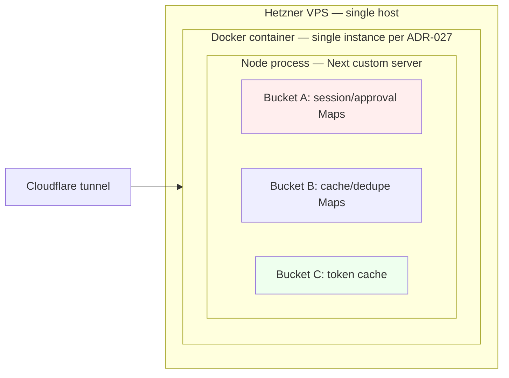

# ADR-027: Process-local state for runner sessions

> **Superseded by [ADR-068](./ADR-068-multi-host-workspaces-shared-git-data-lease-coordinator.md) (2026-06-30).**
> ADR-027 (Decision §1) self-mandated supersession as the required gate for raising
> replica count; ADR-068 — the multi-host `/workspaces` epic (#5274) — is that
> superseding diff and carries the Bucket-A migration. **The `replicas = 1` invariant
> below remains operationally in force** until the epic's GA phase (Phase 3) lands in
> prod; ADR-068 is `adopting` until then. What ADR-068 changes is governance + the
> migration shape: routing-truth → Postgres (#5338, already there); `_locks` → a
> per-workspace Postgres write-lease; the 5 live-handle Maps (AbortControllers /
> timers / SDK `Query` / Promise resolvers) stay **host-local by nature** with
> cross-host control **routed** by a stateless coordinator — NOT serialized to Redis
> (the original "externalize all 7 Maps" path is rejected as unbuildable; see ADR-068
> Considered Options B). The replica runtime guard + `ci-deploy.sh` assertion below
> stay enforced until Phase 3 relaxes them.

## Context

`apps/web-platform/server` runs as a single Node/Next custom server process (`apps/web-platform/server/index.ts`) inside one Docker container per Hetzner VPS. `apps/web-platform/infra/ci-deploy.sh` is the canonical deployment script and starts exactly one named container per host. No orchestrator (Kubernetes, Nomad, Docker Swarm) is in use. **NFR-019 (Auto-Scaling)** is currently `N/A` for all containers (`knowledge-base/engineering/architecture/nfr-register.md`).

Across the server module, the following module-level Maps live in JS heap and would not be shared across a hypothetical second worker process. This is the complete current inventory at `2026-05-11`, verified via `grep -nE "^const \w+ = new Map<" apps/web-platform/server/`:

**Bucket A — cross-replica-fatal (session/approval state).** Re-prompts or silent hangs under `replicas > 1`:

- `_ccBashGates` — `apps/web-platform/server/cc-dispatcher.ts:308` — Bash gate registry awaiting WS reply.
- `_bashApprovalCache` — `apps/web-platform/server/permission-callback-bash-batch.ts:33` — user-granted command prefix grants.
- `_locks` — `apps/web-platform/server/workspace-permission-lock.ts:44` — in-flight workspace mutation chain.
- `activeQueries` — `apps/web-platform/server/soleur-go-runner.ts:1332` (closure inside `createSoleurGoRunner` factory; module-scoped singleton at runtime) — in-flight query registry.
- `activeSessions` — `apps/web-platform/server/agent-session-registry.ts:33` — agent SDK session registry.
- `pendingDisconnects` — `apps/web-platform/server/ws-handler.ts:181` — WS reconnect grace-window timers.
- `sessions` — `apps/web-platform/server/session-registry.ts:6` — WS client session registry.

**Bucket B — cross-replica-degrading (cache/dedupe).** Duplicated work but correct under `replicas > 1`:

- `cache` (share-hash verdict) — `apps/web-platform/server/share-hash-verdict-cache.ts:33` — content-safety verdict cache.
- `_workspacePathCache` — `apps/web-platform/server/kb-document-resolver.ts:68` — workspace path resolution.
- `recentReports` — `apps/web-platform/server/conversation-writer.ts:51` — Sentry debounce.
- `_mirrorLastReportedAt` — `apps/web-platform/server/cc-dispatcher.ts:117` — Sentry debounce.

**Bucket C — already-correct under N>1.** Per-replica copies are fine:

- `tokenCache` — `apps/web-platform/server/github-app.ts:429` — GitHub App installation token; per-replica copies refetch independently with no correctness violation.

The single-replica invariant is **already half-documented** in scattered module-level comments — see `apps/web-platform/server/permission-callback-bash-batch.ts:14-20` for the canonical example. This ADR centralizes what those comments collectively half-say and gives the assumption an explicit governance hook.

PR #2954 (merged 2026-04-27) added the first two Bucket A entries (`_locks`, `_bashApprovalCache`), which is what surfaced this latent assumption and motivated issue #2955.

## Considered Options

- **Option A — Codify single-replica as the invariant; document the migration path.** Author this ADR, declare AP-013, add a runtime startup guard (`WEB_PLATFORM_REPLICAS > 1` aborts boot unless `ALLOW_MULTI_REPLICA=1`), and an infra pre-`docker run` assertion in `ci-deploy.sh`. (Chosen.)
- **Option B — Migrate the 7 Bucket A Maps to Redis or PG `NOTIFY` now.** Rejected — no horizontal-scale need today; the migration's failure modes (Redis outage → no Bash gates → blocked CC sessions) introduce a new hard dependency before any user-visible benefit. Preserved as the documented migration path (see Consequences).
- **Option C — Sticky load-balancing at Cloudflare with cookie affinity.** Rejected — sticky LB covers Bucket A *if* user sessions never move between workers (true at the LB level), but does not cover cross-user state like `_workspacePathCache`, the share-hash verdict cache, or `_locks` (which keys on workspace path; a workspace may be shared across users in the future). Insufficient on its own.

## Decision

The web-platform server **REQUIRES** `replicas = 1` per container until a superseding ADR documents a Bucket-A migration. The invariant is enforced at four review surfaces:

1. **Governance.** This ADR is the canonical source of the invariant. The migration path lives in **Consequences**; superseding this ADR is the required gate for raising replica count.
2. **Principle.** AP-013 in `knowledge-base/engineering/architecture/principles-register.md` cites this ADR. PR-review skills flag a violation when they detect a new module-level Map in `apps/web-platform/server/` without an ADR update. Note: AP-013 is the **first** AP whose canonical source is an ADR — all 12 existing APs cite `AGENTS.md` or `constitution.md`. The deviation is intentional: this is an architectural decision with a documented migration path, not a Hard Rule (mechanical) nor a constitution principle (foundational).
3. **Runtime.** `apps/web-platform/server/single-replica-assertion.ts` exports `assertSingleReplicaInvariant()`, called at the top of `app.prepare().then(...)` in `apps/web-platform/server/index.ts`. Reads `process.env.WEB_PLATFORM_REPLICAS`:
   - unset or `"1"` → no-op (today's default).
   - integer `> 1` AND `ALLOW_MULTI_REPLICA !== "1"` → mirror to Sentry, `process.exit(1)`.
   - integer `> 1` AND `ALLOW_MULTI_REPLICA === "1"` → warn-mirror to Sentry; boot continues. The override exists so a future migration can test the multi-replica path in dev without ripping out the guard.
   - non-integer (operator typo) → warn-mirror to Sentry; boot continues with single-replica semantics. Per `cq-silent-fallback-must-mirror-to-sentry`, the fallback is observable.
4. **Deploy.** `apps/web-platform/infra/ci-deploy.sh` adds a pre-`docker run` assertion: if a `soleur-web-platform` container is already running on the host, abort with a clear `ADR-027`-referencing error. This catches the case where `docker stop`/`docker rm` masked a failure (`|| true`) and a second invocation would otherwise produce a cryptic "name already in use".

## Consequences

- **Positive.** A future "let's add a replica" diff is forced to either (a) supersede this ADR with a migration plan or (b) explicitly toggle `ALLOW_MULTI_REPLICA=1` — both of which trip review attention. The latent assumption becomes a witnessed invariant.
- **Positive.** `cc-soleur-go` and the agent runner can keep using in-memory Maps without backporting Redis. The simplicity is preserved without paying a runtime dependency cost.
- **Positive.** The Bucket A/B/C taxonomy makes the migration path concrete: a future ADR-NNN can scope its work to the 7 Bucket A entries and leave Bucket B/C alone.
- **Negative.** Horizontal scale is gated on superseding this ADR. The migration path:
  - **Bucket A**: sticky load-balancing on `userId` at the Cloudflare edge covers session-scoped Maps (`_ccBashGates`, `_bashApprovalCache`, `activeQueries`, `activeSessions`, `pendingDisconnects`, `sessions`). `_locks` keys on workspace path and needs `flock` (filesystem-side) or a Redis SETNX-based mutex if cross-user workspace sharing lands.
  - **Bucket B**: optional Redis-backed cache or accept the duplicated work (cold-start cost only).
  - **Bucket C**: no change required.
- **Negative.** Operators learn a new env var (`WEB_PLATFORM_REPLICAS`) and a new fail-closed boot path. The default-unset behavior is no-op, but a misconfigured `WEB_PLATFORM_REPLICAS=2` deploy will hard-fail boot. Mitigation: the structured error message names the ADR and the override env var inline so operators do not have to grep code.
- **Negative.** The closure-scoped `activeQueries` Map inside `createSoleurGoRunner` is harder to reason about across replicas than a module-level Map. Documented here so a future migration knows to either lift the Map back to module scope or pass an injected registry through `deps:` — that is the migration's problem, not this ADR's.

## Cost Impacts

None. No new vendors, no billing-tier change, no infra additions. The Hetzner VPS sizing is unchanged. The runtime guard module is ~30 lines of TypeScript with no runtime dependencies beyond the existing `@/server/observability` helper.

## NFR Impacts

- **NFR-019 (Auto-Scaling).** Status remains `N/A` but becomes **explicitly N/A by ADR decree** rather than implicitly N/A by absence of orchestrator. The register row points to this ADR as the canonical source of the N/A rationale (see `knowledge-base/engineering/architecture/nfr-register.md`).
- **NFR-016 (Continuous Automated Delivery).** No change. Single-container deploy is the existing pattern; the new `ci-deploy.sh` pre-run assertion fires only when the deploy script's own `docker stop`/`docker rm` masked a failure.
- **NFR-014 (Externalized Environment Configuration).** Aligned. The new env vars (`WEB_PLATFORM_REPLICAS`, `ALLOW_MULTI_REPLICA`) are read via `process.env` per the existing pattern. Neither is added to Doppler — both are operator-set on-host overrides, not application configuration.

## Principle Alignment

- **AP-013 (Process-local state for runner sessions).** Declared by this ADR. See Decision §2 for the canonical-source rationale.
- **AP-006 (All knowledge in committed repo files).** Aligned. The invariant moves from scattered module-level comments (e.g., `permission-callback-bash-batch.ts:14-20`) into a single committed ADR.
- **AP-011 (ADRs capture "why we chose X over Y").** Aligned. The choice — single-replica + documented migration vs. Redis-now — is exactly the artifact shape ADRs are for.
- **AP-001 (Terraform-only infrastructure).** N/A — this is application-layer and deploy-script governance, not Terraform-managed infrastructure.

## Diagram

