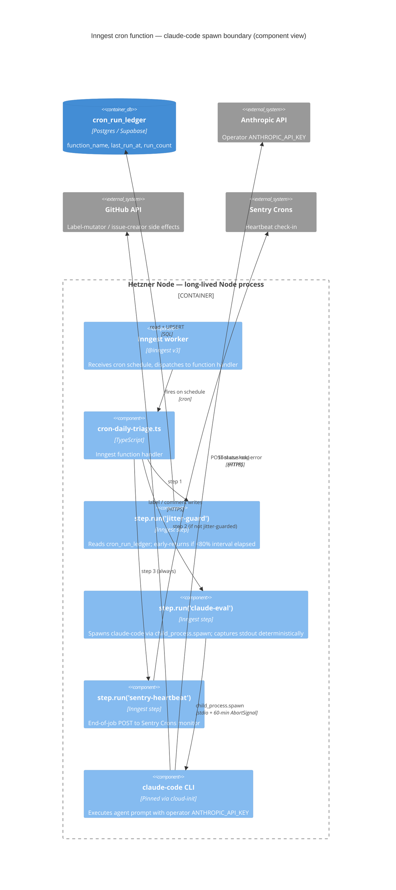

# ADR-033: Inngest cron functions invoke claude-code via child_process.spawn

## Context

PR-F (#3940, MERGED 2026-05-17) shipped the Inngest substrate self-hosted on Hetzner as the durable trigger layer for server-side agents (see [ADR-030](./ADR-030-inngest-as-durable-trigger-layer.md)). The first registered function — `cfo-on-payment-failed.ts` — is event-triggered and invokes the Anthropic SDK directly via `runWithByokLease` inside `step.run`.

The TR9 slice (#3948) migrates ~11 recurring "agent-loop" cron workflows from `.github/workflows/scheduled-*.yml` (currently invoked by `anthropics/claude-code-action` on GitHub Actions runners) to Inngest cron functions running inside the long-lived Node worker on the Hetzner host. The substrate-gap question driving this ADR is: **how do Inngest cron functions invoke `claude-code`?**

The two execution models differ in posture:

- `claude-code-action` spawns a **fresh ephemeral runner** per invocation, with a pristine `~/.claude/`, a 60-min GitHub Actions timeout, and runtime-injected agent prompt text. State does not survive across runs.
- Inngest functions are **long-lived worker processes** with `step.run` memoization (each step re-emits its memoized result on replay). The worker process owns its filesystem state.

Without a deliberate choice, the next 11 migration PRs would each independently re-invent how to invoke the agent — guaranteeing drift on the failure-mode-prevention contract (idempotency, replay-safety, cost ceiling). The decision must be made BEFORE PR-1 (`scheduled-daily-triage` migration) lands code, so every subsequent migration cites a single accepted invariant set.

Operator confirmed the decision 2026-05-18 during brainstorm Phase 1.2; recorded as K9 in `knowledge-base/project/brainstorms/2026-05-18-tr9-agent-loop-crons-inngest-migration-brainstorm.md`. CTO assessment (h) and CPO sign-off both accepted the spawn-child path.

## Considered Options

- **Option A: `child_process.spawn('claude-code', [...args])` inside `step.run('claude-eval', ...)`.** Treats `claude-code` as an external binary executed per step. Stdout/stdin/exit-code captured deterministically so `step.run` memoizes correctly on replay. Agent prompt loaded from a co-located `*.prompt.md` file (or inline string). Operator `ANTHROPIC_API_KEY` passed via env. **Pros:** preserves existing claude-code-action agent prompts as-is (no rewrite); lower-risk port; per-step memoization comes for free if stdout capture is deterministic; the spawn boundary is a natural place to enforce a per-step timeout via `AbortSignal`. **Cons:** spawn surface is one more failure mode (binary missing, version drift, working-directory assumptions); requires `claude-code` CLI on the Hetzner worker image with a pinned version.

- **Option B: SDK rewrite — invoke `@anthropic-ai/sdk` directly inside Inngest functions.** Port each agent prompt + tool-use loop into TypeScript code running in-process. **Pros:** no subprocess surface; full control over conversation state; no binary version-pinning; tighter integration with Inngest's `AbortSignal` + step boundaries. **Cons:** re-implements claude-code's tool-use orchestration, MCP server connections, the agent loop, file-edit primitives, and prompt-caching logic; 11× the per-workflow port cost; loses the prompt-file portability that claude-code-action already provides; tool-use bugs ship per-workflow instead of being centralized in one well-tested binary.

- **Option C: Inngest "function-as-CI" — keep claude-code-action, just have Inngest dispatch a GitHub Actions workflow_dispatch.** Inngest function fires on schedule, calls the GitHub API to dispatch the same `claude-code-action`-based workflow that exists today. **Pros:** zero migration of the agent invocation itself; reuses existing battle-tested action. **Cons:** doesn't actually migrate cron off GitHub Actions — defeats the purpose of TR9 entirely (the rationale is replacing GitHub Actions' jitter + lack-of-replay/idempotency with Inngest's). The cron scheduling moves but the execution doesn't; the failure modes the migration is meant to fix (silent failure, replay safety, observability) remain.
  - **Scope note (2026-06-02, terraform-drift migration):** this Option-C rejection is specific to the **agent-loop** crons, whose whole point was to move `claude-code` execution off GHA. For a **credential-heavy infra cron** whose execution *must* stay in an ephemeral runner (e.g. `scheduled-terraform-drift`: terraform binary + R2/AWS/Doppler `prd_terraform` cloud-admin creds that must NOT be parked on the long-lived app host), Option C is the *correct* shape — only goal (a) "kill GHA scheduling jitter" applies; goal (b) "move execution in-process" is actively harmful. See `apps/web-platform/server/inngest/functions/cron-terraform-drift.ts`. Do not mis-cite this rejection as a blanket ban on Inngest→workflow_dispatch.

## Decision

**Choose Option A.** Every Inngest cron function in `apps/web-platform/server/inngest/functions/cron-*.ts` invokes `claude-code` via `child_process.spawn` inside a `step.run('claude-eval', ...)` step.

The decision lands with PR-1 of #3948 (proof-of-pattern `scheduled-daily-triage` migration). This ADR may be superseded if a future operator decides the SDK-rewrite cost has dropped (e.g., after Anthropic ships a higher-level Node SDK matching claude-code's agent-loop primitives, or after 3+ workflows reveal spawn-boundary friction that the SDK avoids).

**Load-bearing invariants** (binding all 11 subsequent migrations):

- **I1.** `claude-code` is spawned INSIDE `step.run` (not at function entry). Step memoization is what protects against replay-cost runaway; spawning at entry escapes step memoization and triggers fresh Anthropic API calls on every replay.
- **I2.** Operator `ANTHROPIC_API_KEY` ONLY — never founder BYOK. Enforced via inverse-assertion in `apps/web-platform/test/server/byok-audit-writer-sweep.test.ts`: files matching `server/inngest/functions/cron-*.ts` MUST NOT import `runWithByokLease`. This is the "no-founder-context" boundary marker (see also I6).
- **I3.** `AbortSignal` aborts the spawned process at **60 minutes** (matches the old GitHub Actions `timeout-minutes: 60` ceiling and preserves the 0.75 min/turn peer-ratio floor for an 80-turn budget — see `2026-03-20-claude-code-action-max-turns-budget.md`). The `AbortSignal` is plumbed from Inngest's per-step timeout into the `child_process.spawn` options. Abort handler escalates with manual `process.kill(-child.pid, "SIGTERM")` then SIGKILL after 5 s on a `detached: true` process group so grandchildren (bash, gh) do not orphan. `[Refined 2026-05-18 post PR-1 plan review — 5-agent panel converged that the original 55-min figure under-fired the peer ratio; rollback-headroom rationale dropped since Inngest replays do not depend on spawn ceiling.]`
- **I4.** `claude` binary (npm package `@anthropic-ai/claude-code`) is **pinned via `apps/web-platform/package.json` dependency**. The existing deploy pipeline runs `npm install` on the Hetzner worker; the npm package's `postinstall` downloads the platform-native binary and exposes it at `node_modules/.bin/claude`. Inngest functions resolve the absolute path at module load via `createRequire(import.meta.url).resolve("@anthropic-ai/claude-code/package.json")`. The npm package installs the binary under the name `claude` (NOT `claude-code` — that is only the npm-registry package name). `[Refined 2026-05-18 post PR-1 plan review — original cloud-init pin was an extra IaC dance for no upside; the dep already ships via the same release artifact as the application code.]` `[Refined 2026-05-26 post TR9 PR-11 — I4 binary pin surface now includes Chromium, pinned transitively via @playwright/test devDep at docker build time (npx playwright@1.58.2 install --with-deps chromium). The @playwright/test package itself is a devDep omitted from the runner's npm ci --omit=dev; only the browser binary + system libs persist in the image. The Chromium revision is frozen in the image; drift between image-baked Chromium and any future @playwright/test bump is caught by the existing lockfile-sync CI gate.]`
- **I5.** Stdout/exit-code captured **deterministically** so `step.run` memoization fires reliably. Inngest's memoization is keyed on the serialized step result; if claude-code's stdout includes nondeterministic timestamps or progress chatter, memoization breaks and replays re-spawn the agent. PR-1 must verify deterministic capture via the FR10 integration test (second invocation in succession MUST NOT re-spawn).
- **I6.** Event payloads emitted by `cron-*` functions carry `actor: "platform"` tag. This is the boundary marker that lets platform-loop crons + per-founder runtime share one Inngest server; without it, `hr-gdpr-gate-on-regulated-data-surfaces` fires the moment PR-G (#3947) ships founder cohort exposure.
- **I7.** Cron containment is a **deny-by-default `PreToolUse` hook**, NOT the OS bash sandbox and NOT `--allowedTools`/`permissions.defaultMode`. `[Added 2026-06-08 — #5018/#5000/#5004.]` The substrate's `DEFAULT_CLAUDE_SETTINGS` sets `sandbox.enabled:false` (host-independence — immune to the recurring bwrap-userns drift #4928/#4932 that broke #5000/#5004) and registers `cron-bash-allowlist-hook.mjs` under a `*` catch-all matcher via `buildCronEvalSettings`. Phase-0 probes (committed AC0 evidence; re-verified on the prod-pinned CLI 2.1.79) proved that with the sandbox off, headless `claude --print` does **NOT** fail-close non-allowlisted commands via `--allowedTools` or any `defaultMode` (dontAsk/default/auto all fail-OPEN), and an unhooked tool class / a crashed hook **fails OPEN** — so the hook is the only fail-closed boundary. Load-bearing sub-invariants: (a) deny-by-default at the **tool-class** level (catch-all + explicit Read/Grep/Glob secret-path deny + Bash allowlist + Write/Edit self-protection) — `bypassPermissions` (the v1 P1-blocked exfil primitive) MUST NOT reappear; (b) **secret-out-of-context** is the real safety property — every env/secret-read path (env dump, `/proc`, `.git/config` where the clone URL embeds the token) is denied across Bash AND Read/Grep, so the allowed egress verbs (`gh issue create`, `git push`) can't leak a secret never read; (c) a **spawn-time self-test** (`runHookSelfTest`) asserts the hook denies a canonical exfil payload before any agent spawns — a failure aborts the cron (→ FAILED self-report) rather than running unprotected; (d) per-cron `--allowedTools` and `permissions.deny` are documented defense-in-depth, NOT relied upon. **Negative guarantee:** this containment governs the claude-code tool layer ONLY — it does NOT extend to Node-level `child_process.spawn("bash", …)` (cron-content-publisher / content-vendor-drift / rule-prune / weekly-analytics bypass it entirely). Those + the broad-bash crons (`TIER2_DEFERRED_CRONS`) are paused (D6) until restored under finite allowlists. `[Refined 2026-06-10 — #5046 PR-2/ADR-052.]` The Tier-2 boundary LANDED: the 4 spawn-bash crons are now contained by the DOCKER-USER container egress allowlist (ADR-052 — content-blind, off-allowlist-severing), and the hook's catch-all was relax-minimally opened to `Task`/`Agent`/`Skill` ONLY (every Bash/secret-read layer intact; gated by extended `runHookSelfTest` probes incl. a `*`-matcher registration check). That restored exactly the two crons whose sole denied construct was `Task` (cron-agent-native-audit, cron-legal-audit — issue-creator allowlists + a `contents:read`+`issues:write` token); the remaining nine stay deferred pending per-construct allowlist refinement (six PR-flow crons) or non-GitHub-egress coverage (bug-fixer, community-monitor, ux-audit). Only crons whose entire command surface is a finite allowlist (`CRON_BASH_ALLOWLISTS`) are restorable.

- **I8.** **Classify-fatal heartbeat + widened `routine_runs` failure contract.** `[Added 2026-06-29 — #5674.]` A claude-eval non-zero exit is NOT uniformly green and NOT uniformly red — it is **classified** from the captured stdout/stderr tail (`resolveBestEffortEvalOk` / `classifyEvalFatal` in `_cron-shared.ts`, single source of the fatal markers, shared with the credit-probe canary):
  - a **FATAL class** — credit exhausted (`/credit balance is too low/i`), auth/401 revoked (`invalid x-api-key` / `authentication_error`), spawn fault (`exitCode === -1` / `ENOENT`/`EACCES`), OR `abortedByTimeout` — MUST flip the Sentry monitor RED (`postSentryHeartbeat({ ok:false })`) and write a `routine_runs.failed` row carrying the redaction-scrubbed reason;
  - a **BENIGN** non-zero exit (`claude --print` hitting max-turns, clean no-artifact) MUST stay GREEN (liveness) but still record the reason via `warnSilentFallback` + a scrubbed `sentryExtra`.

  This **supersedes and reconciles** the 2026-06-01 decision (incident `5127648` / #4730 / PR #4727) that decoupled the heartbeat from `spawnResult.ok` — that fix correctly stopped benign max-turns false-pages; classify-fatal keeps that protection while restoring a red signal for the genuinely-fatal classes it over-suppressed (the 2026-06-29 credit-exhaustion incident: the whole fleet no-op'd with green monitors). The four masked best-effort crons (`cron-agent-native-audit`, `cron-legal-audit`, `cron-ux-audit`, `cron-bug-fixer`) route every non-zero exit through `resolveBestEffortEvalOk`; the eight output-aware producers keep `resolveOutputAwareOk` (output presence is their success contract) but now also emit a scrubbed `error_summary`.

  **Widened `routine_runs` contract:** for ANY `ROUTINE_METADATA` cron, a handler that **returns** `data.ok === false` (without throwing) is recorded `failed`. The run-log middleware (`middleware/run-log.ts`) gates ONLY the **thrown** path on the final-attempt retry window — a returned `ok:false` is *terminal* under `retries:1` (no retry) and is written immediately (gating it on the final attempt would drop the exact failure we record). The failure reason (scrubbed last-N stdout/stderr) reaches BOTH Sentry and `routine_runs.error_summary`. Every new tail sink (`formatTailForSentry`) routes through the canonical multi-secret scrubber (`redactGithubSourcedText`), not just `redactToken` — closing a pre-existing `sk-ant` Sentry leak in `resolveOutputAwareOk`.

  **No-balance-endpoint canary.** Anthropic exposes NO remaining-credit/prepaid-balance endpoint (verified live 2026-06-29 against the usage/cost API docs); the Admin Usage/Cost API reports *spend* only, under a separate `sk-ant-admin` key. So credit exhaustion is detected by an hourly 1-token canary (`cron-anthropic-credit-probe.ts`) on the operator `ANTHROPIC_API_KEY` (NOT a BYOK lease — I2), which pages on the classified credit-400 / auth-401 and **re-throws** transient/unclassified errors (429/500/529/network) so Inngest retries and the missed-checkin margin backstops (a 529 overloaded is not an empty wallet — false-paging it would itself be the alert-fatigue bug). Pre-exhaustion spend-vs-budget alerting via the Admin `cost_report` API is a deferred follow-up (`Ref #5674`) — it needs the new `sk-ant-admin` secret + an operator-set `ANTHROPIC_MONTHLY_BUDGET_USD` (no sensible default), so shipping it half-configured would false-alarm or never fire.

  **Alternatives considered (rejected):** (1) the prior *unconditional* "liveness, not success" green check-in — wrong because credit-exhaustion non-zero was indistinguishable from clean-no-artifact at the monitor level (the 2026-06-29 incident); (2) **flip-all non-zero → red** — rejected: reintroduces the #4730 daily false-page because `claude --print` exits non-zero on healthy max-turns runs, and pollutes `routine_runs` with false-`failed` rows; (3) the `in_progress → ok/error` two-phase check-in — not needed once classify-fatal distinguishes the classes at the source. Residual risk: **marker drift** — a new fatal mode whose tail matches no marker stays green; mitigated by keeping the marker set small/centralized/fixture-pinned and by the benign path still recording the reason in `routine_runs` (visible-but-not-paged, never invisible). Two further residuals, both accepted (review #5680): (a) **`abortedByTimeout` pages even on a *healthy* long run** — a cron that legitimately exhausts the 60-min budget (most plausibly `cron-bug-fixer`, the highest benign-non-zero-frequency cron) now flips RED rather than staying green-with-a-Sentry-error as before; this is **intended** — a budget overrun is a degraded outcome worth one page, and the alternative (a per-cron timeout exemption) reintroduces exactly the per-handler special-casing this design removed. If timeout-paging proves noisy in practice, raise the budget (I3) rather than re-exempting the class. (b) **The fatal-marker regexes match two distinct text sources** — the claude-CLI stdout/stderr tail (resolver) and the Anthropic HTTP JSON error body (canary) — coupling both detectors to one phrasing; robust today via case-insensitive substring and fixture-pinned, but a marker reword must be validated against both source shapes.

  **Amendment `[2026-06-29 — #5728]` — heartbeat-DELIVERY guarantee (the gap I8 left).**
  I8 reasoned about classifying a non-zero *exit* and **assumed the run reaches the
  `sentry-heartbeat` step**. #5728 surfaced the orthogonal case: the heartbeat is
  **never delivered** — the run is SIGKILLed mid-eval, a step *throws* before the
  heartbeat, or the single terminal POST is dropped (5xx/network/timeout) — so
  Sentry records a server-generated **`missed`** (not a client `?status=`).
  classify-fatal cannot color a check-in that never posts. Phase-0 evidence
  (`routine_runs` + Sentry checkins; Better Stack aged out) found the 2026-06-13→
  06-21 window was **SIGKILL-dominant** (zero `routine_runs` terminal rows while
  sibling crons logged normally) — whose remedy is the **graceful cron drain before
  container swap (ADR-078 / #5686)**, NOT a heartbeat-code change. The #5728 code fix
  closes the *delivery* gap for the throw/dropped-POST classes (defense-in-depth) via
  (i) a final-attempt-gated, memoization-safe terminal `?status=error` on the throw
  path (`finalizeOutputAwareHeartbeat`, adopted fleet-wide by the output-aware cohort),
  and (ii) a bounded retry (5xx/network/timeout; never 4xx) on the heartbeat POST.

  **The `in_progress → ok/error` two-phase check-in REMAINS REJECTED** (alternative
  (3) above) — single end-of-job POST stays the doctrine.
  **Recorded rejection COST (do not re-open the I8 debate):** without the
  run-correlation id an `in_progress` beacon would provide, a **late / retry-chain
  finish cannot reconcile to its scheduled period** — a standalone late `?status=ok`
  does NOT retroactively clear a `missed`. Therefore for the slow/late/killed class,
  **`checkin_margin_minutes` (sized against the worst-case retry-chain + shared
  `account` `limit:1` queue wall-clock, not single-run duration) and kill-prevention
  (ADR-078) are the ONLY levers** — Phase 1/2 delivery-hardening cannot close it.
  **Accepted residual:** a genuinely killed run reads `missed` until a late retry, and
  `missed` is an honest signal for a killed run. Runbook H11 carries the per-day
  H11a–d discrimination recipe. (For #5728 the verdict was kill-dominant with H1/H4
  only plausible on routine_runs-blind days, so the margin was left at 60 — no TF
  diff.)
  **Inngest-run-status vs. Sentry divergence (deliberate).** On a final-attempt
  genuine failure the output-aware cohort posts `?status=error` and **returns
  `{ok:false}` rather than throwing** (unlike the `cron-stale-deferred-scope-outs`
  precedent which rethrows). So the Inngest run is marked *succeeded* while the
  Sentry monitor is RED. This is intentional and preserves the pre-#5728 producer
  behavior: paging is driven by the Sentry check-in, and the failure is also
  recorded as a `routine_runs.failed` row (the I8 widened-contract: a returned
  `data.ok === false` is recorded `failed`) — so the failure is observable via two
  layers without relying on Inngest's native run status. If Inngest-level failure
  alerting is ever introduced, revisit this choice.

- **I9. Structured `--output-format json` for per-run cost capture.** `[Added 2026-07-09 — feat-anthropic-cost-attribution.]` `spawnClaudeEval` now requests `--output-format json` (injected at argv index, mirroring the `--strict-mcp-config` prepend, ONLY when the caller's `flags` do not already set `--output-format`) so the final `{"type":"result",…}` event carries the CLI's own authoritative `total_cost_usd` / `usage` / model (the model id is the KEY of `modelUsage`; Phase-0 live probe pinned the shape). A `SOLEUR_CLAUDE_COST` marker is emitted on EVERY child exit with a positive `capture_status` (`ok` | `no-result-event` | `parse-error` | `timeout`).

  **Reconciliation with I8 (the load-bearing constraint).** The credit/auth/spawn-fault classifier `classifyEvalFatal` substring-matches `stdoutTail + stderrTail`. Under the JSON format the CLI's stdout is a single result object, NOT free text, so the substrate **extracts the result event's human-readable `.result` text (which carries the API error message on an error run) back INTO `stdoutTail`** (via the pure `parseClaudeResultLine` helper) rather than letting raw JSON crowd the bounded tail. stderr is unchanged by `--output-format`, so an Anthropic API error still reaches `stderrTail` independently. I8 classification therefore survives: a credit-exhausted / auth-failed / spawn-fault run still classifies fatal, a benign max-turns run still classifies benign (unit-pinned; Phase-0 live confirmation cited in the plan's `## Research Insights`).

  **Reconciliation with I5 (deterministic capture).** `SpawnResult` gains optional `costUsd?` / `usage?` / `model?` (optional so inline-spawn sibling crons that build their own `SpawnResult` literals stay compiling). The FR10 memoized-step test stays green — the cost fields ride the same deterministically-captured exit path; a parse failure / old text format degrades the fields to `undefined` (fail-open), never a red run. Cost capture is wrapped and NEVER rethrows, so a logging failure cannot red a cron.

## Consequences

**Easier:**

- Migration cost per workflow drops to "translate the YAML to a 50-line TS file" — agent prompts move as-is from inline-YAML to `*.prompt.md` files co-located with the function.
- Replay safety is in scope of the existing Inngest contract — every cron-* function inherits the same `step.run` memoization story without per-function reasoning.
- The `AbortSignal` + 60-min ceiling gives a single consistent cost-runaway primitive across all 11 migrations (where GitHub Actions had 11 different `timeout-minutes` values to reason about).
- Single point of CLI upgrade across all 11 workflows (Hetzner cloud-init), instead of bumping `claude-code-action` version across 11 YAML files.
- Future workflow additions are mechanical: drop a new `cron-*.ts` file and a new `*.prompt.md`, register in `inngest.createFunction({cron: "..."}, ...)` — no GitHub Actions YAML at all.

**Harder:**

- Hetzner Inngest worker image must include `claude-code` with a pinned version (cloud-init or systemd unit). One more thing to keep in IaC drift-check.
- Spawn boundary introduces a `child_process` failure mode class (binary not found, working-directory assumptions, env-var inheritance gotchas). Per-function integration tests must exercise the spawn path.
- Stdout determinism is load-bearing for replay-cost safety; any future `claude-code` upgrade that adds nondeterministic stdout chatter silently breaks memoization. Mitigation: FR10 jitter-guard integration test catches it (second invocation MUST early-return without spawning).
- The 11 follow-up PRs all depend on the spawn primitive landing in PR-1. If PR-1's spawn primitive is wrong, fixing it requires a cross-cutting touchup of every migrated cron-* file (mitigated by per-workflow PR shape — the substrate primitive lives in a shared helper, not per-function code).

**[Refined 2026-05-19 post PR-2 plan review — account-scope concurrency keying]**

PR-2 (`cron-follow-through-monitor`) shares the `account`-scope `"cron-platform"` concurrency slot with PR-1 (`cron-daily-triage`). Decision: KEEP the global `"cron-platform"` key (vs per-function-class key like `"cron-platform-${fn.id}"`) at PR-2 scope. Rationale:

- Two cron-* functions today; schedule overlap impossible (PR-1 fires `0 4 * * *` daily, PR-2 fires `0 9 * * 1-5` weekdays).
- Manual-trigger latency upper bound under global keying = `max(MAX_TURN_DURATION_MS)` across all cron-* = 60 min (PR-1's daily-triage). Acceptable at PR-2 scale.
- Hetzner OOM protection that motivated the global slot at PR-1 remains correct: per-function-class keying would shift sizing budget from `max` to `Σ` and require Hetzner node up-sizing as the cron-* fan-out grows.

**Re-evaluation criterion:** if Monday drain time exceeds 4 hours OR any single function waits >120 minutes in the queue, split to dual pools. Switching to per-function-class keying (`{scope: "account", key: '"cron-platform-${fn.id}"', limit: 1}`) is mechanically simple (30-min find-and-replace) but requires concurrent Hetzner sizing review. `[Updated 2026-05-26 — original "past 3 functions" threshold replaced with empirical drain-time threshold; see Phase 2 refinement below.]`

**[Refined 2026-05-26 post TR9 Phase 2 plan review — schedule staggering + file prefix conventions]**

Phase 2 (#3948) migrates 21 additional functions to the single `cron-platform` pool (limit: 1), bringing the total to ~35 registered Inngest functions. The 5-agent plan review (DHH, Kieran, code-simplicity, architecture-strategist, spec-flow-analyzer) converged: dual pools are premature optimization; schedule staggering solves the real problem (Monday collision) at zero prerequisite cost.

**Schedule staggering strategy:**

- Monday is the heaviest day: 6+ cron functions fire between 06:00-16:00 UTC.
- Stagger Monday-scheduled functions by ≥90 minutes so queue depth never exceeds 2.
- Applied stagger offsets (vs original schedules):
  - `cron-growth-audit`: 09:00→07:00 UTC
  - `cron-seo-aeo-audit`: 10:00→11:00 UTC
  - `cron-linkedin-token-check`: 09:00→11:00 UTC (runs in parallel with seo-aeo-audit since both are <5 min pure-TS)
- Synthetic Sentry monitor `cron-platform-monday-drain` expects heartbeat by 18:00 Monday — if queue hasn't drained, missed check-in fires alert.

**File prefix conventions for `server/inngest/functions/`:**

| Prefix | Schedule | Sentry cron monitor | Example |
|--------|----------|--------------------|---------|
| `cron-` | Recurring (Inngest `cron:` field) | Yes — a `sentry_cron_monitor` resource (declaring it applies it; full-root apply since #6589, no `-target=` line) | `cron-daily-triage.ts` |
| `oneshot-` | One-time fire, no recurring schedule | No — error alerting only via `reportSilentFallback` | `oneshot-gdpr-gate-50d-eval.ts` |
| `event-` | Triggered by `inngest.send()` (manual or cascade) | No — no recurring schedule to monitor | `event-ship-merge.ts` |
| `_` (underscore) | N/A — shared helper, not a function | N/A | `_cron-shared.ts` |

Oneshots and event-triggered functions do NOT get `sentry_cron_monitor` resources. Sentry cron monitors would permanently false-alert on missed check-ins for functions that have no recurring schedule.

### Registration checklist (a NEW `cron-*` claude-eval function)

`[Added 2026-06-30 — #5631. Revised 2026-07-17 — #6589: was eight; the `-target=` allow-list location is gone (full-root apply), leaving seven.]` Adding a recurring claude-eval cron touches **seven** gated locations, not the "four" (handler + manifest + metadata + serve route) often cited in PR bodies. Each location below has a CI gate that fails closed; a stale or bot-generated PR that ran before some gate existed will look green until rebased onto current `main`. Mirror the structurally-closest live cron (claude-eval + `safeCommitAndPr` ⇒ `cron-seo-aeo-audit.ts`) signature-for-signature rather than writing the handler from the substrate's prose.

| # | Location | What to add | Gate that catches an omission |
|---|----------|-------------|-------------------------------|
| 1 | `server/inngest/functions/cron-<name>.ts` | Handler using the REAL substrate API (`spawnClaudeEval({spawnCwd, buildSpawnEnv, …})`, `mintInstallationToken({tokenMinLifetimeMs, repositories})`, `resolveOutputAwareOk({spawnOk, …})`). Prompt MUST carry `PERSISTENCE: Do NOT run git add` for safe-commit crons. | `web-platform-build` (`tsc`) + `cron-safe-commit-parity` (prompt anchor) |
| 2 | `app/api/inngest/route.ts` | `import` + entry in the `functions: [...]` array | `function-registry-count (a)` count + `(e)` watchdog set |
| 3 | `server/inngest/cron-manifest.ts` | `EXPECTED_CRON_FUNCTIONS` entry | `cron-inngest-cron-watchdog` parity |
| 4 | `server/inngest/routine-metadata.ts` | `ROUTINE_METADATA` entry | routine-metadata parity test |
| 5 | `server/inngest/functions/_cron-claude-eval-substrate.ts` | `CRON_BASH_ALLOWLISTS` entry (or `TIER2_DEFERRED_CRONS` if deferred) — substrate-contained crons MUST be in exactly one | `cron-containment-classify` |
| 6 | `test/server/inngest/function-registry-count.test.ts` | Bump the `route.ts functions array` count | `function-registry-count (a)` |
| 7 | `infra/sentry/cron-monitors.tf` | `sentry_cron_monitor` resource for the slug (declaring it applies it — the full-root apply needs no workflow edit) | `sentry-monitor-iac-parity` + `function-registry-count (c)` |

Plus the `cron-tier2-parity` sibling-set sweep (`.github/enforcement-contracts.json`) forces `cron-safe-commit-parity.test.ts` (add to `MIGRATED_PROMPT` for safe-commit crons) and `cron-shared.test.ts` into the same diff whenever `cron-manifest.ts` changes. Validate locally before push: `bunx vitest run test/server/inngest/{function-registry-count,sentry-monitor-iac-parity,cron-containment-classify,cron-safe-commit-parity,cron-shared}.test.ts`.

## Cost Impacts

**None.** Inngest substrate is already in `knowledge-base/operations/expenses.md` (PR-F shipped self-hosted on existing Hetzner node; no new vendor, no billing-tier change). `claude-code` CLI install on Hetzner is free; binary pin is a config change, not a paid resource. Operator `ANTHROPIC_API_KEY` consumption stays in the same operator-Anthropic billing surface — the migration is a substrate swap (GitHub Actions runner → Hetzner node), not a budget increase.

If the Hetzner node ever needs to upsize for concurrency (e.g., multiple cron-* functions running simultaneously), that's an operations-side cost decision NOT bound by this ADR. The Inngest free-tier "5 concurrent steps" cap is irrelevant under self-hosted.

## NFR Impacts

This decision is the **architecture primitive** that enables NFR improvements in subsequent PR-1 acceptance criteria; the ADR itself does not tier-move any NFR at the register level. The downstream effects when the 11 migrations land:

- **Improves NFR-001 (Logging) / NFR-003 (Observability)** for migrated crons: GitHub Actions silent-failure traps (per `2026-05-18-vendor-cron-heartbeat-silent-fail-pattern.md`) are eliminated because Sentry check-in is at end-of-`step.run` (FR4 of PR-1 spec). Status improvement applies per-migrated-workflow, not at the substrate level.
- **Improves NFR-007 (Circuit Breaker / Cost Ceiling)** indirectly: the I3 `AbortSignal` at 55-min provides a deterministic cost ceiling that GitHub Actions' `timeout-minutes` could only approximate.
- **No impact on NFR-026 (Encryption In-Transit)** — `claude-code` invokes the Anthropic API over HTTPS regardless of host; substrate swap doesn't change transport.

NFR register entries are not updated as part of this ADR; PR-1 (and each subsequent migration PR) updates the per-workflow row when the migration lands.

## Principle Alignment

- **AP-008 (Doppler secrets): Aligned** — `ANTHROPIC_API_KEY` already in Doppler `prd` (PR-F runtime). The Hetzner worker reads from Doppler, not from a `.env` file. Cron-* functions inherit the operator key from the parent Node process env.
- **AP-001 (Terraform-only provisioning): Aligned** — `claude-code` binary pin lives in `apps/web-platform/infra/server.tf` (cloud-init or systemd unit), not a manual operator step.
- **`hr-dev-prd-distinct-supabase-projects`: Aligned** — `cron_run_ledger` ledger writes hit dev/prd-distinct Supabase projects per the parent project posture.
- **`hr-autonomous-loop-skill-api-budget-disclosure`: NO-OP at write time** — the rule targets founder-BYOK consumption unattended. These cron-* functions consume the OPERATOR key only (invariant I2). Guard clause: if any future cron-* function transitions to per-founder execution, this ADR MUST be superseded and the budget-disclosure rule re-evaluated before that transition merges.

## Diagram

