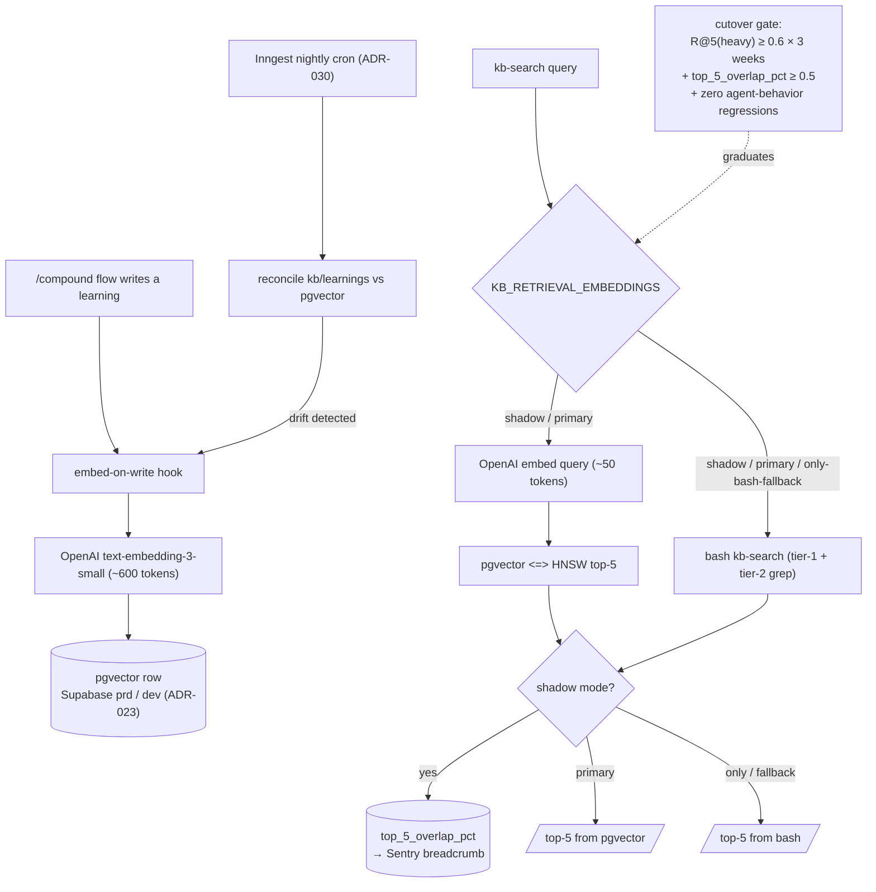

# ADR-038: Embeddings-based KB retrieval — substrate, bench gate, and migration

## Context

The `/compound` loop compounds institutional knowledge into `knowledge-base/project/learnings/` (~1169 files at the time of this ADR). Agents reach that corpus through the `kb-search` skill (`plugins/soleur/skills/kb-search/SKILL.md`), which is a Markdown prompt orchestrating a two-tier `grep` strategy. The `/compound`-write-then-`kb-search`-read cycle is the platform's primary mechanism for ensuring that lessons learned in one session apply to the next.

Issue #4119 reopened the 2026-04-07 RAG/embeddings decision after `scripts/learning-retrieval-bench.sh` produced empirical evidence that the lookup half of that loop is leaking. The 2026-04-07 brainstorm pre-committed the trigger for reconsideration as *"evidence that agents consistently fail to find relevant content despite having a manifest and standardized frontmatter."* The 2026-05-19 bench produced that evidence: `R@5(heavy, kb-search) = 0.133`, with `gap_skill_roi = -0.173` (bare `grep` outperformed the skill).

The #4119 plan committed a four-stage ladder. Each stage was pre-committed to either close the issue or trigger a more invasive successor:

| Stage | Mechanism | PR | Bench result | Action |
|---|---|---|---|---|
| Stage 1 | Mechanical structural fixes (cap-split, learnings-only tier-1, frontmatter backfill) | #4156 | R@5(heavy, kb-search) = 0.2947, `gap_skill_roi` = -0.008 (parity with `grep`) | Ladder → Stage 2 |
| Stage 2 | LLM paraphrase pre-pass (Haiku) over the user query | #4183 | R@5(heavy, kb-search) = 0.2566, **regressed** -0.0381 vs Stage 1, `gap_skill_roi` = -0.0274 (widened) | Ladder → Stage 3 (ADR-trigger) |
| Stage 3 | Embeddings/RAG retrieval | this ADR | — | This ADR |
| Stage 4 | (unfilled — no pre-committed fallback past Stage 3) | — | — | — |

Stage 2's diagnostic (`knowledge-base/project/learnings/2026-05-20-retrieval-diagnostic-findings.md`) attributed the regression to a structural ceiling: lexical-union over LLM paraphrases is bounded by `grep`'s own semantic ceiling (`R@5(heavy, grep) = 0.2966`). Closing the heavy-paraphrase gap to 0.4 requires a different retrieval substrate (vector similarity over embeddings), not better query expansion over `grep`.

This ADR exists because #4119's plan explicitly required it before any embeddings code lands. Per FR7+TR6 of the plan and per hard rule `hr-autonomous-loop-skill-api-budget-disclosure`, an embeddings-based retriever introduces a new external dependency (an embeddings provider), a new substrate (a vector store), and per-write cost (embed-on-`/compound`). None of those are silently introducible. The ADR closes when the substrate, bench gate, refresh cadence, and migration path are decided — implementation tracks under a separate issue.

## Considered Options

The five scope items in #4206 each have option spaces. Below, options are grouped per axis. The Decision section commits to one option per axis.

### Axis A — Embeddings provider

- **Option A1: OpenAI `text-embedding-3-small`** (1536-dim, $0.02 / 1M tokens). Pros: industry incumbent; benchmarked everywhere (MTEB v2, BEIR); 1536-dim is the pgvector sweet spot for HNSW; per-tenant billing isolation already understood by `coo` / `cfo`. Cons: adds OpenAI as a vendor (currently zero outbound OpenAI traffic — Anthropic-only); incremental Doppler secret to manage; cross-vendor data-flow disclosure widens the legal surface.
- **Option A2: Voyage AI `voyage-3-lite`** (512-dim, $0.02 / 1M tokens). Pros: Anthropic-recommended; tighter dim → smaller pgvector row → ~3× faster HNSW build; vendor alignment with the existing Anthropic relationship; private-preview SLA is favorable for our scale. Cons: smaller benchmarking corpus than OpenAI; smaller community of pgvector recipes pinned to `voyage-3-*` dims; not Cloudflare-routed (potential extra hop).
- **Option A3: Local `bge-small-en-v1.5` (384-dim) or `nomic-embed-text-v1.5` (768-dim)**. Pros: zero per-query cost; zero vendor add; data never leaves the host; ideal for `--no-paraphrase` sensitive-query path. Cons: requires GPU or CPU-bound inference on the Hetzner compute (ADR-008 Cloudflare-tunneled host, no GPU); cold-start of model in process is multi-hundred-MB; quality below `text-embedding-3-small` on MTEB heavy buckets; adds a model-versioning concern that doesn't exist today.

### Axis B — Storage substrate

- **Option B1: pgvector on the existing Supabase project**. Pros: zero new infrastructure (ADR-023 already mandates per-environment Supabase isolation, so dev / prd are already split); IaC managed via Supabase migrations alongside existing tables; AP-008 secrets path already in place; RLS posture already audited. Cons: ties retrieval availability to Supabase availability (which is also our auth substrate, so they share a fate either way); HNSW index rebuild on bulk reindex is non-trivial wall-clock time at corpus growth (linear, not load-bearing at ~1k rows but worth flagging at 100k).
- **Option B2: Local SQLite-vss on the compute host**. Pros: zero network hop on read; survives Supabase outage; trivially backed up by snapshotting the file. Cons: every container instance gets a stale copy; reconciliation across deployments becomes a problem; loses the per-environment isolation guarantee from ADR-023 (single host runs both envs); SQLite-vss is FAISS-under-the-hood and adds a heavy native dependency to the container image (NFR-038 contradicts).
- **Option B3: Qdrant (self-hosted or Cloud)**. Pros: purpose-built; HNSW + product-quantization first-class; fastest filtered search by far. Cons: a new infrastructure dependency (violates AP-007 "exhaust automation before manual steps" at the provisioning layer if self-hosted; or adds Qdrant Cloud as a paid vendor, $25/month minimum, which exceeds the budget framing in #4206); zero existing institutional knowledge.

### Axis C — Refresh cadence

- **Option C1: On-write via the `/compound` flow** (embed-at-write, persist alongside the markdown commit). Pros: zero staleness; one source-of-truth write barrier; no scheduled job to fail silently; matches the agent-native principle that any agent can write knowledge AND immediately retrieve it. Cons: failure to embed at write time silently drops a learning from the index (must be backstopped); per-write cost is non-zero (small, but observable).
- **Option C2: Nightly batch via Inngest cron** (ADR-030). Pros: cheap to operate; well-understood pattern (matches `kb-drift-walker`); rolling-window reconciliation; the bash kb-search loop already runs daily anyway. Cons: up to 24h staleness — the `/compound`-then-`kb-search` cycle is what we're trying to make fast; matches the failure mode that #4119 documented (knowledge takes too long to surface to subsequent sessions).
- **Option C3: Lazy-on-query** (embed the query, scan the corpus, embed-and-cache un-indexed rows on demand). Pros: amortized over actual usage; trivially survives backfill misses. Cons: first query on each new learning eats the embedding-and-index latency in-band; query-time write to a shared index is a concurrency hazard; throws away the writer's per-write determinism in exchange for read-time complexity.

### Axis D — Bench gate

- **Option D1: R@5(heavy) ≥ 0.4 (parity floor with the Stage-1 grep ceiling)**. Pros: matches the #4119 ladder threshold; minimum acceptable to claim Stage 3 closes #4119; "parity with grep" is a defensible Schelling point. Cons: 0.4 is *parity*, not improvement — shipping at 0.4 means embeddings cost is paid for zero recall lift over `grep`.
- **Option D2: R@5(heavy) ≥ 0.6 (stretch / true unblock)**. Pros: defensible ROI for the embeddings cost; ~2× over the current grep ceiling; unblocks #4042 (the archive-by-R@K mechanism) cleanly. Cons: aggressive vs published MTEB heavy-bucket numbers for short-paraphrase queries on small corpora (~1k rows); risk of an honest gate-miss with no Stage 4 pre-committed.
- **Option D3: Two-gate ladder — floor 0.4 to land, target 0.6 to default-on**. Pros: lets the implementation land in a parallel-run shadow mode at 0.4, then graduate to primary-retriever at 0.6; matches Stage 1's structural-fix philosophy (land the mechanism, then iterate); creates a natural gate for cutover. Cons: more decision points; the "graduate to default" gate must be enforced by something other than operator memory.

### Axis E — Migration path

- **Option E1: Parallel-run for ≥2 weeks** (both `kb-search` bash AND embeddings retrieval run on every query; agents read embeddings as primary, bash as fallback). Pros: regression detection by direct comparison (top-5 overlap %); zero-downtime cutover; rollback is one feature-flag flip. Cons: 2× per-query cost during the parallel window; the comparison metric must itself be designed (not just "different = bad").
- **Option E2: Hard cutover post-bench-pass**. Pros: simpler; the bench-pass IS the gate. Cons: bench numbers and *agent-behavior* numbers are not the same metric (per #4206 scope item 5); a passing bench does not prove agents stop hitting the failure modes that drove #4119; rollback requires a deploy, not a flag flip.
- **Option E3: Embeddings-only, retire `kb-search` bash immediately**. Pros: removes the maintenance cost of two retrievers; forces commitment. Cons: removes the `--no-paraphrase` sensitive-query path (which deliberately avoids LLM/embedding round-trips per Phase 2.5 of the kb-search skill); removes the fallback when Supabase is unreachable; violates AP-007's "exhaust automation before manual steps" gradient by jumping past the safer parallel-run option.

## Decision

This ADR commits to one option per axis. Each commitment is auditable against the corresponding axis above.

- **Axis A — Provider: A1 (OpenAI `text-embedding-3-small`, 1536-dim).** The Anthropic-vs-OpenAI vendor concern is real but contained: OpenAI's MTEB v2 evidence, pgvector tooling depth, and dimensional fit for HNSW outweigh the cost of adding a second LLM vendor. Voyage (A2) is the named fallback if cost grows materially OR Anthropic releases a first-party embedding endpoint comparable to `voyage-3-lite`. Local models (A3) are deferred until a `--no-paraphrase`-shaped sensitive-query path needs an embedding answer (today the path stays on bash `grep` and skips embeddings).
- **Axis B — Substrate: B1 (pgvector on existing Supabase).** ADR-023's per-environment Supabase isolation already partitions dev / prd embeddings; AP-008 already governs the Supabase secret; RLS posture is already audited. SQLite-vss (B2) loses the per-env guarantee. Qdrant (B3) is a new vendor with no existing knowledge — defer until corpus exceeds 100k learnings OR pgvector HNSW build wall-clock crosses 30s on the prd corpus.
- **Axis C — Refresh cadence: C1 (on-write via `/compound`) + C2 (nightly reconciliation as a backstop).** The on-write hook is the primary path; a nightly Inngest cron reconciles the embedded set against `knowledge-base/project/learnings/*.md` and re-embeds any drift. C3 (lazy-on-query) is rejected — query-time index mutation under concurrent agent load is the wrong shape.
- **Axis D — Bench gate: D3 (two-gate ladder).** **Floor: R@5(heavy, embeddings) ≥ 0.4** — minimum to land in parallel-run mode behind a feature flag (`KB_RETRIEVAL_EMBEDDINGS=shadow`). **Target: R@5(heavy, embeddings) ≥ 0.6 on three consecutive weekly bench runs** — required to graduate to primary retriever (`KB_RETRIEVAL_EMBEDDINGS=primary`). Failure to clear the floor inside one implementation cycle = revert and document the revert in a follow-up learning; no Stage 4 is pre-committed.
- **Axis E — Migration path: E1 (parallel-run for ≥2 weeks).** Both retrievers run on every query during the parallel window. The skill emits `top_5_overlap_pct` for each query as a metric (mirrored to Sentry per `cq-silent-fallback-must-mirror-to-sentry`). Cutover gate requires: (a) target bench passed three weeks running, (b) `top_5_overlap_pct` ≥ 0.5 across the parallel window (sanity check that the two retrievers agree on the easy cases), (c) zero new agent-behavior regressions surfaced through the `one-shot`, `work`, or `review` skills. Bash `kb-search` survives indefinitely as the `--no-paraphrase` path and as the cold-Supabase fallback.

**Implementation must NOT begin from this ADR.** Per #4206 acceptance: this ADR closes when its decisions are recorded; a separate implementation issue is filed against the floor/target bench gate above, and #4206 closes when the ADR is decided (not when embeddings ship).

## Consequences

**Easier:**

- Agents reach corpus content through one named substrate that has a measured recall floor and a measured recall ceiling, not through a `grep` strategy whose ceiling was empirically bounded at 0.30.
- New `/compound` writes index immediately; the writer-then-reader latency that drove #4119 collapses to the embed-write barrier (a single Anthropic+OpenAI round-trip, both already in agent-runtime context).
- #4042 (archive-by-R@K) unblocks once the target gate passes — "low recall = archive candidate" becomes a defensible signal again because the retriever stops being the rate-limit.
- Future `--tag` / `--category` faceted queries compose with vector similarity (pgvector `WHERE` + `<=>` operator), removing the current need for the bash AWK frontmatter parse to happen in-shell.

**Harder:**

- Two retrievers run concurrently for ≥2 weeks, doubling per-query KB cost during the parallel window (small absolute number — see Cost Impacts — but operationally a footgun if the parallel-run flag silently sticks).
- The feature flag `KB_RETRIEVAL_EMBEDDINGS` needs `shadow` → `primary` → (eventual) `only` graduation gates enforced by a check that is NOT operator memory. The Stage-1-to-Stage-2 ladder in #4119 had the bench-result-itself as the gate; this ADR's cutover gate adds the `top_5_overlap_pct` check, which must be wired into the bench script's recommendation block before parallel-run begins.
- Per-write embedding adds a new failure mode: a `/compound` write that succeeds-to-markdown but fails-to-embed produces a silently un-indexed learning. The nightly reconciliation closes this loop, but the gap between write and reconcile is up to 24h. Mitigation: the nightly job emits a Sentry breadcrumb naming each reconciled-late file so the rate of write-then-fail-to-embed is observable, not silent.
- A new vendor (OpenAI) joins the data-flow surface. The legal-compliance-auditor must review the data-flow disclosure before any production traffic lands on `text-embedding-3-small`; the query payload includes the user's literal `kb-search` argument, which can carry secret-shaped strings if `--no-paraphrase` is bypassed (per Phase 2.5 of the skill, that path stays on bash grep — but the rule must survive the rewrite).
- The embedded representation is OpenAI-version-specific. If `text-embedding-3-small` is deprecated or upgraded (`text-embedding-3-medium`?), the corpus must be re-embedded; the migration tooling (a one-shot re-embed script) must exist before model-version updates land, not be improvised at upgrade time.

## Cost Impacts

Reference baseline: `knowledge-base/operations/expenses.md`. Current KB-retrieval line is $0 (bash + grep on the compute host).

- **One-shot ingest (1,169 learnings × ~600 tokens × $0.02 / 1M):** ~$0.014. Negligible.
- **Per-write embedding (1 learning × ~600 tokens × $0.02 / 1M):** ~$0.000012. At current `/compound` cadence (~5/day), this is ~$0.00006/day, ~$0.02/year.
- **Per-query embedding (1 query × ~50 tokens × $0.02 / 1M):** ~$0.000001. At current `kb-search` invocation cadence (~50/day across active operator + agents), this is ~$0.00005/day, ~$0.02/year.
- **pgvector storage:** 1169 rows × 1536 dim × 4 bytes = ~7 MB. Sits inside existing Supabase project allocation; no incremental line item.
- **Parallel-run window (≥2 weeks):** doubles per-query cost during the window — total marginal cost ~$0.0007 over the entire 2-week window. Operationally negligible; flagged here only because the *flag-sticks-on* failure mode is not bounded by cost (it's bounded by metric noise).

Total annualized incremental cost at current scale: **< $1/year.** Per #4206, cost is not the bottleneck; the substrate, gate, and migration path are. This ADR records the cost framing to satisfy `hr-autonomous-loop-skill-api-budget-disclosure` for the implementation issue that follows.

## NFR Impacts

- **NFR-008 (Low Latency):** Mild negative impact on the cold path (every query adds one OpenAI embedding round-trip — typically 60-150ms p50). Mitigation: cache the query embedding (`.soleur/cache/kb-search/query-embeddings.ndjson`, same TTL + 0600/0700 mode as the existing paraphrase cache); pgvector `<=>` HNSW lookup is sub-millisecond at 1k rows. Parallel-run window adds a second cold-path call (the bash retriever) — accepted as the cost of regression detection during cutover.
- **NFR-029 (Data Freshness):** Improves from Partial to Implemented for the KB retrieval surface. On-write embedding eliminates the staleness window that the bash retriever had via stat-time filesystem reads; nightly reconciliation backstops the on-write hook.
- **NFR-027 (Encryption At-Rest):** Unchanged — pgvector rows ride the same Supabase encryption posture as the existing tables (ADR-023, AP-008). No new encryption decisions.
- **NFR-026 (Encryption In-Transit):** Unchanged — OpenAI traffic is HTTPS over the existing Cloudflare-tunneled compute host; the new `Agent Runtime -> OpenAI` link inherits the same posture as `Agent Runtime -> Anthropic`.
- **NFR-014 (Externalized Environment Configuration):** Adds one new Doppler secret (`OPENAI_API_KEY`) and one new env-scoped variable (`KB_RETRIEVAL_EMBEDDINGS={shadow|primary|only}`). Per AP-008, both ride through Doppler; the flag is set per-environment to keep dev / prd parallel-run windows independent.
- **NFR-042 (LLM-Ready Documentation):** Improves indirectly — the `R@5(heavy)` floor under embeddings is the new measurable bound on how easily an LLM agent (the consumer of `kb-search`) can find recorded knowledge. The bench script becomes the regression detector for this NFR.
- **NFR-041 (Link-Level Access Control):** A new outbound link (`Agent Runtime -> OpenAI`) is added to the container inventory. Must be added to `knowledge-base/engineering/architecture/diagrams/container.md` in the implementation PR; access-control posture matches the existing `Agent Runtime -> Anthropic` link.

## Principle Alignment

- **AP-006 (All knowledge in committed repo files): Aligned** — the embedded representation is derived from the markdown files in `knowledge-base/project/learnings/`; the markdown remains the source of truth, the embedding is a queryable index over it.
- **AP-007 (Exhaust automation before manual steps): Aligned** — Stages 1 and 2 of the #4119 ladder shipped the cheaper structural and query-expansion fixes first. This ADR triggers Stage 3 only after the cheaper options were measured and rejected by bench.
- **AP-008 (Doppler for all secrets management): Aligned** — `OPENAI_API_KEY` lands in Doppler alongside the existing `ANTHROPIC_API_KEY`; no per-environment `.env` exception.
- **AP-011 (ADRs for architecture decisions): Aligned** — this ADR is the artifact #4119's plan pre-committed; the rich shape is justified by the rubric below.
- **AP-013 (Process-local state for runner sessions): N/A** — embeddings retrieval is a stateless query against a shared substrate; no per-session state introduced.
- **AP-012 (New vendor checklist): Deviation requiring follow-through** — OpenAI is a new vendor. The implementation PR MUST run the new-vendor checklist (security review, data-flow disclosure, billing isolation, Doppler secret rotation policy) before `KB_RETRIEVAL_EMBEDDINGS=primary` graduation. The deviation is "this ADR commits to OpenAI without having yet run the checklist"; the resolution is "the checklist runs against the implementation PR, gating the `primary` graduation, not the `shadow` land". `legal-compliance-auditor` consultation is required at that gate per `hr-gdpr-gate-on-regulated-data-surfaces` if any embedded learning references PII (current corpus does not, but this must be re-verified at parallel-run start).

**Rubric trigger audit (per `adr-template.md` § Choosing the shape):**

- Trigger 1 (cross-cutting code surface): hit — the retriever is consumed by every skill that calls `kb-search` (current grep on `description:` matches across 9 skills referencing `/kb-search` directly + every agent that delegates to it).
- Trigger 2 (material cost impact): hit — OpenAI is a new vendor row in `knowledge-base/operations/expenses.md`.
- Trigger 3 (NFR-moving): hit — NFR-029 moves from Partial to Implemented; NFR-008, NFR-014, NFR-041 take impact lines.
- Trigger 4 (principle deviation): hit — AP-012 deviation with documented follow-through.
- Trigger 5 (teeth-bearing alternatives): hit — three concrete provider options, three substrate options, three cadence options, each with named tradeoffs.

Five of five triggers — rich shape is required, not optional.

## Diagram

