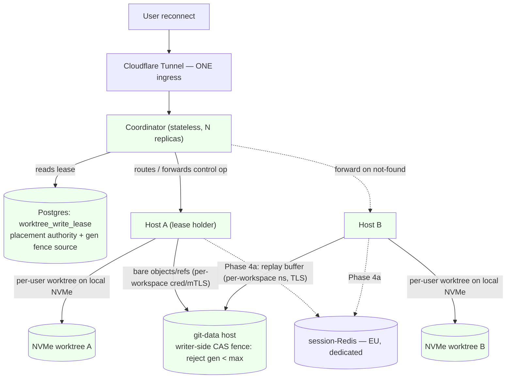

# ADR-068: Multi-host `/workspaces` via shared git-data + per-user worktrees + lease-routed coordinator

- **Status:** adopting — flips to `accepted` when the GA phase (Phase 3) lands in prod. The `replicas = 1` invariant ADR-027 codified remains operationally in force until then; this ADR is the governance gate ADR-027 required for raising it.
- **Date:** 2026-06-30
- **Issue:** #5274 (the explicit re-evaluation trigger); epic plan `knowledge-base/project/plans/2026-06-29-feat-multi-host-workspaces-layer-plan.md` (PR #5710). Related: #5240, #5273, #5275, #5338, #5546, #5547, #5723.
- **Supersedes:** **ADR-027** (`ADR-027-process-local-state-for-runners.md` — `superseded-by: ADR-068`). ADR-027 self-mandates supersession for any multi-replica diff; this ADR is that diff and carries the Bucket-A migration.
- **Re-opens:** **ADR-059** (`ADR-059-stream-since-disconnect-replay-buffer.md`) — it rejected Redis because "no multi-instance requirement exists." This ADR creates that requirement; the replay buffer migrates to Redis in Phase 4a.
- **Lineage:** AP-013 "Process-local state for runner sessions" → ADR-027 (the governing tier principle this ADR supersedes); ADR-059 (in-process replay buffer); ADR-033 (credential-heavy real-stack execution — the pure-TS Inngest cron substrate for lease reclaim); ADR-038 (team workspaces / workspace-as-grain); ADR-044 (workspace-as-source-of-truth owner-gate, `is_workspace_member`); ADR-030 (self-hosted Inngest Redis — the AOF + `--requirepass` precedent the **distinct** session-Redis reuses). Migration precedents: `029_plan_tier_and_concurrency_slots.sql` / `093_*` (`acquire_conversation_slot` fenced-upsert shape), #5338 (`user_session_state.current_workspace_id` lazy rehydrate).

## Context

Today the backend is entirely single-host: one Hetzner server → one RWO block
volume (`apps/web-platform/infra/server.tf:937-940`) mounted `/mnt/data` →
container `/workspaces` → one Node process → in-memory state Maps. ADR-027
codifies a hard `replicas = 1` invariant; ADR-059 puts the stream-replay buffer in
process memory assuming same-process reconnect. To go live and scale with real
users — for concurrent capacity, HA, GA-readiness, and cost bin-packing (all four
confirmed by the operator) — the `/workspaces` layer must become a cluster. This is
the explicit re-evaluation trigger for **#5274**.

The operator chose the maximum target on both axes: **one workspace's users
servable across multiple hosts concurrently**, and **failover invisible even on
unplanned crash, with near-zero loss of uncommitted (un-pushed) work**. Delivery is
**Approach A** — a staged path that reaches that full end-state, hardest-part first,
with the operator choosing which step gates GA.

**The architectural reframe (settled at brainstorm):** never have multiple hosts
write one git index — it corrupts on any filesystem, a git property, not a storage
one. "One workspace spans hosts" therefore means shared git **data**
(objects/refs) + **per-user worktrees** on host-local NVMe, with collaboration
mediated by git refs + a shared state layer.

**The load-bearing research correction.** The spec/brainstorm inherited
"externalize the 7 ADR-027 Maps → Redis." Focused code research (2026-06-29)
falsifies that as written. Only **1 of 7** Maps needs cross-host visibility AND is
serializable (`userWorkspaces`, registry:46 — and it is **already** Postgres-backed
via #5338). The other live handles cannot be serialized at all: `activeSessions` =
AbortController + Promise resolvers; `_locks` = a Promise-chain mutex;
`pendingDisconnects` = `NodeJS.Timeout`; `_ccBashGates` = AgentSession w/ resolvers;
`activeQueries` = Timers + live SDK `Query` + input queue; `sessions` = the live
socket. A turn's AbortController / SDK `Query` executes in the owning host's
process; only that host can abort it. **The cross-host control problem is not a
serialization problem — it is a routing problem.**

## Considered Options

- **Option A — Shared git-data + per-user worktrees + Postgres write-lease +
  lease-routed stateless coordinator (rejecting Ceph/k8s/NFS-for-the-live-tree).**
  Bare repos (objects/refs) on a shared git-data host over the private net;
  worktrees on host-local NVMe; a per-worktree write-lease in Postgres (mirroring the
  canonical `acquire_conversation_slot` fenced upsert) with writer-side CAS fencing
  at the git-data host; a **stateless** coordinator that routes a session to the
  lease-holding host and forwards control ops (abort/gate/grace) to it. Live-handle
  state stays host-local by nature; cross-host control is routed, not serialized.
  Redis enters only in Phase 4a, scoped to the ADR-059 replay buffer. **(Chosen.)**
- **Option B — Externalize all 7 ADR-027 Maps to Redis (the inherited spec).**
  Rejected — 5 of 7 hold AbortControllers / timers / a live SDK `Query` / Promise
  resolvers that are **not serializable**; "put them in Redis" is not expressible.
  The 1 serializable cross-host Map is already Postgres-backed (#5338); a distributed
  concurrency counter is already Postgres-backed (`concurrency.ts:77-129`). This
  option also front-loads a hard Redis dependency before any host can even land a
  second replica. Recorded as rejected in ADR-027's Alternatives.
- **Option C — Ceph / Kubernetes / shared-NFS for the live working tree.**
  Rejected — shared POSIX storage under a live git index still corrupts on
  concurrent writers (the git-index property above); k8s/Ceph buys an orchestration
  + storage substrate whose operational cost dwarfs the need. The "light path" (no
  Ceph/k8s) was an explicit operator + COO constraint to bound operational burden.
- **Option D — Cloudflare sticky-cookie / Load-Balancer affinity.** Rejected as the
  routing authority — sticky cookies pin to a **dead** host on crash and are not
  lease-aware (route to the wrong host). The Postgres lease is the placement
  authority; affinity is derived from it, not from an edge cookie.

## Decision

Adopt **Option A**, delivered as staged **Approach A**. The decisions this ADR
fixes for every per-step plan:

1. **Shared git-data, per-user worktrees, never a shared working tree.** Bare repos
   (objects/refs) live on a shared git-data host reachable over a private
   `hcloud_network`; each user's worktree is created on its host's local NVMe.
   GitHub remains the durable rehydration source (`ensure-workspace-repo.ts`
   self-heal, #5546).

2. **The Postgres write-lease is the placement authority.** A per-`(workspace_id,
   worktree_id)` lease row (migration 116) records `{host_id, lease_generation,
   acquired_at, heartbeat_at}`. Acquire/reclaim is **one atomic statement** under
   `pg_advisory_xact_lock` — `INSERT … ON CONFLICT DO UPDATE … WHERE heartbeat_at <
   now() - interval '120s' RETURNING`, with `lease_generation + 1` computed
   **in-statement** (never app-side — no SELECT-then-INSERT TOCTOU). A live lease ⇒
   zero rows returned ⇒ the caller lost. Expiry uses **server-side Postgres `now()`**
   only; hosts never self-judge expiry (clock-skew hazard). This is a 1:1 mirror of
   the canonical `acquire_conversation_slot` precedent (`029_*.sql:101-210`,
   re-issued `093_*.sql:50-125`) — not a new pattern.

3. **Fencing is writer-side compare-and-write, NOT a pre-check.** A generation check
   *before* the ref write is TOCTOU: a GC-paused holder reads `gen=N` still-current,
   gets reclaimed to `N+1`, resumes, and writes — the check passed, the write
   corrupts. The **git-data host** holds the per-`(workspace,worktree)` monotonic max
   generation and **atomically rejects any write with `gen < max`** under a per-ref
   lock. The resource server enforces the token (Kleppmann), not the client. Fencing
   — not the heartbeat timeout — is the load-bearing invariant that makes reclaim
   safe.

> **Amendment (CTO ruling, 2026-06-30, PR A review).** `lease_generation` is a
> **globally-monotonic fencing token per `(workspace_id, worktree_id)` that
> survives lock release** — this is a precondition of §3's `gen < max` reject.
> The PR-A review caught that a literal 1:1 mirror of `acquire_conversation_slot`
> made `release_worktree_lease` **DELETE** the row, so the next acquire reset
> `gen` to the column default `1`; with §3's fence that inverts into a
> workspace-level **write outage** (HOST_B reclaims → `gen=2`, releases, next
> acquire `gen=1 < max=2` → every push rejected). Resolution: **`release`
> TOMBSTONES the row** (retains it + its `lease_generation`, ages `heartbeat_at`
> to `-infinity` so the next acquire takes over immediately via the expiry
> disjunct), `host_id` kept so the acquire CASE is unchanged. The monotonic-token
> responsibility stays at the **lock service** (the lease), and §3's fence remains
> the unmodified dumb `reject gen < max` — no `(epoch, gen)` scheme needed. The
> FK `ON DELETE CASCADE` is untouched (Art.17 erasure intact; the tombstone is
> non-personal operational state bounded by worktree count). **Rejected:** (A1) a
> per-resource sequence / side-counter table — breaks the single-atomic-statement
> acquire and shares a hot object; (B) keep DELETE + amend the fence to tolerate
> the epoch reset — pushes safety-critical state into the resource server (wrong
> Kleppmann layer) and the crash path never releases, so the fence would need to
> persist epoch boundaries independently anyway (strictly more state, zero
> benefit). The slot precedent (029) was only ever a concurrency slot, never a
> fence token, so DELETE-on-release was correct there and silently wrong here.

> **Amendment (CTO ruling, 2026-07-01, PR B write-path).** §1's "worktrees on
> NVMe, bare data on git-data" has no native git form (a worktree's objects must
> be local), so PR B adopts the **dedicated-remote replication-push model**: the
> NVMe worktree is an ordinary clone with a SECOND git remote `git-data`
> (`git+ssh://git@<private-ip>/<workspace_id>.git`) ALONGSIDE GitHub `origin`. An
> internal `git push git-data` over `gitWithPrivateKeyAuth` (private net),
> triggered at the **turn/session boundary** (the existing `syncPush` sync points
> — `unregisterSession`/`handleCcCloseQuery` finally), is the push §3's
> `pre-receive` CAS fence guards; it carries `--push-option=lease-gen=<N>
> --push-option=worktree-id=primary`. **The push-options attach to the git-data
> push ONLY, never to the GitHub `syncPush`/`origin` push** (GitHub runs no fence
> hook). The two pushes are distinct durability tiers, not a redundant double-write:
> GitHub = external durable rehydration (the §8 SPOF mitigation, #5546, PUSHED refs
> only); git-data = the shared object store Phase 3's 2nd host reads. Clone wiring
> is **additive** — clone from git-data when enabled AND retain `origin`→GitHub
> (orphaning GitHub would collapse the rehydration story). **Rejected:** (b)
> alternates/network-mount borrow — the `pre-receive` fence would never fire
> (no push), pushing enforcement onto a network-FS write-lock = the shared-POSIX
> corruption surface Option C already rejected; (c) bare-authoritative
> checkout-pull — forces a checkout-from-remote on every session open (latency +
> a private-net failure mode at the worst moment) and makes PR C a semantic
> authority-flip instead of the additive rsync-then-flag-flip it is designed to be
> (Phase 3's 2nd-host *read* of the shared bare store is a (c)-flavored read
> ADDITIVE on top of (a), not a replacement). **Lease activation: GATED behind
> `isGitDataStoreEnabled()`, NOT live, at replicas=1.** A live "monitored
> fail-closed" lease around every write (handoff note 3) adds a fail-closed
> Postgres dependency to every prod turn for ZERO multi-host safety benefit (the
> fence provably never rejects at replicas=1 — same-host gen is stable); it trades
> a concrete single-user-incident regression (silent write block on a lease-RPC
> outage) for a non-existent benefit (`hr-weigh-every-decision-against-target-user-impact`).
> The one flag flips clone + path-split + push-with-gen + lease lifecycle ATOMICALLY
> at cutover; the live lease path is first exercised under real contention at PR C /
> Phase 3, not dark-run on prod. **Scope:** the in-sandbox `GIT_PUSH_OPTION_*` env
> injection is DEFERRED to Phase 3 (the in-sandbox agent pushes to GitHub `origin`,
> not git-data; Phase-2 replication is entirely app-server-side) — `receive.advertisePushOptions
> true` stays in the bootstrap (forward-compat). **Prereq:** `gitWithPrivateKeyAuth`
> (git-auth.ts) is unbuilt and must land before any git-data push/clone wiring.

> **Amendment (CTO ruling, 2026-07-01, PR B bare-repo provisioning).** §3's
> `pre-receive` fence guards a `git push`, but `git-receive-pack` never
> auto-creates its target — the per-workspace bare repo MUST exist before the
> first replication push, and the transport `git` user is `git-shell`-restricted
> (`git-shell -c` permits only `receive-pack`/`upload-pack`/`upload-archive` and
> does NOT consult `~/git-shell-commands/`, so the app cannot `git init --bare`
> through the transport key). **Resolution: a dedicated, separately-keyed SSH
> forced-command provisioning path.** A SECOND ED25519 key on the git-data host —
> distinct from the git-shell transport key, same `git` OS user (repo root is
> `git:git 0750`; per-key `command=` overrides the login shell) — carries a FIXED
> forced command `command="/usr/local/bin/git-data-provision.sh"`. The wrapper
> reads `workspace_id` from `SSH_ORIGINAL_COMMAND` as an OPAQUE argument (validated,
> NEVER `eval`'d), enforces `^[A-Za-z0-9._-]+$` and rejects `.`/`..`/slash
> (CWE-22, the same posture the fence hook applies to `worktree-id`), builds
> `/mnt/git-data/repositories/<workspace_id>.git`, refuses if it does not
> canonicalize under the repo root, and runs an idempotent `git init --bare`
> under `flock` on a per-workspace init lock (concurrent first-init safe). The
> transport (git-shell) key is UNTOUCHED — provisioning authority and ref-write
> authority are separate credentials with separate blast radii (ADR-068 §6:
> never a cluster-wide cred). A freshly inited repo needs no sidecar seeding: it
> inherits `core.hooksPath` (the fail-closed placeholder → the real CAS fence)
> automatically, and the fence's `stored_max` defaults to 0 on the absent
> `fence/` dir, so the first push at `gen=N` advances `0→N` correctly; the repo
> is inited ON THE BLOCK VOLUME, preserving the reboot-durable fence guarantee.
> The app calls provision UNCONDITIONALLY before each git-data push (idempotent,
> no existence pre-check), gated behind `isGitDataStoreEnabled()`, over the
> private net from the web host — a pure additive `create` that never touches
> GitHub `origin` or the NVMe worktree, keeping the additive rsync-then-flag-flip
> cutover shape intact. The key + wrapper ship via cloud-init ONLY (like the
> git-shell key and `git-data-bootstrap.sh`; the wrapper is a fixed low-churn
> security boundary, NOT the iterate-heavy fence, so cloud-init immutability is
> its correct home); no SSH provisioner, CI never SSHes. **Rejected:** (a) a
> server-side hook/wrapper that inits "on first push contact" — `receive-pack`
> requires the repo to pre-exist and `pre-receive` cannot fire before its repo
> exists, so this necessarily REPLACES git-shell with a parser over the untrusted
> `SSH_ORIGINAL_COMMAND` on the hot write path (the exact surface the fixed
> git-shell forced command eliminates) and couples provisioning to the data-plane
> key; (c) relax the forced command to allow a constrained `init` on the SAME key
> — `git-shell -c` cannot run `init`, so "relax" collapses into (a)'s wrapper,
> and one leaked transport key could then fabricate repos store-wide, not merely
> write existing refs; (b-HTTP) a standalone provisioning HTTP RPC — adds a new
> daemon, open port, inbound firewall rule, and auth layer to a deliberately
> SSH-only, deny-all-public-ingress host, where the SSH-forced-command form
> reuses the existing sshd + private-net + key-auth substrate.

4. **Live-handle state stays host-local; control is routed by a stateless
   coordinator.** The coordinator holds **no live handles** (the lease lives in
   Postgres), so it is **stateless and replicable — N replicas behind the one
   tunnel**. It routes a session to the lease-holding host and **forwards control
   ops** (abort `registry:200-211`, gate-resolve `cc-dispatcher.ts:1296-1388`, grace)
   to the owning host: WS frame → local resolver → on not-found, RPC-forward to the
   lease-holder → same resolver there. It **composes** with the existing intra-host
   prefix broadcast (registry:206-212); it does not replace it. The single
   enabling change in Phase 1 is making `abortSession` return a **found-count** so
   "turn already finished" is distinguishable from "lives on another host."

5. **Affinity derives from the lease (not an edge cookie).** A reconnect routes back
   to the lease-holding host, keeping the disconnect grace-abort cancel **host-local**
   — avoiding the TOCTOU race a cross-host poll would reintroduce. The single
   Cloudflare tunnel keeps ONE ingress; its `service` target becomes the coordinator
   (IaC option (c)), which proxies to the lease-holder over the private net.

6. **Cross-tenant isolation is per-`workspace_id`, enforced at every new boundary.**
   The bwrap `denyRead:["/workspaces"]` guard (`agent-runner-sandbox-config.ts:94`)
   does **not** cover remote git-data — the bare-repo fetch runs in the Node process,
   outside the sandbox. Network access to git-data MUST carry a per-`workspace_id`
   credential / mTLS (reuse the `resolve_workspace_installation_id` membership-RPC
   shape — per-workspace token, NULL for non-members), **never a cluster-wide mount
   cred**; encryption-at-rest on the git-data volume. The session-Redis replay frames
   carry **user content** (assistant output / tool results / file content), so they
   require TLS + per-`workspace_id` key namespacing + an app-layer scope-check on read
   + TTL ≤ conversation retention. Coordinator↔host is mTLS and the **owning host
   re-verifies** the requester owns the target conversation/lease before honoring any
   forwarded op (defense-in-depth, never trust-the-coordinator).

7. **Self-host the session-Redis on EU Hetzner; secrets via `random_password`.**
   Hetzner has no managed Redis. A self-hosted dedicated EU Redis adds **no new
   sub-processor / DPA** (the deciding GDPR reason over Upstash/Aiven). It is a
   **distinct** resource from the loopback Inngest Redis (different node, port-binding,
   password var — never co-located or conflated). The password is generated in-band
   via a `random_password` TF resource → `doppler_secret`, delivered to the daemon at
   runtime via **env, never argv** (#5560 Inngest argv-leak precedent) — dissolving the
   operator-mint / PR-split. `terraform.tfstate` (R2, no client KMS) holds the
   password + TLS key in plaintext → treat tfstate as secret-bearing; R2 credential
   scope is the control.

8. **GA gates at Phase 3 (operator decision, OQ3 — 2026-06-30).** **Phase 3** —
   concurrent multi-host (two users on one workspace served by two hosts, each on
   their own worktree), planned moves/deploys seamless, **committed/pushed work
   durable** via GitHub-rehydration — is the GA line (panel + deepen consensus).
   **Phase 4a** (Nomad + lease-expiry reclaim + EU session-Redis — seamless
   *unplanned-crash* recovery of committed state) and **Phase 4b** (continuous
   worktree checkpoint — near-zero loss of *uncommitted* work) are **post-GA
   hardening**, built against real load / a real crash-loss incident — not on the
   GA-blocking path. The residual shared-git-data-host SPOF at the Phase-3 GA line is
   accepted with honest reconnect; #5723 (Garage) closes it post-GA (OQ1).

**Staged delivery (each phase is its own `/soleur:plan` + spec + PR):** Phase 0
(this ADR + C4) → Phase 1 (host-local correctness, no new infra, still `replicas=1`)
→ Phase 2 (split git-data/worktrees + lease + fencing) → **Phase 3 (2nd host +
coordinator routing — GA)** → Phase 4a (Nomad + reclaim cron + Redis buffer) →
Phase 4b (continuous checkpoint).

## Consequences

- **Positive.** The serializable-vs-live-handle split (research reconciliation) kills
  a premature Phase-1 control-plane module and an unbuildable "all-7-Maps-to-Redis"
  migration. The cross-host control problem reduces to lease-keyed routing over
  primitives that already exist in-process. Every new substrate (Redis, shared
  git-data, Nomad) is deferred to the phase that actually needs it.
- **Positive.** The coordinator's statelessness (lease in Postgres) makes it
  N-replica-safe behind the one tunnel — the coordinator is not a new hard SPOF, only
  a router. `abortSession` returning a found-count is harmless at `replicas=1` and is
  the load-bearing affordance for the Phase-3 coordinator-forward decision.
- **Positive.** Fencing at the git-data host (writer-side CAS) makes a GC-paused or
  clock-skewed stale holder safe *by construction* — the heartbeat timeout governs
  *when* reclaim is allowed, but the fence is what makes a late write from the old
  holder a no-op rather than corruption.
- **Negative / watch.** Operational burden grows: a self-hosted session-Redis + a
  shared git-data host + (Phase 4a) Nomad are each first-class cost and failure
  surfaces. The light path (no Ceph/k8s) bounds it; per-step PRs must add Better Stack
  monitors + Sentry op slugs (`session_store_op`, `control_plane_route`,
  `worktree_lease`, `worktree_checkpoint`).
- **Negative / watch.** `terraform.tfstate` becomes secret-bearing (Redis password +
  TLS key in plaintext on R2). The mitigation is R2 credential scope + env-not-argv
  secret delivery; there is no client-side KMS on the R2 backend.
- **Negative.** GA at Phase 3 ships with two known, *accepted* residuals: the shared
  git-data host is a SPOF (honest reconnect + GitHub-rehydration cover it; #5723
  closes it post-GA), and uncommitted-work loss on an *unplanned* crash is not yet
  bounded (Phase 4b, built only after evidence). Both are recorded as deliberate
  GA-line trade-offs, not gaps.

## Cost Impacts

Net new recurring Hetzner spend, phased so cost tracks delivered capability:

- **Phase 2:** +1 shared git-data host + private `hcloud_network` (no public IP).
- **Phase 3 (GA):** +1 `hcloud_server` (2nd web host) + `hcloud_placement_group`
  (placement groups are free).
- **Phase 4a:** +1 dedicated session-Redis node (CAX/ARM) + its AOF `hcloud_volume`;
  Nomad agents co-locate on existing hosts (no new node for the scheduler itself).

No new **vendor / sub-processor**: self-hosting Redis + git-data on Hetzner EU is the
deciding reason over Upstash/Aiven/Redis-Cloud (each would add a DPA). Record each
new host in `knowledge-base/operations/expenses.md` at the per-step PR that
provisions it (`wg-record-recurring-vendor-expense-before-ready`). *Verify current
Hetzner pricing at the provider page before each phase's budget decision* — no managed
Redis tier exists at Hetzner.

## NFR Impacts

- **NFR-019 (Auto-Scaling).** Currently `N/A (by ADR-027)` for Dashboard / API Routes
  / Agent Runtime. This ADR opens the migration path; the register flips **when the
  GA phase (Phase 3) lands in prod**, not at this ADR's authoring — the `replicas = 1`
  invariant is still operationally in force while ADR-068 is `adopting`. The per-step
  Phase 3 PR updates `nfr-register.md` (N/A → the achieved tier) and re-points the
  rows from ADR-027 to ADR-068.
- **NFR-016 (Continuous Automated Delivery).** Phase 3 introduces the `for_each`
  multi-host refactor (with `moved` blocks; verify `0 to destroy`); Phase 4a adds
  Nomad rolling deploys. Both extend, not change, the existing single-container deploy
  contract.
- **NFR-026 (Encryption In-Transit) / encryption-at-rest.** Strengthened: mTLS
  coordinator↔host, TLS on session-Redis, encryption-at-rest on the git-data volume —
  all GA-blocking per the Legal/CLO finding.
- **NFR-014 (Externalized Environment Configuration).** Aligned — session-Redis
  secrets flow `random_password` → `doppler_secret` → runtime env, never argv.

## Principle Alignment

- **AP-013 (Process-local state for runner sessions).** **Superseded-in-governance by
  this ADR.** AP-013's canonical source (ADR-027) is now `superseded-by: ADR-068`. The
  principle's *operational* claim (live-handle state is process-local) is **preserved
  and sharpened** by this ADR — live handles stay host-local *by nature*; what changes
  is that cross-host control is now *routed* rather than *forbidden*. The
  principles-register row re-points to ADR-068 at the Phase-3 PR (when the invariant
  actually relaxes), not at this ADR's authoring.
- **AP-001 (Terraform-only infrastructure).** Aligned — every new host/network/Redis
  node is `hcloud_*` / `hcloud_network` in `apps/web-platform/infra/`; lease state is a
  Supabase migration (114), not TF. Every new TF root carries a `terraform validate`
  CI gate.
- **AP-006 (All knowledge in committed repo files).** Aligned — the staged decision,
  the GA line, and the rejected alternatives live in this committed ADR + the epic
  plan.
- **AP-011 (ADRs capture "why we chose X over Y").** Aligned — Options B (all-Maps-to-
  Redis), C (Ceph/k8s/NFS), and D (sticky-cookie affinity) are recorded with
  load-bearing rejection rationale.

## C4 impact

This ADR's Phase-0 deliverable IS a C4 change. Edited
`knowledge-base/engineering/architecture/diagrams/model.c4` and `views.c4`
(spec.c4 unchanged — the new elements are existing kinds). `likec4 validate`
is clean and all four new elements render in the Container view.

**New `infra` elements (`model.c4`), all included in `view containers of platform` (`views.c4`):**

| C4 id | Kind | Phase it ships | Role |
|---|---|---|---|
| `coordinator` | container | 3 (GA path) | Stateless lease-keyed router + control-op forwarder; N replicas behind the one tunnel |
| `gitDataStore` | database | 2 (GA path) | Shared bare repos (objects/refs) over the private net; writer-side CAS fence (reject `gen < max`) |
| `scheduler` | container | 4a (post-GA) | Nomad — placement / health-reschedule / rolling deploy |
| `sessionStore` | database | 4a (post-GA) | Self-hosted EU Redis — ADR-059 replay buffer; DISTINCT from the loopback Inngest Redis |

**New relationships (`model.c4`):** `tunnel -> coordinator` (replaces the former
`tunnel -> api` ingress shape); `coordinator -> claude` (lease-keyed placement);
`coordinator -> supabase` (reads the worktree lease); `api -> sessionStore`;
`claude -> sessionStore`; `claude -> gitDataStore`; `scheduler -> hetzner`. The
`hetzner` description widens from single host → Nomad-client cluster (spread
placement).

The `## Diagram` below is a **runtime reconnect-path** sketch; its node labels map
to the C4 ids as `coord→coordinator`, `pg→supabase` (the `worktree_write_lease`
table), `gitdata→gitDataStore`, `redis→sessionStore`, `hostA/hostB→hetzner`
cluster nodes, `wtA/wtB→host-local NVMe worktrees`. `scheduler` (Nomad) is a
placement-time element and is intentionally absent from this request-path flow.

## Diagram

