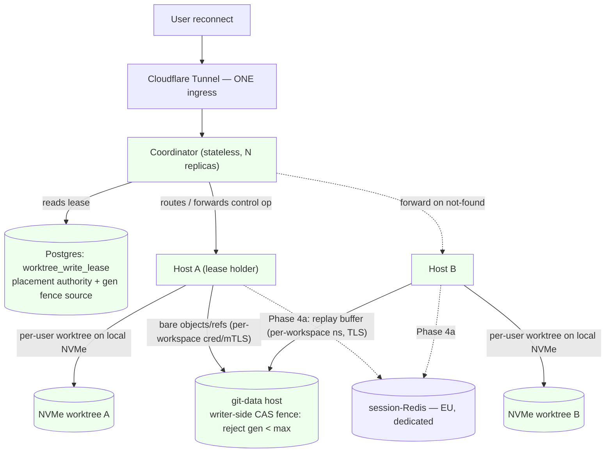

# ADR-068: Multi-host `/workspaces` via shared git-data + per-user worktrees + lease-routed coordinator

- **Status:** adopting — flips to `accepted` when the GA phase (Phase 3) lands in prod. The `replicas = 1` invariant ADR-027 codified remains operationally in force until then; this ADR is the governance gate ADR-027 required for raising it.
- **Date:** 2026-06-30
- **Issue:** #5274 (the explicit re-evaluation trigger); epic plan `knowledge-base/project/plans/2026-06-29-feat-multi-host-workspaces-layer-plan.md` (PR #5710). Related: #5240, #5273, #5275, #5338, #5546, #5547, #5723.
- **Supersedes:** **ADR-027** (`ADR-027-process-local-state-for-runners.md` — `superseded-by: ADR-068`). ADR-027 self-mandates supersession for any multi-replica diff; this ADR is that diff and carries the Bucket-A migration.
- **Re-opens:** **ADR-059** (`ADR-059-stream-since-disconnect-replay-buffer.md`) — it rejected Redis because "no multi-instance requirement exists." This ADR creates that requirement; the replay buffer migrates to Redis in Phase 4a.
- **Lineage:** AP-013 "Process-local state for runner sessions" → ADR-027 (the governing tier principle this ADR supersedes); ADR-059 (in-process replay buffer); ADR-033 (credential-heavy real-stack execution — the pure-TS Inngest cron substrate for lease reclaim); ADR-038 (team workspaces / workspace-as-grain); ADR-044 (workspace-as-source-of-truth owner-gate, `is_workspace_member`); ADR-030 (self-hosted Inngest Redis — the AOF + `--requirepass` precedent the **distinct** session-Redis reuses). Migration precedents: `029_plan_tier_and_concurrency_slots.sql` / `093_*` (`acquire_conversation_slot` fenced-upsert shape), #5338 (`user_session_state.current_workspace_id` lazy rehydrate).

## Context

Today the backend is entirely single-host: one Hetzner server → one RWO block
volume (`apps/web-platform/infra/server.tf:937-940`) mounted `/mnt/data` →
container `/workspaces` → one Node process → in-memory state Maps. ADR-027
codifies a hard `replicas = 1` invariant; ADR-059 puts the stream-replay buffer in
process memory assuming same-process reconnect. To go live and scale with real
users — for concurrent capacity, HA, GA-readiness, and cost bin-packing (all four
confirmed by the operator) — the `/workspaces` layer must become a cluster. This is
the explicit re-evaluation trigger for **#5274**.

The operator chose the maximum target on both axes: **one workspace's users
servable across multiple hosts concurrently**, and **failover invisible even on
unplanned crash, with near-zero loss of uncommitted (un-pushed) work**. Delivery is
**Approach A** — a staged path that reaches that full end-state, hardest-part first,
with the operator choosing which step gates GA.

**The architectural reframe (settled at brainstorm):** never have multiple hosts
write one git index — it corrupts on any filesystem, a git property, not a storage
one. "One workspace spans hosts" therefore means shared git **data**
(objects/refs) + **per-user worktrees** on host-local NVMe, with collaboration
mediated by git refs + a shared state layer.

**The load-bearing research correction.** The spec/brainstorm inherited
"externalize the 7 ADR-027 Maps → Redis." Focused code research (2026-06-29)
falsifies that as written. Only **1 of 7** Maps needs cross-host visibility AND is
serializable (`userWorkspaces`, registry:46 — and it is **already** Postgres-backed
via #5338). The other live handles cannot be serialized at all: `activeSessions` =
AbortController + Promise resolvers; `_locks` = a Promise-chain mutex;
`pendingDisconnects` = `NodeJS.Timeout`; `_ccBashGates` = AgentSession w/ resolvers;
`activeQueries` = Timers + live SDK `Query` + input queue; `sessions` = the live
socket. A turn's AbortController / SDK `Query` executes in the owning host's
process; only that host can abort it. **The cross-host control problem is not a
serialization problem — it is a routing problem.**

## Considered Options

- **Option A — Shared git-data + per-user worktrees + Postgres write-lease +
  lease-routed stateless coordinator (rejecting Ceph/k8s/NFS-for-the-live-tree).**
  Bare repos (objects/refs) on a shared git-data host over the private net;
  worktrees on host-local NVMe; a per-worktree write-lease in Postgres (mirroring the
  canonical `acquire_conversation_slot` fenced upsert) with writer-side CAS fencing
  at the git-data host; a **stateless** coordinator that routes a session to the
  lease-holding host and forwards control ops (abort/gate/grace) to it. Live-handle
  state stays host-local by nature; cross-host control is routed, not serialized.
  Redis enters only in Phase 4a, scoped to the ADR-059 replay buffer. **(Chosen.)**
- **Option B — Externalize all 7 ADR-027 Maps to Redis (the inherited spec).**
  Rejected — 5 of 7 hold AbortControllers / timers / a live SDK `Query` / Promise
  resolvers that are **not serializable**; "put them in Redis" is not expressible.
  The 1 serializable cross-host Map is already Postgres-backed (#5338); a distributed
  concurrency counter is already Postgres-backed (`concurrency.ts:77-129`). This
  option also front-loads a hard Redis dependency before any host can even land a
  second replica. Recorded as rejected in ADR-027's Alternatives.
- **Option C — Ceph / Kubernetes / shared-NFS for the live working tree.**
  Rejected — shared POSIX storage under a live git index still corrupts on
  concurrent writers (the git-index property above); k8s/Ceph buys an orchestration
  + storage substrate whose operational cost dwarfs the need. The "light path" (no
  Ceph/k8s) was an explicit operator + COO constraint to bound operational burden.
- **Option D — Cloudflare sticky-cookie / Load-Balancer affinity.** Rejected as the
  routing authority — sticky cookies pin to a **dead** host on crash and are not
  lease-aware (route to the wrong host). The Postgres lease is the placement
  authority; affinity is derived from it, not from an edge cookie.

## Decision

Adopt **Option A**, delivered as staged **Approach A**. The decisions this ADR
fixes for every per-step plan:

1. **Shared git-data, per-user worktrees, never a shared working tree.** Bare repos
   (objects/refs) live on a shared git-data host reachable over a private
   `hcloud_network`; each user's worktree is created on its host's local NVMe.
   GitHub remains the durable rehydration source (`ensure-workspace-repo.ts`
   self-heal, #5546).

2. **The Postgres write-lease is the placement authority.** A per-`(workspace_id,
   worktree_id)` lease row (migration 116) records `{host_id, lease_generation,
   acquired_at, heartbeat_at}`. Acquire/reclaim is **one atomic statement** under
   `pg_advisory_xact_lock` — `INSERT … ON CONFLICT DO UPDATE … WHERE heartbeat_at <
   now() - interval '120s' RETURNING`, with `lease_generation + 1` computed
   **in-statement** (never app-side — no SELECT-then-INSERT TOCTOU). A live lease ⇒
   zero rows returned ⇒ the caller lost. Expiry uses **server-side Postgres `now()`**
   only; hosts never self-judge expiry (clock-skew hazard). This is a 1:1 mirror of
   the canonical `acquire_conversation_slot` precedent (`029_*.sql:101-210`,
   re-issued `093_*.sql:50-125`) — not a new pattern.

3. **Fencing is writer-side compare-and-write, NOT a pre-check.** A generation check
   *before* the ref write is TOCTOU: a GC-paused holder reads `gen=N` still-current,
   gets reclaimed to `N+1`, resumes, and writes — the check passed, the write
   corrupts. The **git-data host** holds the per-`(workspace,worktree)` monotonic max
   generation and **atomically rejects any write with `gen < max`** under a per-ref
   lock. The resource server enforces the token (Kleppmann), not the client. Fencing
   — not the heartbeat timeout — is the load-bearing invariant that makes reclaim
   safe.

> **Amendment (CTO ruling, 2026-06-30, PR A review).** `lease_generation` is a
> **globally-monotonic fencing token per `(workspace_id, worktree_id)` that
> survives lock release** — this is a precondition of §3's `gen < max` reject.
> The PR-A review caught that a literal 1:1 mirror of `acquire_conversation_slot`
> made `release_worktree_lease` **DELETE** the row, so the next acquire reset
> `gen` to the column default `1`; with §3's fence that inverts into a
> workspace-level **write outage** (HOST_B reclaims → `gen=2`, releases, next
> acquire `gen=1 < max=2` → every push rejected). Resolution: **`release`
> TOMBSTONES the row** (retains it + its `lease_generation`, ages `heartbeat_at`
> to `-infinity` so the next acquire takes over immediately via the expiry
> disjunct), `host_id` kept so the acquire CASE is unchanged. The monotonic-token
> responsibility stays at the **lock service** (the lease), and §3's fence remains
> the unmodified dumb `reject gen < max` — no `(epoch, gen)` scheme needed. The
> FK `ON DELETE CASCADE` is untouched (Art.17 erasure intact; the tombstone is
> non-personal operational state bounded by worktree count). **Rejected:** (A1) a
> per-resource sequence / side-counter table — breaks the single-atomic-statement
> acquire and shares a hot object; (B) keep DELETE + amend the fence to tolerate
> the epoch reset — pushes safety-critical state into the resource server (wrong
> Kleppmann layer) and the crash path never releases, so the fence would need to
> persist epoch boundaries independently anyway (strictly more state, zero
> benefit). The slot precedent (029) was only ever a concurrency slot, never a
> fence token, so DELETE-on-release was correct there and silently wrong here.

> **Amendment (CTO ruling, 2026-07-01, PR B write-path).** §1's "worktrees on
> NVMe, bare data on git-data" has no native git form (a worktree's objects must
> be local), so PR B adopts the **dedicated-remote replication-push model**: the
> NVMe worktree is an ordinary clone with a SECOND git remote `git-data`
> (`git+ssh://git@<private-ip>/<workspace_id>.git`) ALONGSIDE GitHub `origin`. An
> internal `git push git-data` over `gitWithPrivateKeyAuth` (private net),
> triggered at the **turn/session boundary** (the existing `syncPush` sync points
> — `unregisterSession`/`handleCcCloseQuery` finally), is the push §3's
> `pre-receive` CAS fence guards; it carries `--push-option=lease-gen=<N>
> --push-option=worktree-id=primary`. **The push-options attach to the git-data
> push ONLY, never to the GitHub `syncPush`/`origin` push** (GitHub runs no fence
> hook). The two pushes are distinct durability tiers, not a redundant double-write:
> GitHub = external durable rehydration (the §8 SPOF mitigation, #5546, PUSHED refs
> only); git-data = the shared object store Phase 3's 2nd host reads. Clone wiring
> is **additive** — clone from git-data when enabled AND retain `origin`→GitHub
> (orphaning GitHub would collapse the rehydration story). **Rejected:** (b)
> alternates/network-mount borrow — the `pre-receive` fence would never fire
> (no push), pushing enforcement onto a network-FS write-lock = the shared-POSIX
> corruption surface Option C already rejected; (c) bare-authoritative
> checkout-pull — forces a checkout-from-remote on every session open (latency +
> a private-net failure mode at the worst moment) and makes PR C a semantic
> authority-flip instead of the additive rsync-then-flag-flip it is designed to be
> (Phase 3's 2nd-host *read* of the shared bare store is a (c)-flavored read
> ADDITIVE on top of (a), not a replacement). **Lease activation: GATED behind
> `isGitDataStoreEnabled()`, NOT live, at replicas=1.** A live "monitored
> fail-closed" lease around every write (handoff note 3) adds a fail-closed
> Postgres dependency to every prod turn for ZERO multi-host safety benefit (the
> fence provably never rejects at replicas=1 — same-host gen is stable); it trades
> a concrete single-user-incident regression (silent write block on a lease-RPC
> outage) for a non-existent benefit (`hr-weigh-every-decision-against-target-user-impact`).
> The one flag flips clone + path-split + push-with-gen + lease lifecycle ATOMICALLY
> at cutover; the live lease path is first exercised under real contention at PR C /
> Phase 3, not dark-run on prod. **Scope:** the in-sandbox `GIT_PUSH_OPTION_*` env
> injection is DEFERRED to Phase 3 (the in-sandbox agent pushes to GitHub `origin`,
> not git-data; Phase-2 replication is entirely app-server-side) — `receive.advertisePushOptions
> true` stays in the bootstrap (forward-compat). **Prereq:** `gitWithPrivateKeyAuth`
> (git-auth.ts) is unbuilt and must land before any git-data push/clone wiring.

> **Amendment (CTO ruling, 2026-07-01, PR B bare-repo provisioning).** §3's
> `pre-receive` fence guards a `git push`, but `git-receive-pack` never
> auto-creates its target — the per-workspace bare repo MUST exist before the
> first replication push, and the transport `git` user is `git-shell`-restricted
> (`git-shell -c` permits only `receive-pack`/`upload-pack`/`upload-archive` and
> does NOT consult `~/git-shell-commands/`, so the app cannot `git init --bare`
> through the transport key). **Resolution: a dedicated, separately-keyed SSH
> forced-command provisioning path.** A SECOND ED25519 key on the git-data host —
> distinct from the git-shell transport key, same `git` OS user (repo root is
> `git:git 0750`; per-key `command=` overrides the login shell) — carries a FIXED
> forced command `command="/usr/local/bin/git-data-provision.sh"`. The wrapper
> reads `workspace_id` from `SSH_ORIGINAL_COMMAND` as an OPAQUE argument (validated,
> NEVER `eval`'d), enforces `^[A-Za-z0-9._-]+$` and rejects `.`/`..`/slash
> (CWE-22, the same posture the fence hook applies to `worktree-id`), builds
> `/mnt/git-data/repositories/<workspace_id>.git`, refuses if it does not
> canonicalize under the repo root, and runs an idempotent `git init --bare`
> under `flock` on a per-workspace init lock (concurrent first-init safe). The
> transport (git-shell) key is UNTOUCHED — provisioning authority and ref-write
> authority are separate credentials with separate blast radii (ADR-068 §6:
> never a cluster-wide cred). A freshly inited repo needs no sidecar seeding: it
> inherits `core.hooksPath` (the fail-closed placeholder → the real CAS fence)
> automatically, and the fence's `stored_max` defaults to 0 on the absent
> `fence/` dir, so the first push at `gen=N` advances `0→N` correctly; the repo
> is inited ON THE BLOCK VOLUME, preserving the reboot-durable fence guarantee.
> The app calls provision UNCONDITIONALLY before each git-data push (idempotent,
> no existence pre-check), gated behind `isGitDataStoreEnabled()`, over the
> private net from the web host — a pure additive `create` that never touches
> GitHub `origin` or the NVMe worktree, keeping the additive rsync-then-flag-flip
> cutover shape intact. The key + wrapper ship via cloud-init ONLY (like the
> git-shell key and `git-data-bootstrap.sh`; the wrapper is a fixed low-churn
> security boundary, NOT the iterate-heavy fence, so cloud-init immutability is
> its correct home); no SSH provisioner, CI never SSHes. **Rejected:** (a) a
> server-side hook/wrapper that inits "on first push contact" — `receive-pack`
> requires the repo to pre-exist and `pre-receive` cannot fire before its repo
> exists, so this necessarily REPLACES git-shell with a parser over the untrusted
> `SSH_ORIGINAL_COMMAND` on the hot write path (the exact surface the fixed
> git-shell forced command eliminates) and couples provisioning to the data-plane
> key; (c) relax the forced command to allow a constrained `init` on the SAME key
> — `git-shell -c` cannot run `init`, so "relax" collapses into (a)'s wrapper,
> and one leaked transport key could then fabricate repos store-wide, not merely
> write existing refs; (b-HTTP) a standalone provisioning HTTP RPC — adds a new
> daemon, open port, inbound firewall rule, and auth layer to a deliberately
> SSH-only, deny-all-public-ingress host, where the SSH-forced-command form
> reuses the existing sshd + private-net + key-auth substrate.

4. **Live-handle state stays host-local; control is routed by a stateless
   coordinator.** The coordinator holds **no live handles** (the lease lives in
   Postgres), so it is **stateless and replicable — N replicas behind the one
   tunnel**. It routes a session to the lease-holding host and **forwards control
   ops** (abort `registry:200-211`, gate-resolve `cc-dispatcher.ts:1296-1388`, grace)
   to the owning host: WS frame → local resolver → on not-found, RPC-forward to the
   lease-holder → same resolver there. It **composes** with the existing intra-host
   prefix broadcast (registry:206-212); it does not replace it. The single
   enabling change in Phase 1 is making `abortSession` return a **found-count** so
   "turn already finished" is distinguishable from "lives on another host."

5. **Affinity derives from the lease (not an edge cookie).** A reconnect routes back
   to the lease-holding host, keeping the disconnect grace-abort cancel **host-local**
   — avoiding the TOCTOU race a cross-host poll would reintroduce. The single
   Cloudflare tunnel keeps ONE ingress; its `service` target becomes the coordinator
   (IaC option (c)), which proxies to the lease-holder over the private net.

6. **Cross-tenant isolation is per-`workspace_id`, enforced at every new boundary.**
   The bwrap `denyRead` guard (`agent-runner-sandbox-config.ts:106`, per-sibling since ADR-075)
   does **not** cover remote git-data — the bare-repo fetch runs in the Node process,
   outside the sandbox. Network access to git-data MUST carry a per-`workspace_id`
   credential / mTLS (reuse the `resolve_workspace_installation_id` membership-RPC
   shape — per-workspace token, NULL for non-members), **never a cluster-wide mount
   cred**; encryption-at-rest on the git-data volume. The session-Redis replay frames
   carry **user content** (assistant output / tool results / file content), so they
   require TLS + per-`workspace_id` key namespacing + an app-layer scope-check on read
   + TTL ≤ conversation retention. Coordinator↔host is mTLS and the **owning host
   re-verifies** the requester owns the target conversation/lease before honoring any
   forwarded op (defense-in-depth, never trust-the-coordinator).

> **Amendment (operator decision + CTO ruling, 2026-07-01, Phase 3 GA — routing).**
> §4's "stateless coordinator that **forwards control ops** cross-host" and §5's
> tunnel-`service`→coordinator ingress are **superseded by USER-STICKY routing**
> (operator chose the GA D0 fork). `worktree_id` becomes **per-user** (it was
> hardcoded `"primary"`, `worktree-write-lease.ts:23`); the migration-116 PK
> `(workspace_id, worktree_id)` already supports it, so this is **zero schema
> change**. A session routes to the host holding **that user's** worktree lease; two
> users of one workspace hold **two leases** → **two hosts** (ADR-068 G1 satisfied).
> Because each conversation's control ops are **sticky to its owning host**, there is
> **no cross-host control-op forwarding plane, no two-registry union-forward, no
> mTLS-RPC**: the §4 `abortSession` found-count "lives-elsewhere" discriminator and
> the RPC-forward-on-not-found reduce to a **local** ownership lookup
> (`abortSession()>0 || hasActiveCcQuery(convId)` on the arriving host). The
> "coordinator" (§4/C4 `coordinator`) is redefined as a **co-located stateless
> reverse-proxy in the web-host process** (no separate coordinator box / cloud-init):
> inbound WS on any host → resolve the conversation's owning host from the per-user
> lease → local ⇒ serve, remote ⇒ proxy over the private net. The routing decision is
> taken at the **WS-upgrade handshake, not after** (never upgrade-then-redirect;
> fly-replay shape). The owning host **re-verifies membership** before serving a
> proxied session (§6 defense-in-depth, preserved).
> **D0-ref — distinct per-user refs.** Each worktree pushes ONLY to
> `refs/soleur/worktrees/<worktree_id>/heads/*` (+ `/tags/*`) — sole writer of its
> namespace, so `--force` stays safe and the per-`(workspace,worktree)` fence aligns
> 1:1 with the namespace. The **current** `replicateToGitData` refspec
> (`refs/heads/*:refs/heads/*` `--force`, `worktree-id=primary`,
> `git-data-replication.ts:195-207`) is safe only at `replicas=1`; under a 2nd writer
> it **silently clobbers a peer user's commits** (the fence guards monotonicity
> *within* a gen-stream, not last-writer-wins *across* streams). So the namespaced
> refspec + per-user `worktree_id` are a **hard prerequisite** of the flip, plus a
> **namespace-ownership check** in `git-data-pre-receive.sh` (`worktree-id=W` may write
> only `refs/soleur/worktrees/W/`) and app-side CWE-22 validation of `worktree_id`
> (symmetric to `assertSafeWorkspaceId`). Cross-user visibility = `git fetch` the peer
> namespace; reconciliation = explicit user merge; **GitHub `origin/main` stays
> canonical** (rehydration intact). **Rejected:** (A) **workspace-sticky** — re-scopes
> G1 (a workspace's users can no longer span hosts); (B) **coordinator-forwarding** —
> the §4-drafted cross-host control plane + two-registry union-forward + mTLS-RPC, an
> over-built substrate for a goal user-sticky meets with a local lookup (CTO/DHH/
> simplicity converged). (C) a **shared** git-data ref serialized across users —
> re-introduces the last-writer-wins clobber the fence cannot prevent across streams.
> The `coordinator` C4 description is refined to "co-located stateless sticky router";
> the `tunnel -> coordinator` ingress relation is corrected by the TLS/cred amendment.

> **Amendment (CTO ruling, 2026-07-01, Phase 3 GA — placement hook point / b2).**
> The routing amendment above said the placement decision is "taken at the
> **WS-upgrade handshake, not after**". That literal timing is **superseded**: it is
> **impossible** under the codebase's first-message-auth model — the client connects
> to `/ws` with **no** token and sends `{type:"auth",token}` as the FIRST WS message
> (`ws-client.ts:757-765`), so `userId` does not exist at the raw TCP `upgrade` event
> (`ws-handler.ts` `server.on("upgrade")`); the router needs `(workspaceId, userId)`
> to read the per-user lease. **New hook point (b2):** placement is decided at
> **first-message auth** — the earliest point `userId` exists — **before `auth_ok`**
> and before any session bootstrap, gated on `isGitDataStoreEnabled()` (inert, no
> per-connection DB read, until the 3.D flip). A peer-owned session is then
> **transparently proxied** to the owner over one-way TLS with **NO client-visible
> reconnect** (`session-proxy.ts`): the proxying host relays the authenticated socket
> and forwards frames + close codes both ways; the owner runs `verifyProxiedSession
> Membership` (AP-2, fail-closed) before serving. **The preserved fly-replay invariant
> is "never upgrade-then-REDIRECT"** (no client reconnect / no blip) — NOT "decide
> before the TCP upgrade", which is unnecessary because a transparent socket relay
> preserves end-to-end stream continuity (so no ADR-059 replay buffer is pulled from
> Phase 4a). **Rejected:** (A) move auth into the handshake (token in URL/subprotocol)
> — a net-new credential-exposure surface (CF edge access logs are not app-scrubbed)
> and it perturbs the hottest, deliberately-TOCTOU-safe first-message-auth path for
> zero functional gain over b2; (b1) close-code + owner-hint reconnect — the browser
> only ever dials the CF ingress (not lease-aware; edge sticky-affinity was the
> rejected Option D) and the owner's address is a **private-net** address the browser
> cannot dial → reconnect-loop. A **forced drain/migration** still uses a non-transient
> close code (`ROUTING_MIGRATED`) → the client reconnects via the CF ingress → is
> re-proxied by b2 to the new owner (coexists with b2 placement). **AC2's negative
> test** is reframed: *a peer-owned session is proxied transparently to the owner
> before `auth_ok` — assert NO `ROUTING_MIGRATED`/reconnect close on the initial
> placement path, and the owner runs `verifyProxiedSessionMembership`* (asserted at the
> router/handler entry, never via an LLM prompt). **Scope note:** Sub-PR 3.B lands the
> data-correctness core (per-user `worktree_id` + namespaced refspec + pre-receive
> namespace check), the router decision, the b2 transport (`session-proxy.ts`), the
> proxying-side hook, and the owner-side AP-2 acceptor — all inert until 3.D. The
> owner-side **native-session attach** (binding a proxied socket into the session
> lifecycle) + the private-net listener **boot** land with the 3.D 2nd-host bring-up,
> where the relay is first exercisable and soak-validated (AC7/AC8).

> **Amendment (CTO ruling, 2026-07-01, Phase 3 GA — TLS + credential + D2).**
> §6's "**mTLS** coordinator↔host" and "per-`workspace_id` credential / mTLS ... never
> a cluster-wide cred" are concretized for the 2-host owned line:
> **(a) One-way TLS on the host↔host WS proxy.** A long-lived self-signed **server**
> cert per host (`tls_private_key`/`tls_self_signed_cert`, cloud-init + Doppler); the
> proxying client **pins our self-signed CA** (`rejectUnauthorized:true`, never
> `false` — MITM). **Mutual / client certs are dropped** (over-built for 2 hosts we own
> — DHH/simplicity); a multi-year cert ⇒ **no rotation cron** (startup `notAfter` log +
> Sentry handshake-error + one Better Stack cert-expiry monitor). Encryption-in-transit
> (NFR-026) is satisfied by the one-way channel. **(b) The git-data cross-tenant
> credential is a MEMBERSHIP SHAPE, not a new per-workspace secret.**
> `resolve_workspace_installation_id` is reused for its **NULL-for-non-member** shape;
> 3.C adds a **membership-gated fetch authorization** on the existing single
> cluster-wide transport key (de-inflation — the bwrap `denyRead:["/workspaces"]`
> (`agent-runner-sandbox-config.ts`) cannot cover the in-Node fetch). **(c) D2 push-key
> trust — split by threat case.** The **logic-bug** cross-tenant write is **CLOSED** by
> an app-side fail-closed **write-boundary membership sentinel** on the push path
> (`git-data-replication.ts`, making the optional `userId` mandatory + authorizing when
> `isGitDataStoreEnabled()`, keyed on the exact `workspaceId` that builds the push URL —
> `hr-write-boundary-sentinel-sweep-all-write-sites`); it **gates the flip**. The
> **host-compromise** (transport-key abuse) cross-tenant write is an **accepted GA
> residual**, mirroring §8's shared-git-data-host SPOF acceptance — per-workspace push
> keys are disproportionate for a 2-host GA line (a full web-host breach already
> dominates via the DB service-role + GitHub App key), named as the **post-GA closer**
> with a tracking issue + a promotion tripwire (any key-leak/host-compromise incident,
> or workspace count crossing a blast-radius threshold). Cheap non-gating host-side
> hardening: a receive/upload-pack allowlist wrapper on the transport key. **Rejected:**
> mutual TLS + per-workspace push keys at GA (same proportionality bar that downgraded
> mTLS). **Status:** this ADR flips `adopting`→`accepted` when the GA cutover lands in
> prod (3.D — **only after LUKS-at-rest + one-way-TLS are verified**, NFR-026).

> **Amendment (CTO ruling, 2026-07-01, Phase 3 GA — deploy fan-out).** With the web
> host `for_each`'d to a 2-host cluster, deploys must deterministically **deliver the
> container to BOTH hosts** (drain-both, deliver-both). Today the release workflow
> POSTs an HMAC-signed webhook to `deploy.soleur.ai` → the single Cloudflare tunnel
> (`cloudflared.web`); both hosts run cloudflared on that ONE tunnel, so a POST
> load-balances to ONE connector non-deterministically. **Chosen: Option B — a
> receiving-host private-net fan-out.** One POST lands on host A; A deploys itself AND
> forwards the same HMAC-signed payload to each peer over the private net
> (`10.0.1.x:9000`), so one trigger reaches both. This is the deploy-path expression
> of the co-located-router decision already made (§4 user-sticky amendment) and reuses
> the git-data host's "second host that only exists post-apply, verified by a
> web-host-driven private-net script — never CI, never the merge-apply"
> precedent (`hr-fresh-host-provisioning-reachable-from-terraform-apply`). The webhook
> listener binds `0.0.0.0:9000` (was loopback) so the peer is reachable; this is safe
> because `hcloud_firewall.web` default-denies 9000 on the public interface — making
> that default-deny **load-bearing for webhook exposure**, so a drift-guard assertion
> pins it (a future firewall edit opening 9000 must fail CI). The peer list is
> **declarative** — the other hosts' `private_ip`s rendered from `var.web_hosts` into
> each host's config; empty at one host ⇒ the fan-out is a no-op ⇒ the single-host
> deploy path is byte-identical. **Binding constraints:** (a) the peer receives on a
> distinct `/hooks/deploy-peer` hook that runs `ci-deploy.sh` **without re-fanning**
> (A→B must never trigger B→A); (b) the forward result folds into the webhook's HTTP
> response so the release workflow's existing status check catches "web-1 ok, web-2
> down" (`ci-deploy.sh` is idempotent + flock-serialized → a full retry re-delivers to
> both); (c) AC5's per-host state verification is **private-net + peer-driven** (query
> `10.0.1.11:9000`, no SSH — `hr-no-ssh-fallback-in-runbooks`), and the peer-forward
> failure path reaches Sentry/Better Stack from the RECEIVING host
> (`hr-observability-layer-citation`). **Rejected:** (A) **per-host tunnels** —
> `for_each`-ing `cloudflared.web` risks REPLACING the live tunnel (import artifact,
> `config_src` forces replacement) = deploy-path outage; cannot be dormant (rewrites
> `deploy.soleur.ai` at merge, before web-2 exists); collides with 3.D's ingress
> rewire; its only edge (clean per-host CI status) is recovered in B via the
> synchronous forward result. (C) **per-host SSH deploy** — same tunnel restructure as
> A plus a new host-to-host key surface (the 11 SSH provisioners are all
> `web-1`-scoped). (D) **defer** — ships a maintenance-window apply that creates web-2
> which silently misses deploys (a fix then hits ~50% stale code, invisibly): a
> single-user-incident trap the threshold exists to prevent.

> **Extension ([ADR-114](./ADR-114-one-tunnel-many-connectors-ingress-must-be-origin-relative.md), 2026-07-15, #6416) — the finding above generalizes beyond the deploy path.**
> Nothing above is retracted. This ADR correctly stated the multi-connector fact — *"both
> hosts run cloudflared on that ONE tunnel, so a POST load-balances to ONE connector
> non-deterministically"* — and correctly rejected per-host tunnels (A). ADR-114 **cites**
> that rejection rather than re-deciding it.
>
> The gap is narrower: **Option B solved connector nondeterminism for the `deploy.` route
> only.** The same nondeterminism applies to every other ingress rule on the same tunnel, and
> was never generalized:
>
> - **`registry.` → `tcp://10.0.1.30:5000`** is already origin-relative, so it is correct
>   *provided every connector host is a 10.0.1.0/24 member*. #6416: web-2 had **no** private-net
>   attachment, so ~50% of CI registry-bridge attempts landed on a connector with no route to
>   zot — and, being masked by `continue-on-error`, silently skipped the mirror on every release.
> - **`ssh.` → `ssh://localhost:22`** is connector-relative and therefore host-NONdeterministic.
>   The 12 `web-1`-scoped provisioners below can land on the wrong host.
>
> ADR-114 records this as two normative invariants (I1 connector homogeneity, I2 origin-relative
> ingress) plus the anti-pattern that a per-hostname ingress does **not** pin a connector.
>
> **Count correction (measured 2026-07-15).** "the 11 SSH provisioners" above is **stale** —
> `server.tf` now carries **12** `terraform_data.*` blocks with
> `connection { host = hcloud_server.web["web-1"].ipv4_address }` (a 13th, `deploy_pipeline_fix`,
> has no `connection {}` at all). The original text is left verbatim above as this ADR wrote it;
> **12** is the live number. Each of the 12 now carries an in-band `hostname` tripwire (#6416) so
> a wrong-host landing fails the apply loudly instead of writing web-1's config to web-2.

> **Amendment (CTO ruling, 2026-07-02, Phase 3 GA — cutover + read-source overlay, Sub-PR 3.D).**
> The GA cutover to the shared git-data store is a hardened, coordinated operation, and
> the rehydration contract (§1) is refined for the multi-host read side:
> **(a) LUKS-at-rest cutover.** The cutover target is a FRESH **guest-side LUKS** git-data
> volume (`cryptsetup`, not an `hcloud_volume` attribute; idempotent `isLuks` guard so a
> 2nd cloud-init run is a no-op; key delivered via Doppler-env at boot, NEVER argv —
> #5560; mount `/dev/mapper/git-data`). This is the load-bearing NFR-027 at-rest control
> for user git-data, NOVEL to the infra (no prior `cryptsetup`).
> **(b) Set-identity cutover, not count-match.** A two-pass **freeze-rsync** (bulk with
> writers live, then a delta under a git-data write-freeze — the real writers are per-turn
> `syncPush`/`replicateToGitData`, not just crons) copies old→fresh volume; identity is
> verified by `git for-each-ref` diff **and** `git rev-list --all | sort | sha256sum`
> equal per bare repo (a ref-count match is insufficient). The flip is **coordinated
> across both hosts** (drain+reload together — Doppler propagation to two containers is
> not atomic). The `terraform apply` + cutover run **Inngest-dispatches-GHA** off-host
> (cloud-admin creds never on the app host); the placement-group attach reboots `web-1`,
> so it is a **maintenance-window** apply. **Rollback = flag off + re-drain**, which loses
> post-flip git-data writes — acceptable ONLY because pushed refs are also on GitHub
> `origin` (rehydration); this dependency is stated, not implicit. The old unencrypted
> volume is decommissioned/wiped only after a confirmed-healthy flip (CLO DL-2), and
> Art. 17 erasure hits BOTH volumes during dual-existence.
> **(c) Owner-side relay completion.** 3.B landed the proxying-host half (inert); 3.D boots
> the private-net TLS proxy listener on the OWNER host and attaches a pre-authed proxied
> socket into the native session lifecycle (register→bind→idle→heartbeat→`auth_ok`,
> skipping the auth + placement blocks) — a drain/deploy-migrated session must NOT greet
> fresh (AC8).
> **(d) Read-source overlay — rehydration = clone(GitHub) → overlay(git-data).** §1 said
> GitHub `origin` is the canonical rehydration source; it remains the canonical **clone
> base + durable long-term history and is never orphaned**, but git-data is authoritative
> for the **most-recent per-user worktree tip**. Rationale: git-data ⊇ GitHub origin in
> committed-ref completeness — `syncPush` auto-commits only `knowledge-base/**` and reroutes
> a protected-default push to a `soleur/kb-sync` PR branch, so the agent's real commits
> never land on origin's default branch, while `replicateToGitData` `--force`-pushes ALL
> `refs/heads/*` + `refs/tags/*`. So a fresh GitHub clone can be strictly behind the user's
> latest tip. **Mechanism:** `fetchFromGitData` fetches the worktree namespace into
> remote-tracking `refs/remotes/git-data/*` (NEVER local `refs/heads/*`), then the
> fresh-graft path (`ensure-workspace-repo.ts`, past the `isValidGitWorkTree` early-return
> that guarantees zero local-only commits) does a guarded `reset --hard
> refs/remotes/git-data/<primary>` when that ref exists (else keeps the GitHub clone).
> Fail-soft: a git-data blip mirrors to Sentry and keeps the GitHub clone. **Rejected:**
> (Option 3) refs-only, no working-tree overlay — leaves git-data's newer tip in an unread
> ref, so the user silently resumes on stale state (single-user brand trap); (Option 1)
> detach-HEAD + fetch into `refs/heads/*` + re-checkout — same end state but keeps a
> destructive `:refs/heads/*` refspec one bad guard away from clobbering a live branch,
> plus a detach/re-checkout dance and shallow-vs-branch ambiguity. Follow-ups (LOW,
> post-GA, non-blocking): `--unshallow` for full-history parity; last-checked-out-branch
> restoration (needs the HEAD symref, not currently replicated).
> **(e) Host-side hardening (non-gating).** The transport key's bare `git-shell -c` is
> replaced by a receive/upload-pack **allowlist wrapper** + CWE-22 path canonicalization.
> **Status:** UNCHANGED — this ADR stays `adopting` and flips `adopting`→`accepted` only at
> the Phase-3 GA soak (AC11: ≥7 days both hosts owning live per-user leases, zero fence
> false-rejects, zero cross-tenant denials) AND after LUKS-at-rest + one-way-TLS are
> verified in prod (NFR-026/027). It does NOT flip at 3.D merge (the flag ships OFF; the
> cutover is post-merge).

> **Amendment (CTO ruling, 2026-07-02, Phase 3 GA — proxy-listener origin control + token
> scope, Sub-PR 3.D security review).** Activating the owner proxy listener (3.D) surfaced
> that one-way TLS + a token-less `proxy_hello` handshake makes network reachability the
> only control — and Hetzner **cloud firewalls do NOT filter the private net** (intra-`
> hcloud_network` traffic is open by network membership; git-data.tf:182-186). So ANY
> `10.0.1.0/24` host — including the deliberately-lesser-privileged **git-data host** —
> could open port 8443 and `attachProxiedSession` grants it a full act-as-user session:
> account **takeover**, strictly ⊃ the §D2 "cross-tenant WRITE" residual, and reachable
> from a NON-web host, defeating §6's separation-of-authority. This **exceeds** the
> accepted residual and is CLOSED, not documented-away. **(a) Guest-side peer-origin
> allowlist (load-bearing).** `createProxyServer` rejects any connection whose private-net
> source is not in `SOLEUR_PROXY_PEER_ALLOWLIST` (the web-host private IPs, excluding
> git-data) BEFORE the handshake, and is **fail-closed** (TLS material present but no
> allowlist ⇒ the listener refuses to start). Enforced on the guest (the infra firewall
> cannot see the private net), unit-testable, no PKI. **(b) git-data Doppler token scoped**
> to a dedicated read-only `prd_git_data` config holding only `GIT_DATA_LUKS_KEY` — the
> git-data host no longer carries the full-prd token (which exposed `SUPABASE_SERVICE_ROLE`,
> `GIT_REMOVE_SSH_PRIVATE_KEY`, `PROXY_TLS_KEY/CERT`), restoring the "separate blast radii"
> property. **Rejected:** an `hcloud_firewall` rule scoping 8443 — NON-FUNCTIONAL on Hetzner
> (cloud firewall filters only the public interface; the attack traverses the private net).
> **Rejected:** mutual TLS (`requestCert:true`) — reverses the §6 mTLS-drop, adds CA/rotation,
> and is dominated (a git-data compromise holding `PROXY_TLS_KEY` mints a valid client cert
> unless the token is scoped first, after which (a) already suffices). **Residual (now
> narrower):** a *root*-compromised git-data host could IP-spoof a web-host private IP to
> bypass (a); Hetzner's `hcloud_network` enforces source-IP at the vSwitch, so this is
> materially harder and the same host-compromise class already accepted — per-workspace
> keys remain the post-GA closer. Optional follow-up (non-blocking): a host-level nft DROP
> on 8443 for non-web sources (belt-and-suspenders).

7. **Self-host the session-Redis on EU Hetzner; secrets via `random_password`.**
   Hetzner has no managed Redis. A self-hosted dedicated EU Redis adds **no new
   sub-processor / DPA** (the deciding GDPR reason over Upstash/Aiven). It is a
   **distinct** resource from the loopback Inngest Redis (different node, port-binding,
   password var — never co-located or conflated). The password is generated in-band
   via a `random_password` TF resource → `doppler_secret`, delivered to the daemon at
   runtime via **env, never argv** (#5560 Inngest argv-leak precedent) — dissolving the
   operator-mint / PR-split. `terraform.tfstate` (R2, no client KMS) holds the
   password + TLS key in plaintext → treat tfstate as secret-bearing; R2 credential
   scope is the control.

8. **GA gates at Phase 3 (operator decision, OQ3 — 2026-06-30).** **Phase 3** —
   concurrent multi-host (two users on one workspace served by two hosts, each on
   their own worktree), planned moves/deploys seamless, **committed/pushed work
   durable** via GitHub-rehydration — is the GA line (panel + deepen consensus).
   **Phase 4a** (Nomad + lease-expiry reclaim + EU session-Redis — seamless
   *unplanned-crash* recovery of committed state) and **Phase 4b** (continuous
   worktree checkpoint — near-zero loss of *uncommitted* work) are **post-GA
   hardening**, built against real load / a real crash-loss incident — not on the
   GA-blocking path. The residual shared-git-data-host SPOF at the Phase-3 GA line is
   accepted with honest reconnect; #5723 (Garage) closes it post-GA (OQ1).

**Staged delivery (each phase is its own `/soleur:plan` + spec + PR):** Phase 0
(this ADR + C4) → Phase 1 (host-local correctness, no new infra, still `replicas=1`)
→ Phase 2 (split git-data/worktrees + lease + fencing) → **Phase 3 (2nd host +
coordinator routing — GA)** → Phase 4a (Nomad + reclaim cron + Redis buffer) →
Phase 4b (continuous checkpoint).

> **Amendment (CTO ruling, 2026-07-02, #5877/#5887 — moved-block migration sequencing).** A
> `moved {}` block that re-addresses a resource in `OPERATOR_APPLIED_EXCLUSIONS`
> **wedges every target-scoped CI apply** (`apply-web-platform-infra.yml`,
> `apply-deploy-pipeline-fix.yml`) until an operator full apply consumes the pending
> move — Terraform requires every pending `moved` source/target base address to be
> inside the `-target=` set on a targeted plan, or it aborts with `Error: Moved
> resource instances excluded by targeting`. The Phase-3 GA singleton→`for_each`
> migration (#5877) added four `moved` blocks to `placement-group.tf`
> (`hcloud_server.web`, `hcloud_volume.workspaces`, `hcloud_volume_attachment.workspaces`,
> `hcloud_server_network.web`) but shipped WITHOUT the cutover apply, so the targeted
> CI plan went red on every run from 2026-07-01 18:03 (#5887). **Rule:** a
> singleton→`for_each` migration on an operator-excluded host must ship **with** its
> operator maintenance-window cutover, **never** as a routine per-PR `-target=`
> allow-list edit — adding `hcloud_server.web` to the unattended per-PR target set
> forces a power-off reboot of the running prod host (it carries `placement_group_id`
> + `for_each`; see `server.tf`) and the Cloudflare-scoped, `delete`-only destroy-guard
> is blind to that in-place reboot. After that maintenance-window apply consumes the moves, no
> pending moves remain and the targeted CI plan self-heals with zero workflow change.
> A recurrence guard lives in `plugins/soleur/test/terraform-target-parity.test.ts`
> (`moved`/`-target` parity block, `MOVED_OPERATOR_CONSUMED`): a future migration that
> re-addresses an operator-excluded resource fails at plan-review time instead of
> silently wedging CI. (Residual, **closed by #5911**: the destroy-guard is no longer
> blind to reboot-forcing in-place `update` on `hcloud_server.*`. A third counter —
> `reboot_updates` — was added to `tests/scripts/lib/destroy-guard-filter-web-platform.jq`
> and the `apply-web-platform-infra.yml` destroy-guard step; it selects
> `actions==["update"]` on `hcloud_server.*` whose `placement_group_id` or `server_type`
> changed and folds into the same `destroy_count`/`[ack-destroy]` gate. Scope: the
> **unattended per-PR apply path only** (`hcloud_server.web` is reachable there as a
> dependency of the targeted `hcloud_firewall_attachment.web`); the operator's
> human-attended maintenance-window full apply does not run this jq gate. **Resolution
> boundary:** a `reboot_updates` trip is resolved by the **operator maintenance-window
> apply** (which consumes the pending change), NOT by `[ack-destroy]` — because
> `hcloud_server.web` is transitively in the saved plan, an ack-through would *execute*
> the reboot on the unattended `terraform apply tfplan`, re-introducing the exact hazard
> the guard prevents. `[ack-destroy]` still functions (per the issue's
> "`[ack-destroy]`-style" requirement) but is an emergency override, not the normal
> reboot resolution. `location`/`datacenter` changes force a full REPLACE and remain
> caught by the pre-existing `resource_deletes` counter; the reboot clause deliberately
> does not compare them (a REPLACE never matches `actions==["update"]`).)

> **Amendment (2026-07-03, #5887 — blue-green ingress prerequisites & reboot deferral).**
> Refines the moved-block amendment above: by 2026-07-03 the four `moved` blocks were
> already consumed in state and web-2 existed (bare), so the CI red was NOT the moved
> error but the `reboot_updates` guard halting on web-1's pending `placement_group_id`
> attach. **(a) Reboot deferral (zero-downtime CI unwedge).** Adding `placement_group_id`
> to `hcloud_server.web`'s `lifecycle.ignore_changes` (`server.tf`) removes web-1's
> pending `0 → web_spread` attach from **every** plan (verified: a full plan drops from
> `31 add, 2 change` to `31 add, 1 change, 0 destroy` — the only residual change is the
> in-place `hcloud_firewall_attachment.web` server-id update). The `reboot_updates`
> counter then reads 0, so both targeted apply pipelines self-heal green with **zero
> reboot**, via a normal PR merge — no maintenance window. web-2 was born INTO the group
> at create time, so this defers ONLY web-1. **GA-window removal trigger:** the GA
> maintenance-window PR removes this `ignore_changes` entry as its FIRST diff and takes
> the reboot on a **drained** host (blue-green), never on the sole live origin. A static
> guard in `plugins/soleur/test/terraform-target-parity.test.ts` fails if the entry is
> dropped silently. **(b) Deferred GA ingress design.** The multi-host ingress is a
> **Cloudflare Load Balancer** (v4 provider syntax — the repo pins `cloudflare ~> 4.0`,
> NOT v5; drain via origin `weight = 0`, not the v5-only `endpoint_drain_duration`),
> health-checked. Its monitor MUST be **reachability-only** (`expected_codes = "2xx"`
> against `/health`) and MUST NOT parse the `supabase` body field: `/health` always
> returns 200 (`server/index.ts`) and both hosts share one Supabase, so a body-coupled
> monitor would eject the sole live origin on a DB blip → full ingress outage. The A→LB
> record migration is a live-record operation (no `moved` block / stable import id on
> `cloudflare_record.app`) and its gaplessness is an **unverified** Cloudflare-behavior
> claim — verify against CF docs + a staging convert before the GA window. The LB is a
> paid add-on (~$5/mo) — record the recurring expense. web-2 sits in the pool at
> **weight 0** (drained) until GA. **(c) Hard invariant.** NO live LB weight to web-2
> before BOTH the owner-side relay is active (`SOLEUR_PROXY_BIND`/`PEER_ALLOWLIST`/
> `HOST_ROSTER` set → `session-proxy.ts createProxyServer` binds) AND the git-data store
> is cut over (`isGitDataStoreEnabled()` true, 3.C write-boundary sentinel merged, 3.D
> LUKS cutover soak-verified). Rationale: with the router gated off (default) each host
> serves purely locally on its own `/workspaces` volume, so any live request round-robined
> to web-2 hits an empty workspace — a single-user (workspace-gone) incident. A truly
> zero-downtime web-1 reboot therefore requires (b)+(c), i.e. it IS the GA line (§8), not
> a prerequisite. Plan: `knowledge-base/project/plans/2026-07-03-feat-multi-host-blue-green-ingress-prereqs-plan.md`.

> **Amendment (2026-07-03, #5966 — deep-readiness endpoint / Sharp Edge C1).** The blue-green
> amendment above (b) fixes the LB monitor as reachability-only on `/health` — correct, but it
> means the monitor alone **cannot distinguish a ready host from a bare one**: `/health` is
> liveness-only (`server/health.ts buildHealthResponse()` hardcodes `status:"ok"` and probes the
> SHARED Supabase), so a bare web-2 (running, empty/unmounted `/workspaces`, not in rotation)
> returns `200 / status:ok / supabase:connected` — a routing lie. **Decision:** deep-readiness
> lives on a SEPARATE internal endpoint `GET /internal/readyz` (`server/readiness.ts`,
> `handleReadyzRequest`), gated to the **loopback transport peer** (`req.socket.remoteAddress` —
> unspoofable off-host; the Host header is client-supplied secondary), returning **non-2xx unless
> the responding host can actually serve locally**: `/workspaces` is **writable** AND
> **populated**. `/health` stays liveness-only — the physical endpoint split enforces the "no
> mount coupling on `/health`" invariant (b) requires.
>
> - **Why writable, not a mountpoint check.** `buildReadinessResponse()` runs INSIDE the webapp
>   container where `/workspaces` is a docker `-v /mnt/data/workspaces:/workspaces` bind mount over
>   an overlay root, so the classic `st_dev(/workspaces) !== st_dev(/)` mountpoint check is **always
>   true and inert** — it cannot detect a failed Hetzner volume attach (docker auto-creates the
>   source dir on the host root fs). A **write+unlink dotfile probe** is the only signal that proves
>   "this host can serve": it fails on absent (ENOENT), read-only (EROFS — the silent-write-loss
>   mode), permission (EACCES), and I/O (EIO). `populated` = ≥1 host-local workspace dir
>   (`.orphaned-`/`.cron`/`lost+found` excluded) — rejects a fresh/empty volume.
> - **v1 identity = writable + populated; the Hetzner block-volume RWO single-attach guarantee is
>   the identity backstop** (a host physically cannot mount another host's live volume, so
>   "populated" is a sound proxy for "this host's own state"). The residual wrong-volume-attached
>   gap is closed by the ADR-082 `host_id` sentinel as a fast-follow — not a v1 dependency.
> - **Fail-closed is complete.** `buildReadinessResponse()` never throws (any internal error →
>   `ready:false`) AND the route wraps it in try/catch → 503. An unguarded throw here would reach
>   `installCrashHandlers()` → `process.exit(1)` = a *restart* of live web-1, strictly worse than a
>   503.
> - **Boot-time observability.** A latched `verifyWorkspacesMountOnce()` mirrors a not-ready boot to
>   Sentry once via `reportSilentFallback` (`op=boot-readiness`). `verifyPluginMountOnce` checks the
>   PLUGIN mount, NOT `/workspaces`, and passes on a bare volume — so `/workspaces` had no boot
>   coverage before this. This is the async/push layer the pull-only readyz endpoint lacks.
> - **Flap-safety (hard contract, not deferred to the GA PR).** Any consumer draining a **live**
>   origin on a readyz not-ready read MUST require **N≥2 consecutive** not-ready reads — the
>   fail-closed single-shot bias applies ONLY to the *candidate*/pre-pool decision, never to
>   draining the sole live origin on one transient probe error. readyz is NOT the continuous LB
>   liveness monitor (that stays reachability-only on `/health`); the GA LB config (b) inherits this
>   N≥2-consecutive precondition as a stated invariant.
> - **On-host consumer only.** readyz is gated to the loopback transport peer AND a loopback Host
>   header, so it is NOT directly reachable by an off-host LB health probe (that gets 403). The GA
>   pre-pool / drain consumer therefore MUST execute **on-host** (drain-undrain tooling, deploy
>   sidecar) hitting `127.0.0.1:3000/internal/readyz` with a loopback Host, or via the private-net
>   proxy — never as a direct off-host CF-LB monitor. The continuous LB monitor stays
>   reachability-only on `/health` (b); readyz is the on-host pre-pool check, a distinct consumer.
> - **Necessary-but-not-sufficient.** `/internal/readyz` is an ADDITIONAL pre-pool gate layered on
>   top of the unchanged hard invariant (c) (relay active AND git-data cut over). Shipping it does
>   NOT relax (c) or by itself unlock pooling. Plan:
>   `knowledge-base/project/plans/2026-07-03-feat-deep-readiness-endpoint-workspaces-mount-plan.md`.

> **Amendment (2026-07-05, #6055 — web-2 must boot post-#6055 cloud-init before pooling).** A new
> pre-pool gate, layered on the §(c) hard invariant above (necessary, not sufficient — does NOT
> relax (c)): web-2 MUST be (re)created from a cloud-init dated on or after #6055 before its pool is
> added to `default_pool_ids`. #6055 adds the `GIT_LOCK_CHARDEVICE_SWEEP` NOPASSWD grant that lets
> `ci-deploy.sh`'s pre-canary char-device `.git/config.lock` sweep (#5934 / ADR-081) run as root;
> WITHOUT it the sweep is sudo-DENIED (and `ci-deploy.sh`'s `|| true` hides the denial), so the
> residual char-device node is never cleared and the #5912 worktree-creation wedge can strand every
> agent session on that host. **Delivery asymmetry (the load-bearing reason this is a gate):** the 11
> SSH provisioners are web-1-scoped by design (`server.tf` §"web-2 is fresh — provisioned entirely
> by cloud-init at boot"), so a RUNNING web-2 gets **no live grant push** from `apply-deploy-pipeline-fix.yml`
> — cloud-init at (re)create is the sole delivery path. A web-2 whose cloud-init predates #6055 boots
> grant-less and MUST be **recreated** (the #6030 CI-driven `-replace` recreate), not merely
> LB-undrained, before pooling. Enforcement today = this checklist item + #6030; making it
> programmatic (a `/internal/readyz` pre-pool assertion that `grep -q GIT_LOCK_CHARDEVICE_SWEEP
> /etc/sudoers.d/deploy-inngest-bootstrap` succeeds on-host) is a deep-readiness follow-up.

> **Correction to §(b) (2026-07-03, gaplessness verification — PR #5968).** The §(b) remedy
> ("verify against CF docs + a staging convert before the GA window") was executed via a
> verification runbook + two agent pressure-tests (infra-security against the live CF DNS/zone
> API + docs; platform-strategist against the LB steering/monitor design), then a 4-agent PR
> review. It **corrects two claims (b.1, b.3) and adds one hard requirement (b.2)** — the
> corrected form governs the GA cutover PR:
> **(b.1) Overlay-ADD, NOT destroy+recreate — the gapless mechanism.** §(b)'s "the A→LB record
> migration is a live-record operation (no `moved` block / stable import id on
> `cloudflare_record.app`)" describes the **gapped** path and is superseded. Verified (CF docs):
> a Load Balancer and a proxied A record **can coexist on the same hostname** — the LB record
> takes precedence while active, and the plain record is served when the LB is disabled. So the
> GA PR **RETAINS `cloudflare_record.app`** and **adds** a `cloudflare_load_balancer` on
> `app.soleur.ai` as an overlay; it MUST NOT model the two as a Terraform replace (a destroy of
> the record first opens an authoritative-NXDOMAIN window). Because both are **proxied**, the
> edge swap propagates in seconds with **no client-side DNS TTL wait**. Gaplessness verdict:
> **GAPLESS-ONLY-IF** {LB subscription present (zone is Free plan — add-on; spend operator-
> approved 2026-07-03 + recorded in `expenses.md`, provisions with the apply); overlay-not-
> replace; `fallback_pool_id` = web-1 pool; Hetzner firewall — **VERIFIED** already allows the
> CF monitor ranges, no change needed (`firewall.tf` allowlists the published CF ranges on
> 80/443)}. The retained A record also becomes the disabled-LB fallback — the instant-abort
> lever. `dns.tf`'s stale `for_each` round-robin comment is rewritten in the same PR.
> **(b.2) `fallback_pool_id` = web-1 pool is a HARD requirement (new).** With one healthy origin
> and no second pool, a transient probe miss on web-1 marks the sole pool down and — with no
> fallback — returns **530/HTTP 1016 to every user** (a CF fallback pool's health is not
> evaluated, so it keeps serving; it also covers the pre-first-probe cold-LB unknown-health
> window). Without it the LB is a net **availability regression** vs. today's bare A record.
> **(b.3) Drain web-2 STRUCTURALLY (omit its pool from `default_pool_ids`), not `weight = 0`.**
> §(b)'s "`weight = 0` (drained)" is refined: `weight = 0` is a **soft** steering signal — a
> session-affinity cookie overrides it, and it lives in `random_steering`/`origin_steering`
> blocks a refactor can silently drop — so it is not a durable enforcement of the §(c) hard
> invariant. Express the drain as pool-absent-from-`default_pool_ids` (schema fact); reserve
> `weight` for post-GA traffic-proportioning. (The v4-vs-v5 point stands: v4 has no
> `endpoint_drain_duration`.) Also: LB affinity is defense-in-depth only — the §(c) owner-side
> relay is the workspace-correctness mechanism; affinity failover to a bare host is actively
> harmful. Deep-readiness (#5966) gates web-2 *into* the pool via drain/undrain tooling, not the
> live monitor (which stays reachability-only on `/health` to avoid DB-coupling).
> **v4 provider keys:** the load-balancer keys are `default_pool_ids` / `fallback_pool_id` (v5
> renamed them to `default_pools` / `fallback_pool` — the GA PR uses the v4 names since the repo
> pins `cloudflare ~> 4.0`). Verification runbook:
> `knowledge-base/engineering/operations/runbooks/cf-lb-a-record-gaplessness-verify.md`.

> **Amendment (CTO ruling, 2026-07-04, Phase 3 GA — autonomous warm-standby apply + programmatic
> §(c) gate).** The blue-green prerequisites amendment (2026-07-03, #5887) and the
> `moved-block-wedge-cutover-5887.md` runbook carried **human-in-the-loop** ops — an
> operator-local maintenance-window apply, a private-net remote-shell readiness check, and a
> "book a window / decide before the window" human decision. Soleur users are non-technical and
> act only through the web app / CI, so each is an automation bug to close, not a valid step
> (`hr-exhaust-all-automated-options-before`,
> `hr-fresh-host-provisioning-reachable-from-terraform-apply`, `hr-no-ssh-fallback-in-runbooks`).
> This amendment closes that class for the warm-standby line:
>
> **(1) Warm-standby provisioning is a `workflow_dispatch`, never local.** The 6 additive
> resources (private network + subnet + `hcloud_server_network.web[*]` + web-2 `/workspaces`
> volume + attachment) provision through `apply-web-platform-infra.yml -f apply_target=warm-standby`
> inside the **existing R2-backend concurrency serializer** (`terraform-apply-web-platform-host`,
> `cancel-in-progress:false` — the sole writer-serializer for the lock-less R2 backend; NOT a
> second workflow, which would reintroduce an unserialized second-writer hazard). It is never a
> laptop-local run and never remote-shells a host. The plan-scoped `reboot_updates=0` destroy-guard
> runs before the apply so no placement reboot can enter the additive path.
>
> **(2) §(c) WAS a fail-closed, SHAPE-ONLY programmatic check — the checker is now DELETED.**
>
> **CORRECTION 2026-07-20 (#6575).** `apps/web-platform/infra/lb-weight-gate.sh` was deleted with
> the web-2 dispatch sweep. It was never wired to a required CI context, and after web-2 retired
> (2026-07-17, #6538) its first assertion — `SOLEUR_HOST_ROSTER` must contain web-2 — could only
> ever FAIL: a *correct* post-retire roster omitting web-2 trips `A_web2_not_in_roster` forever.
> A gate that a correct configuration cannot pass is not a guard. It was removed under the
> retention rule (retain a verifier iff it is named in a procedure an operator can execute today);
> its design record is preserved in ADR-128. **There is no programmatic §(c) checker today** — the
> paragraph below describes what it DID, retained because the contract it encoded (especially the
> `GIT_DATA_LUKS_CUTOVER_AT` soak-marker semantics) still binds any future implementation.
>
> As deleted, it verified the config-shape of BOTH §(c) conditions
> over injected env (owner-side relay: `SOLEUR_PROXY_BIND` + `SOLEUR_PROXY_PEER_ALLOWLIST` +
> `SOLEUR_HOST_ROSTER` with web-2 in-roster and allowlist ⊆ roster, parser-parity with
> `parseProxyPeerAllowlist`/`loadHostRoster`; git-data cut-over: `GIT_DATA_STORE_ENABLED=="true"`
> + a LUKS-cutover soak marker). On success it prints **`requires_runtime_bind_probe=true`** and a
> SHAPE-ONLY banner, so no consumer — CI or the orchestrator — can mistake exit 0 for weight-flip
> authorization. It **defines the `GIT_DATA_LUKS_CUTOVER_AT` soak-marker contract**: a Doppler
> `prd` ISO-8601 key written by the deferred cutover, satisfied only when
> `now - GIT_DATA_LUKS_CUTOVER_AT >= GIT_DATA_LUKS_SOAK_DAYS` (default 3, §3.D); an
> absent / malformed / future-dated marker is **not satisfied** (the correct fail-closed default
> today, before GA has happened).
>
> **(3) Warm-standby verification: apply output = attach proof; deploy-status `reason` =
> web-2-accepted; readyz is the DEFERRED on-host gate.** The volume attach is proven by the
> terraform **apply output = attach proof** (`hcloud_volume_attachment.workspaces["web-2"]` +
> `hcloud_server_network.web["web-2"]` shown created, in-job) — NOT by an off-host readiness
> probe. web-2 liveness/acceptance is proven off-host by web-1's `/hooks/deploy-status` `reason`
> (`ok` vs `ok_peer_fanout_degraded`), the only web-2 signal reachable through the single tunnel
> (the off-host runner cannot read web-2 directly; web-2 has zero LB weight + no public ingress).
> The **`/internal/readyz` serve-readiness gate is the DEFERRED orchestrator's on-host pre-pool
> check** — in-container `docker exec` at `127.0.0.1:3000` with a loopback Host, requiring
> `workspaces_writable && populated`, N≥2 consecutive reads — explicitly **NOT** `readyz==200`
> off-host (loopback-peer gated → 403 off-host; empty `/workspaces` → 503 by design) and **NOT**
> `workspaces_writable` as the attach proof (it passes on the host-root fallback dir, so it does
> not prove the Hetzner volume attached). The readyz probe is therefore **dropped from the
> warm-standby PR** and lands with the deferred orchestrator.
>
> **De-manualization + enforcement.** The multi-host blue-green plan (Phase 2 + Apply path +
> Post-merge bullet) and the runbook Scope B are rewritten to the dispatch path; a CI lint
> (`scripts/lint-infra-no-human-steps.py`, actor+imperative co-occurrence model, wired into
> `ci.yml` + `lefthook.yml`, scan dirs including this ADR dir) fails any future plan / spec /
> runbook that re-introduces a human terraform / SSH / reboot / verify-on-private-net step.
>
> <!-- lint-infra-ignore start (deferred-orchestrator apply+reboot prose below; the actor is the orchestrator, not a human) -->
> **Deferred orchestrator (unchanged, not this line).** The live cutover remains the
> Inngest-dispatched GHA maintenance-window workflow that — only after the §(c) gate AND its
> separate on-host runtime-bind probe are both green — shifts web-2 LB weight 0→1 → drains web-1 →
> removes `ignore_changes=[placement_group_id]` → power-cycle reboots the drained, non-serving
> web-1 → restores, with auto-rollback. It is gated on the warm-standby + gate landing and
> soak-verifying, and it is the only step that takes the placement reboot.
> <!-- lint-infra-ignore end -->
>
> **Rejected:** (A) a second apply workflow for warm-standby — reintroduces the unserialized
> second-writer hazard against the lock-less R2 backend; (B) `readyz==200` off-host or
> `workspaces_writable` as attach proof — the readiness endpoint is loopback-gated (403 off-host)
> and `workspaces_writable` passes on the host-root fallback dir, so neither proves the attach.
> **Status:** UNCHANGED — this ADR stays `adopting`; the warm-standby + gate are inert-additive
> (no LB weight, no reboot, no ingress change on merge), and the flip to `accepted` still gates on
> the Phase-3 GA soak (AC11). Plan:
> `knowledge-base/project/plans/2026-07-04-feat-autonomous-multihost-ga-warm-standby-and-gate-plan.md`.

> **Amendment (2026-07-05, #5887 — autonomous no-SSH web-2 host bootstrap via scoped
> `-replace`).** The first live warm-standby dispatch (2026-07-05) attached web-2's private-net
> interface + `/workspaces` volume cleanly, and the fail-closed verify correctly RED'd
> (`reason=ok_peer_fanout_degraded`; web-2 stays drained / zero-weight / no user impact) — but
> web-2's `:9000` webhook listener never bound: its ORIGINAL first-boot cloud-init aborted before
> the webhook-enable step (most consistently at `stage=verify`, the baked-host-scripts hash-verify
> that turns the ADR-080 stale-image trap into a loud abort). This amendment adds the **prerequisite**
> that binds web-2 `:9000` before the warm-standby fan-out can verify `reason==ok`:
>
> **(1) web-2-recreate is an autonomous, no-SSH menu-ack dispatch.** `hcloud_server.web` carries
> `lifecycle.ignore_changes = [user_data, ssh_keys, image, placement_group_id]`, so no plain apply
> re-pushes cloud-init to the existing web-2 — only an instance RECREATE re-runs first-boot. The new
> `web_2_recreate` job (`apply-web-platform-infra.yml -f apply_target=web-2-recreate`) runs a scoped
> `-replace` of `hcloud_server.web["web-2"]` + its two id-referencing dependents
> (`hcloud_server_network.web["web-2"]`, `hcloud_volume_attachment.workspaces["web-2"]`) inside the
> EXISTING R2 concurrency serializer (`terraform-apply-web-platform-host` — a job of THIS workflow,
> not a second workflow). web-2 is weight-0 / drained / in no serving pool → zero ingress impact;
> web-1 (the sole live origin) is untargeted. The 20 GB `hcloud_volume.workspaces["web-2"]` is a
> SEPARATE resource — recreating the server does not recreate the volume (0-destroy, guard-asserted).
>
> **(2) The destroy-guard permits ONLY the exact scoped recreate — no `[ack-destroy]` bypass.** A
> POSITIVE-scope counter `web2_out_of_scope_changes` (any create/update/delete whose address ∉ the
> 3-address web-2 allow-set, exact-equality membership) plus `web2_server_replaced` gate the plan:
> PASS iff `web2_out_of_scope_changes==0 && nested_deletes==0 && reboot_updates==0 &&
> web2_server_replaced==1`. This is strictly stronger than a delete-only counter — it also catches a
> web-1 in-place update rebooting via a non-`placement_group_id`/`server_type` attribute (the
> `reboot_updates` counter is known-uncovered for those) and any stray change. There is no ack
> override: an ack could also permit a web-1 delete, so the precision guard is safer.
>
> **(3) Digest-pin determinism — the durable `:latest` fix.** The recreate/boot pins an immutable
> `@sha256` INDEX digest whose baked host-scripts hash provably matches the applied
> `local.host_scripts_content_hash`, never the mutable `:latest`. The `web_2_recreate` job resolves
> web-1's known-good running tag off-host, resolves it to a digest EXACTLY ONCE (frozen `$PINNED`,
> TOCTOU-safe), and runs a **coherence preflight** off-host BEFORE the recreate: it extracts the
> pinned image's `/opt/soleur/host-scripts` and recomputes the boot-identical hash, asserting
> `== local.host_scripts_content_hash`. A mismatch aborts loud BEFORE anything is destroyed
> (remediation: redeploy web-1 to current `main`, then re-dispatch). This is the off-host equivalent
> of the boot check — the durable determinism decision for recreate/boot.
>
> **(4) Verification + idempotence.** web-2 binding `:9000` (fresh cloud-init completed past the
> webhook-enable step) is proven off-host by web-1's `/hooks/deploy-status` `reason` flipping
> `ok_peer_fanout_degraded → ok` under the single-peer invariant (no SSH, no private-IP curl) — the
> same reachable signal the warm-standby verify uses (shared, not re-derived). Re-dispatch is
> idempotent: a create-success + cloud-init abort still lands the server (verify RED, re-dispatch
> re-runs the boot); a TF-layer create failure is recoverable by re-dispatch.
>
> **C4 impact:** no new element. The existing `hetzner -> ghcr` edge (`model.c4`) is refined to note
> the recreate/boot pins an `@sha256` digest (not `:latest`) — see the `## C4 impact` refinement
> below. **Status:** UNCHANGED — this stays additive/inert on merge (the recreate is a post-merge
> menu-ack dispatch, never runs pre-merge). Plan:
> `knowledge-base/project/plans/2026-07-05-feat-web-2-recreate-bootstrap-plan.md`.

> **Amendment (2026-07-05, #6051/#6040 — off-host verify auto-retries the fresh-boot degraded
> window; warm_standby de-duplicated onto the shared script).** The first live `web-2-recreate`
> dispatch (run 28747333763) confirmed the previous amendment's recreate path end-to-end (coherence
> preflight ✓, destroy-guard ✓, `-replace` + attach-proof + volume-preserved ✓, web-1 untouched, prod
> 200 throughout) — but the off-host verify RED'd on a **timing** bug, not a safety one: it fired ONE
> fan-out `SETTLE_SECONDS` (30s) after apply and aborted on the first `ok_peer_fanout_degraded`, while
> a full fresh `-replace` boot of web-2 (apt + docker + multi-image pull + webhook-enable) takes ~10
> min to bind `:9000`. This amendment refines the verify's degraded-handling and ends the
> two-divergent-copies hazard flagged in #6040:
>
> **(1) Bounded in-verify degraded-retry (operationalizes the "idempotent re-dispatch" contract).**
> `deploy-status-fanout-verify.sh` no longer aborts on the FIRST `*_peer_fanout_degraded`. On the
> first degraded completion it passively waits until `elapsed-since-verify-start ≥ FRESH_BOOT_WINDOW_S`
> (default 600s), then re-POSTs the fan-out **exactly once** (`DEGRADED_RETRY_MAX`, default 1) and
> re-verifies. This performs the ADR's already-stated "`ci-deploy.sh` is idempotent + flock-serialized
> → a full retry re-delivers" recovery INSIDE the verify for the `-replace` fresh-boot case, instead of
> requiring a manual operator re-dispatch. `fan_out_to_peers` (`ci-deploy.sh`) is single-attempt
> fire-and-forget with NO host-side peer retry, so the client-side re-POST is the ONLY off-host
> mechanism to re-deliver to web-2 after it boots (web-2 `:9000` is private-net-deny). This is an
> **amend, not a reversal** — no prior decision changes; the fail-loud, no-green-on-timeout contract is
> preserved (terminal `exit 1` on budget exhaustion / genuine failure / non-202 (re)trigger /
> unexpected reason).
>
> **(2) web-1 re-swap amplification is bounded (single-user-incident mitigation).** Each fan-out
> re-POST re-swaps web-1 (the sole live origin) BEFORE fanning to web-2 (`ci-deploy.sh` fans out AFTER
> web-1's own canary-gated swap) — and the web-platform re-POST is a FULL canary + cron-drain + docker
> swap, NOT a same-tag no-op (that ~50ms shortcut is inngest-only). So the retry is capped at ONE
> re-POST (≤2 web-1 swaps total) and gated on the boot window so it never stacks onto an in-flight
> swap; `lock_contention` (a lost `flock -n`, `exit_code=1`) is treated as retryable, not a deploy
> failure. The re-POST re-reads + adopts the freshest tag (downgrade guard) and rebinds the tag the
> verify matches against, so a release landing during the ≥600s wait does not RED a healthy web-2.
> Residual: `reason==ok` proves web-2 ACCEPTED + bound `:9000`, NOT its post-accept canary health
> (private-net-only, invisible off-host by the ADR-068 topology) — a pre-existing limit, tracked as a
> GA-cutover prerequisite (a private-net web-2 health probe), NOT widened by the retry.
>
> **(3) warm_standby de-duplicated onto the shared script (#6040).** The `warm_standby` job's ~94-line
> inline baseline/trigger/verify copy is replaced by a single call to the SAME
> `deploy-status-fanout-verify.sh` (parameterized by `OP_CONTEXT` for the per-context recovery
> wording; the script emits `deployed_tag` to `$GITHUB_OUTPUT` for the surviving summary step). Both
> the recreate and warm-standby paths now run one verify with the retry robustness, ending the
> silent-drift hazard of two load-bearing copies. A booted warm-standby web-2 returns `reason==ok` on
> the first fan-out, so the retry branch never fires there — behavior unchanged.
>
> **C4 impact:** none — internal CI verify control-flow only; no new actor/system/container/edge
> (verified against `model.c4`/`views.c4`/`spec.c4`). **Status:** UNCHANGED — additive/inert on merge
> (both dispatches are operator-gated, never run pre-merge). `Ref #6051`, `Ref #6040`. Plan:
> `knowledge-base/project/plans/2026-07-05-fix-web2-recreate-fanout-verify-retry-and-warm-standby-dedup-plan.md`.
>
> **Amendment (2026-07-05, #6060 item (c) — cross-pipeline web-1-swap serialization).** Closes
> FINDING 1 from #6051's review: the frequent push-release `deploy` job
> (`web-platform-release.yml`) and the operator-dispatched swap jobs were in DISJOINT concurrency
> groups, so a release landing inside a recreate's in-flight window could issue its own web-1
> container swap concurrent with the recreate's re-POST swap on the sole live prod origin
> (`app.soleur.ai`). The verified harm is not merely the transient single-probe 521 (deferred item
> (a)): if the recreate's detached `ci-deploy.sh` swap wins the on-host `flock`, the release's
> detached swap writes `exit_code=1 reason=lock_contention`, and the release's "Verify deploy script
> completion" step has NO `exit_code=1` case → the routine push-release fails **RED**; the recreate
> also re-POSTs web-1 at its existing (possibly older) tag, risking a **tag-downgrade** of the sole
> origin. **Decision:** the **four** jobs that POST `command: deploy web-platform` to `/hooks/deploy`
> and thereby swap web-1 — release `deploy` (`web-platform-release.yml`), `web_2_recreate` +
> `warm_standby` (`apply-web-platform-infra.yml`), and the `apply` job in
> `apply-deploy-pipeline-fix.yml` — share ONE job-level `web-1-swap` concurrency group
> (`cancel-in-progress: false`) so GitHub's scheduler guarantees at most one web-1 swap in flight at
> a time across ALL pipelines. This is an **atomic scheduler mutex** (no check-then-act TOCTOU),
> **bidirectional** (blocks release-during-recreate AND recreate-during-release), and
> **queue-not-fail** (a superseded push release queues then deploys, or is latest-wins-cancelled by a
> newer SHA — never hard-failed/stranded ahead of prod). **Operator-op priority-inversion (accepted,
> mitigated by the merge-freeze):** GitHub keeps at most ONE pending run per concurrency group and the
> newest arrival wins the pending slot, so an operator recovery dispatch (`web_2_recreate` etc.) that is
> *pending* behind an in-flight release can be cancelled by a subsequent routine push entering
> `web-1-swap` — the release then runs, not the recovery. It fails SAFE (nothing half-runs) and is
> visible in the Actions UI; engage the merge-freeze/edit-lock (`guardrails.sh`) BEFORE an operator
> recovery dispatch, and re-dispatch the recovery op if a release preempts it. A related mild coupling:
> while a recreate/warm-standby job is pending on `web-1-swap` it still holds the workflow-level
> `terraform-apply-web-platform-host` group, so a routine infra `apply` queues behind it for the
> release-swap duration (liveness preserved — no cycle; a scheduling-latency residual alongside the G10
> migrate-window one). The job-level `web-1-swap` group **coexists
> with** the workflow-level `terraform-apply-web-platform-host` R2 state serializer (independent
> scopes per the GitHub workflow-syntax reference) — the R2 serializer is UNCHANGED, so
> `web_2_recreate`/`warm_standby`/pipeline-fix-`apply` keep their existing mutual serialization AND
> gain the cross-pipeline web-1-swap mutex.
>
> **Load-bearing lock-hold-duration invariant.** Serialization is only correct because every member
> POSTs `/hooks/deploy` then **polls deploy-status to a terminal state** — the GHA job (and thus the
> `web-1-swap` mutex) is held across the multi-minute on-host detached swap, not just the 202 POST. A
> future edit making any member fire-and-forget would release the mutex in seconds while the swap ran
> on, silently restoring the overlap while the drift-guard stays green. **`cancel-in-progress: false`
> is load-bearing:** cancelling an in-progress `ci-deploy.sh` mid-`docker run` (or a mid-apply
> `terraform apply`) would itself widen a 521 window / risk R2 state. The routine `apply` job in
> `apply-web-platform-infra.yml` is **excluded** (it runs terraform but does NOT POST `/hooks/deploy`
> — enrolling it would over-serialize every routine release behind every routine infra apply).
> **Accepted residual:** the inngest deploy workflows (`restart-inngest-server.yml`,
> `deploy-inngest-image.yml`) POST the same `/hooks/deploy` and contend for the same on-host `flock`
> but swap a DIFFERENT container (inngest, not web-1) and are out of `web-1-swap` scope; promote
> `web-1-swap` to cover them (or rename to a `hooks-deploy` mutex) only IF an inngest-caused release
> RED is observed. The 4-member allow-list + `cancel-in-progress: false` are CI-gated by
> `apps/web-platform/infra/web-1-swap-concurrency-parity.test.sh`.
>
> **C4 impact:** none — CI-scheduler serialization metadata over already-modeled internal control
> edges (release→web-1 deploy webhook; apply→recreate→fan-out); no new actor/system/store/edge
> (verified against `model.c4`/`views.c4`/`spec.c4`: operator dispatch, Hetzner web hosts, GHCR,
> BetterStack origin-absence detector all pre-existing). **Status:** UNCHANGED — pure workflow
> concurrency metadata, additive/inert on merge; **amend, not a reversal** (no prior decision
> changes). Items (a) truly-zero-downtime swap / web-2-only path and (b) private-net web-2
> post-accept health probe remain OPEN on #6060 (GA-cutover / owner-side-relay scoped). `Ref #6060`.
> Plan: `knowledge-base/project/plans/2026-07-05-fix-cross-pipeline-web-1-swap-serialization-plan.md`.

> **Amendment (2026-07-15, #6425 — the tunnel carries ONE connector, and this ADR assumed otherwise).**
> This ADR's Phase-3 verification design rests on a premise about the shared Cloudflare Tunnel
> that was false in production from the moment web-2 first booted. Five corrections:
>
> **(1) Premise correction.** This ADR reasoned that "both hosts run cloudflared on that ONE
> tunnel, **so** a POST load-balances to ONE connector non-deterministically" and chose
> **Option B** (a receiving-host private-net fan-out) to absorb it. The premise is right and the
> conclusion was too narrow: the fan-out fixes `/hooks/deploy` **only**. It was never applied to
> `/hooks/deploy-status`, `/hooks/inngest-liveness`, `/hooks/infra-config`, or `ssh.`, all of
> which resolve `localhost:` against whichever connector the caller's colo selected. Deploys
> survived the coin flip; everything else silently did not. De-pooling does not reverse Option B
> — the fan-out is retained unchanged; only the entry point becomes deterministic.
>
> **(2) The falsified contract.** Two claims in this ADR — *"the off-host runner cannot read
> web-2 directly"* and *"web-2 `:9000` is private-net-deny"* (grep them; line numbers move) —
> are **false under two connectors**: the
> warm-standby verify can POST to web-2 and read web-1, or vice versa, and report either as
> fact. Those lines described the intent, not the behavior. De-pooling makes them true for the
> first time — this amendment *repairs* the verification design rather than weakening it.
>
> **(3) Designated-ingress-host invariant (normative).** Exactly ONE host — the designated
> ingress host, currently `web-1` — registers a `cloudflared` connector on the
> `soleur-web-platform` tunnel (`server.tf`'s `web_tunnel_connector = each.key == "web-1"`).
> Every other web host installs the binary and registers nothing. See ADR-114 (I1/I2).
>
> **This invariant is NOT bound to §(c).** §(c) (`:594`) is a hard invariant on **live LB
> weight** to web-2 — a different mechanism on a different surface. Clearing §(c) at GA
> (owner-side relay active + git-data cut over) says nothing about connectors, and a reading
> that treats "§(c) cleared" as "web-2 may re-join the tunnel" would **regress #6425 with a
> staler host**: post-de-pool, web-2 receives infra-config pushes and SSH-bridged applies 0% of
> the time, so its host scripts and seccomp/apparmor profiles freeze at whatever `PINNED` baked
> and drift permanently. A freshly-recreated web-2 has no `inngest-inventory.sh` at all — its
> `/hooks/inngest-liveness` is broken by construction. Re-pooling therefore requires a full
> infra-config + SSH-bridge re-delivery, **not a weight flip**, and is gated on the
> host-addressability prerequisite (#6466), not on §(c).
>
> **(4) The availability trade, stated.** De-pooling removes deploy-ingress survival of a web-1
> **cloudflared-process-only** failure — previously web-2's connector would have answered. That
> is bounded by the systemd `restart-on-failure` on the unit, and worthless if web-1's *host*
> dies (`app.soleur.ai` is a direct A record to web-1 anyway, so the user-facing surface is gone
> regardless). **A silent-wrong-answer mode is traded for a loud-total-outage mode.** That is
> the right trade — a management plane that lies is worse than one that is visibly down — and it
> must be a stated one, so the zero-connector census verdict pages `action-required`.
>
> **(5) Sole-consumer note.** The tunnel is purely a **management plane**: it carries no `app.`
> ingress rule (`grep -c 'hostname = "app\.' tunnel.tf` → 0), and `app.soleur.ai` is a direct
> CF-proxied A record to web-1 (`dns.tf:13-20`). So the de-pool has **no user-facing surface**.
> Operator break-glass is preserved via the direct A record + `admin_ips` firewall
> (`tunnel.tf:4`), which does not traverse the tunnel being constrained.
>
> **Status:** AMEND, not a reversal — Option B stands, and no prior decision changes. `Ref #6425`.
> Plan: `knowledge-base/project/plans/2026-07-15-fix-web2-tunnel-depool-host-id-plan.md`.

> **Amendment (operator decision, 2026-07-17, #6538/#6463 — the warm standby is retired).**
> `web-2` (`fsn1`, `10.0.1.11`) — the ADR-068 Phase 3 warm standby, provisioned in the
> §5877/§5887 amendments and moved to `fsn1` for cross-DC failover — is **retired**. It
> never carried user-facing web traffic: `app.soleur.ai` is a direct A record to web-1
> (§5 sole-consumer note above), it sat at **LB weight 0** by §(c)'s hard invariant, and
> the multi-host DNS rewire that would have let it serve was deferred to the operator
> cutover and never built. It stood by at a real recurring cost for a cutover with no
> consumer. **§(c) survives unchanged** — it remains the normative gate on any future
> live LB weight to a second host; this amendment removes the *host that §(c) was gating*,
> not the invariant.
>
> **HA is deferred, not abandoned.** The DC-failover posture web-2 nominally provided is
> re-scoped to **active-active-N (#6459)**. That work has a hard placement prerequisite
> this ADR now records as normative: **every active-active host must be *born* in `hel1`
> inside `hcloud_placement_group.web_spread`** (the location-scoped spread group —
> `server.tf` gates that cross-DC hosts cannot join it). A host born in another DC cannot
> later join the group; it must be created in `hel1` from the start. **git-data (#6570) is
> the gating blocker** — active-active needs the shared bare store cut over first (§(c)'s
> `isGitDataStoreEnabled()` prerequisite), so #6459 cannot start until #6570 lands.
>
> **Alternatives considered (both rejected).**
> 1. **Keep web-2 as-is (a non-rebuildable cross-DC standby).** Rejected: `cx33` — web-2's
>    type — is orderable in **exactly one datacenter (`hel1-dc2`)** and on 2026-07-15 was
>    orderable in **zero** (#6463). A `-replace` of web-2 would destroy it and fail to
>    re-place it in `fsn1`, wedging every apply-on-merge on `resource_unavailable` (the
>    2026-07-13 #6374 incident). A standby that cannot be rebuilt is not a standby.
> 2. **Keep a *rebuildable* cross-DC standby (upgrade web-2 to `cpx32`).** Rejected on
>    cost. `cpx32` (€35.49/mo net) is the cheapest ≥8 GB machine `fsn1` will sell — there
>    is nothing between it and `cx33` (€8.49/mo) in that DC. A rebuildable cross-DC standby
>    therefore costs **+€27/mo (+€324/yr, ~47% of all Hetzner spend)** to insure a
>    failover that §(c) keeps drained and that has no traffic-serving consumer until
>    active-active ships anyway. The insurance premium exceeds the risk it covers.
>
> Retiring web-2 is the **first step of active-active**, not a detour: #6459's hosts start
> from a clean single-host `web_hosts` roster born in `hel1`, not from an orphaned fsn1
> standby that would have to be destroyed first regardless.
>
> **Status:** AMEND, not a reversal — Option A / Approach A stand; the GA end-state
> (§8) is unchanged. `Ref #6538`, `Ref #6463`. Plan:
> `knowledge-base/project/plans/2026-07-16-chore-retire-web-2-fsn1-orphan-plan.md`.

> **Amendment (2026-07-20, #6718 — factual status: both web-2 dispatch jobs are now unrunnable,
> and the warm-standby apply cannot birth a host).** No decision is reversed here; this records
> what the 2026-07-17 retirement did to the two dispatch surfaces this ADR introduced.
>
> **`warm_standby` (the "autonomous warm-standby apply", 2026-07-04 amendment) is unrunnable to
> completion.** Three of its six `-target`s name `web-2` addresses, and `var.web_hosts` no longer
> contains that key. **Measured on Terraform v1.10.5:** a `-target` whose `for_each` instance key
> is absent is **silently ignored** — exit 0, `No changes`, no error, no mention of the missing
> key. So those three are no-ops rather than failures, and the job's advertised "additive
> 6-target set" is really a 3-target set. Tracked in #6575.
>
> It does **not**, however, silently succeed: after the (0-change) apply it runs an attach proof
> requiring `hcloud_volume_attachment.workspaces["web-2"]` and `hcloud_server_network.web["web-2"]`
> in state, and exits 1 naming both. So the job always **fails loudly**. (An earlier revision of
> this amendment said "nothing warns an operator who dispatches it" — that described a
> silent-success failure mode which does not exist; corrected in #6725's review. The
> `workflow_dispatch` menu description now says UNRUNNABLE rather than DEGRADED, since "degraded"
> invites an expectation of partial success.)
>
> **`web_2_recreate` is unreachable for a stronger reason.** It keys every address off `web-2`
> *and* its gate requires `web2_server_replaced == 1`, which is unsatisfiable when the instance is
> absent from state. This is why the #6712 resolver extraction was cut rather than deferred: the
> extraction's only call site cannot run.
>
> **The warm-standby apply can no longer birth a host, by design (#6718).** It reaches
> `hcloud_server.web["web-1"]` transitively (via the surviving
> `hcloud_server_network.web["web-1"]` target — `-target` closes over **dependencies**) while
> passing **no `-var image_name`**, so a birth there would have used the mutable `:latest`
> default. It now carries a `host_creates > 0` HALT with no `[ack-destroy]` bypass.
>
> **Consequence for #6459.** The retirement note above says active-active's hosts "start from a
> clean single-host `web_hosts` roster". That remains right, but the roster is now the *only*
> thing that is clean: no automated path can create a **web** host — every route that reaches
> `hcloud_server.web` HALTs on `host_creates > 0`. Enumerated, because #6725's first revision
> asserted this without enumerating and was wrong: `apply` (#6416), `warm_standby` (#6718),
> `apply-deploy-pipeline-fix.yml` (#6718 — a `push:main` workflow that was still unguarded until
> that review), `web_2_recreate` (gate unsatisfiable), `workspaces_luks_cutover` (gate requires
> zero actions on the web-1 server). `inngest_host` is out of scope and still births a host.
> #6459 will need that birth path as a prerequisite, and it is tracked separately in **#6730** so
> it is not gated behind #6459's own ADR.

## Consequences

- **Positive.** The serializable-vs-live-handle split (research reconciliation) kills
  a premature Phase-1 control-plane module and an unbuildable "all-7-Maps-to-Redis"
  migration. The cross-host control problem reduces to lease-keyed routing over
  primitives that already exist in-process. Every new substrate (Redis, shared
  git-data, Nomad) is deferred to the phase that actually needs it.
- **Positive.** The coordinator's statelessness (lease in Postgres) makes it
  N-replica-safe behind the one tunnel — the coordinator is not a new hard SPOF, only
  a router. `abortSession` returning a found-count is harmless at `replicas=1` and is
  the load-bearing affordance for the Phase-3 coordinator-forward decision.
- **Positive.** Fencing at the git-data host (writer-side CAS) makes a GC-paused or
  clock-skewed stale holder safe *by construction* — the heartbeat timeout governs
  *when* reclaim is allowed, but the fence is what makes a late write from the old
  holder a no-op rather than corruption.
- **Negative / watch.** Operational burden grows: a self-hosted session-Redis + a
  shared git-data host + (Phase 4a) Nomad are each first-class cost and failure
  surfaces. The light path (no Ceph/k8s) bounds it; per-step PRs must add Better Stack
  monitors + Sentry op slugs (`session_store_op`, `control_plane_route`,
  `worktree_lease`, `worktree_checkpoint`).
- **Negative / watch.** `terraform.tfstate` becomes secret-bearing (Redis password +
  TLS key in plaintext on R2). The mitigation is R2 credential scope + env-not-argv
  secret delivery; there is no client-side KMS on the R2 backend.
- **Negative.** GA at Phase 3 ships with two known, *accepted* residuals: the shared
  git-data host is a SPOF (honest reconnect + GitHub-rehydration cover it; #5723
  closes it post-GA), and uncommitted-work loss on an *unplanned* crash is not yet
  bounded (Phase 4b, built only after evidence). Both are recorded as deliberate
  GA-line trade-offs, not gaps.

## Cost Impacts

Net new recurring Hetzner spend, phased so cost tracks delivered capability:

- **Phase 2:** +1 shared git-data host + private `hcloud_network` (no public IP).
- **Phase 3 (GA):** +1 `hcloud_server` (2nd web host) + `hcloud_placement_group`
  (placement groups are free).
- **Phase 4a:** +1 dedicated session-Redis node (CAX/ARM) + its AOF `hcloud_volume`;
  Nomad agents co-locate on existing hosts (no new node for the scheduler itself).

No new **vendor / sub-processor**: self-hosting Redis + git-data on Hetzner EU is the
deciding reason over Upstash/Aiven/Redis-Cloud (each would add a DPA). Record each
new host in `knowledge-base/operations/expenses.md` at the per-step PR that
provisions it (`wg-record-recurring-vendor-expense-before-ready`). *Verify current
Hetzner pricing at the provider page before each phase's budget decision* — no managed
Redis tier exists at Hetzner.

## NFR Impacts

- **NFR-019 (Auto-Scaling).** Currently `N/A (by ADR-027)` for Dashboard / API Routes
  / Agent Runtime. This ADR opens the migration path; the register flips **when the
  GA phase (Phase 3) lands in prod**, not at this ADR's authoring — the `replicas = 1`
  invariant is still operationally in force while ADR-068 is `adopting`. The per-step
  Phase 3 PR updates `nfr-register.md` (N/A → the achieved tier) and re-points the
  rows from ADR-027 to ADR-068.
- **NFR-016 (Continuous Automated Delivery).** Phase 3 introduces the `for_each`
  multi-host refactor (with `moved` blocks; verify `0 to destroy`); Phase 4a adds
  Nomad rolling deploys. Both extend, not change, the existing single-container deploy
  contract.
- **NFR-026 (Encryption In-Transit) / encryption-at-rest.** Strengthened: mTLS
  coordinator↔host, TLS on session-Redis, encryption-at-rest on the git-data volume —
  all GA-blocking per the Legal/CLO finding.
- **NFR-014 (Externalized Environment Configuration).** Aligned — session-Redis
  secrets flow `random_password` → `doppler_secret` → runtime env, never argv.

## Principle Alignment

- **AP-013 (Process-local state for runner sessions).** **Superseded-in-governance by
  this ADR.** AP-013's canonical source (ADR-027) is now `superseded-by: ADR-068`. The
  principle's *operational* claim (live-handle state is process-local) is **preserved
  and sharpened** by this ADR — live handles stay host-local *by nature*; what changes
  is that cross-host control is now *routed* rather than *forbidden*. The
  principles-register row re-points to ADR-068 at the Phase-3 PR (when the invariant
  actually relaxes), not at this ADR's authoring.
- **AP-001 (Terraform-only infrastructure).** Aligned — every new host/network/Redis
  node is `hcloud_*` / `hcloud_network` in `apps/web-platform/infra/`; lease state is a
  Supabase migration (116), not TF. Every new TF root carries a `terraform validate`
  CI gate.
- **AP-006 (All knowledge in committed repo files).** Aligned — the staged decision,
  the GA line, and the rejected alternatives live in this committed ADR + the epic
  plan.
- **AP-011 (ADRs capture "why we chose X over Y").** Aligned — Options B (all-Maps-to-
  Redis), C (Ceph/k8s/NFS), and D (sticky-cookie affinity) are recorded with
  load-bearing rejection rationale.

## C4 impact

This ADR's Phase-0 deliverable IS a C4 change. Edited
`knowledge-base/engineering/architecture/diagrams/model.c4` and `views.c4`
(spec.c4 unchanged — the new elements are existing kinds). `likec4 validate`
is clean and all four new elements render in the Container view.

**New `infra` elements (`model.c4`), all included in `view containers of platform` (`views.c4`):**

| C4 id | Kind | Phase it ships | Role |
|---|---|---|---|
| `coordinator` | container | 3 (GA path) | Co-located stateless **sticky** router (in each web-host process; user-sticky amendment 2026-07-01) — routes to the per-user lease-holder at **first-message auth** (b2 hook-point amendment), transparently proxies over one-way TLS; control ops are host-local (no cross-host forwarder) |
| `gitDataStore` | database | 2 (GA path) | Shared bare repos (objects/refs) over the private net; writer-side CAS fence (reject `gen < max`) |
| `scheduler` | container | 4a (post-GA) | Nomad — placement / health-reschedule / rolling deploy |
| `sessionStore` | database | 4a (post-GA) | Self-hosted EU Redis — ADR-059 replay buffer; DISTINCT from the loopback Inngest Redis |

**New relationships (`model.c4`):** `tunnel -> coordinator` (replaces the former
`tunnel -> api` ingress shape); `coordinator -> claude` (lease-keyed placement);
`coordinator -> supabase` (reads the worktree lease); `api -> sessionStore`;
`claude -> sessionStore`; `claude -> gitDataStore`; `scheduler -> hetzner`. The
`hetzner` description widens from single host → Nomad-client cluster (spread
placement).

**Refinement (2026-07-05, #5887 web-2-recreate).** No new C4 element. The existing
`hetzner -> ghcr` edge (`model.c4`) description is refined to note that the recreate/boot pins an
`@sha256` digest (not `:latest`) whose baked host-scripts hash is coherence-checked against the
applied `host_scripts_content_hash`. The operator dispatch is the existing menu-ack actor; `ghcr`
and `hetzner` are already modeled. Run `apps/web-platform/test/c4-code-syntax.test.ts` +
`c4-render.test.ts` after the edit.

The `## Diagram` below is a **runtime reconnect-path** sketch; its node labels map
to the C4 ids as `coord→coordinator`, `pg→supabase` (the `worktree_write_lease`
table), `gitdata→gitDataStore`, `redis→sessionStore`, `hostA/hostB→hetzner`
cluster nodes, `wtA/wtB→host-local NVMe worktrees`. `scheduler` (Nomad) is a
placement-time element and is intentionally absent from this request-path flow.

## Diagram

