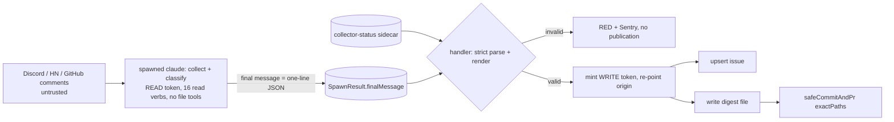

# ADR-272: Schema-constrained, handler-side publication for claude-eval crons that publish to a public surface

## Status

**Accepted - 2026-10-06 (#7122).** Applies to `cron-community-monitor` now. The other claude-eval crons that ingest third-party
content and publish are tracked in #9606 and are not covered by this decision until that issue lands; this ADR is `accepted`, not
`adopting`, because the decision is fully in force for the one cron it names. **The closure claim is forward-path only**: it says
what future output of this cron can contain. It says nothing about the 80+ digests already published (#7119), and it does not
close `cron-daily-triage`, which has the same exposure and is not fixed here.

## Context

`cron-community-monitor` feeds text written by outsiders (Discord messages, Hacker News posts, GitHub issue and comment bodies)
into a `claude --print` run whose output reached two public surfaces under the bot identity: a committed digest file that
auto-merges to the public `jikig-ai/soleur` repository, and a public tracking issue. Nothing between the model and those
surfaces constrained what text was published (the register records this as "no output allowlist", Art. 32(1)(b), deferred item
DEF-7). A redaction pass would constrain content, not structure, so the issue itself says it does not close the finding.

Reading the code while planning found that the two named channels were not the whole surface:

- The agent held `Write`/`Edit`, and `CRON_BASH_ALLOWLISTS["cron-community-monitor"]` allowed the whole
  `community-router.sh` prefix. The agent could overwrite the allowlisted router script and then run it with the full spawn
  environment, so narrowing the verb list alone would not have made posting unreachable.
- `gh issue list --jq env` passed the hook (the single-quoted `env` carries no `$`) and dumped the environment into the agent's own
  context; the file-read deny-list was bypassable (`Grep` rooted at `/` with a `proc/*/environ` glob, `Glob` for `**/.git/config`).
- The clone embedded the write-scoped installation token in `.git/config` (`buildAuthenticatedCloneUrl`), and the same token was in
  the spawn environment (`buildSpawnEnv`).
- `safeCommitAndPr` rendered up to ten agent-chosen untracked path names into the public PR body, and
  `ensureScheduledAuditIssue` published the model's final message tail into a public issue body on a RED run.

## Considered Options

| Option | Disposition |
|---|---|
| Redaction or sanitisation pass over the agent's prose (R4 shape) | Rejected. Constrains content, not structure; a bounded attacker-chosen sentence survives any charset filter. DEF-0 (#7119) keeps it as a legal-track item. |
| Constrained free text (length, charset, URL and mention strip) per field | Rejected. Same class: bounded attacker-chosen prose stays publishable. |
| Parse the agent's existing markdown, then publish | Rejected. A parser of free-form model markdown is the allowlist problem restated. |
| Narrow the router verb list only | Rejected. Does not stop `Write` over the allowlisted script. |
| Keep `Write` and a sidecar draft file | Rejected. Needs symlink and TOCTOU hardening and leaves the router script overwritable. |
| Human review gate (draft PR, no auto-merge) | Not the deliverable asked; adds a daily operator task; does not cover the issue channel. Kept as the fallback if counsel requires a gate. |
| Handler-side collection (no agent) | Right long-term direction for numeric provenance; a rewrite of seven collectors; belongs to #7124. |
| Generic `PublicationSpec<T>` primitive now | Premature before a second adopter; the module exports helper-level functions the siblings can lift (#9606). |
| **Chosen: closed-schema draft, handler renders and publishes, agent has no write capability or credential** | See Decision. |

## Decision

**claude-eval crons that publish to a public surface do so handler-side, from a closed-schema draft. The agent has no write or
publication capability and holds no write credential during its run.** For `cron-community-monitor` this means:

1. **The deliverable is the final message.** The agent collects and classifies; its final message is exactly one line of compact
   JSON. The substrate carries it on a new `SpawnResult.finalMessage` (redacted, capped, with a truncation flag), not on the front-cut
   `stdoutTail`. The handler parses it with a `z.strictObject` schema whose only leaves are bounded integers and closed enum members;
   there is no free-text field. The renderer turns a validated draft into the digest file and the issue body from fixed templates,
   so the set of publishable strings is a finite template family and model output selects values within it. The schema carries no
   direct identifier; counts can still single a person out (see residual (a) and the attestation).
2. **No write primitive, no publication verb.** A per-cron hook directive `no-file-tools` (the ADR-058 file-driven pattern,
   produced by the substrate from `CRON_NO_FILE_TOOLS`) makes the containment hook deny `Read`, `Glob`, `Grep`, `Write`, `Edit`,
   `MultiEdit`, `Task`, `Agent` and `Skill`; `NotebookEdit` is already denied by the hook's catch-all. The Bash allowlist becomes
   `COMMUNITY_ROUTER_READ_VERBS`, sixteen literal read invocations; `gh issue create|comment|list`, `gh label create|list` and the
   bare router prefix are gone. The three router posting verbs (`bsky post`, `linkedin post-content`, `x post-tweet`) therefore
   stop being inert only by an env convention and become hook-denied. `runHookSelfTest` probes the deny before each spawn.
3. **`--disallowedTools` is a second layer, and the hook is the load-bearing one.** `CLAUDE_CODE_FLAGS` adds `--disallowedTools`
   for the same tools and `--allowedTools` becomes `Bash`. No other cron spawn passes `--disallowedTools`, and how it composes with a
   hook `allow` cannot be proved offline; the hook tests exercise only the hook, and the flag has an argv test only. **The first
   post-merge run is the live evidence**: a `Write` attempt must appear as a hook denial, not as a write.
4. **Token custody split.** The clone and the spawn use a READ token (`COMMUNITY_SPAWN_TOKEN_PERMISSIONS`: contents, issues and
   pull requests read). The WRITE token (`DEFAULT_CRON_TOKEN_PERMISSIONS`) is minted only after the spawn, in a `mint-write-token`
   step that is skipped on a timeout, and `setOriginToken` re-points `origin` before `publish-issue` and `safe-commit-pr`. No write
   credential exists in the agent's environment or workspace during its run. The audit-issue fallback uses the App-installation
   client (`createProbeOctokit()`), because the write token does not exist when setup or the spawn fails. `DISCORD_WEBHOOK_URL` is
   dropped from `buildSpawnEnv` (no read-path consumer).
5. **Global `exactPaths` / `isPathAllowed` addition in `safeCommitAndPr` (ADR-054).** `SafeCommitConfig` gains `exactPaths`, and one
   shared predicate `isPathAllowed(path, { allowedPaths, exactPaths })` partitions `matched` and `dropped`. Community passes
   `allowedPaths: []` and `exactPaths: [<today's digest path>]`. In exact mode the dropped-path PR-body marker renders a count only;
   the other 14 callers keep prefix semantics and their marker byte for byte. This backs up the `no-file-tools` control at about six
   lines if the directive or flag regresses.
6. **Failure path publishes no model output.** `ensureScheduledAuditIssue` takes `withholdModelOutput`; community passes true, so
   both tail rows render a fixed notice and Sentry keeps the redacted tail.
7. **Collector truth is bound into the render.** `verify-collector-status` runs before validation; a failed github record in the
   sidecar overrides the model's github block to `failed`, and a missing sidecar renders github as `partial`.

This extends **ADR-054** (persistence is a platform responsibility; now authorship of the committed bytes is too) and **ADR-058**
(a per-cron directive in the file the hook reads, so the policy is structurally per cron). It sits under
[ADR-033-inngest-cron-functions-invoke-claude-code-via-child-process-spawn](./ADR-033-inngest-cron-functions-invoke-claude-code-via-child-process-spawn.md),
the decision that crons spawn `claude-code` inside a `claude-eval` step; the other two ADR-033 files are unrelated.

**Interaction with ADR-126.** ADR-126 requires the liveness signal to assert the consumed artifact. The tracking issue is now
made by the handler, so `verify-output` observes a deterministic artifact and is no longer a proof that the agent produced
anything. The gate is the validation verdict: `heartbeatOk = (verifyOutputOk || via === "patched") && publication.ok`, applied before
the unchanged persistence gate (`heartbeatOk && !spawnResult.abortedByTimeout`). `publish-issue` upserts: if a real digest issue for
the day exists it PATCHes the body (never state, title, labels or assignees; the target must be a non-PR, bot-authored, canonical-title
digest issue, and the existence read fails closed), which also covers the #6714 recovery case. Marker 3
(`emitCommunityDigestFile`) gains `verdict` and `writer: "handler"`.

**Spike S3 result.** No prompt step needs a file tool. Router output is truncated inline by the Bash tool, not spilled to a file the
agent must read. The 2026-10-05 digest note "output exceeded inline limit" shows a Discord message listing can exceed the inline
limit; the prompt therefore tells the agent to mark that platform `partial` with cause `output-too-large` rather than guess. The
`read-root` allow-list fallback was not needed.

### Operating triggers

- **RED-streak trigger.** If three consecutive runs end `community-publication-rejected` with reason `schema`, coerce unknown enum
  members to `other` (the PA-27 `MAIL_CLASS_ALLOWLIST` precedent: closed set, coerce out-of-set, mirror to Sentry, attach no values)
  instead of rejecting. The measured fix is an enum-parse edit, its test and one runbook line, so it is documented here and in the
  runbook rather than filed as an issue.
- **Abuse note.** Two consecutive `parse` rejections are possible abuse (a persistent hostile message in the collection window),
  not drift; the response is to inspect the ingested sources. The coercion above does not cover a non-JSON message, and the
  handler-authored audit issue still files a visible FAILED issue each day.

### Residuals, at true strength

Accepted and tracked. None of them is closed by this decision.

- **(a) Numeric truth and the integer channel.** An injection can choose in-range integers and in-set enum members; the schema
  bounds structure, not truth (the 2026-07-19 fabricated-stats lesson). About 35 free integers are a covert encoding channel for any
  secret that reaches the agent's context; caps are realistic and a bit budget is asserted, and the paths that put secrets into
  context are closed (residual (g) states what remains). A count can single out a person (one first outside contributor, a
  single-member topic). Mitigations are the #6695 collector-status sidecar and #7124, not this ADR.
- **(b) The interactive `/soleur:community digest` skill** is operator-attended, not an unattended publisher, and is outside this
  threat model.
- **(c) Sibling crons share the class.** `cron-daily-triage` (a PA-32 member that comments publicly and has no hook at all, #7123),
  `cron-competitive-analysis`, `cron-growth-audit`, `cron-seo-aeo-audit`, `cron-content-generator` and `cron-growth-execution`.
  Tracked in **#9606**; the compliance-posture row for #7122 stays OPEN for `cron-daily-triage`.
- **(d) `Grep`/`Glob` literal-path checking.** The hook tests only the literal `path`/`pattern`, so a recursive `Grep` rooted at `.`
  may descend into `.git/config`. Moot for this cron once file tools are removed, and the on-disk credential is READ-scoped; recorded
  for #9606.
- **(e) Trailing arguments on allowlisted verbs** (`hn mentions --query <text>`, `discord messages <id>`) are a path for in-context
  data to reach third parties. Accepted because, with no file tools and no env-dump verb, the agent holds no secret in context.
- **(f) The redacted spawn tail still reaches Sentry and alert emails.** A phishing vector aimed at the operator; it predates this
  change and is shared by every claude-eval cron. Recorded on #9606, not fixed here.
- **(g) Non-GitHub credentials remain in the spawn env** for the read collectors (`DISCORD_BOT_TOKEN`, `BSKY_APP_PASSWORD`,
  `X_ACCESS_TOKEN`/`X_ACCESS_TOKEN_SECRET`, the LinkedIn tokens, `ANTHROPIC_API_KEY`). With no write primitive, no posting verb and no
  network egress verb they cannot be used to publish, but a covert encoding of one into the free integers would be a permanent
  public leak. Containment rests on the hook's `/proc` and secret-read denies and on the router scripts not echoing env (a source
  test asserts no `printenv`, bare `env`, `set -x` or `declare -p` in them).

**What this does not change**, stated so the closure cannot be over-read: there is still **no human gate** (`mergeMode: "auto"`
stays); enum selection and counts remain model-influenced; the raw collected text still reaches Anthropic and **no PII scrub exists
on that input** (#7124); and the 80+ digests already published keep naming commenters and stargazers (#7119, R5, Art. 17
impossibility). For R1/R2/R3 the position is that future output is structurally incapable of that content; R4's objective is met
by a different mechanism; whether that substitutes for R1-R4 is for counsel at #7119. The register's lawful-basis conclusion is not
touched. The digest drops Top Contributors, Community Interactions, stargazer usernames, quotes and free-text Trending prose
(Decision Challenge in `knowledge-base/project/specs/feat-one-shot-7122-community-monitor-output-allowlist/decision-challenges.md`).

## Consequences

- **Easier.** What the digest and issue can say is a reviewable finite template family; a tampered or drifting draft is rejected
  loudly (RED monitor plus Sentry op `community-publication-rejected`) and never silently published. The agent cannot overwrite the
  router script, and no write credential is on disk or in env while it runs.
- **Harder.** A single stray field loses that day's digest, and it is not retried. The digest is far poorer than before (counts
  and statuses only). A strict one-line-JSON final-message contract binds the prompt and the substrate's `result` extraction.
- **Operational.** Merging redeploys the unattended publisher with no flag; rollback is a revert. The first RED after merge may be
  an in-flight run on the old prompt. If the read token under-serves a collector, the sidecar reports `collector-status-failed`;
  the fallback is to narrow the claim to "write verbs are hook-denied and the write credential is minted after the spawn" and keep
  the rest.
- **Reversible.** The richer-digest options in the Decision Challenge are schema edits; Phase 5 (custody) is independently
  revertable.

## Cost Impacts

None. No new vendor, tier or service; one extra installation-token mint per run.

## NFR Impacts

None. No NFR status in `nfr-register.md` changes tier.

## Principle Alignment

- AP-011 (ADRs for architecture decisions): Aligned.
- AP-020 (untrusted input at the agent boundary): Aligned in spirit and adjacent in scope. The principle is written for the hook-stdin
  envelope; this ADR applies the same stance (verify, do not normalise) to model output crossing into a public surface.

## Diagram

