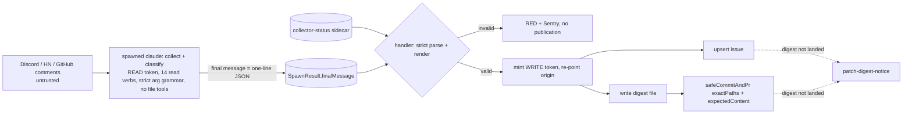

# ADR-273: Schema-constrained, handler-side publication for claude-eval crons that publish to a public surface

## Status

**Accepted - 2026-10-06 (#7122).** Applies to `cron-community-monitor` now. The other claude-eval crons that ingest third-party
content and publish are tracked in #9606 and are not covered by this decision until that issue lands; this ADR is `accepted`, not
`adopting`, because the decision is fully in force for the one cron it names. **The closure claim is forward-path only**: it says
what future output of this cron can contain. It says nothing about the 80+ digests already published (#7119), and it does not
close `cron-daily-triage`, which has the same exposure and is not fixed here. The PR closes issue #7122, so a reader of that closed issue should follow the pointer: `cron-daily-triage` remains OPEN under #9606, and the compliance-posture row for #7122 stays OPEN for it.

## Context

`cron-community-monitor` feeds text written by outsiders (Discord messages, Hacker News posts, GitHub issue and comment bodies)
into a `claude --print` run whose output reached two public surfaces under the bot identity: a committed digest file that
auto-merges to the public `jikig-ai/soleur` repository, and a public tracking issue. Nothing between the model and those
surfaces constrained what text was published (the register records this as "no output allowlist", Art. 32(1)(b), deferred item
DEF-7). A redaction pass would constrain content, not structure, so the issue itself says it does not close the finding.

Reading the code while planning found that the two named channels were not the whole surface:

- The agent held `Write`/`Edit`, and `CRON_BASH_ALLOWLISTS["cron-community-monitor"]` allowed the whole
  `community-router.sh` prefix. The agent could overwrite the allowlisted router script and then run it with the full spawn
  environment, so narrowing the verb list alone would not have made posting unreachable.
- `gh issue list --jq env` passed the hook (the single-quoted `env` carries no `$`) and dumped the environment into the agent's own
  context; the file-read deny-list was bypassable (`Grep` rooted at `/` with a `proc/*/environ` glob, `Glob` for `**/.git/config`).
- The clone embedded the write-scoped installation token in `.git/config` (`buildAuthenticatedCloneUrl`), and the same token was in
  the spawn environment (`buildSpawnEnv`).
- `safeCommitAndPr` rendered up to ten agent-chosen untracked path names into the public PR body, and
  `ensureScheduledAuditIssue` published the model's final message tail into a public issue body on a RED run.

## Considered Options

| Option | Disposition |
|---|---|
| Redaction or sanitisation pass over the agent's prose (R4 shape) | Rejected. Constrains content, not structure; a bounded attacker-chosen sentence survives any charset filter. DEF-0 (#7119) keeps it as a legal-track item. |
| Constrained free text (length, charset, URL and mention strip) per field | Rejected. Same class: bounded attacker-chosen prose stays publishable. |
| Parse the agent's existing markdown, then publish | Rejected. A parser of free-form model markdown is the allowlist problem restated. |
| Narrow the router verb list only | Rejected. Does not stop `Write` over the allowlisted script. |
| Keep `Write` and a sidecar draft file | Rejected. Needs symlink and TOCTOU hardening and leaves the router script overwritable. |
| Human review gate (draft PR, no auto-merge) | Not the deliverable asked; adds a daily operator task; does not cover the issue channel. Kept as the fallback if counsel requires a gate. |
| Handler-side collection (no agent) | Right long-term direction for numeric provenance; a rewrite of seven collectors; belongs to #7124. |
| Generic `PublicationSpec<T>` primitive now | Premature before a second adopter; the module exports helper-level functions the siblings can lift (#9606). |
| **Chosen: closed-schema draft, handler renders and publishes, agent has no write capability and no GitHub write credential** | See Decision. |

## Decision

**claude-eval crons that publish to a public surface do so handler-side, from a closed-schema draft. The agent has no write or
publication capability and holds no GitHub write credential during its run.** The wording is deliberately "GitHub write credential":
the posting credentials for Discord, Bluesky, X and LinkedIn that the read collectors need remain in the spawn environment
(residual (g)); what makes them unusable for publication is the absence of a posting verb and of any file or network primitive, not
the absence of the credential. For `cron-community-monitor` this means:

1. **The deliverable is the final message.** The agent collects and classifies; its final message is exactly one line of compact
   JSON. The substrate carries it on `SpawnResult.finalMessage` (redacted, capped at `FINAL_MESSAGE_CAP_BYTES` = 16 KiB, with a
   truncation flag), not on the front-cut `stdoutTail`. The field is **opt-in**: `spawnClaudeEval` populates it only when the
   caller passes `captureFinalMessage: true`, and only this cron does, because three sibling crons spread the whole `SpawnResult`
   into Sentry extras and a field nobody asked for must not exist on their result. Where it is captured, the redacted message
   (up to 16 KiB) is memoized in the `claude-eval` step output; the *published* artefacts carry only handler-rendered text.
   The handler parses the message with a `z.strictObject` schema whose only leaves are bounded integers and closed enum members;
   there is no free-text field. The renderer turns a validated draft into the digest file and the issue body from fixed
   templates, so the set of publishable strings is a finite template family and model output selects values within it. The
   schema carries no direct identifier; counts can still single a person out (see residual (a) and the attestation).
   Three rendering rules came out of review. **(4a) The period is handler-owned and honest:** there is no `periodDays` field. The collectors do NOT share a window: the five GitHub verbs take a 1-day argument (`COMMUNITY_PERIOD_DAYS`, GitHub only), Hacker News mentions look back 7 days, Discord returns the latest 50 messages per channel (a ceiling, not a daily volume), and X, Bluesky and LinkedIn are totals as of collection. The render states exactly that in a fixed constant (`COMMUNITY_WINDOWS_NOTE`) instead of one "Last 1 day" label, and `generated_at` is the run's own start instant at second precision. **An all-zero guard:** a `collected` platform with more than one metric whose every value is 0 renders as `partial (unverified: all values 0)`; a single-metric platform (Hacker News) at 0 is a legitimate quiet day and renders as measured. **Metrics are not rendered for a failed or disabled platform** (a 0 there is not a
   measurement); a `partial` platform renders its numbers under an explicit label saying a 0 may mean unavailable.
2. **No write primitive, no publication verb, no code-execution path.** A per-cron hook directive `no-file-tools` (the ADR-058
   file-driven pattern, produced by the substrate from `CRON_NO_FILE_TOOLS`) makes the containment hook deny `Read`, `Glob`,
   `Grep`, `Write`, `Edit`, `MultiEdit`, `Task`, `Agent` and `Skill`; `NotebookEdit` is already denied by the hook's catch-all.
   The Bash allowlist becomes `COMMUNITY_ROUTER_READ_VERBS`, **thirteen** exact-literal read invocations (round-1 review also dropped `linkedin fetch-activity`, which feeds no schema field); `gh issue create|comment|list`,
   `gh label create|list` and the bare router prefix are gone. The three router posting verbs (`bsky post`,
   `linkedin post-content`, `x post-tweet`) therefore stop being inert only by an env convention and become hook-denied.
   `runHookSelfTest` probes the deny before each spawn. Review removed two verbs from the sixteen the first draft carried:
   `discord members` (a payload of up to 1000 member objects, and the member count is already available from `guild-info`) and
   `hn trending` (no schema field consumes it).
   **Trailing arguments are not inert data, so commands are exact literals and the scripts validate (review finding, P1; tightened in round 1).** The
   allowlist matches a verb prefix and the hook's metacharacter screen strips single-quoted spans, so the arguments after an
   allowed verb were never inspected. They reached live interpreters: a single-quoted `HOME[$(cmd)]` was evaluated by bash
   arithmetic in the Discord script (`(( limit ))`, `$(( limit ))`), and an HN `--query` value was interpolated into
   `python3 -c` source. Either ran with the full spawn environment. Three controls close it. **(0)** (round 1) For a cron carrying `no-file-tools` each `;`/`&&` segment must equal one allowlist line token-for-token, with a single placeholder `<uint>` (`^(0|[1-9][0-9]*)$`) for the Discord channel id; no trailing argument of any kind is accepted, so `hn mentions --query soleur --limit 20` is the only HN command and the query word is pinned. **(i)** The token charset check stays as a second layer: for a cron carrying
   `no-file-tools`, `strictArgumentGrammarReason` requires every whitespace-separated token of every `;`/`&&` segment to match
   `[A-Za-z0-9._:=@/+-]+`, checked on the RAW command text before quote-stripping or tokenizing, with a fixed deny reason that
   echoes nothing from the command. **(ii)** The platform scripts validate their own operands (`require_uint` for
   `discord messages` channel, limit and after_id (leading zeros rejected: `08` was an octal arithmetic error that exited 0 with `[]`) and for the `hn` `--limit`; the `hn` query now reaches python through
   `sys.argv`, never program text; error messages name the operand label and never its value). Each control alone would leave a
   path if the others regressed, so all three stay. The hook also caps the command at 8 KiB before any regex and trims by splitting, because a
   whitespace-trim regex was quadratic (100k spaces = 25 s).
3. **`--disallowedTools` is a second layer, and the hook is the load-bearing one.** `CLAUDE_CODE_FLAGS` adds `--disallowedTools`
   (`COMMUNITY_DISALLOWED_TOOLS`) for the same tools and `--allowedTools` becomes `Bash`. No other cron spawn passes
   `--disallowedTools`, and how it composes with a hook `allow` cannot be proved offline; the hook tests exercise only the hook,
   and the flag has an argv test only. **What the first post-merge run does and does not prove.** If `--disallowedTools` works as
   intended the model never sees a file tool and never attempts `Write`, so a healthy first run (zero `permissionDenialCount`, the
   digest landing) proves **neither layer**: it proves only that the collectors and the draft path work under the new flags. The
   hook's deny is evidenced by `runHookSelfTest` (a per-spawn probe of `Write`, `Grep`, `Task` and `Skill`) and by the hook tests,
   not by the live run. A denial is evidence in one direction only: a non-zero `permissionDenialCount` with a file tool named in
   `deniedTools` (Sentry op `community-agent-denied-verb`) shows the model still reached for the tool, i.e. the CLI flag did not
   remove it, and that the hook refused it. Absence of a denial says nothing about either layer.
4. **Token custody split, and a step-id rename.** The clone and the spawn use a READ token (`COMMUNITY_SPAWN_TOKEN_PERMISSIONS`:
   contents, issues and pull requests read), minted in the step `mint-read-token`; the clone is the step `setup-workspace-ro`.
   Both step ids are **new**: memoized step ids are the replay contract, and a run that started before the deploy and is re-driven
   after it would otherwise read back the OLD write-scoped token and the OLD clone (old allowlist, no `no-file-tools` directive)
   from its memo and then run the new prompt and flags under old containment. With new ids that run re-mints a read token and
   re-clones. The WRITE token (`DEFAULT_CRON_TOKEN_PERMISSIONS`) is minted only after the spawn and a validated draft, in a
   `mint-write-token` step that is skipped on a timeout, and `setOriginToken` re-points `origin` before `publish-issue` and
   `safe-commit-pr`. **No GitHub write credential exists in the agent's environment or workspace during its run.** The audit-issue
   fallback uses the App-installation client (`createProbeOctokit()`), because the write token does not exist when setup or the
   spawn fails. `DISCORD_WEBHOOK_URL` is dropped from `buildSpawnEnv` (the Discord *posting* credential; no read-path consumer).
   The substrate also kills the child's whole process group (`process.kill(-pid, "SIGKILL")`, the child is a `detached` group
   leader) on **every** exit, not only on timeout, because a grandchild that outlived the run could otherwise read the write token
   the handler mints into `.git/config` afterwards; and it waits a bounded `STDIO_CLOSE_WAIT_MS` after `exit` for the stdout
   pipe to drain so the final `result` line (the whole deliverable) is not lost.
5. **Global `exactPaths` / `isPathAllowed` addition in `safeCommitAndPr` (ADR-054), with the workspace treated as untrusted.**
   `SafeCommitConfig` gains `exactPaths`, and one shared predicate `isPathAllowed(path, { allowedPaths, exactPaths })` partitions
   `matched` and `dropped`. Community passes `allowedPaths: []` and `exactPaths: [<today's digest path>]`. In exact mode the
   dropped-path PR-body marker renders a count only; the other 14 callers keep prefix semantics and their marker byte for byte.
   Review found the pipeline ran git in a directory the agent had written to, so exact mode also: **(i)** passes
   `-c core.hooksPath=/dev/null -c core.fsmonitor=false -c core.attributesFile=/dev/null` on every git invocation the module
   makes (`GIT_HARDENING_ARGS`), with replace refs disabled (`--no-replace-objects`); **(ii)** sanitises `.git` before the first git command (`sanitizeWorkspaceGit`): the config is
   rewritten from nothing and only `remote.origin.url` (written by `setOriginToken` after the child exited, which itself refuses a symlinked `.git`/`.git/config`) carries over, and only if the key has EXACTLY one value (a planted second `url` line, which `--get` would read as the last value, is refused),
   `.git/hooks`, `.git/info/attributes`, `refs/replace/*`, `commondir`, `objects/info/alternates` and `info/grafts` are removed (round 1: git also reads these from the common dir and object store), and a `.git`, `.git/config`, `.git/info`, `.git/hooks` or `.git/objects` that is a symlink or a file is refused; **(iii)** stages
   each path as a filter-free blob (`hash-object --no-filters` + `update-index`, never `git add`) and refuses anything but a
   regular file; **(iv)** takes `expectedContent` (path to the handler's rendered bytes) and, after staging and before the
   commit, reads the index blob back and requires a byte-for-byte match, so a file planted at the exact path cannot ride the
   commit; the refusal is stage `integrity` with a closed-vocabulary reason and no bytes in any message; **(v)** before EVERY push (the fresh commit and a replay-resume of a pre-existing branch alike) requires HEAD to be exactly one commit
   on the freshly fetched origin tip, whose diff (renames NOT detected, so a rename pairing fails) is only added or modified regular
   files at `exactPaths` with blobs equal to `expectedContent`, authored and committed by the bot (a planted branch or an agent
   commit riding along is refused). `expectedContent` is REQUIRED in exact mode. This backs up the `no-file-tools` control and was reachable in practice only
   through the argument path of item 2.
6. **Failure path publishes no model output.** `ensureScheduledAuditIssue` takes `withholdModelOutput`; community passes true, so
   both tail rows render a fixed notice and Sentry keeps the redacted tail. The rejection report
   (`community-publication-rejected`) carries a closed vocabulary and numbers only and is emitted on the message path (a null
   error), so the `op` tag survives in Sentry (#8629); a rejected draft also skips the advisory `verify-output` read below,
   because that read folds the spawn's stdout/stderr tail (which holds the rejected message) into its own Sentry event.
7. **Collector truth is bound into the render.** `verify-collector-status` runs before validation; a failed github record in the
   sidecar overrides the model's github block to `failed`, and a missing sidecar renders github as `partial`.
8. **The issue is published before the commit, so a dangling link is handled explicitly.** `publish-issue` runs before
   `safe-commit-pr`, so the public issue can link a digest file that never lands. After the body's inner try/catch, a
   `patch-digest-notice` step keyed on the OUTCOME (`published !== undefined && !livenessOk && !commitNoChanges`) PATCHes the
   issue body to a handler constant (`digest not committed - see Sentry`). It covers a throw out of `safe-commit-pr`, a failed or
   unverified commit, a throw between publish and commit, and a skipped persistence; the one exception is `no-changes`, where the
   identical file is already on main and the link is valid. The PATCH is body-only, never reopens, and replaces ONLY the `Digest file:` line (the validated counts survive); its own failure is
   reported (`community-publication-notice-failed`) and never masks the verdict. `verify-output` runs after persistence, only for a
   created issue, in its own try/catch: it is telemetry and can neither gate nor fail the run.
9. **Bot identity is resolved, not defaulted.** The PATCH-target author gate uses the App's `<slug>[bot]` login obtained from
   `getAppSlug()` (GET /app, 5 s timeout). Only a slug validated from a 2xx response is cached for the process; a fallback to the env value is returned but never cached, so one transient failure cannot pin a wrong login until restart. A bot-authored canonical digest for today under a *different* login
   is not overwritten: the run warns (`community-publication-bot-login-mismatch`) and creates, producing a visible duplicate
   rather than a silent overwrite of an unexpected issue.

This extends **ADR-054** (persistence is a platform responsibility; now authorship of the committed bytes is too; see its
2026-10-06 addendum) and **ADR-058** (a per-cron directive in the file the hook reads, so the policy is structurally per cron; see
its addendum). It sits under
[ADR-033-inngest-cron-functions-invoke-claude-code-via-child-process-spawn](./ADR-033-inngest-cron-functions-invoke-claude-code-via-child-process-spawn.md),
the decision that crons spawn `claude-code` inside a `claude-eval` step; the other two ADR-033 files are unrelated.

**Step design (AP-028).** Every verdict that crosses a step boundary is *returned* from the step as a JSON-plain value and
re-read by the handler, never inferred from a caught error's class, `name` or `status`: `validate-publication` returns
`PublicationVerdict` (the rendered text only, never the raw draft), `publish-issue` returns `{ issueNumber, via }`, and
`safe-commit-pr` returns its result. The hoisted `published` and `commitNoChanges` are assigned from those returns in the handler
body, not inside a step callback, so they survive Inngest re-entering the handler. The publish step's catch reports the error's
`name` and numeric `status` only and rethrows; the handler never branches on it.

**Interaction with ADR-126.** ADR-126 requires the liveness signal to assert the consumed artifact. The tracking issue is now
made by the handler, so re-reading it cannot prove anything the handler does not already hold. The gate is therefore
`heartbeatOk = publication.ok && published !== undefined` (the draft validated AND the handler's own issue write returned), applied
before the unchanged persistence gate (`heartbeatOk && !spawnResult.abortedByTimeout`). `resolveOutputAwareOk` (the `verify-output`
step) is **kept as advisory telemetry only**, runs only when `publication.ok`, and never feeds `heartbeatOk`: re-reading the
handler's own write cannot credit a PATCHed closed issue, and list lag would turn a healthy run into a false negative that skips
the commit. `publish-issue` upserts: if a real digest issue for the day exists it PATCHes the body (never state, title, labels or
assignees; the target must be a non-PR, `Bot`-typed, canonical-title digest issue authored by the resolved App login, and the
existence read fails closed), which also covers the #6714 recovery case. Marker 3 (`emitCommunityDigestFile`) gains `verdict` and
`writer: "handler"`. For ADR-216, the run-report population row for this cron is now `filer: "handler"` (see its addendum).

**Spike S3 result.** No prompt step needs a file tool. Router output is truncated inline by the Bash tool, not spilled to a file the
agent must read. The 2026-10-05 digest note "output exceeded inline limit" shows a Discord message listing can exceed the inline
limit; the prompt therefore tells the agent to mark that platform `partial` with cause `output-too-large` rather than guess. The
`read-root` allow-list fallback was not needed.

### Operating triggers

- **RED-streak trigger.** If three consecutive runs end `community-publication-rejected` with reason `schema`, coerce unknown enum
  members to `other` (the PA-27 `MAIL_CLASS_ALLOWLIST` precedent: closed set, coerce out-of-set, mirror to Sentry, attach no values)
  instead of rejecting. The measured fix is an enum-parse edit, its test and one runbook line, so it is documented here and in the
  runbook rather than filed as an issue.
- **Abuse note.** Two consecutive `parse` rejections are possible abuse (a persistent hostile message in the collection window),
  not drift; the response is to inspect the ingested sources. The coercion above does not cover a non-JSON message, and the
  handler-authored audit issue still files a visible FAILED issue each day.

### Residuals, at true strength

Accepted and tracked. None of them is closed by this decision; (e) is the one that changed most during review and is rewritten
below for that reason.

- **(a) Numeric truth and the integer channel.** An injection can choose in-range integers and in-set enum members; the schema
  bounds structure, not truth (the 2026-07-19 fabricated-stats lesson). About 35 free integers are a covert encoding channel for any
  secret that reaches the agent's context; caps are realistic and a bit budget is asserted, and the paths that put secrets into
  context are narrowed (residual (g) states what remains). **Counts can single a person out.** The fields that can do so are not
  limited to `externalContributors`, `externalInteractions` and the per-topic counts: `discord.members` and `discord.messages`
  for a private guild (a small, enumerable membership) and `github.newStargazers` can each identify an individual or an event
  when the population is small. Because the digest is daily and several of these fields are snapshots or short windows (the collection windows differ by platform, see item 4a), the published series is
  a **daily series**, so day-over-day differences can point at a specific day's actor. Mitigations are the #6695 collector-status
  sidecar and #7124, not this ADR.
- **(b) The interactive `/soleur:community digest` skill** is operator-attended, not an unattended publisher, and is outside this
  threat model. It writes the same `YYYY-MM-DD-digest.md` filename, so an interactive run on a day the cron also publishes can
  overwrite the cron's file (documented in the agent and skill, see below).
- **(c) Sibling crons share the class.** `cron-daily-triage` (a PA-32 member that comments publicly and has no hook at all, #7123),
  `cron-competitive-analysis`, `cron-growth-audit`, `cron-seo-aeo-audit`, `cron-content-generator` and `cron-growth-execution`.
  Tracked in **#9606**; the compliance-posture row for #7122 stays OPEN for `cron-daily-triage` even though this PR closes
  issue #7122 itself.
- **(d) `Grep`/`Glob` literal-path checking.** The hook tests only the literal `path`/`pattern`, so a recursive `Grep` rooted at `.`
  may descend into `.git/config`. Moot for this cron once file tools are removed, and the on-disk credential is READ-scoped; recorded
  for #9606.
- **(e) Trailing arguments on allowlisted verbs, REWRITTEN.** The first draft of this ADR recorded this residual as "accepted
  because, with no file tools and no env-dump verb, the agent holds no secret in context". That was wrong in two ways, found in
  review. **First,** trailing arguments were not inert data: they reached `python3 -c` source and bash arithmetic evaluation, so a
  steered agent could execute code with the spawn environment (which includes the non-GitHub posting credentials, residual (g)).
  **Second,** in-context content was reachable by the argument path: the first draft's `discord members` verb placed up to 1000
  member objects in the agent's context, and `hn mentions --query` is an egress path to a third party (`hn.algolia.com`), so
  members' data could have left through an argument. **Now closed** on both legs: the code-execution leg by exact-literal commands, the token
  grammar and script-side operand validation (decision item 2), and the egress-by-argument leg because the HN query word is a pinned
  literal (no agent-chosen string can reach `hn.algolia.com`), `discord members` is removed, and a Discord channel id must be a number.
  **What remains:** the verbs that put third-party text into context (`discord messages`, `github fetch-interactions`, `hn mentions`)
  are unchanged, and the integer channel in (a) is bounded, covert and dependent on an injection having steered the agent.
- **(f) The redacted spawn tail still reaches Sentry and alert emails.** A phishing vector aimed at the operator; it predates this
  change and is shared by every claude-eval cron. Recorded on #9606, not fixed here. The redacted final message (up to 16 KiB)
  is additionally memoized in the `claude-eval` step output for this cron (`captureFinalMessage`), which is Inngest run state,
  not a published surface.
- **(g) Non-GitHub credentials remain in the spawn env** for the read collectors, and several are *posting* credentials:
  `DISCORD_BOT_TOKEN`, `BSKY_APP_PASSWORD`, `X_ACCESS_TOKEN`/`X_ACCESS_TOKEN_SECRET` (with `X_API_KEY`/`X_API_SECRET`), the
  LinkedIn tokens, and `ANTHROPIC_API_KEY`. Measured against `buildSpawnEnv` at this PR: 17 keys, of which 12 are
  third-party platform variables (8 are credentials, 4 are identifiers: `DISCORD_GUILD_ID`, `BSKY_HANDLE`,
  `LINKEDIN_PERSON_URN`, `LINKEDIN_ORG_ID`), plus `ANTHROPIC_API_KEY`, the READ-scoped `GH_TOKEN`, and `PATH`, `HOME`,
  `NODE_ENV`; the handler wrapper adds `SOLEUR_COLLECTOR_STATUS_DIR` and the substrate adds
  `CLAUDE_CODE_DISABLE_NONESSENTIAL_TRAFFIC`, so the child sees 19 (20 since the 2026-10-07 addendum: the wrapper also sets the non-secret `SOLEUR_COLLECTOR_COMPACT`). With no write primitive, no posting verb, no code-execution
  path and no network egress verb they cannot be used to publish, but a covert encoding of one into the free integers or the
  one agent-chosen token, a numeric Discord channel id (the HN query word is pinned; see (e)), would be a permanent public leak or a third-party disclosure. Containment rests on the hook's
  `/proc` and secret-read denies, the argument grammar, and the router scripts not echoing env (a source test asserts no
  `printenv`, bare `env`, `set -x` or `declare -p` in them).

**What this does not change**, stated so the closure cannot be over-read: there is still **no human gate** (`mergeMode: "auto"`
stays); enum selection and counts remain model-influenced; the raw collected text still reaches Anthropic and **no PII scrub exists
on that input** (#7124); and the 80+ digests already published keep naming commenters and stargazers (#7119, R5, Art. 17
impossibility). For R1/R2/R3 the position is that future output is structurally incapable of that content; for R4 the exposure it
described is **narrowed** by a different mechanism (no redaction pass was built); whether that substitutes for R1-R4 is for
counsel at #7119, and nothing here treats any of them as met. The register's lawful-basis conclusion is not touched. The digest
drops Top Contributors, Community Interactions, stargazer usernames, quotes and free-text Trending prose (Decision Challenge in
`knowledge-base/project/specs/feat-one-shot-7122-community-monitor-output-allowlist/decision-challenges.md`).

## Consequences

- **Easier.** What the digest and issue can say is a reviewable finite template family; a tampered or drifting draft is rejected
  loudly (RED monitor plus Sentry op `community-publication-rejected`) and never silently published. The agent cannot overwrite the
  router script, and no GitHub write credential is on disk or in env while it runs (the non-GitHub posting credentials are residual (g)).
- **Harder.** A single stray field loses that day's digest, and it is not retried. The digest is far poorer than before (counts
  and statuses only). A strict one-line-JSON final-message contract binds the prompt and the substrate's `result` extraction.
- **Operational.** Merging redeploys the unattended publisher with no flag; rollback is a revert. The first RED after merge may be
  an in-flight run on the old prompt (the step-id rename in Decision item 4 makes a run that merely *replays* across the deploy re-mint and re-clone rather than resume under old containment). If the read token under-serves a collector, the sidecar reports `collector-status-failed`;
  the fallback is to narrow the claim to "write verbs are hook-denied and the GitHub write credential is minted after the spawn" and keep
  the rest.
- **Reversible.** The richer-digest options in the Decision Challenge are schema edits; Phase 5 (custody) is independently
  revertable.

## Cost Impacts

None. No new vendor, tier or service; one extra installation-token mint per run.

## NFR Impacts

None. No NFR status in `nfr-register.md` changes tier.

## Principle Alignment

- AP-011 (ADRs for architecture decisions): Aligned.
- AP-028 (a verdict that crosses a step boundary is returned, not read from a caught error): Aligned; see "Step design (AP-028)" in Decision.
- AP-020 (untrusted input at the agent boundary): Aligned in spirit and adjacent in scope. The principle is written for the hook-stdin
  envelope; this ADR applies the same stance (verify, do not normalise) to model output crossing into a public surface.

## Diagram

## Addendum (2026-10-06): first production run

The first run on the read-only spawn token showed `github` as failed. GitHub answers `403 Resource not accessible by integration` for the stargazers list (REST and GraphQL) unless the installation token carries `contents: write`; no read-level permission unlocks it (probed one permission at a time and all together against the live app installation). This is the contingency the Consequences section anticipated ("if the read token under-serves a collector ... narrow the claim"), realised for one metric. The narrow-the-claim fallback was not taken: custody is intact (the spawn token is still read-only, and widening it to write would defeat this ADR), only one metric is affected, and the other eight GitHub numbers are measured.

Resolution: `repo-stats` treats exactly that response (the message and `HTTP 403` together; any other stargazers failure is still a hard failure) as an unavailable count: `new_stargazers_count: null`, `stargazers_unavailable: true`, exit 0, and a closed `stargazers_unavailable` warn in the collector-status sidecar. The handler, not the model, acts on that warn: a draft that reports github `collected` is forced to `partial` / `auth` with its other numbers kept, so an unmeasured `New stargazers 0` is never published as a measurement. The prompt also tells the model to do this, as a second layer. The warn is not reported to Sentry (it is a standing fact about the token, and a daily event for it would stop the signal being read).

Consequence: the digest's `New stargazers` value is not a measured count while the spawn token stays read-only, and the github row carries the `partial (auth; a 0 may mean unavailable)` label on every run. Options for a later change: derive new stars from the delta in `stargazers_count` against the previous digest (no extra permission), or drop the metric from the schema.

## Addendum (2026-10-07): compact collector output (#9678)

**Problem.** Spike S3 accepted `partial` / `output-too-large` for "a Discord message listing". The 2026-10-06 digest showed it on both Discord and GitHub: the agent has no file tools, so any collector line past the Bash tool's inline limit (30,000 characters) is unreadable, and the prompt forces the row to `partial`. GitHub `activity` alone is 77,599 bytes compact on a worst-case window.

**Decision.** Shrink what the agent reads, at the collector, with a handler-controlled switch. The cron handler sets one non-secret spawn env key, `SOLEUR_COLLECTOR_COMPACT=1`, in the same wrapper that already adds `SOLEUR_COLLECTOR_STATUS_DIR`. With it set, each collector command the prompt runs prints ONE line of JSON holding only the fields the prompt reads: counts, the first 40 text-channel ids (digits only), and the newest 40 titles per list capped at 60 characters. Unset, or any other value, leaves the output byte-identical to the interactive form. The agent cannot set the flag itself (the containment hook denies `NAME=value` prefixes and has no `env` or `export` verb). `discord members` is not projected: the hook denies it, so the cron never runs it.

**What does not change.** The closed schema, the containment hook's allowlist (no command literal changed), the agent's tools (still no file tool), the posting and read credentials in the spawn env (residual (g) is unchanged apart from the child-env count, 19 to 20), the publication path and the handler-authored metrics. The projection strictly narrows what reaches the model: logins, message bodies, comment snippets and URLs are dropped, so it also reduces the input that #7124 is about without closing it. A drifted required field fails closed (`compact-projection-failed`) instead of printing a `null` the model could read as 0.

**Alternatives rejected.** A file or handoff path for the full output needs `Read`/`Glob`, which this ADR removed (the `read-root` fallback was declined in Spike S3), and a handler-side collector run would move credentials. Raising the Bash output cap is a clamped bump, not a bound, and feeds more third-party text to the model. Computing the metrics in the handler from raw collector output is a larger rewrite that moves metric authorship, and is not needed to remove the cause.

**Signals.** Two closed warn values ride the existing collector-status sidecar `warn` field (GitHub only; Discord has no sidecar, and its outputs are about 1 KB by construction): `compact_off` (a cron run whose flag did not reach the collector) and `compact_over_budget` (one compact output over 6,000 bytes). The prompt keeps its `output-too-large` rule as the residual fallback.

**Residual, unchanged in kind.** GitHub still renders `partial` / `auth` on every run while the read-only spawn token cannot list stargazers (the 2026-10-06 addendum); this change removes only the `output-too-large` cause, so Discord can now render `collected` and GitHub's other counts are measured rather than truncated. The standing `auth` label is tracked as #9679.
