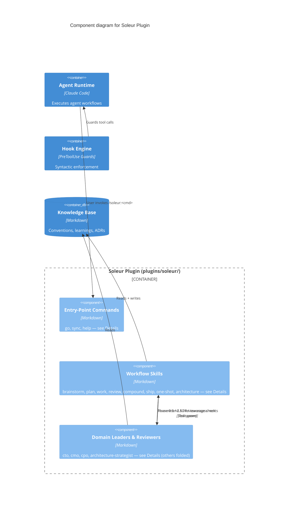

# Soleur Plugin — Component Diagram (C4 Level 3)

Generated: 2026-05-13 (visual redesign per SOL-40, was 2026-03-27)

## Details

**`entry` (Entry-Point Commands)** — `plugins/soleur/commands/`:

- `go` — classifies intent and routes to workflow skills
- `sync` — populates knowledge-base from existing codebase
- `help` — lists all available commands, skills, and agents

**`workflows` (Workflow Skills)** — `plugins/soleur/skills/`:

- `brainstorm` — explores requirements with domain leader assessment (Phase 0.5 → spawns leaders)
- `plan` — creates implementation plans with research and domain review (Phase 2.5 → spawns leaders)
- `work` — executes plans with incremental commits and test-first
- `review` — multi-agent code review (8 parallel review agents, including `architecture-strategist`)
- `compound` — captures learnings and promotes to constitution
- `ship` — validates artifacts, creates PR, manages merge lifecycle
- `one-shot` — full autonomous pipeline orchestrating `plan` → `work` → `review` → `compound` → `ship` as Steps 1–5
- `architecture` — ADR lifecycle and C4 diagram generation (target of `cto` and `architecture-strategist` recommendations)

**`leaders` (Domain Leaders & Reviewers)** — `plugins/soleur/agents/`:

- `cto` — engineering assessment, architecture decision detection
- `cmo` — marketing assessment, content opportunities
- `cpo` — product strategy, UX flow analysis
- `architecture-strategist` — architectural compliance and ADR coverage check at review time

Other domain leaders exist (`clo` legal, `coo` operations, `cfo` finance, `cro` sales, `cco` support) — folded out of this diagram for visual budget. See #3714 for content refresh that may restore them when budget permits.

**External containers shown for context** (defined at L2 `container.md`):

- `claude` (Agent Runtime, Claude Code) — invokes plugin entry-points via slash commands
- `hooks` (Hook Engine) — intercepts tool calls before they reach the runtime
- `kb` (Knowledge Base) — read+write target for skills' artifacts and read target for leaders' assessments

## Notes

- Three commands (go, sync, help) are the only user-facing entry points (ADR-016)
- One-shot orchestrates the full pipeline: plan → work → review → compound → ship (ADR-015)
- Domain leaders (CTO, CMO, CPO) participate in brainstorm Phase 0.5 and plan Phase 2.5 (ADR-013)
- CTO agent detects architectural decisions and recommends `/soleur:architecture create`
- Architecture-strategist checks ADR coverage during review as advisory finding
- 8 review agents run in parallel during `/soleur:review` — only `architecture-strategist` shown here
