# Soleur Plugin — Component Diagram (C4 Level 3)

Generated: 2026-03-27

```mermaid
C4Component
title Component diagram for Soleur Plugin

Container(claude, "Agent Runtime", "Claude Code", "Executes agent workflows")
Container(hooks, "Hook Engine", "PreToolUse Guards", "Syntactic enforcement")
ContainerDb(kb, "Knowledge Base", "Markdown", "Conventions, learnings, ADRs")

Container_Boundary(plugin, "Soleur Plugin (plugins/soleur/)") {

    Component(go, "go command", "Entry Point", "Classifies intent and routes to workflow skills")
    Component(sync, "sync command", "Entry Point", "Populates knowledge-base from existing codebase")
    Component(help, "help command", "Entry Point", "Lists all available commands, skills, and agents")

    Component(brainstorm, "brainstorm skill", "Workflow", "Explores requirements with domain leader assessment")
    Component(plan, "plan skill", "Workflow", "Creates implementation plans with research and domain review")
    Component(work, "work skill", "Workflow", "Executes plans with incremental commits and test-first")
    Component(review, "review skill", "Workflow", "Multi-agent code review with 8 parallel reviewers")
    Component(compound, "compound skill", "Workflow", "Captures learnings and promotes to constitution")
    Component(ship, "ship skill", "Workflow", "Validates artifacts, creates PR, manages merge lifecycle")
    Component(oneshot, "one-shot skill", "Orchestrator", "Full autonomous pipeline: plan, work, review, compound, ship")
    Component(architecture, "architecture skill", "Documentation", "ADR lifecycle and C4 diagram generation")

    Component(cto, "CTO agent", "Domain Leader", "Engineering assessment, architecture decision detection")
    Component(cmo, "CMO agent", "Domain Leader", "Marketing assessment, content opportunities")
    Component(cpo, "CPO agent", "Domain Leader", "Product strategy, UX flow analysis")
    Component(archstrat, "architecture-strategist", "Review Agent", "Architectural compliance and ADR coverage check")

    Rel(go, brainstorm, "Routes explore/generate")
    Rel(go, oneshot, "Routes build")
    Rel(oneshot, plan, "Step 1")
    Rel(oneshot, work, "Step 2")
    Rel(oneshot, review, "Step 3")
    Rel(oneshot, compound, "Step 4")
    Rel(oneshot, ship, "Step 5")
    Rel(brainstorm, cto, "Phase 0.5 assessment")
    Rel(brainstorm, cmo, "Phase 0.5 assessment")
    Rel(brainstorm, cpo, "Phase 0.5 assessment")
    Rel(plan, cto, "Phase 2.5 domain review")
    Rel(review, archstrat, "Parallel review agent")
    Rel(cto, architecture, "Recommends ADR creation")
    Rel(archstrat, architecture, "Checks ADR coverage")
}

Rel(claude, go, "User invokes /soleur:go")
Rel(hooks, claude, "Guards tool calls")
Rel(brainstorm, kb, "Writes brainstorms")
Rel(plan, kb, "Writes plans and specs")
Rel(work, kb, "Reads plans, writes code")
Rel(compound, kb, "Writes learnings, promotes to constitution")
Rel(architecture, kb, "Writes ADRs and diagrams")
```

## Notes

- Three commands (go, sync, help) are the only user-facing entry points (ADR-016)
- One-shot orchestrates the full pipeline: plan → work → review → compound → ship (ADR-015)
- Domain leaders (CTO, CMO, CPO) participate in brainstorm Phase 0.5 and plan Phase 2.5 (ADR-013)
- CTO agent detects architectural decisions and recommends `/soleur:architecture create`
- Architecture-strategist checks ADR coverage during review as advisory finding
- 8 review agents run in parallel during `/soleur:review` — only architecture-strategist shown here
