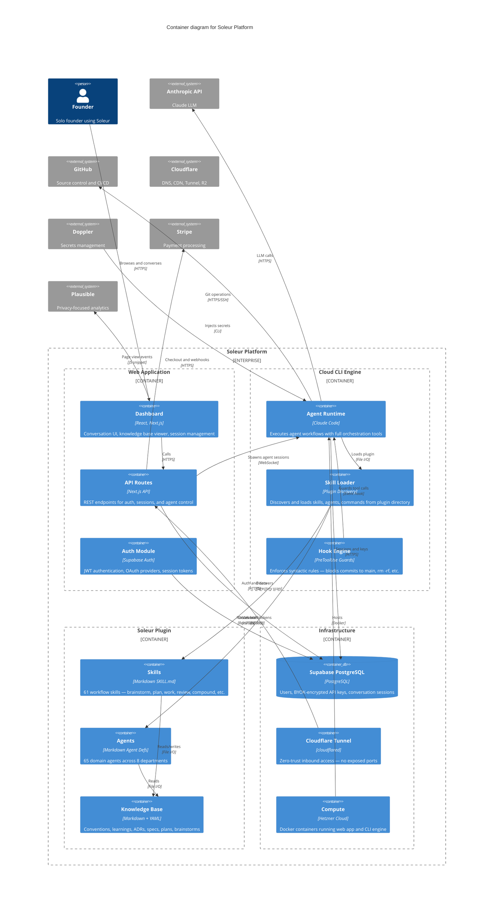

# Soleur Platform — Container Diagram (C4 Level 2)

Generated: 2026-03-27

## Notes

- Plugin has flat skill structure (skills don't nest) and recursive agent discovery (ADR-016)
- Three enforcement tiers: hooks (syntactic), skills (semantic), prose (advisory) — ADR-011
- Knowledge base compounds ADRs, learnings, and conventions across sessions
- Worktree isolation enforced via PreToolUse hooks (ADR-009)
- Version derived from git tags at merge time, not committed files (ADR-017)
- Stripe handles subscription checkout sessions and payment webhooks (test mode)
- Plausible analytics embedded as JS snippet in the web dashboard (no cookies, GDPR-compliant)
