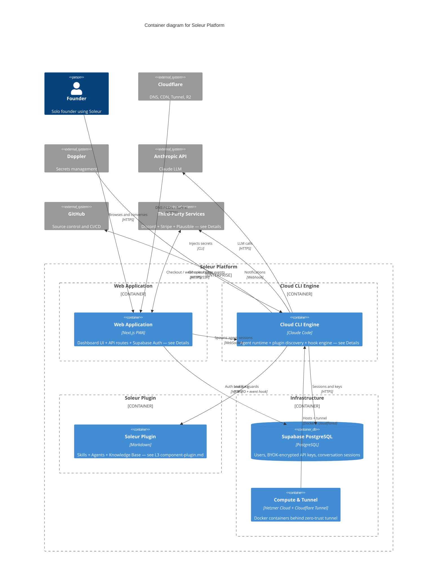

# Soleur Platform — Container Diagram (C4 Level 2)

Generated: 2026-05-13 (visual redesign per SOL-40, was 2026-03-27)

## Details

**`webapp` (Web Application) — folded from L2 source for visual budget; original Mermaid aliases preserved:**

- `dashboard` (React, Next.js) — conversation UI, knowledge base viewer, session management
- `api` (Next.js API) — REST endpoints for auth, sessions, and agent control
- `auth` (Supabase Auth) — JWT authentication, OAuth providers, session tokens

**`engine` (Cloud CLI Engine) — folded from L2 source:**

- `claude` (Claude Code) — executes agent workflows with full orchestration tools
- `skillloader` (Plugin Discovery) — discovers and loads skills, agents, commands from the plugin directory
- `hooks` (PreToolUse Guards) — enforces syntactic rules; blocks commits to main, `rm -rf`, etc.

**`plugin_box` (Soleur Plugin) — see L3 `component-plugin.md` for full decomposition:**

- `skills` — workflow skills (brainstorm, plan, work, review, compound, ship, one-shot, …) under `plugins/soleur/skills/`
- `agents` — domain agents across 8 departments under `plugins/soleur/agents/`
- `kb` — Markdown + YAML conventions, learnings, ADRs, specs, plans, brainstorms under `knowledge-base/`

**`compute` (Compute & Tunnel) — folded from L2 source:**

- `tunnel` (cloudflared) — zero-trust inbound access; no exposed ports (ADR-008)
- `hetzner` (Hetzner Cloud) — Docker containers running web app and CLI engine (ADR-006)

**`thirdparty` (Third-Party Services) — same fold as L1 `system-context.md`:**

- `stripe` — payment processing and subscription checkout + webhooks (test mode)
- `discord` — community notifications and release announcements via webhook
- `plausible` — privacy-focused page-view analytics (no cookies, GDPR-compliant)

## Notes

- Plugin has flat skill structure (skills don't nest) and recursive agent discovery (ADR-016)
- Three enforcement tiers: hooks (syntactic), skills (semantic), prose (advisory) — ADR-011
- Knowledge base compounds ADRs, learnings, and conventions across sessions
- Worktree isolation enforced via PreToolUse hooks (ADR-009)
- Version derived from git tags at merge time, not committed files (ADR-017)
- Stripe handles subscription checkout sessions and payment webhooks (test mode)
- Plausible analytics embedded as JS snippet in the web dashboard (no cookies, GDPR-compliant)
