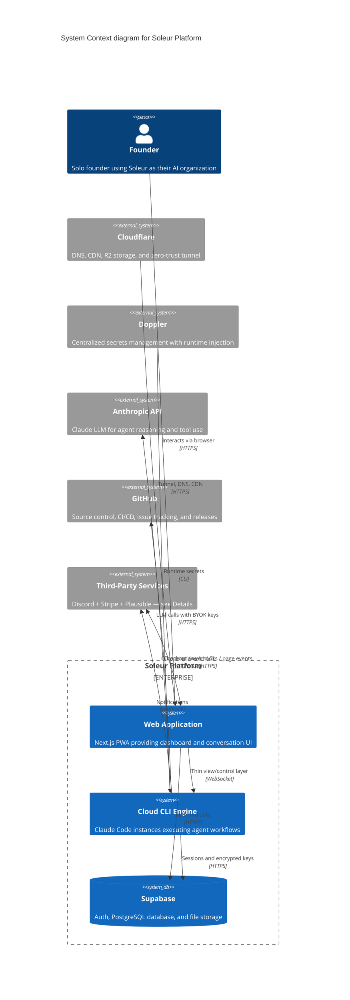

# Soleur Platform — System Context (C4 Level 1)

Generated: 2026-05-13 (visual redesign per SOL-40, was 2026-03-27)

## Details

**`thirdparty` group contains** (original Mermaid aliases preserved for grep-ability):

- `discord` — Discord — community notifications and release announcements
- `stripe` — Stripe — payment processing and subscription billing (test mode)
- `plausible` — Plausible Analytics — privacy-focused page-view tracking

All three are external SaaS systems with low individual visual signal at the system-context level. The `BiRel(webapp, thirdparty)` covers Stripe checkout + Stripe webhooks + Plausible JS events. The `Rel(engine, thirdparty)` covers Discord webhook notifications.

## Notes

- Web App is a thin view/control layer over the CLI engine (ADR-003)
- CLI engine preserves 100% of orchestration capability — agents execute on cloud-hosted Claude Code instances
- BYOK encryption isolates per-user API keys via AES-256-GCM with HKDF derivation (ADR-004)
- All infrastructure provisioned via Terraform with R2 remote backend (ADR-006, ADR-019)
- Secrets managed via Doppler with runtime injection — no plaintext .env on disk (ADR-007)
- Zero-trust access via Cloudflare Tunnel — server invisible to port scanners (ADR-008)
- Stripe in test mode — subscription billing via checkout sessions and webhooks
- Plausible Analytics for privacy-focused tracking (no cookies, GDPR-compliant)
