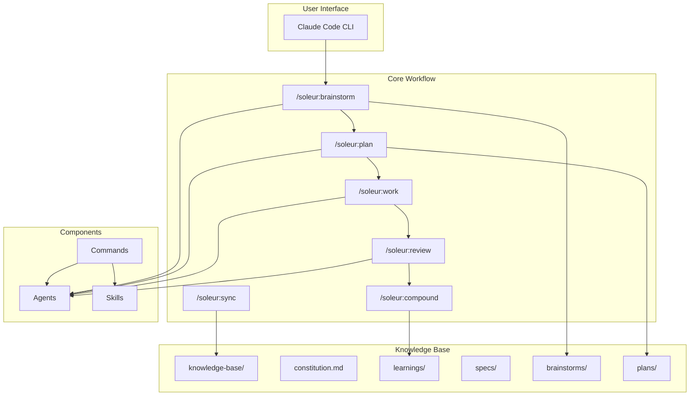

# Soleur Project Overview

Soleur is a Claude Code plugin providing AI-powered development tools that compound engineering knowledge over time. Every problem solved makes the next one easier.

## Purpose

Transform feature development from ad-hoc coding into a structured, repeatable workflow. The plugin captures learnings, patterns, and solutions in a knowledge base that grows with the project.

## Architecture



## The Workflow

```
/soleur:brainstorm --> /soleur:plan --> /soleur:work --> /soleur:review --> /soleur:compound
```

| Phase | Command | Purpose |
|-------|---------|---------|
| 1. Explore | `/soleur:brainstorm` | Clarify requirements, explore approaches, make design decisions |
| 2. Plan | `/soleur:plan` | Create structured implementation plans with research |
| 3. Execute | `/soleur:work` | Implement systematically with incremental commits |
| 4. Review | `/soleur:review` | Multi-agent code review before PR |
| 5. Learn | `/soleur:compound` | Capture learnings for future work |

**For existing codebases:** Run `/soleur:sync` first to populate knowledge-base with conventions.

## Components

| Component | Count | Description |
|-----------|-------|-------------|
| [Agents](./components/agents.md) | 18 | AI agents for specialized tasks |
| [Commands](./components/commands.md) | 26 | Slash commands for workflow |
| [Skills](./components/skills.md) | 17 | Specialized capabilities |
| [Knowledge Base](./components/knowledge-base.md) | 1 | Documentation system |

Each component has detailed documentation in [components/](./components/) covering its purpose, available items, usage patterns, and conventions. See individual component docs for full reference.

## Constitution

The [constitution](./constitution.md) defines project principles organized by domain (Code Style, Architecture, Testing, Proposals, Specs, Tasks). Each domain uses **Always/Never/Prefer** categories to express rules at different levels of strictness.

Commands like `/soleur:plan` and `/soleur:work` read the constitution automatically to guide decisions. `/soleur:sync` discovers new conventions from the codebase and writes them as constitution rules. `/soleur:compound` promotes learnings to constitution principles when appropriate.

## Directory Structure

```
soleur/
  plugins/soleur/           # The Claude Code plugin
    agents/                 # AI agents by category
      review/               # Code review agents
      research/             # Research and analysis
      workflow/             # Workflow automation
    commands/               # Slash commands
      soleur/               # Core workflow commands
    skills/                 # Specialized capabilities
    .claude-plugin/         # Plugin manifest
  knowledge-base/           # Project documentation
    learnings/              # Documented solutions
    specs/                  # Feature specifications
    brainstorms/            # Design explorations
    plans/                  # Implementation plans
    overview/               # This documentation
      constitution.md       # Coding conventions
```

## Key Concepts

### Compounding Engineering

Every solved problem contributes to the knowledge base. Future similar problems reference past solutions instead of being solved from scratch.

### Agent Hierarchy

Agents are organized by function:
- **Review agents** catch issues before PR
- **Research agents** gather context and best practices
- **Workflow agents** automate repetitive tasks

### Convention Over Configuration

Paths follow predictable patterns:
- Feature branches: `feat-<name>`
- Specs: `knowledge-base/specs/feat-<name>/`
- Worktrees: `.worktrees/feat-<name>/`

## Quick Start

```bash
# Install the plugin
claude plugin install soleur

# For existing projects, sync first
/soleur:sync

# Start the workflow
/soleur:brainstorm <feature idea>
```

## See Also

- [Constitution](./constitution.md) - Project principles (Always/Never/Prefer rules by domain)
- [Agents](./components/agents.md) - AI agent categories and usage
- [Commands](./components/commands.md) - Slash command reference
- [Skills](./components/skills.md) - Specialized capabilities
- [Knowledge Base](./components/knowledge-base.md) - Documentation system structure
- [Plugin README](../../plugins/soleur/README.md) - Full component reference
- [Installation](../../README.md) - Setup instructions
