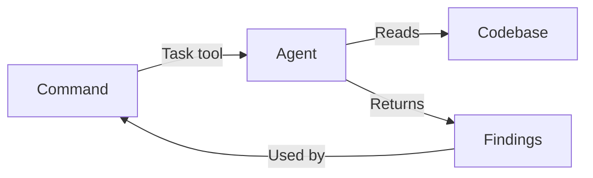

# Agents

AI agents that perform specialized tasks during the development workflow. Each agent is a markdown file containing instructions for Claude to follow when invoked.

## Purpose

Provide specialized AI capabilities for specific tasks like code review, research, design verification, and workflow automation. Agents allow the main workflow commands to delegate complex analysis to focused, expert-level AI personas.

## Responsibilities

- Perform deep analysis within a specific domain (security, performance, patterns)
- Provide consistent, reproducible results following defined instructions
- Return structured findings for use by other commands
- Execute in parallel when multiple perspectives are needed

## Key Interfaces

**Invocation:** Agents are called via the Task tool with `subagent_type`:

```typescript
Task({
  description: "Review security vulnerabilities",
  prompt: "Analyze this code for security issues...",
  subagent_type: "soleur:engineering:review:security-sentinel"
})
```

**Naming convention:** Agents are named by their directory path under `agents/`:
- Engineering agents: `soleur:engineering:review:<name>` or `soleur:engineering:design:<name>`
- Cross-domain agents: `soleur:research:<name>` or `soleur:workflow:<name>`

## Data Flow



1. Workflow skill (e.g., `soleur:review`) identifies which agents to invoke
2. Task tool spawns agent with specific prompt
3. Agent reads relevant files, analyzes, and returns findings
4. Parent command consolidates results

## Categories

Agents are organized by domain first, then by function. Cross-domain agents stay at root level.

### Engineering (15 agents)

#### Review (14)

Code review specialists that catch issues before PR:

| Agent | Purpose |
|-------|---------|
| `agent-native-reviewer` | Verify agent-native architecture (action + context parity) |
| `architecture-strategist` | Architectural compliance and design decisions |
| `code-quality-analyst` | Formal quality reports with severity-scored smells and refactoring roadmaps |
| `code-simplicity-reviewer` | Final pass for YAGNI and minimalism |
| `data-integrity-guardian` | Database migrations and data integrity |
| `data-migration-expert` | Validate ID mappings, check for swapped values |
| `deployment-verification-agent` | Go/No-Go deployment checklists |
| `dhh-rails-reviewer` | Rails review from DHH's perspective |
| `kieran-rails-reviewer` | Rails code with strict conventions |
| `legacy-code-expert` | Safely modify untested legacy code using Feathers' dependency-breaking techniques |
| `pattern-recognition-specialist` | Design patterns and anti-patterns |
| `performance-oracle` | Performance analysis and optimization |
| `security-sentinel` | Security audits and vulnerabilities |
| `test-design-reviewer` | Score test quality using Farley's 8 properties with weighted rubric |

#### Design (1)

| Agent | Purpose |
|-------|---------|
| `ddd-architect` | Domain-Driven Design with strategic bounded contexts and tactical patterns |

### Cross-domain (7 agents)

#### Research (5)

Gather context and best practices:

| Agent | Purpose |
|-------|---------|
| `best-practices-researcher` | External documentation and examples |
| `framework-docs-researcher` | Framework-specific documentation |
| `git-history-analyzer` | Code evolution and commit patterns |
| `learnings-researcher` | Search knowledge-base/learnings/ for relevant solutions |
| `repo-research-analyst` | Repository structure and conventions |

#### Workflow (2)

Automate repetitive tasks:

| Agent | Purpose |
|-------|---------|
| `pr-comment-resolver` | Address PR review comments |
| `spec-flow-analyzer` | Analyze specifications for gaps and edge cases |

## Dependencies

- **Internal**: None (agents are standalone)
- **External**: Claude Code Task tool, various CLI tools per agent

## Examples

**Run security review:**

```markdown
Task security-sentinel("Review authentication changes in src/auth/")
```

**Run multiple reviewers in parallel:**

```markdown
Task kieran-rails-reviewer("Review controller changes")
Task code-simplicity-reviewer("Check for over-engineering")
Task security-sentinel("Audit permission checks")
```

## Related Files

- `plugins/soleur/agents/engineering/review/` - Engineering review agents
- `plugins/soleur/agents/engineering/design/` - Engineering design agents
- `plugins/soleur/agents/research/` - Research agents
- `plugins/soleur/agents/workflow/` - Workflow agents

## See Also

- [Commands](./commands.md) - Commands that invoke agents
- [constitution.md](../constitution.md) - Agent organization conventions
