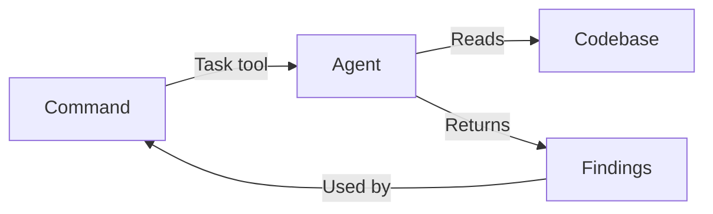

# Agents

AI agents that perform specialized tasks during the development workflow. Each agent is a markdown file containing instructions for Claude to follow when invoked.

## Purpose

Provide specialized AI capabilities for specific tasks like code review, research, design verification, and workflow automation. Agents allow the main workflow commands to delegate complex analysis to focused, expert-level AI personas.

## Responsibilities

- Perform deep analysis within a specific domain (security, performance, patterns)
- Provide consistent, reproducible results following defined instructions
- Return structured findings for use by other commands
- Execute in parallel when multiple perspectives are needed

## Key Interfaces

**Invocation:** Agents are called via the Task tool with `subagent_type`:

```typescript
Task({
  description: "Review security vulnerabilities",
  prompt: "Analyze this code for security issues...",
  subagent_type: "soleur:review:security-sentinel"
})
```

**Naming convention:** `soleur:<category>:<agent-name>`

## Data Flow



1. Workflow command (e.g., `/soleur:review`) identifies which agents to invoke
2. Task tool spawns agent with specific prompt
3. Agent reads relevant files, analyzes, and returns findings
4. Parent command consolidates results

## Categories

### Review (14 agents)

Code review specialists that catch issues before PR:

| Agent | Purpose |
|-------|---------|
| `agent-native-reviewer` | Verify agent-native architecture (action + context parity) |
| `architecture-strategist` | Architectural compliance and design decisions |
| `code-simplicity-reviewer` | Final pass for YAGNI and minimalism |
| `data-integrity-guardian` | Database migrations and data integrity |
| `data-migration-expert` | Validate ID mappings, check for swapped values |
| `deployment-verification-agent` | Go/No-Go deployment checklists |
| `dhh-rails-reviewer` | Rails review from DHH's perspective |
| `julik-frontend-races-reviewer` | JavaScript/Stimulus race conditions |
| `kieran-python-reviewer` | Python code with strict conventions |
| `kieran-rails-reviewer` | Rails code with strict conventions |
| `kieran-typescript-reviewer` | TypeScript with strict conventions |
| `pattern-recognition-specialist` | Design patterns and anti-patterns |
| `performance-oracle` | Performance analysis and optimization |
| `security-sentinel` | Security audits and vulnerabilities |

### Research (5 agents)

Gather context and best practices:

| Agent | Purpose |
|-------|---------|
| `best-practices-researcher` | External documentation and examples |
| `framework-docs-researcher` | Framework-specific documentation |
| `git-history-analyzer` | Code evolution and commit patterns |
| `learnings-researcher` | Search knowledge-base/learnings/ for relevant solutions |
| `repo-research-analyst` | Repository structure and conventions |

### Design (3 agents)

Verify UI implementations:

| Agent | Purpose |
|-------|---------|
| `design-implementation-reviewer` | Compare implementation to Figma design |
| `design-iterator` | Iteratively refine UI through systematic improvements |
| `figma-design-sync` | Synchronize web implementation with Figma |

### Workflow (5 agents)

Automate repetitive tasks:

| Agent | Purpose |
|-------|---------|
| `bug-reproduction-validator` | Systematically reproduce bug reports |
| `every-style-editor` | Edit copy for style guide compliance |
| `lint` | Run linting on Ruby and ERB files |
| `pr-comment-resolver` | Address PR review comments |
| `spec-flow-analyzer` | Analyze specifications for gaps and edge cases |

### Docs (1 agent)

Generate documentation:

| Agent | Purpose |
|-------|---------|
| `ankane-readme-writer` | Create READMEs following Ankane template |

## Dependencies

- **Internal**: None (agents are standalone)
- **External**: Claude Code Task tool, various CLI tools per agent

## Examples

**Run security review:**

```markdown
Task security-sentinel("Review authentication changes in src/auth/")
```

**Run multiple reviewers in parallel:**

```markdown
Task kieran-rails-reviewer("Review controller changes")
Task code-simplicity-reviewer("Check for over-engineering")
Task security-sentinel("Audit permission checks")
```

## Related Files

- `plugins/soleur/agents/review/` - Review agent definitions
- `plugins/soleur/agents/research/` - Research agent definitions
- `plugins/soleur/agents/design/` - Design agent definitions
- `plugins/soleur/agents/workflow/` - Workflow agent definitions
- `plugins/soleur/agents/docs/` - Documentation agent definitions

## See Also

- [Commands](./commands.md) - Commands that invoke agents
- [constitution.md](../../constitution.md) - Agent organization conventions
