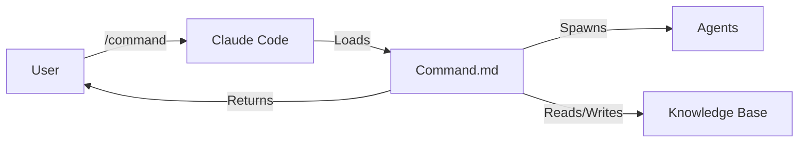
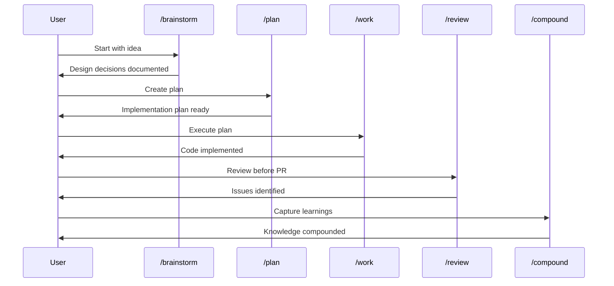

# Commands

Slash commands that users invoke to perform development tasks. Commands are markdown files containing instructions that Claude executes when the user types the command.

## Purpose

Provide user-facing entry points for the development workflow. Commands orchestrate agents, manage the knowledge base, and guide users through structured processes.

## Responsibilities

- Accept user input and parse arguments
- Coordinate multiple agents when needed
- Read and write to the knowledge base
- Guide users through multi-step workflows
- Provide consistent, repeatable processes

## Key Interfaces

**Invocation:** Users type the command name prefixed with `/`:

```
/soleur:plan feat-authentication
```

**Definition:** Commands are markdown files with YAML frontmatter:

```yaml
---
name: soleur:plan
description: Create implementation plans
argument-hint: "[path-to-spec]"
---

# Command Title

Instructions for Claude to follow...
```

## Data Flow



1. User types `/soleur:command` in Claude Code
2. Claude Code loads the command markdown file
3. Claude follows instructions, invoking agents as needed
4. Command reads/writes knowledge base files
5. Results returned to user

## Categories

### Core Workflow (6 commands)

The main development workflow commands use `soleur:` prefix:

| Command | Purpose |
|---------|---------|
| `/soleur:brainstorm` | Explore requirements, make design decisions |
| `/soleur:plan` | Create implementation plans with research |
| `/soleur:work` | Execute plans with incremental commits |
| `/soleur:review` | Multi-agent code review before PR |
| `/soleur:compound` | Capture learnings for future work |
| `/soleur:sync` | Populate knowledge base from existing codebase |

### Utility Commands (15 commands)

Supporting commands for specific tasks:

| Command | Purpose |
|---------|---------|
| `/agent-native-audit` | Audit codebase for agent-native architecture |
| `/changelog` | Generate changelogs from recent merges |
| `/create-agent-skill` | Create or edit Claude Code skills |
| `/deepen-plan` | Enhance plans with parallel research |
| `/deploy-docs` | Validate docs for GitHub Pages deployment |
| `/feature-video` | Record video walkthroughs for PR |
| `/generate_command` | Generate new slash commands |
| `/heal-skill` | Fix skill documentation issues |
| `/lfg` | Full autonomous engineering workflow |
| `/plan_review` | Multi-agent plan review in parallel |
| `/release-docs` | Build and update documentation site |
| `/report-bug` | Report bugs in the plugin |
| `/reproduce-bug` | Reproduce bugs with logs and screenshots |
| `/resolve_parallel` | Resolve TODO comments in parallel |
| `/resolve_pr_parallel` | Resolve PR comments in parallel |
| `/resolve_todo_parallel` | Resolve CLI todos in parallel |
| `/test-browser` | Run browser tests on PR-affected pages |
| `/triage` | Triage and categorize issues |
| `/xcode-test` | Build and test iOS apps on simulator |

## Workflow Sequence



## Dependencies

- **Internal**: Agents (invoked via Task tool), Skills (for specialized capabilities)
- **External**: Claude Code CLI, GitHub CLI (for PR operations)

## Examples

**Start a new feature:**

```
/soleur:brainstorm Add user authentication with OAuth
```

**Execute an existing plan:**

```
/soleur:work knowledge-base/plans/2026-02-06-feat-auth-plan.md
```

**Review before PR:**

```
/soleur:review
```

## Related Files

- `plugins/soleur/commands/soleur/` - Core workflow commands
- `plugins/soleur/commands/*.md` - Utility commands
- `plugins/soleur/AGENTS.md` - Command naming conventions

## See Also

- [Agents](./agents.md) - Agents invoked by commands
- [Skills](./skills.md) - Skills used by commands
- [constitution.md](../constitution.md) - Command conventions
