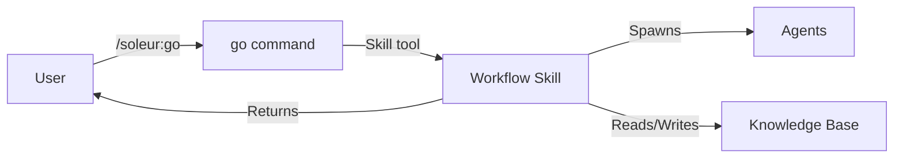
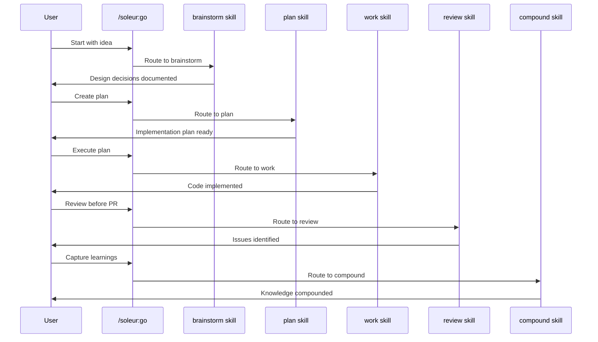

# Commands

Slash commands that users invoke as entry points to the development workflow. Commands are markdown files containing instructions that Claude executes when the user types the command.

## Purpose

Provide user-facing entry points for routing, knowledge-base sync, and help. Workflow stages (brainstorm, plan, work, review, compound, one-shot) have been migrated to skills for agent discoverability and Skill tool invocation.

## Responsibilities

- Accept user input and route to the appropriate workflow skill
- Manage the knowledge base (sync)
- Provide help and orientation

## Key Interfaces

**Invocation:** Users type the command name prefixed with `/`:

```
/soleur:go plan feat-authentication
```

**Definition:** Commands are markdown files with YAML frontmatter:

```yaml
---
name: soleur:go
description: Unified entry point that routes to workflow skills
argument-hint: "[stage] [args]"
---

# Command Title

Instructions for Claude to follow...
```

## Data Flow



1. User types `/soleur:go <stage>` or invokes a skill directly
2. The go command routes to the appropriate workflow skill
3. The skill follows instructions, invoking agents as needed
4. Skill reads/writes knowledge base files
5. Results returned to user

## Commands (3)

All commands use the `soleur:` prefix to avoid collisions with built-in commands. Workflow stages were migrated from commands to skills in v2.37.0 for agent discoverability.

| Command | Purpose |
|---------|---------|
| `/soleur:go` | Unified entry point that routes to workflow skills |
| `/soleur:sync` | Populate knowledge base from existing codebase |
| `/soleur:help` | List all available Soleur commands, agents, and skills |

**Workflow skills** (invoked via `/soleur:go` or directly):

| Skill | Purpose |
|-------|---------|
| `soleur:brainstorm` | Explore requirements, make design decisions |
| `soleur:plan` | Create implementation plans with research |
| `soleur:work` | Execute plans with incremental commits |
| `soleur:review` | Multi-agent code review before PR |
| `soleur:compound` | Capture learnings for future work |
| `soleur:one-shot` | Full autonomous engineering workflow from plan to PR |

## Workflow Sequence



## Dependencies

- **Internal**: Skills (workflow stages), Agents (invoked by skills via Task tool)
- **External**: Claude Code CLI, GitHub CLI (for PR operations)

## Examples

**Start a new feature via go:**

```
/soleur:go brainstorm Add user authentication with OAuth
```

**Invoke a skill directly:**

```
/soleur:plan feat-authentication
```

**Review before PR:**

```
/soleur:review
```

## Related Files

- `plugins/soleur/commands/soleur/` - Command definitions (go, sync, help)
- `plugins/soleur/skills/` - Workflow skill definitions

## See Also

- [Agents](./agents.md) - Agents invoked by skills
- [Skills](./skills.md) - Workflow skills and specialized capabilities
- [constitution.md](../constitution.md) - Command and skill conventions
