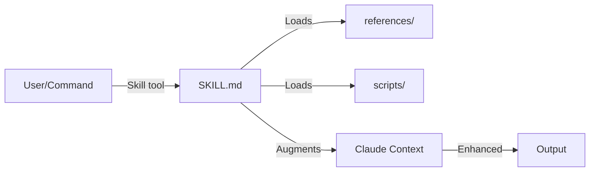

# Skills

Specialized capabilities that extend Claude's knowledge in specific domains. Skills are directories containing a SKILL.md file and optional supporting resources (scripts, references, assets).

## Purpose

Provide domain expertise and specialized workflows that can be loaded on-demand. Unlike agents (which are invoked programmatically), skills are loaded into context to augment Claude's capabilities for specific tasks.

## Responsibilities

- Provide specialized knowledge for specific domains (Rails, design, workflows)
- Include reference materials, scripts, and examples
- Define best practices and conventions
- Enable consistent, high-quality output in specialized areas

## Key Interfaces

**Invocation:** Skills are loaded via the Skill tool:

```typescript
Skill({
  skill: "soleur:dhh-rails-style"
})
```

**Definition:** Skills have a specific directory structure:

```
skills/<skill-name>/
  SKILL.md           # Main skill document (required)
  references/        # Reference materials (optional)
  scripts/           # Helper scripts (optional)
  assets/            # Images, templates (optional)
```

**SKILL.md frontmatter:**

```yaml
---
name: skill-name
description: This skill should be used when...
---
```

## Data Flow



1. User or command requests a skill
2. Claude Code loads SKILL.md into context
3. Referenced materials loaded as needed
4. Claude's capabilities enhanced for the domain
5. Higher quality output in that domain

## Categories

### Architecture & Design

| Skill | Purpose |
|-------|---------|
| `agent-native-architecture` | Build AI agents with prompt-native architecture |
| `frontend-design` | Create production-grade frontend interfaces |

### Development Patterns

| Skill | Purpose |
|-------|---------|
| `andrew-kane-gem-writer` | Write Ruby gems following Andrew Kane's patterns |
| `dhh-rails-style` | Write Ruby/Rails in DHH's 37signals style |
| `dspy-ruby` | Build type-safe LLM applications with DSPy.rb |

### Workflow & Documentation

| Skill | Purpose |
|-------|---------|
| `brainstorming` | Question techniques for effective brainstorming |
| `compound-docs` | Capture solved problems as categorized documentation |
| `create-agent-skills` | Expert guidance for creating Claude Code skills |
| `every-style-editor` | Review copy for Every's style guide |
| `file-todos` | File-based todo tracking system |
| `skill-creator` | Guide for creating effective skills |
| `spec-templates` | Templates for specs and tasks |

### Tools & Utilities

| Skill | Purpose |
|-------|---------|
| `agent-browser` | CLI-based browser automation |
| `gemini-imagegen` | Generate images with Google Gemini API |
| `git-worktree` | Manage Git worktrees for parallel development |
| `rclone` | Upload files to cloud storage |

## Skill Structure Example

```
skills/dhh-rails-style/
  SKILL.md              # Main instructions
  references/
    conventions.md      # Rails conventions
    examples.md         # Code examples
  scripts/
    check-style.sh      # Validation script
```

## Dependencies

- **Internal**: May reference other skills or use scripts
- **External**: Various CLI tools per skill (rclone, agent-browser, etc.)

## Examples

**Load Rails style guide:**

```
skill: soleur:dhh-rails-style
```

**Create a new skill:**

```
skill: soleur:skill-creator
```

**Use browser automation:**

```
skill: soleur:agent-browser
```

## Conventions

From `constitution.md`:

- Skill descriptions MUST use third person ("This skill should be used when...")
- Reference files MUST use markdown links, not backticks
- All skills MUST include YAML frontmatter with `name` and `description`

## Related Files

- `plugins/soleur/skills/` - All skill directories
- `plugins/soleur/AGENTS.md` - Skill compliance checklist

## See Also

- [Commands](./commands.md) - Commands that invoke skills
- [constitution.md](../../constitution.md) - Skill conventions
