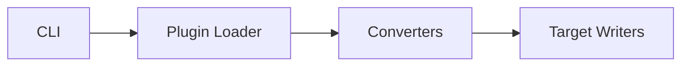

# feat: Knowledge Base Project Overview System

## Overview

Add a comprehensive project overview system to `knowledge-base/overview/` that describes the entire project and its components. The system serves both human developers and AI agents equally, integrating with the existing `/sync` command for automatic updates.

## Problem Statement / Motivation

The knowledge-base has conventions (constitution.md), feature specs, and learnings, but lacks a high-level document describing **what the project does** and its component architecture. This creates friction for:

1. **New developers**: No single entry point to understand the project
2. **AI agents**: Must explore codebase without contextual guidance
3. **Maintainers**: No canonical reference for architectural decisions

The existing constitution.md describes **how to work on** the project, not **what it does**. These are complementary concerns requiring separate documentation.

## Proposed Solution

### Directory Structure

```
knowledge-base/overview/
  README.md              # Project purpose, architecture overview, quick links
  components/
    cli.md               # CLI interface, commands, arguments
    plugins.md           # Plugin system, loading, configuration
    converters.md        # Conversion logic between formats
    targets.md           # Target providers (OpenCode, etc.)
```

### Component Detection Heuristics

Use architectural boundaries for component detection:

1. **Top-level directories under `src/`** containing index files or multiple related files
2. **Explicit `@component` markers** in doc comments (future extension)
3. **Exclude by default**: `tests/`, `dist/`, `node_modules/`, generated code

For this codebase, detected components:
- `cli` (entry point)
- `plugins` (plugin system)
- `converters` (format conversion)
- `targets` (output providers)

### Component Template

```markdown
---
component: <component-name>
updated: YYYY-MM-DD
primary_location: src/<path>/
related_locations:
  - src/<other-path>
---

# <Component Name>

## Purpose
[One paragraph - what this component does]

## Responsibilities
- [Key responsibility 1]
- [Key responsibility 2]

## Key Interfaces

[Public APIs, entry points, exported types]

## Data Flow

[How data enters and exits this component]

## Diagram

[Mermaid diagram if applicable]

## Dependencies
- **Internal**: [other components it uses]
- **External**: [third-party packages]

## Examples

[Usage examples with code]

## Related Files
- `src/<path>/file.ts` - [description]

## See Also
- [constitution.md](../overview/constitution.md) for coding conventions
```

### /sync Integration

Add `overview` as a new area to `/sync` command:

```markdown
# sync.md changes

**Valid areas:** `conventions`, `architecture`, `testing`, `debt`, `overview`, `all` (default)

**Output mapping:**
| Finding Type | Destination |
|--------------|-------------|
| Component boundaries | `knowledge-base/overview/components/` |
| Project summary | `knowledge-base/overview/README.md` |
```

## Technical Considerations

### Update Behavior

- **New components**: Create new `.md` file from template
- **Existing components**: Preserve user customizations; only update auto-generated sections
- **Removed components**: Add `status: deprecated` frontmatter, do not delete
- **User edits**: Frontmatter `auto_generated: false` flags sections to preserve

### Cross-Directory Components

Use "Primary + References" pattern:

```yaml
---
component: authentication
primary_location: src/auth/
related_locations:
  - src/middleware/auth.ts
  - src/types/auth.ts
---
```

### Diagram Format

Mermaid syntax for portability. Example:



## Acceptance Criteria

### Functional

- [ ] `knowledge-base/overview/README.md` exists with project purpose and component index
- [ ] `knowledge-base/overview/components/` contains one file per logical domain
- [ ] Component files include: Purpose, Responsibilities, Key Interfaces, Data Flow, Examples
- [ ] `/sync overview` detects components and generates/updates documentation
- [ ] `/sync all` includes overview updates automatically
- [ ] Overview links to constitution.md but does not duplicate content

### Technical

- [ ] Component detection uses architectural boundaries heuristic
- [ ] Template is hardcoded in sync.md command
- [ ] User customizations preserved during updates (via frontmatter flags)
- [ ] Deprecated components marked, not deleted

### Quality

- [ ] All generated markdown passes markdownlint
- [ ] Mermaid diagrams render correctly in GitHub
- [ ] README.md provides clear navigation to all components

## Success Metrics

1. New developers can understand project structure from README.md in < 5 minutes
2. AI agents reference overview docs before modifying components
3. `/sync overview` completes in < 10 seconds on this codebase

## Dependencies & Risks

### Dependencies

| Dependency | Status | Notes |
|------------|--------|-------|
| Existing `/sync` command | Complete | Extend with new area |
| Mermaid support | Available | GitHub renders natively |
| knowledge-base/ structure | Complete | Already exists |

### Risks

| Risk | Likelihood | Impact | Mitigation |
|------|------------|--------|------------|
| Component detection misses important code | Medium | Low | Manual override via config |
| User customizations lost during update | High | Medium | Frontmatter preservation flags |
| Documentation becomes stale | Medium | Medium | Integrate with `/sync all` workflow |

## Implementation Phases

### Phase 1: Static Structure (Manual)

Create initial `knowledge-base/overview/` structure manually:
- `README.md` with project overview
- `components/` directory with initial component files

**Deliverable**: Working documentation without automation

### Phase 2: Component Template

Define and document component template:
- YAML frontmatter schema
- Section structure
- Example content

**Deliverable**: Template specification

### Phase 3: /sync Integration

Extend `/sync` command:
- Add `overview` area to valid areas
- Implement component detection heuristics
- Implement template generation
- Handle update/preservation logic

**Deliverable**: Automated `/sync overview` command

### Phase 4: Polish

- Add mermaid diagrams
- Verify preservation logic
- Update constitution.md with overview conventions

**Deliverable**: Complete feature

## Alternative Approaches Considered

### Single Overview File

**Rejected because**: Gets unwieldy as project grows; harder to deep-link to specific components.

### Auto-generate from Code Comments

**Rejected because**: Requires significant code annotation; maintenance burden on developers.

### External Documentation Tool (Docusaurus, etc.)

**Rejected because**: Adds external dependency; knowledge-base should remain self-contained markdown.

## References & Research

### Internal References

- Sync command: `plugins/soleur/commands/soleur/sync.md`
- Constitution: `knowledge-base/overview/constitution.md`
- Spec templates: `plugins/soleur/skills/spec-templates/SKILL.md`
- External spec example: `knowledge-base/specs/external/claude-code.md`

### Related Issues

- Original request: #14
- Feature issue: #16
- Brainstorm: `knowledge-base/brainstorms/2026-02-06-project-overview-brainstorm.md`
- Spec: `knowledge-base/specs/feat-project-overview/spec.md`
