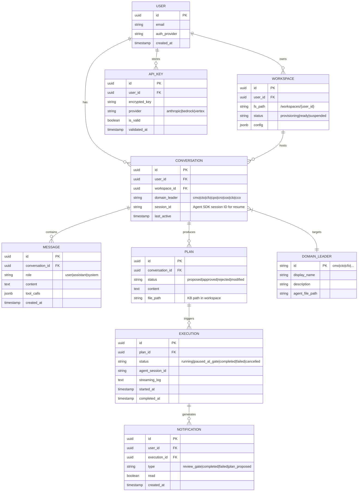

# feat: Web Platform — Cloud CLI Engine

## Overview

Build a web platform where founders interact with Soleur domain leaders through a browser dashboard. Agents execute on the server via the **Claude Agent SDK** (not CLI subprocesses), preserving 100% of orchestration value. The web app provides chat, knowledge-base browsing, plan review, execution monitoring, and inbox — the complete autonomous execution loop with human review gates.

**Architecture pivot from brainstorm:** Research discovered the Claude Agent SDK (`@anthropic-ai/claude-agent-sdk`), which replaces the "spawn CLI subprocess" pattern with an embedded library. Each user session calls `query()` as an async iterator, streaming `StreamEvent` messages to the browser over WebSocket. This is simpler, more secure, and eliminates the NDJSON subprocess bridge complexity.

## Problem Statement

Two validated friction points prevent adoption:

1. **Install friction** — CLI plugin installation deters both technical and non-technical founders
2. **Visibility gap** — the terminal is the wrong surface for browsing knowledge-base, reviewing plans, and monitoring execution

User feedback (mix of technical and non-technical founders): they want autonomous execution with human review gates — talk to department heads, get a plan, approve it, watch it run, get pulled in at decision points. Both segments showed equal interest.

## Proposed Solution

### Architecture: Agent SDK + WebSocket + Web Dashboard

```
┌──────────────┐     WebSocket      ┌─────────────────────────────────┐
│   Browser    │◄──────────────────►│   Application Server             │
│              │                     │                                  │
│  - Chat UI   │  SSE (KB updates)  │  - WebSocket handler             │
│  - KB viewer │◄──────────────────►│  - Agent SDK query() per session │
│  - Inbox     │                     │  - KB API (git-backed markdown)  │
│  - Plan UI   │                     │  - Auth + BYOK key injection     │
│  - Exec mon. │                     │  - Workspace isolation           │
└──────────────┘                     └─────────┬───────────────────────┘
                                               │
                                     ┌─────────▼───────────────────────┐
                                     │   Per-User Workspace             │
                                     │                                  │
                                     │  /workspaces/{user_id}/          │
                                     │    knowledge-base/               │
                                     │    .claude/                      │
                                     │    plugins/soleur/               │
                                     │                                  │
                                     │  Agent SDK operates here:        │
                                     │  - Read/Write/Edit tools → fs    │
                                     │  - Bash tool → sandboxed shell   │
                                     │  - Glob/Grep → workspace files   │
                                     └─────────────────────────────────┘
```

### Why Agent SDK Instead of CLI Subprocess

| Factor | CLI Subprocess (brainstorm plan) | Agent SDK (research finding) |
|--------|----------------------------------|------------------------------|
| Integration | Spawn process, pipe NDJSON, parse stdout | Import library, call `query()`, iterate `StreamEvent` |
| Streaming | Parse raw NDJSON, handle process lifecycle | Native async iterator with typed events |
| Session mgmt | Manage PID, restart on crash, exponential backoff | `resume: sessionId` built-in |
| Tools | Full CLI tools (Read, Write, Bash, etc.) | Same built-in tools, same behavior |
| Hooks | PreToolUse/PostToolUse via JSON stdin | Same hooks, programmatic callbacks |
| MCP servers | Pass config via CLI flags | Pass `mcpServers` config object |
| Subagents | Task tool spawns child processes | `agents` config with `Agent` in allowedTools |
| Permissions | permissionMode flag | `allowedTools` whitelist, `permissionMode` |
| Security | Process isolation only | Library runs in server process — needs workspace isolation |
| Complexity | High (process management, NDJSON parsing, crash recovery) | Low (library call, typed interface) |

**Key trade-off:** Agent SDK runs in your server process, so workspace isolation must be enforced at the filesystem level (chroot, containers, or Linux namespaces) rather than relying on process boundaries.

### Tech Stack Recommendation

**Next.js (App Router) + Supabase + Stripe**

| Layer | Technology | Rationale |
|-------|-----------|-----------|
| Frontend | Next.js 15 (App Router, RSC) | SSR for SEO, RSC for KB viewer, App Router for layouts |
| Real-time | WebSocket (custom server) | Agent SDK streaming is long-running and bidirectional |
| Database | Supabase (PostgreSQL) | Auth, real-time subscriptions, row-level security |
| Auth | Supabase Auth (magic links) | Zero-password onboarding, lowest friction |
| Payments | Stripe | BYOK model = simple platform subscription, no usage metering |
| Agent engine | Claude Agent SDK (TypeScript) | Server-side, embedded in Node.js process |
| KB storage | Git-backed filesystem + API | Preserves branching, history, and the compound loop |
| Deployment | Railway / Fly.io | Persistent server for WebSocket + Agent SDK (not serverless) |
| File isolation | Linux namespaces or container-per-workspace | Prevent cross-tenant file access |

**Why not Rails:** Agent SDK is TypeScript. A Rails app would need a Node.js sidecar for agent execution, adding deployment complexity. A full-TypeScript stack (Next.js + Node.js server) keeps everything in one language and one runtime.

**Why not serverless:** Agent SDK `query()` is a long-running async iterator (minutes to hours for complex tasks). Serverless functions have execution time limits. A persistent server is required.

## Technical Approach

### Architecture

#### Core Components

1. **Web Frontend** (`apps/web/`) — Next.js App Router
   - `app/(auth)/` — Login, signup, BYOK setup
   - `app/(dashboard)/chat/` — Chat with domain leaders
   - `app/(dashboard)/kb/` — Knowledge-base viewer
   - `app/(dashboard)/inbox/` — Notifications and task items
   - `app/(dashboard)/plans/` — Plan review and approval
   - `app/(dashboard)/exec/` — Execution monitoring

2. **Agent Server** (`apps/agent-server/`) — Node.js + WebSocket
   - `src/sessions/` — Session manager (spawn, resume, cancel Agent SDK queries)
   - `src/workspace/` — Per-user workspace provisioning and isolation
   - `src/streaming/` — WebSocket handler, StreamEvent relay to browser
   - `src/hooks/` — PreToolUse/PostToolUse hooks (audit, permission gates, review checkpoints)
   - `src/kb-api/` — Knowledge-base REST API (file tree, content, search)
   - `src/byok/` — BYOK key storage, validation, injection

3. **Shared Types** (`packages/types/`) — TypeScript types shared between frontend and agent server

4. **Soleur Plugin** (existing `plugins/soleur/`) — Copied into each user workspace at provisioning. Agent SDK loads agents/skills from this directory.

#### Data Model



#### Workspace Isolation Model

Each user gets an isolated filesystem workspace:

```
/workspaces/{user_id}/
├── knowledge-base/          # User's compounding KB
│   ├── brainstorms/
│   ├── specs/
│   ├── plans/
│   ├── learnings/
│   └── overview/
├── plugins/
│   └── soleur/              # Copied from latest release
│       ├── agents/
│       ├── skills/
│       └── .claude-plugin/
├── .claude/
│   └── settings.json        # Workspace-level settings
└── .git/                    # Git repo for KB versioning
```

**Isolation mechanism:** Linux namespaces (mount namespace + user namespace) via `unshare`. Each Agent SDK `query()` call runs with `cwd` set to the user's workspace. Bash tool is sandboxed to the workspace directory. File tools (Read/Write/Edit/Glob/Grep) are restricted to the workspace path via a PreToolUse hook.

**Why not container-per-user:** Higher resource overhead, slower cold start. Namespaces achieve filesystem isolation without the full container lifecycle.

#### Review Gate Protocol

When an agent reaches a decision point (e.g., "approve this plan?"), the current CLI uses `AskUserQuestion`. In the web platform:

1. Agent SDK hook (PreToolUse) intercepts `AskUserQuestion` calls
2. Hook serializes the question + options as a `NOTIFICATION` (type: `review_gate`)
3. Hook pauses the Agent SDK query (returns a pending promise)
4. Web frontend receives notification via Supabase Realtime subscription
5. User sees the question in chat UI, selects an option
6. Frontend sends selection to agent server via WebSocket
7. Hook resolves the promise with the user's answer
8. Agent SDK continues execution with the response

```typescript
// apps/agent-server/src/hooks/review-gate.ts
const reviewGateHook: PreToolUseHook = async (toolUse) => {
  if (toolUse.name !== "AskUserQuestion") return { allow: true };

  const question = toolUse.input;
  const notification = await createNotification({
    type: "review_gate",
    payload: question,
    executionId: currentExecution.id,
  });

  // Wait for user response (WebSocket message from frontend)
  const userResponse = await waitForUserResponse(notification.id);

  return {
    allow: true,
    updatedInput: { ...question, answers: userResponse },
  };
};
```

### Implementation Phases

#### Phase 1: Foundation (auth, workspace, BYOK)

Build the minimal infrastructure: user signup, workspace provisioning, and BYOK key management. No agent execution yet — just the container for everything else.

**Tasks:**
- [ ] Initialize monorepo (`apps/web/`, `apps/agent-server/`, `packages/types/`)
- [ ] Set up Supabase project (database, auth, realtime)
- [ ] Implement magic-link auth flow (`app/(auth)/login/page.tsx`, `app/(auth)/signup/page.tsx`)
- [ ] Build BYOK key management UI (`app/(auth)/setup-key/page.tsx`)
- [ ] Implement encrypted key storage (`apps/agent-server/src/byok/key-store.ts`) — AES-256-GCM, key derived from `ENCRYPTION_SECRET` env var
- [ ] Build key validation endpoint — test key against Anthropic API with minimal request
- [ ] Build workspace provisioning (`apps/agent-server/src/workspace/provisioner.ts`) — create directory, copy plugin, init git repo
- [ ] Set up Supabase RLS policies (users can only access own data)
- [ ] Deploy to Railway/Fly.io with persistent volume for `/workspaces/`
- [ ] Set up Stripe subscription (single plan, platform access)

**Acceptance criteria:**
- [ ] User can sign up via magic link, provide Anthropic API key, see empty dashboard
- [ ] Key is encrypted at rest, validated against Anthropic API
- [ ] Workspace directory created with plugin files and git repo
- [ ] RLS prevents cross-user data access

**Files:**
- `apps/web/app/(auth)/login/page.tsx`
- `apps/web/app/(auth)/signup/page.tsx`
- `apps/web/app/(auth)/setup-key/page.tsx`
- `apps/agent-server/src/byok/key-store.ts`
- `apps/agent-server/src/byok/key-validator.ts`
- `apps/agent-server/src/workspace/provisioner.ts`
- `packages/types/src/user.ts`
- `packages/types/src/workspace.ts`
- `supabase/migrations/001_initial_schema.sql`

#### Phase 2: Chat Interface + Agent Execution

Connect the browser to Agent SDK. User sends a message, agent executes, output streams back in real-time.

**Tasks:**
- [ ] Set up WebSocket server (`apps/agent-server/src/streaming/ws-server.ts`)
- [ ] Implement session manager (`apps/agent-server/src/sessions/session-manager.ts`) — maps conversation ID to Agent SDK query, handles resume
- [ ] Build domain leader routing — map selected leader to agent file path, construct system prompt
- [ ] Implement Agent SDK integration (`apps/agent-server/src/sessions/agent-runner.ts`):
  ```typescript
  import { query } from "@anthropic-ai/claude-agent-sdk";
  for await (const event of query({
    prompt,
    options: {
      cwd: workspace.fsPath,
      allowedTools: ["Read", "Write", "Edit", "Bash", "Glob", "Grep", "Agent"],
      includePartialMessages: true,
      apiKey: decryptedByokKey,
      agents: loadSoleurAgents(workspace.fsPath),
    }
  })) {
    ws.send(JSON.stringify(event));
  }
  ```
- [ ] Build chat UI (`app/(dashboard)/chat/page.tsx`) — message list, input, streaming text display
- [ ] Build domain leader selector — card grid showing 8 domain leaders with descriptions
- [ ] Persist messages to Supabase (`CONVERSATION`, `MESSAGE` tables)
- [ ] Handle conversation resume (Agent SDK `resume: sessionId`)
- [ ] Implement workspace filesystem sandboxing via PreToolUse hook — block file access outside workspace

**Acceptance criteria:**
- [ ] User can select a domain leader and start a conversation
- [ ] Agent response streams in real-time to browser
- [ ] Agent can read/write files in user's workspace
- [ ] Agent cannot access files outside user's workspace
- [ ] Conversation persists across page refreshes
- [ ] User can resume a previous conversation

**Files:**
- `apps/agent-server/src/streaming/ws-server.ts`
- `apps/agent-server/src/sessions/session-manager.ts`
- `apps/agent-server/src/sessions/agent-runner.ts`
- `apps/agent-server/src/hooks/workspace-sandbox.ts`
- `apps/web/app/(dashboard)/chat/page.tsx`
- `apps/web/app/(dashboard)/chat/components/MessageList.tsx`
- `apps/web/app/(dashboard)/chat/components/ChatInput.tsx`
- `apps/web/app/(dashboard)/chat/components/LeaderSelector.tsx`
- `apps/web/lib/ws-client.ts`
- `supabase/migrations/002_conversations.sql`

#### Phase 3: Plan Review + Execution Monitoring

Turn the chat from a conversation into an execution engine. Agent proposes plans, user approves, agent executes autonomously with review gates.

**Tasks:**
- [ ] Implement review gate hook (`apps/agent-server/src/hooks/review-gate.ts`) — intercept `AskUserQuestion`, create notification, wait for user response
- [ ] Build plan detection — parse agent output for plan structure (markdown with task lists), create `PLAN` record
- [ ] Build plan review UI (`app/(dashboard)/plans/page.tsx`) — structured view with approve/reject/modify buttons
- [ ] Build execution monitoring UI (`app/(dashboard)/exec/page.tsx`) — streaming log, status indicator, cancel button
- [ ] Implement execution cancellation — abort Agent SDK query, cleanup
- [ ] Implement concurrent execution management — max N simultaneous executions per user
- [ ] Build plan modification flow — user edits plan text, agent receives modified version
- [ ] Handle execution failure — capture error, create notification, show in UI

**Acceptance criteria:**
- [ ] Agent proposes plan → user sees structured plan view
- [ ] User can approve → agent executes → streaming output visible
- [ ] User can reject → conversation continues with alternative
- [ ] User can modify plan before approving
- [ ] Review gates pause execution and notify user
- [ ] User can cancel a running execution
- [ ] Failed executions show error details

**Files:**
- `apps/agent-server/src/hooks/review-gate.ts`
- `apps/agent-server/src/sessions/execution-manager.ts`
- `apps/web/app/(dashboard)/plans/page.tsx`
- `apps/web/app/(dashboard)/plans/components/PlanViewer.tsx`
- `apps/web/app/(dashboard)/plans/components/PlanActions.tsx`
- `apps/web/app/(dashboard)/exec/page.tsx`
- `apps/web/app/(dashboard)/exec/components/StreamingLog.tsx`
- `supabase/migrations/003_plans_executions.sql`

#### Phase 4: Knowledge-Base Viewer

Make the compounding knowledge-base browsable and searchable through the web.

**Tasks:**
- [ ] Build KB REST API (`apps/agent-server/src/kb-api/`) — file tree, file content, search
- [ ] Implement file tree endpoint — recursively read workspace KB directory, return JSON tree
- [ ] Implement markdown content endpoint — read file, parse YAML frontmatter, return content + metadata
- [ ] Implement search endpoint — grep across all KB files, return matches with context
- [ ] Build KB viewer UI (`app/(dashboard)/kb/page.tsx`) — sidebar tree navigation, markdown content area
- [ ] Implement markdown rendering — parse and render with syntax highlighting, mermaid diagrams
- [ ] Build search UI — search bar, results with file path and highlighted matches
- [ ] Implement real-time KB updates — when agent modifies a file, push update to browser via Supabase Realtime

**Acceptance criteria:**
- [ ] User can browse KB directory tree
- [ ] Markdown files render with proper formatting, code highlighting, diagrams
- [ ] Search returns results across all artifact types (brainstorms, specs, plans, learnings)
- [ ] KB viewer updates in real-time when agent writes to a file

**Files:**
- `apps/agent-server/src/kb-api/tree.ts`
- `apps/agent-server/src/kb-api/content.ts`
- `apps/agent-server/src/kb-api/search.ts`
- `apps/web/app/(dashboard)/kb/page.tsx`
- `apps/web/app/(dashboard)/kb/components/FileTree.tsx`
- `apps/web/app/(dashboard)/kb/components/MarkdownViewer.tsx`
- `apps/web/app/(dashboard)/kb/components/SearchBar.tsx`

#### Phase 5: Inbox + Notifications

Complete the awareness layer — users know what agents have done and what needs their attention.

**Tasks:**
- [ ] Build notification system (`apps/agent-server/src/notifications/`) — create, read, mark as read
- [ ] Implement Supabase Realtime subscription for notifications — push to browser in real-time
- [ ] Build inbox UI (`app/(dashboard)/inbox/page.tsx`) — notification list, priority ordering, read/unread
- [ ] Implement notification types: `plan_proposed`, `review_gate`, `completed`, `failed`
- [ ] Build email notifications (Resend or Supabase Edge Functions) — for offline users
- [ ] Implement notification preferences — which types trigger email vs. in-app only

**Acceptance criteria:**
- [ ] Agent completion creates inbox notification
- [ ] Review gates create priority notification
- [ ] Notifications arrive in real-time when browser is open
- [ ] Email sent for review gates when user is offline
- [ ] User can mark notifications as read

**Files:**
- `apps/agent-server/src/notifications/notification-service.ts`
- `apps/web/app/(dashboard)/inbox/page.tsx`
- `apps/web/app/(dashboard)/inbox/components/NotificationList.tsx`
- `apps/web/app/(dashboard)/inbox/components/NotificationItem.tsx`
- `supabase/migrations/004_notifications.sql`

#### Phase 6: Security Hardening + Production Readiness

Harden multi-tenant isolation, add rate limiting, monitoring, and prepare for production traffic.

**Tasks:**
- [ ] Implement Linux namespace isolation for workspace filesystem access
- [ ] Add rate limiting (per-user execution concurrency, API requests)
- [ ] Set up monitoring (execution success/failure rates, latency, active sessions)
- [ ] Implement BYOK key rotation flow — swap key without interrupting active sessions
- [ ] Add session timeout handling — idle sessions release resources
- [ ] Implement workspace cleanup — archive inactive workspaces to object storage
- [ ] Security audit — input validation, OWASP top 10, BYOK key exposure vectors
- [ ] Add CSP headers, CORS configuration
- [ ] Set up error tracking (Sentry or similar)
- [ ] Load testing — concurrent users, simultaneous agent executions

**Acceptance criteria:**
- [ ] User A cannot access User B's workspace files
- [ ] System handles 50+ concurrent users without degradation
- [ ] Inactive sessions are cleaned up after configurable timeout
- [ ] Rate limits prevent abuse
- [ ] Security audit passes with no critical findings

## Alternative Approaches Considered

| Approach | Why Rejected |
|----------|-------------|
| CLI subprocess + NDJSON bridge | Higher complexity (process management, crash recovery, NDJSON parsing). Agent SDK provides same capabilities as a library. |
| Web-native agents (Anthropic Messages API) | Loses 65-70% of agent value (no Task, Skill, Bash, File tools). Would require rebuilding orchestration from scratch. |
| Knowledge-first staged approach | Doesn't deliver autonomous execution (the feature users want most). Phase 3 becomes this plan anyway. |
| Container-per-user | Higher resource overhead ($$$), slower cold start. Linux namespaces achieve isolation at lower cost. |
| Rails monolith | Agent SDK is TypeScript. Rails would need Node.js sidecar for agent execution, adding deployment complexity. |

## Acceptance Criteria

### Functional Requirements

- [ ] User can sign up, provide BYOK Anthropic API key, start chatting with domain leader
- [ ] Agent executes with full orchestration (Read, Write, Edit, Bash, Glob, Grep, Agent subagents)
- [ ] Agent output streams in real-time to browser
- [ ] Plans render as structured reviewable documents with approve/reject/modify
- [ ] Review gates pause execution and notify user
- [ ] Knowledge-base is browsable and searchable through web UI
- [ ] Inbox shows agent activity with priority ordering
- [ ] Email notifications for offline review gates

### Non-Functional Requirements

- [ ] <2s cold start for new agent session
- [ ] <100ms WebSocket message latency
- [ ] Workspace isolation prevents cross-tenant file access
- [ ] BYOK keys encrypted at rest (AES-256-GCM)
- [ ] Mobile-responsive layout (all dashboard views)
- [ ] 99.9% uptime for web dashboard

### Quality Gates

- [ ] E2E tests for critical flows (signup, chat, plan approval, KB browse)
- [ ] Security review of workspace isolation and BYOK key handling
- [ ] Load test with 50 concurrent users

## Test Scenarios

### Acceptance Tests

- Given a new user, when they sign up and provide a valid Anthropic API key, then they see the dashboard with domain leader selection
- Given a user with a valid key, when they start a conversation with the CMO, then the agent responds and output streams in real-time
- Given an agent proposing a plan, when the user approves it, then execution starts and streaming output is visible
- Given a running execution, when the agent reaches a review gate, then the user receives a notification and can respond
- Given a user browsing the KB, when they search for "pricing", then results appear from brainstorms, plans, and learnings

### Edge Cases

- Given an invalid Anthropic API key, when the user submits it, then a clear error message explains the problem and they can retry
- Given a running execution, when the user closes the browser, then the execution continues and a notification is sent when it completes
- Given two users on the same server, when both start agent executions, then neither can see the other's workspace files
- Given a user with an expired API key, when the agent tries to make an API call, then the execution pauses and the user is prompted to update their key
- Given a long-running execution (>30 min), when the server restarts, then the execution state is recoverable via Agent SDK session resume

### Regression Scenarios

- Given the Telegram bridge NDJSON streaming pattern (learnings), verify the WebSocket streaming path handles the same message types (`system`, `stream_event`, `assistant`, `result`)
- Given the async status message lifecycle failure modes (learnings: race conditions, dangling cleanup, double-edit), verify the WebSocket handler avoids these patterns

## Dependencies & Prerequisites

| Dependency | Status | Risk |
|-----------|--------|------|
| Claude Agent SDK (`@anthropic-ai/claude-agent-sdk`) | Available on npm | LOW — actively maintained by Anthropic |
| Supabase (auth, DB, realtime) | SaaS, self-hosted, or local dev | LOW |
| Stripe | SaaS | LOW — simple subscription model |
| Persistent server hosting (Railway/Fly.io) | Available | MEDIUM — need persistent volumes for workspaces |
| Agent SDK licensing for hosted product | **UNKNOWN** | **HIGH** — must verify before building. Can the SDK be used in a multi-tenant hosted product? |
| Soleur plugin compatibility with Agent SDK | **UNTESTED** | **HIGH** — agents/skills designed for Claude Code CLI. Agent SDK may have different tool APIs or behavior. Must validate early. |

## Risk Analysis & Mitigation

| Risk | Likelihood | Impact | Mitigation |
|------|-----------|--------|-----------|
| Agent SDK licensing prevents hosted use | Medium | Critical | Research terms before Phase 1. Fallback: CLI subprocess bridge (Telegram pattern). |
| Soleur agents don't work in Agent SDK | Medium | High | Spike in Phase 1: run 3 agents via SDK, verify tools and subagents work. |
| Workspace isolation vulnerability | Low | Critical | Security audit in Phase 6. Use Linux namespaces + PreToolUse file path validation. |
| API key exposure | Low | Critical | AES-256-GCM encryption, no logging of keys, memory-only decryption. |
| Anthropic rate limits hit by many BYOK users | Medium | Medium | Per-user rate limiting on platform side. Warn users about their Anthropic tier limits. |
| Performance: concurrent agent executions | Medium | Medium | Load test early. Set per-user concurrency limit. Queue excess requests. |
| Cowork Plugins competitive pressure | High | High | Differentiate on compounding KB, cross-domain coherence, orchestration depth — the 3 moats that templates can't replicate. |

## Success Metrics

| Metric | Target | Why |
|--------|--------|-----|
| Signup → first conversation | <5 minutes | Validates install friction is eliminated |
| Weekly active users | 10 within first month | Validates demand beyond informal conversations |
| Plan approval → execution success rate | >80% | Validates the autonomous execution loop works |
| KB artifact count per user | Growing week-over-week | Validates the compound loop works on web |
| Willingness to pay | 3+ users convert to paid | Validates the pricing model (CPO flag) |

## Open Questions (Require Resolution Before Phase 2)

1. **Agent SDK licensing** — Can the SDK be used in a multi-tenant hosted product? Contact Anthropic developer relations.
2. **Agent SDK compatibility** — Do Soleur agents (with Task, Skill, AskUserQuestion tools) work via the SDK? Needs a spike.
3. **Workspace storage costs** — Each user gets a full Soleur plugin copy (~50MB?). At 1000 users = ~50GB. Is this manageable? Consider shared read-only plugin mount + user-specific KB overlay.
4. **Session resume reliability** — Does Agent SDK `resume: sessionId` survive server restarts? If not, need persistent session state.

## References & Research

### Internal References

- Brainstorm: `knowledge-base/brainstorms/2026-03-16-web-platform-cloud-cli-engine-brainstorm.md`
- Spec: `knowledge-base/specs/feat-web-platform-ux/spec.md`
- Telegram bridge (existing web-to-CLI proof of concept): `apps/telegram-bridge/`
- Cloud deploy learnings: `knowledge-base/learnings/integration-issues/2026-02-10-cloud-deploy-infra-and-sdk-integration.md`
- Streaming learnings: `knowledge-base/learnings/2026-03-02-telegram-streaming-repurpose-status-message.md`
- Platform risk learnings: `knowledge-base/learnings/2026-02-25-platform-risk-cowork-plugins.md`
- Codex portability scan: `knowledge-base/learnings/2026-03-10-codex-portability-scan-methodology.md`
- Plugin manifest: `plugins/soleur/.claude-plugin/plugin.json`
- Hook protocol: `.claude/settings.json` (PreToolUse hooks)

### External References

- Claude Agent SDK: https://github.com/anthropics/claude-agent-sdk-typescript
- Agent SDK docs: https://platform.claude.com/docs/en/agent-sdk/overview
- Supabase Auth: https://supabase.com/docs/guides/auth
- Railway persistent volumes: https://docs.railway.app/reference/volumes

### Related Work

- Issue: #297
- Previous business model brainstorm: #287
- Validation plan: #430 (closed)
- Cowork Plugins risk analysis: `knowledge-base/brainstorms/2026-02-25-cowork-plugins-risk-analysis-brainstorm.md` (on `feat-business-model` branch)
