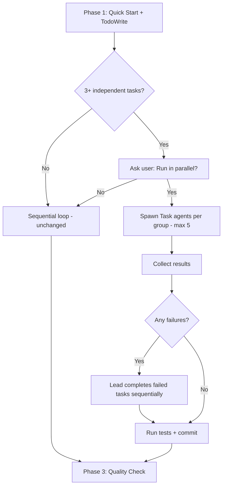

# Parallel Subagent Execution in /soleur:work

## Overview

Add parallel execution support to `/soleur:work` using the Task tool's subagent fan-out pattern. When a plan has 3+ independent tasks, ask the user if they want to run them in parallel. This is a prerequisite for #26 (Agent Teams integration) -- ship the proven pattern first.

## Problem Statement

`/soleur:work` processes plan tasks sequentially. For plans with multiple independent tasks, this wastes wall-clock time. The plugin already has proven parallel patterns (`/soleur:review` spawns 9+ agents, `/resolve_parallel` spawns N agents), but `/soleur:work` remains purely sequential.

## Proposed Solution

Add a conditional block to `work.md` Phase 2. After TodoWrite creation, examine `blockedBy` fields. If 3+ independent tasks exist, ask the user: "Run in parallel?" If yes, spawn one Task agent per group (max 5), collect results, handle failures, test, commit.

**Scope:** ~30-40 lines of new markdown in `work.md`. No new agents, commands, or skills.

## Technical Approach

### What Changes in `work.md`

A single conditional block inserted into Phase 2 (Execute), before the existing sequential task loop. The existing sequential loop remains unchanged as the default path.



### Parallel Execution Block

Insert before the existing "Task Execution Loop" in Phase 2:

```markdown
### Parallel Execution (optional)

Before starting the sequential task loop, check for parallelization opportunities:

1. Read the TodoWrite task list. Identify tasks with no `blockedBy` dependencies
   and no obvious file overlap (tasks that reference different files/modules).

2. If 3+ independent tasks exist, ask the user:

   "I found N independent tasks that could run in parallel.
   This uses more tokens but completes faster. Run in parallel?"

   - Yes: proceed to parallel execution below
   - No: proceed to sequential loop (existing behavior)

3. Group independent tasks (max 5 groups). Each independent task or small
   cluster of related tasks becomes one group.

4. For each group, spawn a Task general-purpose agent:

   Task general-purpose: "You are executing part of a work plan.

   BRANCH: [current branch name]
   WORKING DIRECTORY: [current path]

   YOUR TASKS:
   [Task descriptions and relevant plan sections for this group]

   INSTRUCTIONS:
   - Read referenced files before modifying them
   - Follow existing codebase patterns
   - Write tests for new functionality
   - Run tests relevant to your changes
   - Do NOT commit -- the lead will commit after reviewing all work
   - Report: what you completed, files modified, any issues encountered"

5. Wait for all subagents to complete.

6. If any subagent failed or reported issues: complete those tasks
   sequentially using the existing task loop.

7. Run the full test suite to verify integration.

8. If tests pass: commit all changes with a conventional commit message.
   If tests fail: fix integration issues, then commit.

9. Update TodoWrite to mark all completed tasks.

Then proceed to Phase 3: Quality Check.
```

### Key Design Decisions

- **Subagents do NOT commit.** The lead commits after collecting all work and running tests. This avoids git coordination issues entirely (per Kieran's review feedback).
- **Dependency detection uses `blockedBy` fields + common sense.** No formal graph construction needed -- the AI reads the task list and identifies independent work (same pattern as `/resolve_parallel`).
- **Max 5 subagents** to bound token costs.
- **Context is minimal.** Subagents inherit session context (CLAUDE.md, constitution). The prompt only includes: branch, working directory, task descriptions, and rules.
- **Failure handling is simple.** If a subagent fails, the lead does that work sequentially. No reassignment, no retry logic.

## Tasks

- [x] 1. Read current `work.md` Phase 2 to identify exact insertion point
- [x] 2. Write the "analyze independence" instructions (examine `blockedBy`, file overlap)
- [x] 3. Write the "ask user" prompt (yes/no for parallel)
- [x] 4. Write the "spawn subagents" instructions (Task tool, max 5, concrete context template)
- [x] 5. Write the "collect results" instructions (wait, handle failures, test, commit)
- [x] 6. Version bump `plugin.json` to 1.10.0 + `CHANGELOG.md` + `README.md`

## Acceptance Criteria

- [ ] `/soleur:work` detects independent task groups from `blockedBy` fields
- [ ] Prompts user when 3+ independent tasks exist
- [ ] Spawns Task subagents per group (max 5) when user opts in
- [ ] Subagents do NOT commit -- lead commits after collection
- [ ] Falls back to sequential on subagent failure
- [ ] Lead runs full test suite after collection
- [ ] No behavior change for plans with < 3 independent tasks (backward compatible)
- [ ] Dogfooding: validated on a real plan with 5+ independent tasks

## Risks

- **Subagent file conflicts:** Two subagents may edit the same file. Mitigation: lead reviews all changes before committing; grouping instructions tell the agent to avoid assigning overlapping files to the same group.
- **Token cost:** Parallel execution uses more tokens. Mitigation: user consent required, max 5 subagents.
- **Integration issues:** Parallel work may produce subtle incompatibilities. Mitigation: lead runs full test suite and reviews integration manually.

## References

- Current work command: `plugins/soleur/commands/soleur/work.md`
- Proven fan-out pattern: `plugins/soleur/commands/resolve_parallel.md`
- Agent spawning pattern: `plugins/soleur/commands/soleur/review.md`
- Plugin versioning: `knowledge-base/learnings/plugin-versioning-requirements.md`
- Brainstorm: `knowledge-base/brainstorms/2026-02-09-agent-team-brainstorm.md`
- Follow-up: #26 (Agent Teams integration)
- Issue: #31
