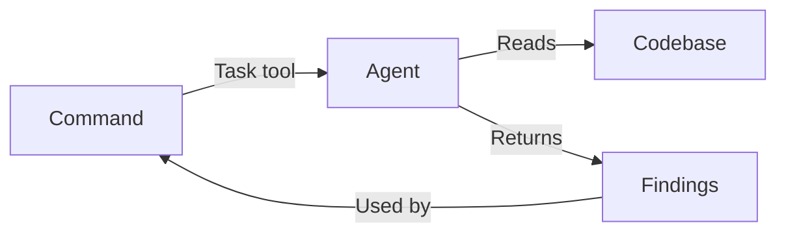

# Agents

AI agents that perform specialized tasks during the development workflow. Each agent is a markdown file containing instructions for Claude to follow when invoked.

## Purpose

Provide specialized AI capabilities across 8 business domains. Each domain has a leader agent (C-level) that orchestrates specialists, enabling a Company-as-a-Service architecture where any business function can be delegated to an AI agent.

## Responsibilities

- Perform deep analysis within a specific domain (security, performance, legal, marketing, etc.)
- Provide consistent, reproducible results following defined instructions
- Return structured findings for use by other commands
- Execute in parallel when multiple perspectives are needed

## Key Interfaces

**Invocation:** Agents are called via the Task tool with `subagent_type`:

```typescript
Task({
  description: "Review security vulnerabilities",
  prompt: "Analyze this code for security issues...",
  subagent_type: "soleur:engineering:review:security-sentinel"
})
```

**Naming convention:** Agents are named by their directory path under `agents/`:

- Domain agents: `soleur:<domain>:<name>` (e.g., `soleur:finance:cfo`)
- Nested agents: `soleur:<domain>:<function>:<name>` (e.g., `soleur:engineering:review:security-sentinel`)

## Data Flow



1. Workflow skill (e.g., `soleur:review`) identifies which agents to invoke
2. Task tool spawns agent with specific prompt
3. Agent reads relevant files, analyzes, and returns findings
4. Parent command consolidates results

## Categories (60+ agents across 8 departments)

### Engineering (27 agents)

#### CTO (1)

| Agent | Purpose |
|-------|---------|
| `cto` | Assess technical implications, flag architecture concerns during planning |

#### Review (15)

Code review specialists that catch issues before PR:

| Agent | Purpose |
|-------|---------|
| `agent-native-reviewer` | Verify agent-native architecture (action + context parity) |
| `architecture-strategist` | Architectural compliance and design decisions |
| `code-quality-analyst` | Formal quality reports with severity-scored smells and refactoring roadmaps |
| `code-simplicity-reviewer` | Final pass for YAGNI and minimalism |
| `data-integrity-guardian` | Database migrations and data integrity |
| `data-migration-expert` | Validate ID mappings, check for swapped values |
| `deployment-verification-agent` | Go/No-Go deployment checklists |
| `dhh-rails-reviewer` | Rails review from DHH's perspective |
| `kieran-rails-reviewer` | Rails code with strict conventions |
| `legacy-code-expert` | Safely modify untested legacy code using Feathers' techniques |
| `pattern-recognition-specialist` | Design patterns and anti-patterns |
| `performance-oracle` | Performance analysis and optimization |
| `security-sentinel` | Security audits and vulnerabilities |
| `semgrep-sast` | Deterministic static analysis using semgrep rules |
| `test-design-reviewer` | Score test quality using Farley's 8 properties |

#### Design (1)

| Agent | Purpose |
|-------|---------|
| `ddd-architect` | Domain-Driven Design with bounded contexts and aggregate design |

#### Discovery (2)

| Agent | Purpose |
|-------|---------|
| `agent-finder` | Find community agents for missing tech stack coverage |
| `functional-discovery` | Check if planned features already exist in registries |

#### Infrastructure (2)

| Agent | Purpose |
|-------|---------|
| `infra-security` | Audit domain security, configure DNS/Cloudflare via MCP |
| `terraform-architect` | Generate and review Terraform configurations |

#### Research (5)

| Agent | Purpose |
|-------|---------|
| `best-practices-researcher` | External documentation and examples |
| `framework-docs-researcher` | Framework-specific documentation |
| `git-history-analyzer` | Code evolution and commit patterns |
| `learnings-researcher` | Search knowledge-base/project/learnings/ for relevant solutions |
| `repo-research-analyst` | Repository structure and conventions |

#### Workflow (1)

| Agent | Purpose |
|-------|---------|
| `pr-comment-resolver` | Address PR review comments |

### Finance (4 agents)

| Agent | Purpose |
|-------|---------|
| `cfo` | Orchestrate finance domain, assess financial posture |
| `budget-analyst` | Budget plans, spending allocation, burn rate modeling |
| `financial-reporter` | Financial summaries, cash flow, investor-ready reports |
| `revenue-analyst` | Revenue tracking, P&L projections, financial forecasts |

### Legal (3 agents)

| Agent | Purpose |
|-------|---------|
| `clo` | Orchestrate legal domain, assess legal posture |
| `legal-compliance-auditor` | Audit documents for compliance gaps and consistency |
| `legal-document-generator` | Generate draft legal documents |

### Marketing (11 agents)

| Agent | Purpose |
|-------|---------|
| `cmo` | Orchestrate marketing domain, unified strategy |
| `analytics-analyst` | Tracking implementations, event taxonomies, A/B tests |
| `brand-architect` | Brand identity workshops, voice and tone, visual direction |
| `conversion-optimizer` | Landing pages, signup flows, paywall optimization |
| `copywriter` | Landing pages, email sequences, cold outreach, social content |
| `growth-strategist` | Content strategy, keyword research, content auditing |
| `paid-media-strategist` | Google/Meta/LinkedIn campaign structure and targeting |
| `pricing-strategist` | SaaS pricing, tier design, value metric selection |
| `programmatic-seo-specialist` | Template-driven SEO page generation at scale |
| `retention-strategist` | Churn prevention, payment recovery, referral programs |
| `seo-aeo-analyst` | Technical SEO and AI Engine Optimization audits |

### Operations (4 agents)

| Agent | Purpose |
|-------|---------|
| `coo` | Orchestrate operations domain, recommend actions |
| `ops-advisor` | Track operational expenses, manage domains |
| `ops-provisioner` | Set up SaaS accounts, configure tools |
| `ops-research` | Research domains, hosting providers, cost optimization |

### Product (5 agents)

| Agent | Purpose |
|-------|---------|
| `cpo` | Orchestrate product domain, validate business models |
| `business-validator` | Structured market research and business model assessment |
| `competitive-intelligence` | Recurring competitive landscape monitoring |
| `spec-flow-analyzer` | Analyze specifications for gaps and edge cases |
| `ux-design-lead` | Visual designs in .pen files using Pencil MCP tools |

### Sales (4 agents)

| Agent | Purpose |
|-------|---------|
| `cro` | Orchestrate sales domain, pipeline strategy |
| `deal-architect` | Proposals, SOWs, battlecards, objection handling |
| `outbound-strategist` | Outbound prospecting sequences, ICP targeting |
| `pipeline-analyst` | Pipeline health, deal velocity, stage criteria |

### Support (3 agents)

| Agent | Purpose |
|-------|---------|
| `cco` | Orchestrate support domain, assess support posture |
| `community-manager` | Community engagement analysis, weekly digests |
| `ticket-triage` | Classify and route GitHub issues by severity and domain |

## Dependencies

- **Internal**: None (agents are standalone)
- **External**: Claude Code Task tool, various CLI tools per agent

## Related Files

- `plugins/soleur/agents/engineering/` - Engineering agents (review, design, discovery, infra, research, workflow)
- `plugins/soleur/agents/finance/` - Finance agents
- `plugins/soleur/agents/legal/` - Legal agents
- `plugins/soleur/agents/marketing/` - Marketing agents
- `plugins/soleur/agents/operations/` - Operations agents
- `plugins/soleur/agents/product/` - Product agents (includes design/ subdirectory)
- `plugins/soleur/agents/sales/` - Sales agents
- `plugins/soleur/agents/support/` - Support agents

## See Also

- [Commands](./commands.md) - Commands that invoke agents
- [constitution.md](../constitution.md) - Agent organization conventions
