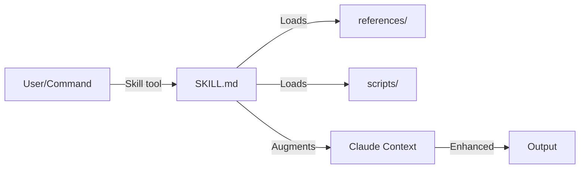

# Skills

Specialized capabilities that extend Claude's knowledge in specific domains. Skills are directories containing a SKILL.md file and optional supporting resources (scripts, references, assets).

## Purpose

Provide domain expertise and specialized workflows that can be loaded on-demand. Unlike agents (which are invoked programmatically via Task tool), skills are loaded into context to augment Claude's capabilities for specific tasks.

## Responsibilities

- Provide specialized knowledge for specific domains (Rails, design, workflows)
- Include reference materials, scripts, and examples
- Define best practices and conventions
- Enable consistent, high-quality output in specialized areas

## Key Interfaces

**Invocation:** Skills are loaded via the Skill tool:

```typescript
Skill({
  skill: "soleur:dhh-rails-style"
})
```

**Definition:** Skills have a specific directory structure:

```
skills/<skill-name>/
  SKILL.md           # Main skill document (required)
  references/        # Reference materials (optional)
  scripts/           # Helper scripts (optional)
  assets/            # Images, templates (optional)
```

**SKILL.md frontmatter:**

```yaml
---
name: skill-name
description: This skill should be used when...
---
```

## Data Flow



1. User or command requests a skill
2. Claude Code loads SKILL.md into context
3. Referenced materials loaded as needed
4. Claude's capabilities enhanced for the domain
5. Higher quality output in that domain

## Categories (60+ skills)

### Core Workflow (6)

The primary development lifecycle, invocable directly or via `/soleur:go`:

| Skill | Purpose |
|-------|---------|
| `brainstorm` | Clarify requirements, explore approaches, route to domain experts |
| `plan` | Transform features into structured implementation plans |
| `work` | Execute plans systematically with incremental commits |
| `review` | Multi-agent code review before PR |
| `compound` | Capture learnings and promote knowledge to definitions |
| `one-shot` | Full autonomous workflow from plan to PR with video |

### Shipping & Release (6)

| Skill | Purpose |
|-------|---------|
| `ship` | Enforce feature lifecycle checklist before creating PRs |
| `merge-pr` | Merge feature branch to main with conflict resolution and cleanup |
| `changelog` | Create engaging changelogs for recent merges |
| `release-announce` | Generate GitHub Releases from CHANGELOG.md |
| `release-docs` | Update documentation metadata after component changes |
| `deploy` | Build Docker images, push to GHCR, deploy via SSH |

### Code Quality & Testing (7)

| Skill | Purpose |
|-------|---------|
| `atdd-developer` | Acceptance Test Driven Development with RED/GREEN/REFACTOR gates |
| `test-fix-loop` | Iterate on test failures until all pass |
| `test-browser` | Run browser tests on PR-affected pages |
| `reproduce-bug` | Reproduce bugs using logs, console, and browser screenshots |
| `fix-issue` | Automated single-file fix for GitHub issues |
| `agent-native-audit` | Comprehensive agent-native architecture review |
| `xcode-test` | Build and test iOS apps on simulator |

### Planning & Review (4)

| Skill | Purpose |
|-------|---------|
| `plan-review` | Multi-agent plan review in parallel |
| `deepen-plan` | Enhance plans with parallel research agents |
| `brainstorm-techniques` | Question techniques for effective brainstorming |
| `user-story-writer` | Decompose features into INVEST-compliant stories |

### Resolution & Automation (5)

| Skill | Purpose |
|-------|---------|
| `resolve-parallel` | Resolve TODO comments in codebase in parallel |
| `resolve-pr-parallel` | Resolve PR review comments in parallel |
| `resolve-todo-parallel` | Resolve CLI todos in parallel |
| `triage` | Triage and categorize findings for the CLI todo system |
| `schedule` | Create scheduled agent tasks via GitHub Actions cron workflows |

### Knowledge Management (4)

| Skill | Purpose |
|-------|---------|
| `compound-capture` | Capture solved problems as categorized documentation |
| `archive-kb` | Archive completed knowledge-base artifacts |
| `spec-templates` | Templates for specs, tasks, and component docs |
| `file-todos` | File-based todo tracking system |

### Documentation & Content (4)

| Skill | Purpose |
|-------|---------|
| `deploy-docs` | Validate and prepare documentation for GitHub Pages |
| `docs-site` | Scaffold Markdown-based documentation site using Eleventy |
| `content-writer` | Generate article drafts with brand-consistent voice |
| `every-style-editor` | Review copy for Every's style guide compliance |

### SEO & Growth (3)

| Skill | Purpose |
|-------|---------|
| `seo-aeo` | Audit and fix SEO and AI Engine Optimization for Eleventy sites |
| `growth` | Content strategy, keyword research, content gap analysis |
| `competitive-analysis` | Competitive intelligence scans and market research |

### Legal (2)

| Skill | Purpose |
|-------|---------|
| `legal-generate` | Generate draft legal documents |
| `legal-audit` | Audit existing legal documents for compliance gaps |

### Social & Community (3)

| Skill | Purpose |
|-------|---------|
| `discord-content` | Create and post community content to Discord |
| `social-distribute` | Distribute blog articles across 5 social platforms |
| `community` | Community engagement scripts (structurally incomplete -- no SKILL.md) |

### Development Style (4)

| Skill | Purpose |
|-------|---------|
| `dhh-rails-style` | Write Ruby/Rails in DHH's 37signals style |
| `andrew-kane-gem-writer` | Write Ruby gems following Andrew Kane's patterns |
| `dspy-ruby` | Build type-safe LLM applications with DSPy.rb |
| `frontend-design` | Create production-grade frontend interfaces |

### Architecture (2)

| Skill | Purpose |
|-------|---------|
| `agent-native-architecture` | Design agent-native applications |
| `skill-creator` | Expert guidance for creating Claude Code skills |

### Infrastructure & Tools (5)

| Skill | Purpose |
|-------|---------|
| `git-worktree` | Manage Git worktrees for parallel development |
| `agent-browser` | CLI-based browser automation using Vercel's agent-browser |
| `rclone` | Upload files to S3, Cloudflare R2, Backblaze B2 |
| `gemini-imagegen` | Generate and edit images using Google's Gemini API |
| `pencil-setup` | Install and register Pencil MCP server |

### Video & Media (1)

| Skill | Purpose |
|-------|---------|
| `feature-video` | Record video walkthroughs and add to PR descriptions |

### Meta (1)

| Skill | Purpose |
|-------|---------|
| `heal-skill` | Fix skill documentation issues discovered during execution |

## Conventions

From `constitution.md`:

- Skill descriptions MUST use third person ("This skill should be used when...")
- Reference files MUST use markdown links, not backticks
- All skills MUST include YAML frontmatter with `name` and `description`
- All skills live flat under `skills/` (the loader does not recurse into subdirectories)

## Related Files

- `plugins/soleur/skills/` - All skill directories

## See Also

- [Commands](./commands.md) - Commands that invoke skills
- [constitution.md](../constitution.md) - Skill conventions
