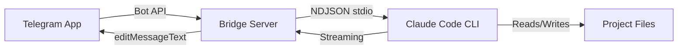

# Telegram Bridge

A standalone Bun/TypeScript application that bridges Telegram to the Claude Code CLI via stdin/stdout. Messages sent to a Telegram bot are forwarded to a Claude Code session running with the Soleur plugin, and responses stream back in real time.

## Purpose

Provide a mobile-accessible interface to Claude Code + Soleur. The bot uses long-polling (outbound only), so no public HTTP endpoint or TLS certificate is required. Single-user lockdown via `TELEGRAM_ALLOWED_USER_ID`.

## Responsibilities

- Forward Telegram messages to Claude Code CLI via NDJSON stdio
- Stream responses back to Telegram using progressive `editMessageText` calls
- Manage Claude CLI process lifecycle (spawn, restart with exponential backoff)
- Provide health check endpoint for monitoring

## Key Interfaces

**Runtime:** Bun + grammY bot framework + `@grammyjs/parse-mode`

**Architecture:**

```
Telegram App --> (Bot API, long polling) --> Bridge Server (Bun + grammY)
    --> (stdin/stdout, NDJSON) --> Claude Code CLI + Soleur Plugin
    --> Project Files
```

**Infrastructure:** Hetzner Cloud CX22 with Terraform provisioning:

- `infra/main.tf` - Hetzner provider and network
- `infra/server.tf` - CX22 instance with cloud-init
- `infra/firewall.tf` - SSH + health check firewall rules
- `infra/variables.tf` / `infra/outputs.tf` - Configuration
- Monthly cost: ~EUR 4.43 (~$4.80 USD)

## Data Flow



## Source Structure

```
apps/telegram-bridge/
  src/
    index.ts          # Entry point: env validation, grammY setup, CLI lifecycle
    bridge.ts         # Core logic: message handling, streaming, status management
    health.ts         # Health check HTTP server
    types.ts          # Shared type definitions
  test/
    bridge.test.ts    # ~130 tests covering bridge logic
    health.test.ts    # Health endpoint tests
  infra/              # Terraform for Hetzner Cloud
  scripts/            # deploy.sh, remote.sh for operations
  Dockerfile          # Production container
```

## Dependencies

- **Internal**: Soleur plugin (loaded into Claude Code CLI)
- **External**: grammY (Telegram Bot API), Bun runtime, Docker, Hetzner Cloud

## Testing

- `bun test` from `apps/telegram-bridge/` runs the test suite
- CI enforces coverage via `bun test --coverage` in `ci.yml`
- Tests use factory functions (`createMockApi()`) and `beforeEach`/`afterEach` lifecycle

## Related Files

- `apps/telegram-bridge/README.md` - Setup and operations guide
- `.github/workflows/ci.yml` - CI job for bridge tests

## See Also

- [Skills](./skills.md) - Skills invoked through the bridge
- [Agents](./agents.md) - Agents available via the bridge
