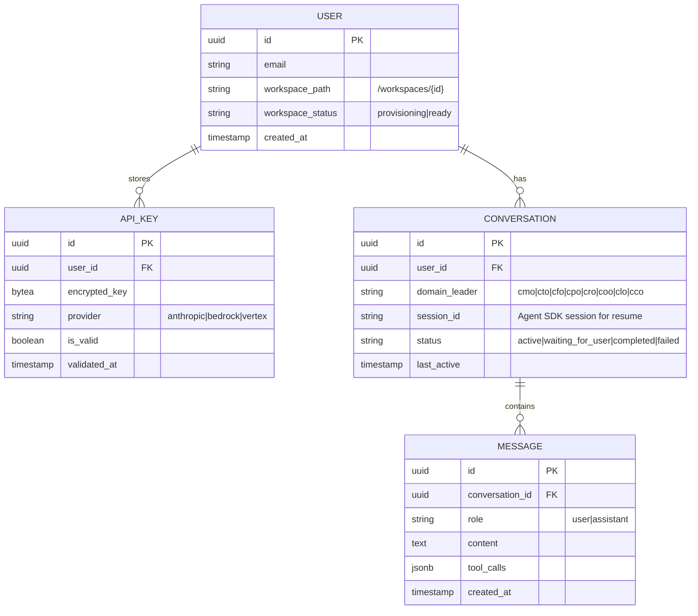

# feat: Web Platform — Cloud CLI Engine

[Updated 2026-03-16 — rewritten after plan review by DHH, Kieran, and Code Simplicity reviewers. Collapsed from 6 phases to 3. Cut 4 database tables. Merged to single app. Spike-first approach.]

## Overview

Build a web platform where founders chat with Soleur domain leaders through a browser. Agents execute on the server via the **Claude Agent SDK** (`@anthropic-ai/claude-agent-sdk`). The web app is a single Next.js application with a custom server for WebSocket — one app, one deployment, one runtime.

**Core loop:** User talks to a department head in chat → agent proposes a plan → user approves in chat → agent executes autonomously → user gets pulled in at review gates → knowledge-base compounds.

**Architecture pivot from brainstorm:** The Claude Agent SDK replaces the "spawn CLI subprocess" pattern. Each user session calls `query()` as an async iterator, streaming `SDKMessage` events to the browser over WebSocket.

## Problem Statement

Two validated friction points prevent adoption:

1. **Install friction** — CLI plugin installation deters both technical and non-technical founders
2. **Visibility gap** — the terminal is the wrong surface for browsing knowledge-base, reviewing plans, and monitoring execution

User feedback: they want autonomous execution with human review gates. Both technical and non-technical segments showed equal interest. **Willingness to pay is unvalidated** (CPO flag).

## Proposed Solution

### Architecture

```
┌──────────────┐     WebSocket      ┌──────────────────────────────────┐
│   Browser    │◄──────────────────►│   Next.js + Custom Server         │
│              │                     │                                   │
│  - Chat UI   │                     │  server/ws-handler.ts             │
│  - KB viewer │                     │  server/agent-runner.ts           │
│  (Phase 2)   │                     │  server/workspace.ts              │
│              │                     │  server/byok.ts                   │
└──────────────┘                     └────────────┬────────────────────┘
                                                  │
                                        ┌─────────▼──────────────────┐
                                        │  /workspaces/{user_id}/     │
                                        │    knowledge-base/          │
                                        │    plugins/soleur/ (symlink)│
                                        │    .claude/                 │
                                        │    .git/                    │
                                        └────────────────────────────┘
```

**Single app:** `apps/web-platform/` — Next.js with a custom `server.ts` that handles both HTTP and WebSocket. Agent SDK integration, BYOK key management, and workspace provisioning all live in `server/` within this app. No monorepo, no shared types package.

### Why Agent SDK

| Factor | CLI Subprocess | Agent SDK |
|--------|---------------|-----------|
| Integration | Spawn process, pipe NDJSON | Import library, call `query()`, iterate `SDKMessage` |
| Streaming | Parse raw NDJSON | Native async iterator with typed events |
| Session mgmt | Manage PID, crash recovery | `resume: sessionId` built-in |
| Multi-turn chat | Send messages to stdin | Streaming input mode (`prompt: AsyncIterable<SDKUserMessage>`) |
| Review gates | N/A (terminal prompts) | `canUseTool` callback intercepts `AskUserQuestion` |
| Permissions | CLI flags | `permissionMode`, `allowedTools` whitelist |

### Tech Stack

| Layer | Technology | Rationale |
|-------|-----------|-----------|
| App | Next.js 15 + custom server | One app, one deployment. Custom server for WebSocket. |
| Database | Supabase (PostgreSQL) | Auth (magic links), real-time subscriptions, RLS |
| Payments | Stripe | Simple platform subscription (BYOK = no usage metering) |
| Agent engine | Claude Agent SDK (TypeScript) | Embedded in server process. Same tools as CLI. |
| KB storage | Git-backed filesystem | Preserves branching, history, compound loop |
| Deployment | Railway / Fly.io | Persistent server + volume (not serverless) |
| Isolation | PreToolUse path validation | Upgrade to containers when real users + real threats exist |

**Why not Rails:** Agent SDK is TypeScript. The streaming integration is the hot path — a sidecar adds latency and failure modes. The TypeScript stack cost (Next.js churn, Supabase abstractions) is real but acceptable since the Agent SDK is the core of every interaction.

**Why not serverless:** `query()` is long-running (minutes to hours). Needs a persistent server.

### Data Model

Four tables. Plans live as files in the KB. Review gates are chat messages. Domain leaders are a TypeScript constant.



**Indexes:** `conversation.user_id`, `conversation.status` (for "inbox" = conversations where status is `waiting_for_user`), `message.conversation_id + created_at`.

**Domain leaders as config:**

```typescript
// server/domain-leaders.ts
export const DOMAIN_LEADERS = [
  { id: "cmo", name: "CMO", description: "Marketing strategy...", agentPath: "agents/marketing/cmo.md" },
  { id: "cto", name: "CTO", description: "Technical architecture...", agentPath: "agents/engineering/cto.md" },
  // ... 6 more
] as const;
```

### Review Gate Protocol

Review gates are chat messages, not a distributed notification system.

1. Agent SDK's `canUseTool` callback intercepts `AskUserQuestion`
2. Callback sends the question + options as a WebSocket message to the browser
3. Browser renders options in chat UI (buttons or inline choices)
4. User clicks an option → WebSocket message back to server
5. Callback resolves with the user's selection
6. Agent continues

```typescript
// server/agent-runner.ts
const runner = query({
  prompt: userMessages,
  options: {
    cwd: user.workspacePath,
    env: { ANTHROPIC_API_KEY: decryptedKey },
    permissionMode: "acceptEdits",
    allowedTools: ["Read", "Write", "Edit", "Bash", "Glob", "Grep", "Agent"],
    systemPrompt: leaderInstructions,
    canUseTool: async (toolName, toolInput) => {
      if (toolName === "AskUserQuestion") {
        // Send question to browser, wait for response
        ws.send(JSON.stringify({ type: "review_gate", payload: toolInput }));
        const response = await waitForUserResponse(ws);
        return { allow: true, updatedInput: { ...toolInput, answers: response } };
      }
      // Workspace sandbox: block file access outside workspace
      if (["Read", "Write", "Edit", "Glob", "Grep"].includes(toolName)) {
        const path = toolInput.file_path || toolInput.path || "";
        if (!path.startsWith(user.workspacePath)) {
          return { allow: false, reason: "Access denied: outside workspace" };
        }
      }
      return { allow: true };
    },
  }
});

for await (const message of runner) {
  ws.send(JSON.stringify(message));
  // Persist assistant messages to DB
  if (message.role === "assistant") {
    await saveMessage(conversation.id, message);
  }
}
```

### Workspace Structure

```
/workspaces/{user_id}/
├── knowledge-base/          # User's compounding KB
│   ├── brainstorms/
│   ├── specs/
│   ├── plans/
│   └── learnings/
├── plugins/
│   └── soleur -> /app/shared/plugins/soleur  # Symlink to shared read-only copy
├── .claude/
│   └── settings.json
└── .git/                    # Git repo for KB versioning
```

**Plugin sharing:** Symlink `plugins/soleur/` to a shared read-only copy. Only `knowledge-base/` and `.claude/` are user-specific. At 1000 users, this saves ~50GB vs. copying the full plugin.

**Isolation:** PreToolUse `canUseTool` callback validates all file paths start with the user's workspace. Upgrade to container-per-workspace when there are real users and real threat signals.

## Implementation Phases

### Phase 0: Agent SDK Spike (prerequisite — blocks everything)

**One afternoon. One file. Does `query()` work with Soleur agents?**

- [ ] Create `spike/agent-sdk-test.ts`
- [ ] Import `@anthropic-ai/claude-agent-sdk`
- [ ] Point `cwd` at a workspace with Soleur plugin and a test KB
- [ ] Run `query()` with prompt "You are the CMO. Analyze our brand positioning."
- [ ] Verify: streaming works, file tools work, Agent (subagent) tool works, AskUserQuestion can be intercepted via `canUseTool`
- [ ] Document findings: what works, what breaks, what needs adaptation

**Pass/fail criteria:**
- PASS: Agent responds, can read/write KB files, subagents spawn, review gates interceptable → proceed to Phase 1
- FAIL: Tools don't work or SDK rejects Soleur agent format → evaluate fallback (CLI subprocess via Telegram bridge pattern)

**SDK licensing:** Kieran's review found that Agent SDK terms explicitly permit hosted products. Risk downgraded from HIGH to **LOW**. Verify this in the spike by checking the npm package license field.

### Phase 1: Working Loop (auth → chat → execute → review gates)

Everything a user needs to experience the core value: sign up, provide key, talk to a domain leader, approve a plan, watch execution, respond at review gates.

**Tasks:**

- [ ] 1.1 Initialize `apps/web-platform/` — Next.js with custom `server.ts`
- [ ] 1.2 Set up Supabase project (database, auth)
- [ ] 1.3 Database migration: `USER`, `API_KEY`, `CONVERSATION`, `MESSAGE` tables + RLS policies + indexes
- [ ] 1.4 Magic-link auth flow (`app/(auth)/login/page.tsx`, `app/(auth)/signup/page.tsx`)
- [ ] 1.5 BYOK key setup page (`app/(auth)/setup-key/page.tsx`)
- [ ] 1.6 Encrypted key storage (`server/byok.ts`) — AES-256-GCM, validate against Anthropic API
- [ ] 1.7 Workspace provisioner (`server/workspace.ts`) — create dir, symlink plugin, init git
- [ ] 1.8 WebSocket server (`server/ws-handler.ts`) — auth, session routing
- [ ] 1.9 Agent SDK runner (`server/agent-runner.ts`) — `query()` with streaming input mode, `canUseTool` for review gates + workspace sandbox, `env` for BYOK key injection, `systemPrompt` for leader routing, `permissionMode: "acceptEdits"`
- [ ] 1.10 Domain leader selector UI — card grid, 8 leaders
- [ ] 1.11 Chat UI — message list with streaming text, review gate buttons inline, conversation history
- [ ] 1.12 WebSocket client (`lib/ws-client.ts`) — connect, reconnect, message handling
- [ ] 1.13 Persist conversations + messages to Supabase
- [ ] 1.14 Stripe subscription — single platform plan, webhook handler
- [ ] 1.15 Deploy to Railway/Fly.io — persistent volume for `/workspaces/`

**Acceptance criteria:**
- [ ] User signs up via magic link, provides Anthropic API key, sees leader selector
- [ ] Selects leader → chat opens → agent streams response in real-time
- [ ] Agent reads/writes KB files in user's workspace
- [ ] Agent cannot access files outside workspace (canUseTool blocks it)
- [ ] AskUserQuestion renders as buttons in chat, user responds, agent continues
- [ ] Conversation persists across page refreshes
- [ ] BYOK key encrypted at rest, never logged

**Test scenarios:**
- Given valid BYOK key, when user chats with CMO, then streaming response appears
- Given invalid key, when submitted, then clear error with retry option
- Given agent at review gate, when user selects option in chat, then execution resumes
- Given two users, when both chatting, then neither sees the other's workspace files
- Given browser close during execution, when user returns, then conversation resumes

### Phase 2: Visibility (KB viewer, execution history, email notifications)

Only build after Phase 1 users tell you what they need to see. Likely scope:

- [ ] 2.1 KB REST API (`server/kb-api.ts`) — file tree, content (markdown + frontmatter), search (grep)
- [ ] 2.2 KB viewer UI — sidebar tree, markdown rendering with syntax highlighting, search bar
- [ ] 2.3 Conversation list with status badges (the "inbox" = conversations where `status = waiting_for_user`)
- [ ] 2.4 Email notifications for offline users when agent hits review gate (Resend, triggered by `canUseTool` callback when WebSocket is disconnected)
- [ ] 2.5 Execution history — list of completed conversations with outcomes

**Acceptance criteria:**
- [ ] User browses KB directory tree and reads rendered markdown
- [ ] Search returns results across all artifact types
- [ ] KB updates in real-time when agent writes files
- [ ] Email sent when agent hits review gate and user is offline

### Phase 3: Hardening (security, monitoring, production readiness)

Only after real users exist:

- [ ] 3.1 Security audit — workspace isolation, BYOK key handling, path traversal, OWASP top 10
- [ ] 3.2 Upgrade to container-per-workspace if threat model warrants it
- [ ] 3.3 Rate limiting — per-user execution concurrency, API request rate
- [ ] 3.4 Monitoring — execution success/failure rates, active sessions, error rates
- [ ] 3.5 Error tracking (Sentry)
- [ ] 3.6 CSP headers, CORS configuration
- [ ] 3.7 Session timeout — idle sessions release resources
- [ ] 3.8 Load testing — 50+ concurrent users

## Alternative Approaches Considered

| Approach | Why Rejected |
|----------|-------------|
| CLI subprocess + NDJSON bridge | Agent SDK is simpler (library call vs. process management). Fallback if SDK spike fails. |
| Web-native agents (Messages API) | Loses 65-70% of agent value (no Task, Skill, Bash, File tools). |
| 6-phase plan | Overengineered. Reviewers unanimously said: collapse to 3 phases, cut half the data model. |
| Monorepo (apps/web + apps/agent-server + packages/types) | Unnecessary for one app. Custom server in Next.js handles WebSocket. |
| Linux namespace isolation | Premature. PreToolUse path validation is sufficient until real users + real threats exist. |
| PLAN/EXECUTION/NOTIFICATION tables | Plans are KB files. Executions are conversations. Review gates are chat messages. |
| Container-per-user | $$$. Upgrade path from PreToolUse validation when warranted. |
| Rails | Agent SDK is TypeScript. Sidecar adds latency on the hot path. Revisit if SDK gets Ruby binding. |

## Acceptance Criteria

### Functional

- [ ] Signup → first conversation in <5 minutes
- [ ] Agent streams responses in real-time
- [ ] Review gates work as inline chat interactions
- [ ] KB files readable through web UI (Phase 2)
- [ ] Email notification when agent needs input and user is offline (Phase 2)

### Non-Functional

- [ ] BYOK keys encrypted at rest (AES-256-GCM)
- [ ] Workspace isolation via canUseTool path validation
- [ ] Conversations persist across page refreshes and server restarts

### Quality Gates

- [ ] Agent SDK spike passes before Phase 1 begins
- [ ] E2E test: signup → chat → review gate → resume
- [ ] Security review before opening to external users

## Dependencies & Prerequisites

| Dependency | Status | Risk |
|-----------|--------|------|
| Claude Agent SDK | npm package available | **LOW** — terms permit hosted products (per Kieran review) |
| Supabase | SaaS | LOW |
| Stripe | SaaS | LOW |
| Railway/Fly.io persistent volume | Available | MEDIUM — volume durability for workspaces |
| **Agent SDK spike** | **NOT DONE** | **BLOCKER** — must pass before Phase 1 |

## Risk Analysis

| Risk | Impact | Mitigation |
|------|--------|-----------|
| Soleur agents don't work in Agent SDK | High | Spike first. Fallback: CLI subprocess (Telegram bridge pattern). |
| Workspace path traversal | Critical | canUseTool validates all paths. Security audit in Phase 3. |
| BYOK key exposure | Critical | AES-256-GCM, no logging, memory-only decryption. |
| Cowork Plugins competition | High | Differentiate on compounding KB, cross-domain coherence, orchestration depth. |
| Nobody pays | High | BYOK model = low burn. Validate pricing with first 10 users. |

## Success Metrics

| Metric | Target |
|--------|--------|
| Signup → first conversation | <5 minutes |
| Weekly active users (month 1) | 10 |
| Users who return after first session | >50% |
| Users who convert to paid | 3+ |

## Open Questions (Resolve During Spike)

1. **Agent SDK + Soleur agents** — Do Task, Skill, AskUserQuestion work? (Spike validates this.)
2. **Streaming input mode** — Does `prompt: AsyncIterable<SDKUserMessage>` work for multi-turn? Or must each turn be a new `query()` with `resume`?
3. **Session resume across restarts** — Does `resume: sessionId` survive server process restarts?
4. **Workspace storage** — Symlinked plugin vs. copied. Measure actual size.

## References

- Brainstorm: `knowledge-base/project/brainstorms/2026-03-16-web-platform-cloud-cli-engine-brainstorm.md`
- Spec: `knowledge-base/project/specs/feat-web-platform-ux/spec.md`
- Telegram bridge (fallback pattern): `apps/telegram-bridge/`
- Cloud deploy learnings: `knowledge-base/project/learnings/integration-issues/2026-02-10-cloud-deploy-infra-and-sdk-integration.md`
- Streaming learnings: `knowledge-base/project/learnings/2026-03-02-telegram-streaming-repurpose-status-message.md`
- Platform risk: `knowledge-base/project/learnings/2026-02-25-platform-risk-cowork-plugins.md`
- Portability scan: `knowledge-base/project/learnings/2026-03-10-codex-portability-scan-methodology.md`
- Issue: #297 | Validation: #430 (closed) | Business model: #287
