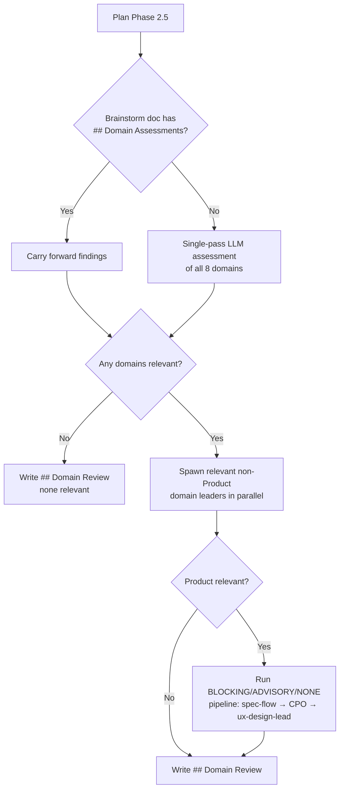

# ✨ feat: expand plan Phase 2.5 domain detection beyond product/UX to legal and operations

## Overview

Expand the plan skill's Phase 2.5 from a product/UX-only gate to a generalized domain review gate covering all 8 business domains. This prevents engineering plans from shipping third-party services without legal review (DPA, GDPR) or operations review (expense tracking, vendor management).

**Issue:** #753
**Branch:** feat-plan-domain-gates-753
**Brainstorm:** knowledge-base/project/brainstorms/2026-03-19-plan-domain-gates-brainstorm.md
**Spec:** knowledge-base/project/specs/feat-plan-domain-gates-753/spec.md
**Draft PR:** #792

## Problem Statement / Motivation

The web platform MVP (PR #637) added Resend (email) and Supabase (auth/DB) without updating legal documents or recording expenses. The plan skill's Phase 2.5 only detects product/UX signals — it has no awareness of legal or operations implications.

Two failure modes exist:

1. **Bypass path** — users running `/plan` or `/one-shot` directly skip brainstorm Phase 0.5, so no domain assessment runs at all
2. **Handoff gap** — even when brainstorm runs domain assessments, findings aren't persisted in a structured way and evaporate before plan Phase 2.5

## Proposed Solution

Expand Phase 2.5 to assess all 8 domains using `brainstorm-domain-config.md` as the single source of truth:

1. **Domain Sweep:** Assess all 8 domains against plan content. Spawn domain leaders for relevant non-Product domains as blocking Tasks.
2. **Product/UX Gate:** If Product domain is relevant, run the existing BLOCKING/ADVISORY/NONE tier with spec-flow-analyzer → CPO → ux-design-lead pipeline. CPO runs here only — excluded from the sweep to avoid double-invocation.

Plus **brainstorm persistence**: brainstorm Phase 3.5 writes a structured `## Domain Assessments` section that plan Phase 2.5 can carry forward without re-assessing.

## Technical Approach

### Architecture

All changes are to SKILL.md instruction text only (TR1). No new scripts, hooks, agents, or code files.



### Implementation Phases

#### Phase 1: Brainstorm Domain Persistence (FR6)

Modify `plugins/soleur/skills/brainstorm/SKILL.md` Phase 3.5 (lines 178-191) to add a structured `## Domain Assessments` section when domain leaders participated.

**Current behavior (Phase 3.5 line 187):** Document structure includes "What We're Building, Why This Approach, Key Decisions, Open Questions" — domain leader findings are woven into dialogue but not persisted in a parseable format.

**New behavior:** After existing sections, if domain leaders participated in Phase 0.5, write:

```markdown
## Domain Assessments

**Assessed:** Marketing, Engineering, Operations, Product, Legal, Sales, Finance, Support

### Legal

**Summary:** New third-party processor requires DPA review and GDPR policy update.

### Operations

**Summary:** New recurring expense (Resend) needs ledger entry and vendor tracking.
```

- One-line `**Assessed:**` field lists all 8 domains to confirm completeness
- Only relevant domains get `### [Domain Name]` subsections with summaries
- If no domain leaders participated, omit the entire `## Domain Assessments` section (current behavior preserved)
- **Relationship to `## Capability Gaps`:** These sections coexist. `## Domain Assessments` is structured carry-forward data for plan Phase 2.5. `## Capability Gaps` remains for missing capabilities. Plan reads only `## Domain Assessments` for carry-forward.

**Files modified:**
- `plugins/soleur/skills/brainstorm/SKILL.md` — Phase 3.5 capture instructions (lines 178-191)

#### Phase 2: Replace Phase 2.5 with Domain Review Gate (FR1-FR5, TR3)

Replace `plugins/soleur/skills/plan/SKILL.md` Phase 2.5 (lines 194-244), update `plugins/soleur/skills/work/SKILL.md` backstop (line 73), and update `knowledge-base/project/constitution.md` (line 122).

**Section header change:** `### 2.5. Product/UX Gate` → `### 2.5. Domain Review Gate`

**Step 1 — Domain Sweep:**

1. **Brainstorm carry-forward check:** If the brainstorm document (loaded in Phase 0.5) contains a `## Domain Assessments` section, carry forward the findings. Extract relevant domains and their summaries. Skip fresh assessment.

2. **Fresh assessment (if no brainstorm or incomplete findings):** Read `plugins/soleur/skills/brainstorm/references/brainstorm-domain-config.md`. Assess all 8 domains against the plan content in a single LLM pass using each domain's Assessment Question.

3. **Spawn domain leaders:** For each domain assessed as relevant **except Product** (handled in Step 2), spawn the domain leader as a blocking Task using the Task Prompt from brainstorm-domain-config.md, substituting `{desc}` with the plan summary. Spawn in parallel if multiple are relevant. Product is excluded because Step 2 subsumes it — running CPO in both steps wastes tokens and risks contradictory findings.

4. **Collect findings:** Wait for all domain leader Tasks to complete. Each returns a brief structured assessment. If a domain leader Task fails (timeout, error), write partial findings for that domain with `Status: error` and continue with remaining domains.

**Step 2 — Product/UX Gate (unchanged logic, runs after Step 1):**

After the sweep, if Product domain was flagged as relevant, run the existing three-tier classification:

- **BLOCKING**: Creates new user-facing pages, multi-step flows, or significant UI components → run spec-flow-analyzer → CPO → ux-design-lead pipeline
- **ADVISORY**: Modifies existing UI → auto-accept in pipeline, prompt in interactive
- **NONE**: No user-facing impact → skip

The existing self-referential exclusion remains: "A plan that *discusses* UI concepts but *implements* orchestration changes is NONE."

If Product domain was NOT flagged as relevant in the sweep, skip Step 2 entirely.

**New `## Domain Review` heading contract:**

```markdown
## Domain Review

**Domains relevant:** legal, operations | none

### Legal

**Status:** reviewed | error
**Assessment:** [leader's structured assessment summary]

### Product/UX Gate (if Product domain relevant)

**Tier:** blocking | advisory | none
**Decision:** reviewed | reviewed (partial) | skipped | auto-accepted (pipeline) | N/A
**Agents invoked:** spec-flow-analyzer, cpo, ux-design-lead | spec-flow-analyzer, cpo | none
**Pencil available:** yes | no | N/A

#### Findings

[Agent findings summary]
```

When NO domains are relevant:

```markdown
## Domain Review

**Domains relevant:** none

No cross-domain implications detected — infrastructure/tooling change.
```

**Work skill backstop update (line 73):** Scan plan for `## Domain Review` **OR** `## UX Review` heading (backward-compatible — existing plans with the old heading still pass). If neither heading found + UI file patterns found → WARN. If either heading present → pass. The backstop's keyword check remains UI-focused as defense-in-depth for the highest-risk miss class.

**Constitution line 122 update:**

Current text:
> `[skill-enforced: plan Phase 2.5, work Phase 0.5] When a plan includes user-facing pages or components (page.tsx, layout.tsx, signup/login/dashboard flows, forms, chat UI), invoke ux-design-lead for wireframes and spec-flow-analyzer for user flow review before implementation begins — engineering plans default to infrastructure framing and silently skip product/UX validation; the agent must detect UI signals in the plan and cross-check with product domain`

New text:
> `[skill-enforced: plan Phase 2.5, work Phase 0.5] When generating a plan, assess all 8 business domains (marketing, engineering, operations, product, legal, sales, finance, support) for cross-domain implications using brainstorm-domain-config.md and spawn relevant domain leaders for review. For product/UX specifically: when a plan includes user-facing pages or components (page.tsx, layout.tsx, signup/login/dashboard flows, forms, chat UI), invoke ux-design-lead for wireframes and spec-flow-analyzer for user flow review — engineering plans default to infrastructure framing and silently skip cross-domain validation`

**Migration targets (exhaustive — confirmed by repo research):**

| File | Line | Change |
|------|------|--------|
| `plugins/soleur/skills/plan/SKILL.md` | 194-244 | Replace entire Phase 2.5 section |
| `plugins/soleur/skills/work/SKILL.md` | 73 | Accept `## Domain Review` OR `## UX Review` |
| `knowledge-base/project/constitution.md` | 122 | Replace with all-domain enforcement text |

**Not consumers (confirmed clean):** plan-review, compound, compound-capture, one-shot, ship, review, deepen-plan, all agent `.md` files. Knowledge-base references are historical and do not need migration.

**TR5 (cross-domain disambiguation):** No new agents are added and no overlapping scope changes occur — existing domain leader disambiguation is unaffected. TR5 is satisfied by existing disambiguation sentences.

**Files modified:**
- `plugins/soleur/skills/plan/SKILL.md` — Phase 2.5 section (lines 194-244)
- `plugins/soleur/skills/work/SKILL.md` — backstop check (line 73)
- `knowledge-base/project/constitution.md` — enforcement annotation (line 122)

#### Phase 3: Validation

- [ ] Manual test: run `/soleur:plan` on a feature that adds a new third-party service → verify legal and operations domains are detected
- [ ] Manual test: run `/soleur:plan` on a backend-only feature → verify `## Domain Review` with "none" is written
- [ ] Manual test: run `/soleur:brainstorm` → verify `## Domain Assessments` section is written in brainstorm doc → run `/soleur:plan` → verify carry-forward
- [ ] Manual test: run `/soleur:one-shot` on a feature triggering 3+ domains → verify domain review gate fires in subagent context and observe context behavior (TR4)
- [ ] Verify no references to `## UX Review` remain in active SKILL.md files (except backward-compat check in work SKILL.md): `grep -r '## UX Review' plugins/soleur/skills/`
- [ ] Test: existing plan with `## UX Review` heading passes work skill backstop without false warning

## Acceptance Criteria

- [ ] Plan Phase 2.5 detects legal implications when a plan introduces a new third-party service (FR1)
- [ ] Plan Phase 2.5 detects operations implications when a plan introduces a new paid service (FR1)
- [ ] Domain findings from brainstorm carry forward into plan without re-running (FR3)
- [ ] Product/UX BLOCKING tier still triggers spec-flow-analyzer and ux-design-lead (FR4)
- [ ] `## Domain Review` section appears in all generated plans (FR5)
- [ ] No references to `## UX Review` remain in active skill files except backward-compat (TR3)
- [ ] Plan proceeds only after all relevant domain leaders complete their review (FR2)
- [ ] Brainstorm Phase 3.5 writes structured `## Domain Assessments` when domain leaders participate (FR6)
- [ ] Constitution line 122 updated with all-domain enforcement text (TR3)

## Test Scenarios

- Given a plan that introduces Resend as an email provider, when Phase 2.5 runs, then Legal (DPA/GDPR) and Operations (expense tracking) domains are detected and their leaders are spawned
- Given a plan that modifies internal SKILL.md instructions with no third-party services, when Phase 2.5 runs, then `## Domain Review` is written with "Domains relevant: none"
- Given a brainstorm doc with `## Domain Assessments` showing Legal as relevant, when plan loads that brainstorm, then legal findings are carried forward without re-assessing
- Given a brainstorm doc without `## Domain Assessments` section, when plan Phase 2.5 runs, then fresh assessment of all 8 domains occurs
- Given a plan that creates new user-facing signup pages, when Phase 2.5 runs, then Product domain is detected AND the specialized BLOCKING tier fires with spec-flow-analyzer → CPO → ux-design-lead
- Given an existing plan with `## UX Review` heading (pre-migration), when work skill Phase 0.5 check 7 runs, then the old heading is accepted and no false warning is triggered
- Given a plan that creates new UI pages AND introduces a new third-party service, when Phase 2.5 runs, then Step 1 spawns legal + operations leaders AND Step 2 runs BLOCKING product/UX pipeline (CPO only in Step 2)

## Domain Review

**Domains relevant:** none

No cross-domain implications detected — orchestration/skill instruction change. This plan modifies SKILL.md files to expand domain detection logic.

## Dependencies & Risks

**Dependencies:**
- All 8 domain leaders already exist (confirmed: cto, clo, cmo, coo, cpo, cfo, cro, cco)
- `brainstorm-domain-config.md` already has all 8 domain rows with assessment questions and task prompts
- No new agents, scripts, or hooks needed

**Risks:**

| Risk | Severity | Mitigation |
|------|----------|------------|
| Token budget bloat in one-shot subagent context (up to 8 domain leaders) | Medium | Single-pass LLM assessment (no agent per assessment), leaders return brief assessments, most plans trigger 0-2 domains. Validated by Phase 3 one-shot test with 3+ domains. |
| Double-routing waste (brainstorm ran domain assessments, plan re-runs them) | Low | Brainstorm carry-forward guard checks for `## Domain Assessments` section |
| Breaking heading contract consumers | Low | Exhaustive audit found only 2 SKILL.md consumers + 1 constitution line — all migrated in Phase 2 |
| False positives (domains flagged unnecessarily) | Low | Domain leader assessments are brief and non-destructive. Cost of a false positive is one short leader review. |

## References & Research

### Internal References

- Plan SKILL.md Phase 2.5: `plugins/soleur/skills/plan/SKILL.md:194-244`
- Work SKILL.md backstop: `plugins/soleur/skills/work/SKILL.md:73`
- Brainstorm Phase 3.5: `plugins/soleur/skills/brainstorm/SKILL.md:178-191`
- Brainstorm Phase 0.5: `plugins/soleur/skills/brainstorm/SKILL.md:60-83`
- Domain config: `plugins/soleur/skills/brainstorm/references/brainstorm-domain-config.md`
- Constitution enforcement: `knowledge-base/project/constitution.md:122`
- One-shot (plan as subagent): `plugins/soleur/skills/one-shot/SKILL.md`

### Institutional Learnings Applied

- **#1 Domain leader LLM detection** — semantic assessment, not keywords
- **#2 Passive domain routing** — YAGNI for routing infrastructure, start simple
- **#3 Supabase/Resend incident** — the motivating incident; "new third-party service = new data processor" was the missed signal
- **#4 Legal audit-fix-reaudit cycle** — domain leader (CLO) triggers this lifecycle
- **#5 Disambiguation budget** — no new agents, so no description budget impact; TR5 satisfied
- **#9 Skill-enforced convention pattern** — detection + heading contract + backstop
- **#17 Extension simplification** — one generic instruction, not N domain-customized variants

### Related Work

- Previous PR: #745 (product/UX gate — the pattern this expands)
- Issue: #671 (product/UX gate issue)
- Draft PR: #792
