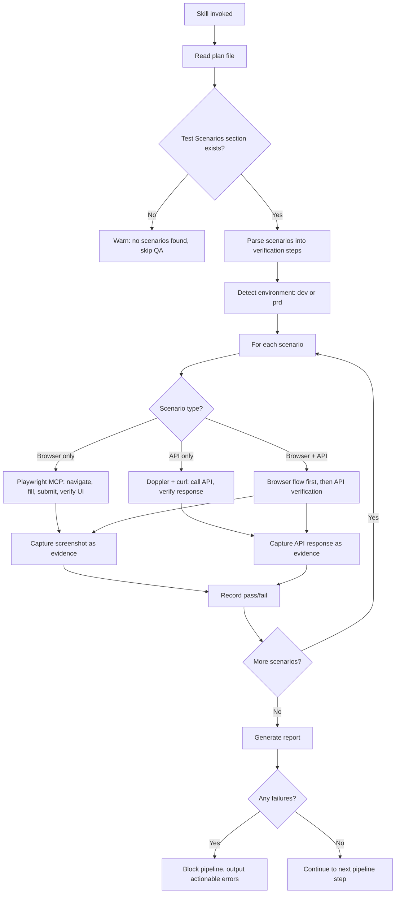

# feat: Add functional QA skill (`/soleur:qa`)

## Overview

Add a new skill (`/soleur:qa`) that performs end-to-end functional verification of features before merge. Unlike `/test-browser` (page rendering), this skill verifies that features actually work: forms submit correctly, external services receive the right data, error paths behave as expected, and data integrity holds across system boundaries.

The skill is generic (not tied to specific services), auto-derives test scenarios from the plan, and uses LLM reasoning to construct API verification calls dynamically.

## Problem Statement / Motivation

The gap was exposed during #1139 (waitlist signup form): `/test-browser` caught a broken anchor link but missed that the `pricing-waitlist` tag wasn't being assigned to Buttondown subscribers. The form appeared to work in the browser, but the external service state was wrong — only discovered via manual API verification.

Existing verification is ad hoc — embedded in individual skills (deploy health checks, token validation, drift detection) with no reusable, composable QA capability. The one-shot pipeline has no quality gate between code review and merge that verifies functional correctness.

## Proposed Solution

### Architecture: Skill + Scripts

```text
plugins/soleur/skills/qa/
├── SKILL.md                          # LLM orchestration (scenario parsing, API reasoning)
├── scripts/
│   ├── detect-environment.sh         # Auto-detect dev vs prd Doppler config
│   └── generate-report.sh           # Format pass/fail markdown report
└── references/
    └── qa-scenario-format.md         # Reference doc for plan Test Scenarios format
```

### Pipeline Integration

Insert QA as a new step in the one-shot pipeline between `resolve-todo-parallel` (step 5) and `compound` (step 6):

```text
Current pipeline:
3. work → 4. review → 5. resolve-todo-parallel → 6. compound → 7. ship

New pipeline:
3. work → 4. review → 5. resolve-todo-parallel → 5.5 QA → 6. compound → 7. ship
```

Position rationale: QA runs after all code changes are finalized (review + todo resolution) but before compound (learnings capture) and ship (merge). If QA fails, the agent can fix issues and re-run QA before proceeding.

### Flow



## Technical Considerations

### Playwright MCP vs agent-browser CLI

Per constitution.md, default to Playwright MCP tools. The existing `/test-browser` mandates agent-browser CLI, but that's a rendering-focused constraint. The QA skill needs form filling, route interception, and programmatic interaction — Playwright MCP's strengths.

**Worktree path resolution:** Playwright MCP resolves paths from the repo root, not CWD. Always use absolute paths for screenshots. The `detect-environment.sh` script can provide the correct base path.

### Doppler Integration

```bash
# Auto-detect: presence of DEPLOY_URL indicates production context
if [ -n "$DEPLOY_URL" ]; then
  CONFIG="prd"
else
  CONFIG="dev"
fi

# Get a specific secret
doppler secrets get BUTTONDOWN_API_KEY -c "$CONFIG" --plain

# Or inject all into a command
doppler run -c "$CONFIG" -- curl ...
```

The skill must handle missing Doppler secrets gracefully — warn and skip the scenario rather than failing the entire QA run. Not all features touch external services.

### LLM-Reasoned API Calls

The SKILL.md instructs the LLM to:

1. Read the test scenario description (e.g., "verify subscriber exists in Buttondown with tag pricing-waitlist")
2. Infer the service, API endpoint, method, and expected response
3. Use Doppler to get the API key (key name inferred from service name convention)
4. Construct and execute a `curl` command
5. Parse the response and compare against expectations

This is inherently non-deterministic — the LLM reasons about what to verify. The `references/qa-scenario-format.md` file provides guidance on how to write verifiable test scenarios in plans.

### Eventual Consistency

External services may not reflect changes immediately. The skill should:

1. Execute the browser action (e.g., form submit)
2. Wait a configurable delay (default: 3 seconds) before API verification
3. Retry API verification up to 3 times with exponential backoff (3s, 6s, 12s)
4. Only fail after all retries are exhausted

### Error Path Testing

Playwright route interception enables simulating network failures:

```javascript
// Via mcp__plugin_playwright_playwright__browser_evaluate
await page.route('**/api/subscribe', route => route.abort('failed'));
```

The skill tests:

- Network failure → verify graceful error message in UI
- Invalid input → verify validation errors display correctly
- Honeypot field populated → verify submission is rejected silently

### Report Format

Markdown file saved to the worktree: `qa-report-YYYY-MM-DD-HHMMSS.md`

```markdown
# QA Report

**Date:** 2026-03-26 14:30:00
**Plan:** knowledge-base/project/plans/2026-03-26-feat-example-plan.md
**Environment:** dev (localhost:8080)
**Result:** PASS (3/3 scenarios passed)

## Scenario 1: Form submission creates subscriber ✅

**Type:** Browser + API
**Browser:** Filled email field, submitted form, verified success message
**API:** GET /v1/subscribers?email=test@example.com → 200, tag: pricing-waitlist ✅
**Evidence:** [screenshot-1.png]

## Scenario 2: Invalid email shows error ✅

**Type:** Browser only
**Browser:** Filled invalid email, submitted, verified error message displayed
**Evidence:** [screenshot-2.png]
```

## Acceptance Criteria

- [ ] Skill directory created at `plugins/soleur/skills/qa/` with SKILL.md, scripts/, and references/
- [ ] SKILL.md parses plan's Test Scenarios section to derive verification steps
- [ ] Browser flows execute via Playwright MCP (form fill, submit, verify UI state)
- [ ] External service verification via LLM-reasoned `curl` commands with Doppler credentials
- [ ] Error path testing via Playwright route interception
- [ ] Pass/fail report generated with screenshots and API response evidence
- [ ] Pipeline blocks on any test failure with actionable error output
- [ ] Environment auto-detection works (dev vs prd via `detect-environment.sh`)
- [ ] One-shot pipeline updated with QA step between resolve-todo-parallel and compound
- [ ] Skill description under 1,024 characters and uses third-person format
- [ ] Cumulative skill description word count stays under 1,800 words
- [ ] README.md component counts updated
- [ ] Graceful degradation: missing Doppler secrets → skip scenario with warning
- [ ] Graceful degradation: Playwright MCP unavailable → skip browser scenarios with warning
- [ ] Graceful degradation: no Test Scenarios section in plan → skip QA with warning

## Test Scenarios

### Happy Path

- Given a plan with a Test Scenarios section containing a browser+API scenario, when QA skill runs, then it executes the browser flow via Playwright MCP, verifies external service state via API, and produces a PASS report
- Given a plan with only API verification scenarios, when QA skill runs, then it constructs curl commands with Doppler credentials and verifies responses without browser interaction
- Given a plan with error path scenarios, when QA skill runs, then it uses Playwright route interception to simulate failures and verifies graceful UI error handling

### Edge Cases

- Given a plan with no Test Scenarios section, when QA skill runs, then it warns "No test scenarios found" and skips QA without blocking the pipeline
- Given an empty Test Scenarios section, when QA skill runs, then it warns and skips (same as above)
- Given a Doppler secret that doesn't exist for the service being tested, when QA skill tries to verify, then it warns "Missing Doppler secret: X" and skips that scenario
- Given Playwright MCP is not available, when QA skill encounters a browser scenario, then it warns "Playwright MCP unavailable" and skips browser scenarios (API-only scenarios still run)
- Given the local dev server is not running, when QA skill tries to navigate, then it fails the scenario with "Server not reachable at localhost:PORT"

### Failure Handling

- Given a scenario where the API response doesn't match expectations, when QA skill verifies, then it marks the scenario as FAIL with the expected vs actual values in the report
- Given a scenario where the browser flow fails (element not found, timeout), when QA skill runs, then it captures a screenshot of the failure state and marks the scenario as FAIL
- Given eventual consistency delay, when the first API check fails, then QA retries up to 3 times with exponential backoff before marking as FAIL

### Pipeline Integration

- Given the one-shot pipeline runs with QA enabled, when QA passes, then the pipeline continues to compound and ship
- Given the one-shot pipeline runs with QA enabled, when QA fails, then the pipeline blocks and outputs actionable error information

## Domain Review

**Domains relevant:** Engineering, Product, Marketing

### Engineering (CTO)

**Status:** reviewed (carried from brainstorm)
**Assessment:** Key architectural concerns: Playwright MCP path resolution in worktrees (use absolute paths), Doppler config auto-detection pattern is well-established in the codebase, pipeline insertion point between resolve-todos and compound is correct. No new infrastructure required.

### Product/UX Gate

**Tier:** NONE
**Decision:** auto-accepted (pipeline)

No user-facing pages or UI components. This is an internal engineering capability (skill + scripts).

### Marketing (CMO)

**Status:** reviewed (carried from brainstorm)
**Assessment:** New skill adds to plugin capability count (semver:minor). The "autonomous QA" capability strengthens the autonomous engineering pipeline positioning. No immediate content action required — update landing page stats automatically via data files.

## Dependencies & Risks

### Dependencies

- Playwright MCP server must be available for browser scenarios
- Doppler CLI must be installed and configured for API verification
- Local dev server must be running for browser scenarios
- Plan must have a Test Scenarios section (new convention for plan skill)

### Risks

| Risk | Impact | Mitigation |
|------|--------|------------|
| LLM API reasoning produces wrong curl command | False pass/fail | Include scenario format guidance in references/, cross-check with second verification method |
| Eventual consistency causes false failures | Pipeline blocks unnecessarily | Retry with exponential backoff (3 attempts) |
| QA takes too long for complex features | Slows pipeline | Sequential execution is fine for now; add parallelism (sub-agents) only if latency becomes a problem |
| Playwright MCP not installed in CI | QA skipped silently | Graceful degradation with clear warning |

## References & Research

### Internal References

- Existing browser testing: `plugins/soleur/skills/test-browser/SKILL.md`
- One-shot pipeline: `plugins/soleur/skills/one-shot/SKILL.md:98-113`
- Deploy health check pattern: `plugins/soleur/skills/deploy/scripts/deploy.sh`
- Doppler usage patterns: `.github/workflows/scheduled-terraform-drift.yml`, `.github/workflows/infra-validation.yml`
- Skill compliance: `plugins/soleur/AGENTS.md` (Skill Compliance Checklist)

### Learnings Applied

- Negative-space testing (CSRF learning): test for absence of expected state
- Verification commands can lie (KB migration learning): cross-check with second method
- Playwright path resolution (screenshots learning): absolute paths in worktrees
- External platform verification (distribution strategy learning): live API > code inspection
- Silent logic errors (Supabase auth learning): test dual-purpose APIs
- Timer/session cleanup (Bun segfault learning): teardown browser sessions

### Related Issues

- #1146: Original feature request
- #1139: Waitlist signup gap that motivated this feature
- #1143: CSP header gap found during #1139 review

## Implementation Phases

### Phase 1: Skill Skeleton + Environment Detection

**Files to create:**

- `plugins/soleur/skills/qa/SKILL.md` — Frontmatter + basic orchestration structure
- `plugins/soleur/skills/qa/scripts/detect-environment.sh` — Auto-detect dev vs prd
- `plugins/soleur/skills/qa/references/qa-scenario-format.md` — Guide for writing verifiable test scenarios

**Verification:** Skill appears in `/soleur:help` output, `detect-environment.sh` correctly returns `dev` or `prd`

### Phase 2: Core QA Logic in SKILL.md

**SKILL.md sections to implement:**

1. Plan parsing — read plan file, extract Test Scenarios section
2. Scenario classification — browser-only, API-only, browser+API
3. Browser flow execution — Playwright MCP navigate, fill, submit, verify
4. API verification — Doppler credential injection, curl construction, response parsing
5. Error path testing — Playwright route interception
6. Graceful degradation — handle missing prerequisites

### Phase 3: Report Generation + Pipeline Integration

**Files to create/modify:**

- `plugins/soleur/skills/qa/scripts/generate-report.sh` — Format pass/fail report
- `plugins/soleur/skills/one-shot/SKILL.md` — Insert QA step (step 5.5)

**Verification:** One-shot pipeline includes QA step, report generates correctly

### Phase 4: Compliance + Documentation

**Files to modify:**

- `README.md` — Update skill count
- Run `bun test plugins/soleur/test/components.test.ts` — Verify description word count
- Verify all reference files are properly linked in SKILL.md
