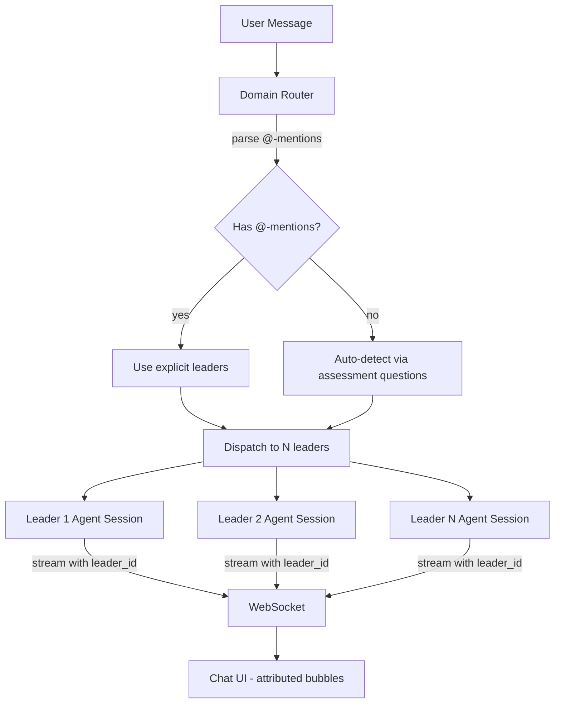
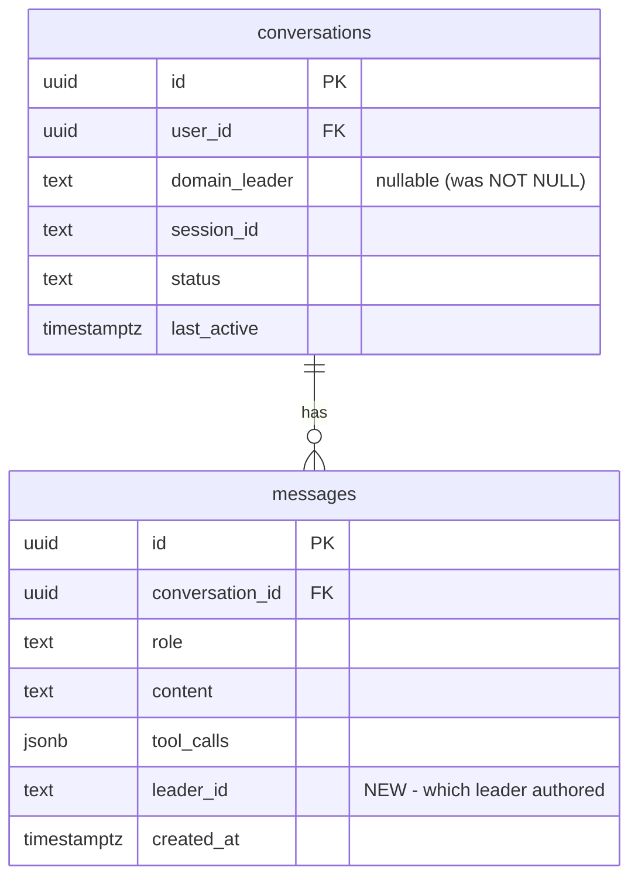

# feat: Tag-and-Route UX Model (#1059)

## Overview

Replace the "department offices" chat model (8 leader cards → dedicated chat pages) with a "command center" model where domain leaders are contextually routed to the founder via auto-detection and @-mentions. Multiple leaders can respond in the same conversation thread as separate attributed message bubbles.

## Problem Statement

The current web platform has single-leader coupling at every layer:

| Layer | Current Coupling | File |
|-------|-----------------|------|
| Database | `conversations.domain_leader NOT NULL` + CHECK constraint | `supabase/migrations/001_initial_schema.sql:49-50` |
| Types | `Conversation.domain_leader: DomainLeaderId` required | `lib/types.ts:54` |
| WebSocket | `start_session` requires `leaderId` | `lib/types.ts:18` |
| Agent runner | `startAgentSession()` takes single `leaderId`, builds single-leader system prompt | `server/agent-runner.ts:237-240,286` |
| WS handler | `createConversation()` requires `leaderId` | `server/ws-handler.ts:96-98` |
| Dashboard UI | Grid of 8 cards, each linking to `/dashboard/chat/new?leader={id}` | `app/(dashboard)/dashboard/page.tsx:24-42` |
| Chat UI | Reads `?leader=` param, shows single leader in header | `app/(dashboard)/dashboard/chat/[conversationId]/page.tsx:13,22` |
| WS client | `startSession(leaderId: DomainLeaderId)` required | `lib/ws-client.ts:261-265` |

This forces the founder to know which department to visit before asking a question, prevents multi-domain conversations, and provides no page context to leaders.

## Proposed Solution

**Meta-Router Pattern:** A server-side routing layer analyzes each user message against the brainstorm domain-config assessment questions to select 1-N relevant leaders. Each leader responds as a separate message bubble. The routing logic already exists in the CLI plugin (`plugins/soleur/skills/brainstorm/references/brainstorm-domain-config.md`) — this feature ports it to the web platform.

## Technical Approach

### Architecture



### ERD — Schema Changes



**Review simplifications applied:** Dropped `conversation_leaders` junction table (leader participation is derivable via `SELECT DISTINCT leader_id FROM messages`). Dropped `context_path`/`context_type` columns (context passed transiently via WebSocket, not persisted — it goes stale when the user navigates).

### Implementation Phases

#### Phase 1: Data Model + Types (Foundation)

No UI changes. Backend becomes multi-leader-ready.

**1.1 Schema migration** (`supabase/migrations/010_tag_and_route.sql`):

```sql
-- Make domain_leader nullable (remove NOT NULL + CHECK)
ALTER TABLE public.conversations
  ALTER COLUMN domain_leader DROP NOT NULL;
ALTER TABLE public.conversations
  DROP CONSTRAINT IF EXISTS conversations_domain_leader_check;

-- Add leader attribution to messages
ALTER TABLE public.messages
  ADD COLUMN leader_id text;
```

**1.2 TypeScript types** (`lib/types.ts`):

- `Conversation.domain_leader` → `DomainLeaderId | null`
- `Message.leader_id?: DomainLeaderId` (new field)
- `WSMessage` `start_session` → `leaderId` becomes optional, add `context?: { path: string; type: string; content?: string }`
- Stream messages: `leaderId: DomainLeaderId` **required** (not optional) — needed for multiplexing parallel leader streams
- Add `| { type: "stream_start"; leaderId: DomainLeaderId }` and `| { type: "stream_end"; leaderId: DomainLeaderId }` — per-leader stream lifecycle events for initializing/finalizing message bubbles

**1.3 Update existing code for nullable domain_leader:**

- `ws-handler.ts:createConversation()` → `leaderId` param becomes optional
- `agent-runner.ts:sendUserMessage()` → handle `conv.domain_leader` being null
- `agent-runner.ts:startAgentSession()` → accept optional `leaderId`
- All Supabase queries selecting `domain_leader` → handle null

**Success criteria:** Existing single-leader flow still works. All tests pass. New migration applies cleanly.

#### Phase 2: Domain Router (Routing Logic)

**2.1 Create routing module** (`server/domain-router.ts`):

```typescript
interface RouteResult {
  leaders: DomainLeaderId[];
  reason: string; // human-readable routing explanation
  source: "auto" | "mention"; // how leaders were selected
}

// Port from brainstorm-domain-config.md assessment questions
const DOMAIN_ASSESSMENT: Record<DomainLeaderId, string> = {
  cmo: "Does this involve content, brand, SEO, pricing, or marketing?",
  cto: "Does this require architectural decisions or technical assessment?",
  cfo: "Does this involve budgeting, revenue, or financial planning?",
  cpo: "Does this involve product strategy, specs, UX, or competitive analysis?",
  cro: "Does this involve sales, pipeline, outbound, or deal negotiation?",
  coo: "Does this involve operations, vendors, tools, or expense tracking?",
  clo: "Does this involve legal documents, compliance, or privacy?",
  cco: "Does this involve support, community, or customer engagement?",
};

export async function routeMessage(
  message: string,
  context?: { path?: string; type?: string; content?: string },
  apiKey: string,
): Promise<RouteResult>;

export function parseAtMentions(message: string): DomainLeaderId[];
```

**2.2 @-mention parser:**

- Parse `@CMO`, `@cmo`, `@CTO` etc. from message text
- Case-insensitive matching against `DOMAIN_LEADERS[].id` and `DOMAIN_LEADERS[].name`
- Return matched leader IDs
- If any @-mentions found, return only those leaders (override auto-detection)

**2.3 Auto-detection:**

- Use Claude API call with the assessment questions as a classification prompt
- Input: user message + optional context
- Output: ranked list of relevant leader IDs
- Cap at 3 leaders max per message to avoid cacophony
- Use the user's own BYOK API key for the routing call

**Success criteria:** Given "What's the GDPR impact on our pricing?", router returns `[cmo, clo]`. Given "@CTO fix the build", router returns `[cto]`.

#### Phase 3: Agent Runner Refactor (Multi-Leader Support)

**3.1 Multi-leader dispatch** (`server/agent-runner.ts`):

- New function `dispatchToLeaders(userId, conversationId, leaders, message, context)`:
  - For each leader, call `startAgentSession()` (possibly in parallel via `Promise.allSettled`)
  - Each session gets: conversation history, artifact context (from `context.content`), leader-specific system prompt
  - Stream responses tagged with `leader_id`

- Modify `startAgentSession()` signature:
  - Accept optional `contextContent: string` for artifact injection into system prompt
  - Stream messages include `leader_id` in the payload

- Modify `sendUserMessage()`:
  - Call `routeMessage()` to determine leaders
  - Call `dispatchToLeaders()` instead of single `startAgentSession()`

**3.2 Message persistence:**

- `saveMessage()` accepts optional `leaderId` parameter
- Each leader's response saved with `leader_id` column set

**3.3 Context injection:**

- When `context.content` is provided, prepend to system prompt:

  ```text
  The user is currently viewing: ${context.path}

  Artifact content:
  ${context.content}

  Answer in the context of this artifact.
  ```

**3.4 Per-leader stream lifecycle:**

- Before each leader starts streaming, send `stream_start` with `leaderId` to client
- Client creates a new message bubble for that leader
- All `stream` chunks include `leaderId` (required field)
- After each leader completes, send `stream_end` with `leaderId`
- This prevents interleaved chunks from garbling multi-leader output

**Success criteria:** A single user message can trigger parallel responses from multiple leaders, each persisted with attribution.

#### Phase 4: WebSocket Protocol Changes

**4.1 Server-side** (`server/ws-handler.ts`):

- `start_session` handler:
  - `leaderId` becomes optional
  - Accept `context?: { path: string; type: string; content?: string }` field
  - If no `leaderId` and no context, create a "general" conversation (routing happens on first message)
  - Store context in conversation record

- `chat` handler:
  - Before forwarding to `sendUserMessage`, pass conversation context
  - `sendUserMessage` now handles routing internally

- Stream messages:
  - All `stream` messages include required `leaderId` field
  - `stream_start` / `stream_end` lifecycle events per leader

**4.2 Client-side** (`lib/ws-client.ts`):

- `startSession()` → accepts optional `leaderId` + optional `context`
- `ChatMessage` type → add `leaderId: DomainLeaderId` field
- **Critical: Replace single `streamIndexRef` with `Map<DomainLeaderId, number>`** — one tracking index per active leader stream. Without this, parallel leader streams produce garbled output.
- Handle `stream_start` → create new message bubble for that leader, record index in map
- Handle `stream` → use `leaderId` to look up correct bubble index, append content
- Handle `stream_end` → finalize bubble, remove from active streams map

**Success criteria:** Client can start sessions without specifying a leader. Stream messages are correctly attributed. Multiple leader streams don't interfere.

#### Phase 5: UI Components

**5.1 Message attribution** (`app/(dashboard)/dashboard/chat/[conversationId]/page.tsx`):

- `MessageBubble` component:
  - Accept `leaderId?: DomainLeaderId` prop
  - Show leader name + avatar/icon for assistant messages
  - Use domain color coding (reuse from docs site CSS variables)
  - User messages remain right-aligned, no change

**5.2 @-mentions (plain text — autocomplete deferred):**

- @-mentions work as plain text (e.g., user types "@CLO" manually)
- Server-side parsing handles routing override
- Autocomplete dropdown deferred to follow-up — plain text suffices for P1

**5.3 Chat sidebar — DEFERRED:**

Sidebar is deferred to a follow-up PR. Validate the core routing hypothesis with full-page chat first. The sidebar adds an entire parallel UI surface (layout restructuring, context passing via React context, state synchronization, navigation persistence) that is not needed to prove routing works.

**5.4 Dashboard transformation** (`app/(dashboard)/dashboard/page.tsx`):

- Replace 8-card grid with command center layout:
  - Primary: chat input (centered, prominent)
  - Secondary: leader discovery (collapsible section below, or sidebar nav)
  - Keep leaders visible for discoverability but not as primary navigation
- Update heading from "Choose a domain leader" to "Command Center" or similar

**5.5 KB viewer context injection:**

- When starting a new conversation from the KB viewer, capture:
  - Artifact path (from URL/route)
  - Artifact content (from rendered page data)
  - Page type: "kb-viewer"
- Pass as `context` in `start_session` message
- Context is transient (WebSocket message field), not persisted to DB

**Success criteria:** Leader names and colors appear on assistant messages. @-mentions work as plain text. Dashboard shows chat-first layout.

### Deferred to follow-up PRs

- Chat sidebar (collapsible panel on every page)
- @-mention autocomplete dropdown
- `routing_info` status pill (leader attribution on bubbles is sufficient)
- `conversation_leaders` junction table (DISTINCT query on messages suffices)
- `context_path`/`context_type` DB columns (transient WebSocket context suffices)

## Alternative Approaches Considered

1. **Router Agent Pattern:** Single meta-agent consolidates responses. Rejected: loses multi-voice UX and doesn't match "organization" brand metaphor.
2. **Progressive Enhancement:** Build incrementally across P1/P2/P3. Rejected: three migration steps create throwaway UX. User chose full implementation.

## Acceptance Criteria

### Functional Requirements

- [ ] Founder can start a conversation from the dashboard without selecting a specific leader
- [ ] Founder can start a conversation from the KB viewer with artifact context auto-injected
- [ ] System auto-detects relevant leaders from message content and responds with attributed bubbles
- [ ] Founder can use @-mentions (e.g., @CLO) to override auto-detection
- [ ] Multiple leaders can respond in the same conversation thread
- [ ] Each assistant message shows the responding leader's name and visual identity
- [ ] Existing single-leader conversations continue to work (backward compatibility)

### Non-Functional Requirements

- [ ] Routing call adds < 2s latency to first response
- [ ] Multi-leader responses stream in parallel (not sequentially blocked)
- [ ] Schema migration is backward-compatible (no data loss for existing conversations)

### Quality Gates

- [ ] All existing WebSocket tests pass with protocol changes
- [ ] New tests cover: routing logic, @-mention parsing, multi-leader streaming, sidebar open/close
- [ ] Migration tested against empty DB and DB with existing conversations

## Test Scenarios

### Acceptance Tests

- Given a user on the dashboard, when they type "What's our marketing strategy?" and send, then the system auto-routes to CMO and CMO responds with attributed bubble
- Given a user types "@CTO @CLO review this architecture", when sent, then only CTO and CLO respond (auto-detection overridden)
- Given a user on the KB viewer viewing `roadmap.md`, when they open sidebar chat and ask "What's the status of P1?", then leaders receive the roadmap content as context
- Given a sidebar conversation, when user clicks "expand", then the conversation moves to full-page view with full history

### Edge Cases

- Given a message that matches zero domains, when auto-detecting, then route to a default leader (CPO as general advisor) with explanation
- Given a message with an invalid @-mention (e.g., @XYZ), when sent, then ignore the invalid mention and auto-detect normally
- Given 3+ leaders responding simultaneously, when streaming, then all streams are correctly attributed and don't interleave within a single bubble

## Dependencies & Prerequisites

- Multi-turn conversations (#1044): **MERGED** — persistent sessions are available
- No external dependencies or new packages required
- Domain leader definitions already exist in `server/domain-leaders.ts`

## Risk Analysis & Mitigation

| Risk | Severity | Mitigation |
|------|----------|------------|
| Routing accuracy in free-form conversation | Medium | @-mention override as escape hatch; iterative tuning of assessment prompts |
| Latency from routing + multi-leader dispatch | Medium | Cap at 3 leaders per message; parallel dispatch via Promise.allSettled |
| Cost of routing API call per message | Low | Use fast model (Haiku) for routing classification; small prompt |
| Schema migration breaks existing data | Low | All new columns nullable; no data modification; migration is additive |
| Sidebar + full page state synchronization | Medium | Share WebSocket connection via React context; single source of truth |

## Domain Review

**Domains relevant:** Engineering, Product, Marketing

### Engineering (CTO)

**Status:** reviewed
**Assessment:** Every layer has hard-coded single-leader assumptions. Multi-turn dependency resolved. Schema migration safe before beta. Brainstorm domain-config routing pattern is the right server-side model. Key risk: multi-leader parallel streaming adds WebSocket complexity.

### Marketing (CMO)

**Status:** reviewed
**Assessment:** HIGH concern — "departments" metaphor baked into all content. "Choose a domain leader" copy describes deprecated UX. Opportunity: "One command center" is stronger positioning. All public surfaces must be updated at ship. SEO keyword continuity check needed.

### Product/UX Gate

**Tier:** blocking
**Decision:** reviewed
**Agents invoked:** spec-flow-analyzer, cpo
**Pencil available:** pending

#### Findings

New user-facing pages (command center dashboard, chat sidebar) and significant UX paradigm shift require wireframes before implementation. The spec-flow-analyzer and CPO assessments are carried forward from the brainstorm. Key product concerns:

- Auto-detection accuracy must be high enough to build trust (false routing erodes confidence)
- "Command center" framing must be reflected in dashboard copy
- Leader discoverability must not be lost when cards are removed

**UX Gate:** Wireframes should be created before Phase 5 implementation begins. Phases 1-4 (backend) can proceed independently.

## References

### Internal

- Brainstorm: `knowledge-base/project/brainstorms/2026-03-27-tag-and-route-brainstorm.md`
- Spec: `knowledge-base/project/specs/feat-tag-and-route/spec.md`
- Domain config (routing source): `plugins/soleur/skills/brainstorm/references/brainstorm-domain-config.md`
- Domain leaders: `apps/web-platform/server/domain-leaders.ts`
- Current schema: `apps/web-platform/supabase/migrations/001_initial_schema.sql`
- Agent runner: `apps/web-platform/server/agent-runner.ts`
- WebSocket handler: `apps/web-platform/server/ws-handler.ts`
- WebSocket client: `apps/web-platform/lib/ws-client.ts`
- Dashboard: `apps/web-platform/app/(dashboard)/dashboard/page.tsx`
- Chat page: `apps/web-platform/app/(dashboard)/dashboard/chat/[conversationId]/page.tsx`
- Layout: `apps/web-platform/app/(dashboard)/layout.tsx`

### Related Issues

- #1059 — Tag-and-route UX model
- #1044 — Multi-turn conversation continuity (MERGED)
