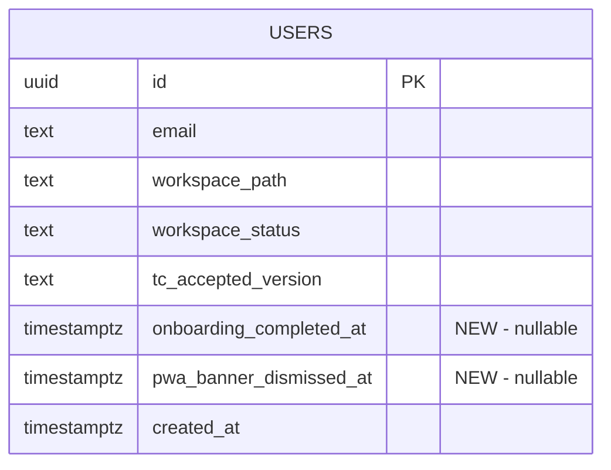

# feat: Add first-time onboarding walkthrough

## Overview

Add a lightweight first-time onboarding experience to the Command Center dashboard: welcome card with brand-voice copy, pulsing @-mention hint, and iOS Safari PWA install banner. DB-backed state persists across devices. No tour library.

## Problem Statement / Motivation

New users land on the dashboard with no guided path to the activation moment: sending an @-mention message to a domain leader. The existing UX (suggested prompts, hint text, leader strip) provides passive discovery but no active nudge.

Phase 2 (Secure for Beta) is 13/14 complete. This is the last open item.

## Proposed Solution

Three components, no tour library:

1. **Welcome Card** — above chat input on first visit. One declarative sentence in brand voice. Auto-dismisses when user sends first message.
2. **Pulsing @-Mention Hint** — CSS pulse on the "Type @ to mention a specific leader" text. Stops after first @-mention.
3. **iOS PWA Install Banner** — dismissible callout for iOS Safari users. Remembers dismissal in DB.

State: `onboarding_completed_at` and `pwa_banner_dismissed_at` nullable timestamp columns on users table.

## Technical Considerations

### Data Model



### Architecture

```text
Dashboard Page (page.tsx)
├── WelcomeCard              ← NEW: above chat input
├── ChatInput                ← existing: triggers onboarding completion
├── AtMentionDropdown        ← existing: no changes
├── @-mention hint text      ← existing: add conditional pulse class
├── PwaInstallBanner         ← NEW: iOS Safari only
├── Suggested Prompts        ← existing: no changes
└── Leader Strip             ← existing: no changes
```

State flow: page mounts → fetch user row → conditionally render onboarding UI → on first message: update DB, hide card/pulse → on PWA dismiss: update DB, hide banner.

### Resolved Flow Gaps (from spec-flow analysis)

| # | Gap | Resolution |
|---|-----|------------|
| 1 | Pulse and card have independent triggers — pulse could animate after card gone in same session | Tie both to `onboarding_completed_at`. Setting it hides card AND stops pulse. No separate pulse state. |
| 2 | Race: user sends before user row fetch completes | Initialize onboarding UI as hidden. Only show after fetch resolves. |
| 3 | Card + banner stacking on small iOS viewport | PWA banner renders below suggested prompts, not above chat input. Only card is above input. |

DB write failures (card and banner): fire-and-forget. Message/dismiss works locally, card/banner reappears on next visit if write fails. Acceptable degradation.

### Approved Copy (from copywriter agent)

- **Welcome card headline:** "Your Organization Is Ready"
- **Welcome card body:** "Eight department leaders are standing by. Type @ to put one to work."
- **@-mention hint:** Keep existing "Type @ to mention a specific leader" (brand-aligned, no change needed)
- **PWA banner headline:** "Add Soleur to Your Home Screen"
- **PWA banner body:** "Open on any device, no app store needed. Tap the Share icon, then 'Add to Home Screen.'"

Voice check: general register, declarative, zero prohibited words. Confirmed brand-aligned.

### Implementation Phases

#### Phase 1: Database Migration

- Create `apps/web-platform/supabase/migrations/012_onboarding_state.sql`
- `ALTER TABLE public.users ADD COLUMN onboarding_completed_at timestamptz;`
- `ALTER TABLE public.users ADD COLUMN pwa_banner_dismissed_at timestamptz;`
- Nullable by design — null means "not yet completed/dismissed"
- No RLS changes needed — table-level SELECT/UPDATE policies already cover all columns

#### Phase 2: Welcome Card + Pulse

- Create `apps/web-platform/components/chat/welcome-card.tsx`
  - Approved copy: "Your Organization Is Ready" / "Eight department leaders are standing by. Type @ to put one to work."
  - Tailwind: dark theme, amber-500 accent, neutral-900 bg
  - Positioned between hero heading and chat input
- Modify `apps/web-platform/app/(dashboard)/dashboard/page.tsx`:
  - Fetch `onboarding_completed_at` and `pwa_banner_dismissed_at` on mount via `createClient()` from `@/lib/supabase/client` (matches existing client-side Supabase pattern used in settings, billing pages)
  - Keep onboarding UI hidden until fetch resolves (per gap #2)
  - Render `<WelcomeCard />` when `onboarding_completed_at` is null
  - Add conditional `animate-pulse` class to hint `<span>` when `onboarding_completed_at` is null (same boolean — per gap #1)
  - On `handleSend`, if onboarding not completed: fire-and-forget DB update, then navigate
  - Inline `console.debug('[onboarding]', 'first_message_sent')` at the update call site — no analytics abstraction
- Test: `apps/web-platform/test/welcome-card.test.tsx` + additions to `dashboard-page.test.tsx`

#### Phase 3: iOS PWA Install Banner

- Create `apps/web-platform/components/chat/pwa-install-banner.tsx`
- iOS Safari detection: UA check for iPhone/iPad + Safari, excluding CriOS/FxiOS/etc.
- Render below suggested prompts (per gap #3 — not above chat input) when iOS Safari AND `pwa_banner_dismissed_at` is null
- Dismiss button: fire-and-forget DB update, hide banner locally
- Approved copy: "Add Soleur to Your Home Screen" / "Open on any device, no app store needed."
- Inline `console.debug` for `pwa_banner_shown` and `pwa_banner_dismissed`
- Test: `apps/web-platform/test/pwa-install-banner.test.tsx`

#### Phase 4: Testing & QA

- All component tests pass (`bun test`)
- Browser QA via Playwright MCP: new user flow, returning user flow, iOS simulation
- Responsive check: mobile, tablet, desktop breakpoints
- Verify Supabase migration applied (REST API query)

## Acceptance Criteria

- [ ] First-time user sees welcome card above chat input
- [ ] Welcome card copy follows brand guide voice
- [ ] Welcome card auto-dismisses on first message sent
- [ ] @-mention hint pulses on first visit, stops when first message sent (same trigger as card dismiss)
- [ ] iOS Safari user sees PWA banner; dismissal persists across sessions
- [ ] Non-iOS user does not see PWA banner
- [ ] `onboarding_completed_at` set in DB when first message sent
- [ ] `pwa_banner_dismissed_at` set in DB when PWA banner dismissed
- [ ] No tour library in `package.json`
- [ ] Returning user sees no card, no pulse
- [ ] Supabase calls destructure `{ error }` (per learning)
- [ ] Components responsive across mobile/tablet/desktop

## Test Scenarios

### Acceptance Tests (RED phase targets)

- Given new user (no `onboarding_completed_at`), when dashboard loads, then welcome card visible and hint pulses
- Given new user sends first message, when submitted, then card disappears and `onboarding_completed_at` set
- Given returning user (`onboarding_completed_at` set), when dashboard loads, then no card, no pulse
- Given iOS Safari user on first visit, when dashboard loads, then PWA banner visible
- Given non-iOS user, when dashboard loads, then no PWA banner
- Given iOS user dismisses banner, when they return, then banner stays hidden
- Given user clears browser, logs in on new device, then DB state preserved

### Edge Cases

- Given user navigates away before sending, when they return, then card reappears
- Given user sends empty message (rejected by validation), then card stays visible

### Integration Verification

- **Browser:** Dashboard as new user → verify card → send message → verify card gone
- **Browser:** Dashboard as returning user → verify no card
- **API:** `curl "${SUPABASE_URL}/rest/v1/users?select=onboarding_completed_at&id=eq.${USER_ID}"` expects non-null after first message

## Success Metrics

Measurable when analytics platform ships (#1063):

- Activation rate: % of new users who send first message within first session
- Time to first message: median seconds from dashboard load to first message
- PWA install rate: % of iOS Safari users who install (informational)

## Dependencies & Risks

| Dependency | Risk | Mitigation |
|-----------|------|------------|
| Supabase migration applied to production | Missing column → query error | Post-merge REST API verification (AGENTS.md gate) |
| Copywriter copy approved | Blocks Phase 2 | Done — copy approved (see Approved Copy section) |
| iOS Safari UA detection | UA string changes | Use established patterns; test with current UA strings |

## Domain Review

**Domains relevant:** Product, Marketing

### Marketing (CMO)

**Status:** reviewed
**Assessment:** Copy must use general register per brand guide. Welcome card, @-mention hint, and PWA banner all need copywriter-produced copy before implementation. Pulsing animation must feel like "glow, not bounce" per brand motion guidelines ("subtle, purposeful — no bouncing or playful animations"). CMO recommends conversion-optimizer or ux-design-lead for visual layout review. No external marketing action needed (audience <10 invited founders). Key question: use pain-point framing ("Stop hiring, start delegating") or memory-first framing ("The AI that already knows your business") — pick one and validate qualitatively.

### Product/UX Gate

**Tier:** blocking
**Decision:** reviewed
**Agents invoked:** spec-flow-analyzer, cpo, ux-design-lead, copywriter
**Skipped specialists:** none
**Pencil available:** yes

#### Findings

**CPO:** No product strategy concerns. Scope correctly minimal. Copy gate is highest-risk item — must not be skipped. Analytics placeholder appropriate for pre-beta. Recommends treating onboarding as effectively must-pass (activation rate is the key metric for P4 validation).

**Spec Flow Analyzer:** Identified 7 gaps (resolved in plan — see "Resolved Flow Gaps" table above). Critical: (1) pulse/card trigger coupling, (2) DB failure handling, (4) fetch-before-render race, (5) card+banner viewport stacking.

**Copywriter:** Complete. Welcome card: "Your Organization Is Ready / Eight department leaders are standing by. Type @ to put one to work." @-mention hint: keep existing (brand-aligned). PWA banner: "Add Soleur to Your Home Screen / Open on any device, no app store needed."

**UX Design Lead:** Complete. Wireframes in `knowledge-base/product/design/onboarding/onboarding-walkthrough.pen` with screenshots: new user desktop, iOS Safari (card + banner stacking), returning user (no onboarding UI).

## Institutional Learnings Applied

- **Supabase silent errors** — destructure `{ error }` on all calls
- **Column-level grants** — table-level RLS covers new columns, no changes needed
- **`backdrop-filter` positioning** — welcome card uses normal flow, not fixed
- **UX review gap** — BLOCKING gate enforces wireframes + copy before code
- **Analytics operationalization** — tracked separately for Plausible goals + legal docs
- **Responsive testing** — verify all three breakpoints before shipping

## References

- Spec: `knowledge-base/project/specs/feat-onboarding-walkthrough/spec.md`
- Brainstorm: `knowledge-base/project/brainstorms/2026-04-03-onboarding-walkthrough-brainstorm.md`
- Dashboard: `apps/web-platform/app/(dashboard)/dashboard/page.tsx`
- Chat input: `apps/web-platform/components/chat/chat-input.tsx`
- Initial schema: `apps/web-platform/supabase/migrations/001_initial_schema.sql`
- Issue: [#1375](https://github.com/jikig-ai/soleur/issues/1375)
- PR: [#1451](https://github.com/jikig-ai/soleur/pull/1451) (draft)
