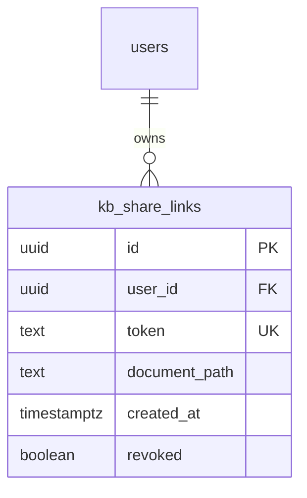

# KB Document Sharing

## Overview

Add link-based read-only sharing of individual knowledge base documents with external users. Shared pages display full document content with a non-blocking CTA banner that adapts to the product state (create account if open signups, join waitlist if not). Owners can revoke shared access at any time.

This is the first feature introducing unauthenticated access to user-owned data — a fundamental auth boundary change requiring careful security design.

## Problem Statement

Soleur users produce high-value KB artifacts (brand guides, competitive analyses, roadmaps) but have no way to share them externally. This limits organic discovery and prevents the product-led growth loop where shared artifacts demonstrate value to potential users before asking for commitment.

## Proposed Solution

Database-backed share tokens with public API routes that bypass Supabase cookie auth. A `shared_links` table stores token → document mappings with revocation support. A new `/shared/[token]` page renders the document with Soleur branding and a CTA banner. Owners manage shares via inline controls in the KB viewer and a dedicated sharing dashboard.

## Technical Approach

### Architecture

```text
┌─────────────────────────────────────────────────────┐
│ Owner (authenticated)                               │
│                                                     │
│  KB Viewer → Share Button → POST /api/kb/share      │
│                               ↓                     │
│                        shared_links table            │
│                        (token, user_id, path,        │
│                         created_at, revoked)         │
│                               ↓                     │
│  Sharing Dashboard ← GET /api/kb/share (list)       │
│                    ← DELETE /api/kb/share/[token]    │
└─────────────────────────────────────────────────────┘

┌─────────────────────────────────────────────────────┐
│ External Viewer (unauthenticated)                   │
│                                                     │
│  /shared/[token] → GET /api/shared/[token]          │
│                      ↓                              │
│               Validate token (not revoked)           │
│                      ↓                              │
│               Resolve owner's workspace_path         │
│                      ↓                              │
│               Read KB file via kb-reader.ts          │
│                      ↓                              │
│               Render document + CTA banner           │
└─────────────────────────────────────────────────────┘
```

### ERD



### Implementation Phases

#### Phase 1: Database & Auth Foundation

**Tasks:**

1.1. Create migration `017_kb_share_links.sql`:

- `kb_share_links` table with columns: `id` (uuid PK), `user_id` (uuid FK → users ON DELETE CASCADE), `token` (text UNIQUE), `document_path` (text, relative to `knowledge-base/` within workspace), `created_at` (timestamptz), `revoked` (boolean default false)
- **CASCADE on user_id FK** — when a user deletes their account, all their share links are automatically cleaned up
- **document_path convention:** Store paths relative to the `knowledge-base/` directory (e.g., `product/roadmap.md`), NOT absolute paths. The public endpoint reconstructs the full path as `join(workspace_path, "knowledge-base", document_path)`.
- RLS: enable on table
- SELECT/INSERT/UPDATE/DELETE policies scoped to `auth.uid() = user_id` for owner operations
- **No anon SELECT policy** — public access uses service-role client, not RLS bypass
- Index on `token` for fast lookups
- Index on `user_id` for dashboard queries
- **Gotcha (learning):** Do NOT add table-level grants. Use restrictive per-column grants if needed. Table-level grants subsume column-level revokes silently.

1.2. Add public paths to `lib/routes.ts`:

- Add `/shared` to `PUBLIC_PATHS`
- **Gotcha (learning):** Use exact-or-prefix-with-slash matching (`pathname === p || pathname.startsWith(p + "/")`), not bare `startsWith`. Bare `startsWith` creates auth bypass for any route sharing a prefix.

1.3. Add rate limiting for public share endpoints:

- Reuse `SlidingWindowCounter` from `server/rate-limiter.ts`
- Configure: 60 requests/minute per IP for GET `/api/shared/[token]`
- **Gotcha (learning):** Extract IP via `cf-connecting-ip` header. Never trust `x-forwarded-for` as fallback — absence of `cf-connecting-ip` means traffic bypassed Cloudflare.

**Files:** `apps/web-platform/supabase/migrations/017_kb_share_links.sql`, `apps/web-platform/lib/routes.ts`, `apps/web-platform/server/rate-limiter.ts`

#### Phase 2: Core Sharing API

**Tasks:**

2.1. Create `POST /api/kb/share` (authenticated):

- Input: `{ documentPath: string }`
- **One share per document:** If an active (non-revoked) share already exists for this document, return the existing token instead of creating a new one. Revoke is permanent — if a revoked share exists, create a new token (simpler model, no re-activation state).
- Generate cryptographically random token (32 bytes, base64url) for new shares only
- Validate `documentPath` exists in user's workspace via `isPathInWorkspace()` check
- Insert into `kb_share_links` with user's `user_id`
- Return: `{ token, url: "/shared/{token}" }`
- CSRF: Add `validateOrigin()` + `rejectCsrf()` per existing pattern
- **Gotcha (learning):** `csrf-coverage.test.ts` will fail if this POST route lacks CSRF protection and is not in `EXEMPT_ROUTES`. Add CSRF protection, do NOT exempt.

2.2. Create `GET /api/kb/share` (authenticated):

- Return all share links for the authenticated user
- Include: token, documentPath, createdAt, revoked status
- Used by the sharing dashboard

2.3. Create `DELETE /api/kb/share/[token]` (authenticated):

- Set `revoked = true` on the share link (soft delete)
- Verify ownership via `auth.uid() = user_id`
- CSRF protection required

2.4. Create `GET /api/shared/[token]` (public, unauthenticated):

- Look up token in `kb_share_links` using service-role Supabase client (no `auth.uid()`)
- If token not found → 404
- If token revoked → 410 Gone
- Resolve owner's `workspace_path` from `users` table via service client
- **If workspace disconnected** (workspace_path empty or user deleted) → 404 "Document no longer available"
- Construct `kbRoot = join(workspace_path, "knowledge-base")`, then read via `kb-reader.ts:readContent(kbRoot, document_path)`
- **Security:** The `document_path` from the share record is the ONLY path used — do NOT accept path parameters from the request. `isPathInWorkspace()` validates the constructed path stays within `kbRoot`.
- **XSS prevention:** Sanitize rendered HTML output with DOMPurify or equivalent. Add `rel="nofollow noopener"` to all outbound links in rendered markdown. Shared documents may contain arbitrary markdown — treat as untrusted input.
- Apply rate limiting (Phase 1.3)
- Return: rendered markdown content + document metadata

**Files:** `apps/web-platform/app/api/kb/share/route.ts`, `apps/web-platform/app/api/kb/share/[token]/route.ts`, `apps/web-platform/app/api/shared/[token]/route.ts`

#### Phase 3: UI — Share Button & Shared Viewer

**Tasks:**

3.1. Add Share button to KB viewer header:

- Location: `apps/web-platform/app/(dashboard)/dashboard/kb/[...path]/page.tsx` lines 99-125, next to "Chat about this" button
- On click: open share popover

3.2. Create share popover component:

- States: no share exists → "Generate link" button; share active → show URL, copy button, revoke button
- Copy to clipboard with confirmation toast ("Link copied!")
- **Revoke confirmation:** Show confirmation dialog before revoking ("Anyone with this link will lose access. Revoke?")
- Popover dismisses on outside click; share is only created when "Generate link" is explicitly clicked
- `apps/web-platform/components/kb/share-popover.tsx`

3.3. Create shared document viewer page at `/shared/[token]`:

- New route: `apps/web-platform/app/shared/[token]/page.tsx`
- Layout: clean page with Soleur branding header, document content, CTA banner
- No sidebar, no dashboard chrome — standalone read-only view
- `<meta name="robots" content="noindex">` in HTML head
- Error states: token not found (404 page), token revoked (410 page with "This link has been disabled" message), document deleted (404 with "Document no longer available"), workspace disconnected (404)

3.4. Create CTA banner component:

- `apps/web-platform/components/shared/cta-banner.tsx`
- Single mode: "Create your account" + link to existing `/signup` route. Change copy when signups close (simple text swap, not a branching component).
- Persistent but non-blocking — fixed bottom banner, does not overlay content

**Files:** `apps/web-platform/app/(dashboard)/dashboard/kb/[...path]/page.tsx`, `apps/web-platform/components/kb/share-popover.tsx`, `apps/web-platform/app/shared/[token]/page.tsx`, `apps/web-platform/components/shared/cta-banner.tsx`

#### Phase 4: Sharing Dashboard — DEFERRED

**Deferred per plan review.** The share popover (Phase 3.2) already shows share status and revoke controls per document. A dedicated dashboard is unnecessary until users accumulate enough shares to need centralized management. Add it only if user demand emerges.

#### Phase 5: Legal & Compliance

**Tasks:**

5.1. Update Privacy Policy (`docs/legal/privacy-policy.md`):

- Add sharing processing activity: what data is shared, legal basis, retention policy

5.2. Update Terms & Conditions (`docs/legal/terms-and-conditions.md`):

- Add shared content liability clause, revocation mechanics, user responsibility for shared content

5.3. Update GDPR Policy (`docs/legal/gdpr-policy.md`):

- Add processing activity entry for shared content and recipient access data

5.4. Update AUP (`docs/legal/acceptable-use-policy.md`):

- Add rules governing shared content (no confidential data, no infringing material)

5.5. Run `legal-compliance-auditor` agent after all edits:

- **Gotcha (learning):** Legal documents have invisible cross-reference graphs. Run auditor after ALL edits are complete, not after each individual edit.

**Files:** `docs/legal/privacy-policy.md`, `docs/legal/terms-and-conditions.md`, `docs/legal/gdpr-policy.md`, `docs/legal/acceptable-use-policy.md`

#### Phase 6: Analytics & Testing

**Tasks:**

6.1. Add feature usage analytics events:

- `share_created` — when user generates a share link (user_id, document_path)
- `share_revoked` — when user revokes a share link (user_id, token)
- `shared_page_viewed` — when external viewer loads a shared page (token, no user identity)
- Use existing analytics pattern (Plausible or custom events)

6.2. Integration tests:

- Test share creation (authenticated user creates share, gets token)
- Test public access (unauthenticated request with valid token returns document)
- Test revocation (revoked token returns 410)
- Test invalid token (returns 404)
- Test path traversal (token cannot be used to access other documents)
- Test rate limiting (excess requests get 429)
- Test CSRF (POST/DELETE without CSRF token rejected)

6.3. Update CSRF coverage test:

- Add `POST /api/kb/share` and `DELETE /api/kb/share/[token]` to CSRF-protected routes
- `GET /api/shared/[token]` does NOT need CSRF exemption — CSRF only applies to mutating verbs (POST/DELETE). If `csrf-coverage.test.ts` flags all HTTP methods, update the test to exclude GET routes.
- **Gotcha (learning):** `csrf-coverage.test.ts` CI test will fail if new POST routes lack CSRF protection and are not in `EXEMPT_ROUTES`

6.3b. Add XSS security test:

- Test that rendered markdown with `<script>` tags, `onerror` attributes, and `javascript:` URLs is sanitized
- Test that outbound links in rendered markdown have `rel="nofollow noopener"`

6.4. Post-merge verification:

- **Gotcha (learning):** Verify migration `017` applied to production via Supabase REST API. An unapplied migration is a silent production failure.

**Files:** `apps/web-platform/__tests__/`, `apps/web-platform/server/csrf.test.ts`

## Alternative Approaches Considered

| Approach | Why rejected |
|----------|-------------|
| Signed URLs (stateless) | Revocation requires a denylist — more complex than database tokens for the same functionality |
| Email-invite access | Higher friction, lower reach. Link-based validates the sharing pattern with minimal scope |
| Preview + hard gate | Reduces social proof — viewer can't see the full value before being asked to sign up |
| Full KB sharing | Introduces subtree path-scoping complexity. Deferred to validate single-doc first (#1858) |
| Session sharing | Requires content sanitization for API keys/PII in tool calls. Deferred (#1859) |

## Acceptance Criteria

### Functional Requirements

- [ ] User generates a share link from the KB viewer via a "Share" button
- [ ] Share popover shows link URL with copy-to-clipboard
- [ ] External viewer accesses the link and sees the full document without login
- [ ] CTA banner is visible but does not block content
- [ ] CTA banner shows "Create your account" with signup link
- [ ] User revokes the link and external viewer immediately gets a 410 error page
- [ ] Shared page has `<meta name="robots" content="noindex">` in HTML head

### Non-Functional Requirements

- [ ] Public share endpoint rate-limited (60 req/min per IP)
- [ ] Path traversal impossible — share token locked to specific document path
- [ ] CSRF protection on all mutating share endpoints
- [ ] No user data leaked to unauthenticated viewers beyond the shared document content
- [ ] Rendered markdown sanitized against XSS (DOMPurify or equivalent)
- [ ] Outbound links in shared documents have `rel="nofollow noopener"`
- [ ] Share token is cryptographically random (32 bytes base64url — 256 bits entropy)

### Quality Gates

- [ ] Privacy Policy, T&C, GDPR Policy, and AUP updated for sharing
- [ ] Legal compliance auditor passes after all legal doc edits
- [ ] Integration tests cover: creation, access, revocation, invalid token, path traversal, rate limiting, CSRF
- [ ] CSRF coverage test updated and passing
- [ ] Migration verified applied to production post-merge

## Test Scenarios

### Acceptance Tests

- Given an authenticated user viewing a KB document, when they click "Share", then a popover appears with a "Generate link" button
- Given a share link exists, when the owner clicks "Copy link", then the URL is copied to clipboard with a confirmation toast
- Given a valid share token, when an unauthenticated user visits `/shared/[token]`, then they see the full document content with CTA banner
- Given a revoked share token, when anyone visits `/shared/[token]`, then they see a "This link has been disabled" page (HTTP 410)
- Given an invalid token, when anyone visits `/shared/[token]`, then they see a 404 page
- Given an external viewer on the shared page, when they see the CTA banner, then it shows "Create your account" with a link to `/signup`

### Security Tests

- Given a valid share token for document A, when the API request path is modified to document B, then access is denied (path locked to token)
- Given 61 requests from the same IP in 1 minute, when the 61st request hits `/api/shared/[token]`, then it receives 429 Too Many Requests
- Given a POST to `/api/kb/share` without a CSRF token, then the request is rejected
- Given a DELETE to `/api/kb/share/[token]` from a different origin, then the request is rejected
- Given a shared document containing `<script>alert('xss')</script>`, when the external viewer loads the page, then the script tag is stripped from the rendered output
- Given a shared document containing `[link](javascript:alert('xss'))`, when rendered, then the link href is sanitized
- Given a share link for a user whose workspace is disconnected, when the external viewer visits the link, then they see a 404

### Edge Cases

- Given a share link for a document that was subsequently deleted from the KB, when the external viewer visits the link, then they see a "Document no longer available" message
- Given a share link for a user who deleted their account (CASCADE), when the external viewer visits the link, then they see a 404 (share record was cascaded)

## Success Metrics

- Feature usage: number of shares created per user per week
- Conversion: % of shared page viewers who click the CTA
- Revocation usage: % of shares that get revoked (indicates trust in the control)

## Dependencies & Prerequisites

- KB REST API (#1688) and KB viewer (#1689) — **both DONE**
- Supabase service-role client for anonymous token lookups — existing pattern
- `kb-reader.ts` content reader — existing, reusable
- `SlidingWindowCounter` rate limiter — existing, reusable

## Risk Analysis & Mitigation

| Risk | Severity | Mitigation |
|------|----------|------------|
| Auth bypass via public routes | HIGH | Service-role client for token lookups only. No anon RLS policies. Path locked to share record. |
| Path traversal to other user files | HIGH | `isPathInWorkspace()` check + path must match `document_path` in share record exactly |
| Token brute-force | MEDIUM | 256-bit random tokens (2^256 space). Rate limiting at 60/min/IP. |
| Stale content after KB changes | LOW | Live content (reads current file). If document deleted, show "no longer available" |
| Legal non-compliance | HIGH | Legal doc updates included in feature scope. Legal-compliance-auditor runs post-edit. |

## Domain Review

**Domains relevant:** Product, Marketing, Engineering, Legal

### Engineering (CTO)

**Status:** reviewed (carry-forward from brainstorm)
**Assessment:** First-ever unauthenticated access to user-owned data. HIGH risk: auth bypass for public routes, content leakage, session data sensitivity. Database token model recommended. Suggests ADR for the sharing auth model.

### Marketing (CMO)

**Status:** reviewed (carry-forward from brainstorm)
**Assessment:** Viral acquisition loop opportunity. Recommends conversion-optimizer and ux-design-lead for shared-page layout before implementation.

### Legal (CLO)

**Status:** reviewed (carry-forward from brainstorm)
**Assessment:** No existing legal docs cover sharing. P0 updates needed to Privacy Policy, T&C, GDPR Policy, AUP. New processing activity for sharing.

### Product/UX Gate

**Tier:** blocking
**Decision:** reviewed (partial)
**Agents invoked:** spec-flow-analyzer
**Skipped specialists:** ux-design-lead (defer to implementation — run wireframes before building UI phases), copywriter (defer — CTA copy can be refined during implementation)
**Pencil available:** N/A

#### Findings

**Spec-flow-analyzer identified 14 items. Resolution:**

| # | Finding | Status |
|---|---------|--------|
| 1 | Popover dismiss behavior | Addressed — dismiss on outside click, share only on explicit "Generate link" |
| 2 | Clipboard feedback | Addressed — toast notification "Link copied!" |
| 3 | Revoke confirmation | Addressed — confirmation dialog before revoking |
| 4 | Multiple tokens per document | Resolved — one active share per document, re-activate revoked |
| 5 | No `/signup` route | Verified — `/signup` exists in `PUBLIC_PATHS`. Waitlist uses inline email capture |
| 6 | No `/shared` route group | Addressed in Phase 3.3 — new route outside `(dashboard)` layout |
| 7 | Expired vs revoked vs invalid | Resolved — no expiry (brainstorm decision). Two states: revoked (410), invalid (404) |
| 8 | SEO/bot handling | Addressed — `noindex` + OG tags for link previews |
| 9 | Unauthenticated content API | Addressed — new `GET /api/shared/[token]` with service-role client |
| 10 | No entry point to sharing dashboard | Addressed — sidebar nav link added to Phase 4 |
| 11 | Re-activation decision | Resolved — yes, boolean toggle, same token reused |
| 12 | Empty state | Addressed in Phase 4 |
| 13 | Bulk operations | Deferred — out of scope for v1 |

## Open Design Decisions

1. **URL format:** `/shared/[token]` (recommended — simple, no conflict with existing routes)
2. **Content freshness:** Live (read current file, not snapshot) — simpler, owner controls content by editing the file
3. **Re-activation:** Should revoked shares be re-activatable? Recommendation: yes, simple boolean toggle. Same token reused.
4. **Signup state detection:** Server-side environment variable (e.g., `SIGNUPS_OPEN=true`) checked at render time

## References & Research

### Internal References

- KB API routes: `apps/web-platform/app/api/kb/{tree,content,search}/route.ts`
- Content reader: `apps/web-platform/server/kb-reader.ts`
- Path sandbox: `apps/web-platform/server/sandbox.ts:isPathInWorkspace()`
- Middleware: `apps/web-platform/middleware.ts`
- Public paths: `apps/web-platform/lib/routes.ts`
- Rate limiter: `apps/web-platform/server/rate-limiter.ts`
- KB viewer page: `apps/web-platform/app/(dashboard)/dashboard/kb/[...path]/page.tsx`
- CSRF utilities: `apps/web-platform/server/csrf.ts`
- Legal docs: `docs/legal/*.md`

### Institutional Learnings (Critical)

- RLS column-level security: `knowledge-base/project/learnings/security-issues/rls-column-takeover-github-username-20260407.md`
- Supabase column REVOKE ineffective: `knowledge-base/project/learnings/2026-03-20-supabase-column-level-grant-override.md`
- CSRF three-layer defense: `knowledge-base/project/learnings/2026-03-20-csrf-three-layer-defense-nextjs-api-routes.md`
- Middleware prefix matching bypass: `knowledge-base/project/learnings/2026-03-20-middleware-prefix-matching-bypass.md`
- Migration CI patterns: `knowledge-base/project/learnings/implementation-patterns/2026-03-28-psql-migration-runner-ci-patterns.md`
- Unapplied migration outage: `knowledge-base/project/learnings/2026-03-28-unapplied-migration-command-center-chat-failure.md`
- Rate limiting IP extraction: `knowledge-base/project/learnings/security-issues/websocket-rate-limiting-xff-trust-20260329.md`
- Legal audit cycle: `knowledge-base/project/learnings/2026-03-18-legal-cross-document-audit-review-cycle.md`

### Related Issues

- #1745 — KB items, KB, Session Sharing (parent issue)
- #1858 — Full KB sharing (deferred)
- #1859 — Session sharing (deferred)
- #1688 — KB REST API (done, prerequisite)
- #1689 — KB viewer UI (done, prerequisite)
