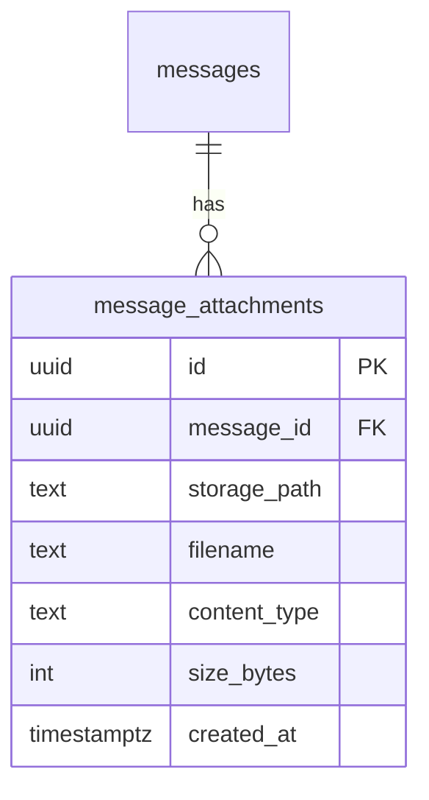

# feat: Chat Attachments (Images + PDFs)

## Overview

Add file attachment support (images + PDFs) to chat conversations on the Soleur cloud platform. Users upload files via presigned URLs to Supabase Storage, see inline previews in message bubbles, and AI agents process files through Claude's native vision/PDF capabilities via a workspace filesystem write.

**Issue:** [#1961](https://github.com/jikig-ai/soleur/issues/1961)
**Brainstorm:** `knowledge-base/project/brainstorms/2026-04-11-chat-attachments-brainstorm.md`
**Spec:** `knowledge-base/project/specs/feat-chat-attachments/spec.md`

## Problem Statement

Communication with AI domain leader agents is text-only. Founders cannot share screenshots of errors, competitor pages, design mockups, contracts, or invoices. This limits agent response quality for tasks that benefit from visual context — a table-stakes capability every competitor already supports.

## Proposed Solution

Presigned URL upload to Supabase Storage with inline display in chat and AI processing via filesystem write workaround.

**Upload flow:**

```text
1. Client: POST /api/attachments/presign { filename, contentType, size, conversationId }
2. Server: validates type/size/ownership, creates Supabase Storage signed upload URL
3. Client: PUT uploadUrl (direct to Supabase Storage — server never touches bytes)
4. Client: WS { type: "chat", content: "...", attachments: [{ path, name, type, size }] }
5. Server: saves message + attachment metadata, downloads file to workspace
6. Server: starts agent session with file path referenced in prompt context
```

## Technical Approach

### Architecture

```text
┌─────────────┐     POST /api/attachments/presign     ┌──────────────┐
│  Browser     │ ─────────────────────────────────────► │  Next.js API │
│  (PWA)       │ ◄───────────────── { uploadUrl, path } │  Route       │
│              │                                        └──────┬───────┘
│              │     PUT uploadUrl (direct upload)              │ validates type/size
│              │ ─────────────────────────────────────► ┌──────┴───────┐
│              │                                        │  Supabase    │
│              │                                        │  Storage     │
│              │     WS { type: "chat", attachments }   │  (RLS)       │
│              │ ─────────────────────────────────────► └──────────────┘
│              │                                        ┌──────────────┐
│              │                                        │  WS Handler  │
│              │ ◄─── stream_start/stream/stream_end ── │  → Agent     │
└─────────────┘                                        │  Runner      │
                                                       └──────┬───────┘
                                                              │ downloads file
                                                              │ to workspace
                                                       ┌──────┴───────┐
                                                       │  Claude Agent │
                                                       │  (vision/PDF) │
                                                       └──────────────┘
```

### Database Schema (ERD)



### Implementation Phases

#### Phase 1: Infrastructure + Upload API

Create the storage bucket, database table, presigned URL endpoint, and extend TypeScript types. No UI changes — pure backend foundation.

**Tasks:**

- [x] 1.1 Create Supabase Storage bucket `chat-attachments` via migration `019_chat_attachments.sql`
  - Bucket: `chat-attachments`, public: false
  - Storage object path pattern: `{user_id}/{conversation_id}/{uuid}.{ext}`
  - RLS policy: SELECT where user owns the conversation (join through `messages` → `conversations`)
  - INSERT only via service role (server-side presign endpoint creates the upload URL)
  - No direct UPDATE/DELETE by anon key
  - File: `apps/web-platform/supabase/migrations/019_chat_attachments.sql`

- [x] 1.2 Create `message_attachments` table in same migration
  - Columns: `id uuid PK DEFAULT gen_random_uuid()`, `message_id uuid FK REFERENCES messages(id) ON DELETE CASCADE`, `storage_path text NOT NULL`, `filename text NOT NULL`, `content_type text NOT NULL`, `size_bytes integer NOT NULL`, `created_at timestamptz DEFAULT now()`
  - RLS: SELECT where `auth.uid()` matches the message owner (via join to conversations)
  - No INSERT/UPDATE/DELETE via anon key — all writes via service role
  - Index on `message_id` for join performance

- [x] 1.3 Update CSP in `apps/web-platform/lib/csp.ts`
  - Add Supabase Storage host to `img-src` directive (same as `NEXT_PUBLIC_SUPABASE_URL` host)
  - The `connect-src` already includes `*.supabase.co` — uploads work without changes

- [x] 1.4 Create presign API route `apps/web-platform/app/api/attachments/presign/route.ts`
  - Method: POST
  - Input: `{ filename: string, contentType: string, sizeBytes: number, conversationId: string }`
  - Validation:
    - CSRF: `validateOrigin(request)` + `rejectCsrf()` (structural test enforces this)
    - Auth: `supabase.auth.getUser()` — reject if unauthenticated
    - Ownership: verify user owns the conversation via service client query
    - Content type: allowlist `image/png`, `image/jpeg`, `image/gif`, `image/webp`, `application/pdf`
    - Size: reject if `sizeBytes > 20 * 1024 * 1024` (20 MB)
    - **Max files per message:** reject if request includes more than 5 attachments
  - Generate storage path: `{user.id}/{conversationId}/{randomUUID()}.{ext}`
  - Create signed upload URL via `serviceClient.storage.from('chat-attachments').createSignedUploadUrl(path)`
  - Return: `{ uploadUrl: string, storagePath: string }`
  - Error responses: typed `{ error: "file_too_large" | "unsupported_file_type" | "unauthorized" | "conversation_not_found" | "too_many_files" }`
  - Pattern follows: `apps/web-platform/app/api/keys/route.ts`

- [x] 1.5 Extend `WSMessage` type in `apps/web-platform/lib/types.ts:17`
  - Change chat message type from `{ type: "chat"; content: string }` to `{ type: "chat"; content: string; attachments?: AttachmentRef[] }`
  - Add `AttachmentRef` interface: `{ storagePath: string; filename: string; contentType: string; sizeBytes: number }`

- [x] 1.6 Extend `ChatMessage` in `apps/web-platform/lib/ws-client.ts:10`
  - Add `attachments?: AttachmentRef[]` to the `ChatMessage` interface
  - Update `sendMessage` function (line 268) to accept optional `attachments` parameter and include in WS payload

- [x] 1.7 Extend `Message` interface in `apps/web-platform/lib/types.ts:103`
  - Add `attachments?: { id: string; storagePath: string; filename: string; contentType: string; sizeBytes: number }[]`

- [x] 1.8 Add error sanitizer entries in `apps/web-platform/server/error-sanitizer.ts`
  - Add to `KNOWN_SAFE_MESSAGES`: `"File too large"`, `"Unsupported file type"`, `"Upload failed"`, `"Attachment not found"`, `"Too many files"`

- [x] 1.9 Add typed error codes to `WSErrorCode` in `apps/web-platform/lib/types.ts`
  - Add `"upload_failed"`, `"file_too_large"`, `"unsupported_file_type"`, `"too_many_files"` to the union type

#### Phase 2: Client Upload UX

Add the file picker, drag-drop, paste, and upload progress to the chat input.

**Tasks:**

- [x] 2.1 Extract chat input into dedicated component `apps/web-platform/components/chat/chat-input.tsx`
  - Move the `<form>` from `page.tsx:101-128` into a new component
  - Props: `onSend(content: string, attachments?: AttachmentRef[])`, `disabled: boolean`
  - Keeps existing text input + send button behavior

- [x] 2.2 Add file input handlers (paperclip button, drag-drop, clipboard paste)
  - **Paperclip button:** Hidden `<input type="file" accept="image/png,image/jpeg,image/gif,image/webp,application/pdf" multiple />` triggered by paperclip icon button to the left of the text input. On file select: add to pending attachments state, show preview strip
  - **Drag-and-drop:** `onDragEnter`/`onDragOver` on chat container shows drop zone overlay. `onDrop`: add files to pending attachments with client-side type/size validation
  - **Clipboard paste:** `onPaste` handler checks `event.clipboardData.files` for image data, adds to pending attachments
  - **Client-side validation:** reject files > 20 MB or wrong MIME type with immediate error feedback. Cap at 5 files per message

- [x] 2.3 Add attachment preview strip
  - Below the text input, show thumbnails for pending images and file cards for pending PDFs
  - Each preview has a remove (X) button
  - Show filename and size
  - For images: `URL.createObjectURL()` for local preview (works with existing `blob:` in CSP `img-src`)

- [x] 2.4 Implement upload flow in `ChatInput`
  - On send: for each pending attachment:
    1. Call `POST /api/attachments/presign` with file metadata
    2. `PUT` the file to the returned `uploadUrl`
    3. Collect `AttachmentRef[]` from successful uploads
  - Show upload progress per file (percentage bar in the preview strip)
  - On all uploads complete: call `onSend(content, attachments)`
  - On upload failure: show error toast, keep the failed attachment in the preview strip with retry option

#### Phase 3: Server-Side Processing

Wire up the WebSocket handler, message persistence, and agent integration.

**Tasks:**

- [ ] 3.1 Update WebSocket chat handler in `apps/web-platform/server/ws-handler.ts:138`
  - Extract `msg.attachments` (optional array) from the chat message
  - Server-side cap: reject if `attachments.length > 5`
  - Pass to `sendUserMessage(userId, session.conversationId, msg.content, msg.attachments)`

- [ ] 3.2 Update `sendUserMessage` in `apps/web-platform/server/agent-runner.ts:1187`
  - Add `attachments?: AttachmentRef[]` parameter
  - After `saveMessage()`, insert rows into `message_attachments` table for each attachment
  - Destructure `{ error }` on every Supabase insert — throw on failure
  - For each attachment: download from Supabase Storage to workspace filesystem
    - Path: `/workspaces/{userId}/attachments/{uuid}.{ext}` (or similar workspace-relative path)
    - Use `serviceClient.storage.from('chat-attachments').download(storagePath)`
    - Write to filesystem with `fs.writeFile()`
  - Build attachment context string for the agent prompt:
    - `"The user attached the following files:\n- {filename} ({contentType}, {sizeBytes} bytes): {workspacePath}\n..."`
  - Pass this context to `startAgentSession()` as additional prompt context

- [ ] 3.3 Update `startAgentSession` to accept attachment context
  - Add optional `attachmentContext?: string` parameter
  - Prepend attachment context to the agent prompt so the agent knows about uploaded files
  - The agent can then read the files from the workspace using Claude's native vision/PDF capabilities

- [ ] 3.4 Update message history API in `apps/web-platform/server/api-messages.ts`
  - Join `message_attachments` when fetching messages
  - Return attachment metadata with each message
  - Generate signed download URLs for each attachment (temporary URLs for client display)
  - Use `serviceClient.storage.from('chat-attachments').createSignedUrl(path, 3600)` (1hr expiry)

#### Phase 4: Display + Polish

Render attachments in the chat and finalize.

**Tasks:**

- [ ] 4.1 Update `MessageBubble` in `apps/web-platform/app/(dashboard)/dashboard/chat/[conversationId]/page.tsx:136`
  - Accept `attachments` prop
  - For images: render `` thumbnail (max-width 300px) with click-to-expand (lightbox or modal)
  - For PDFs: render a file card with icon, filename, size, and download link
  - Download link: use the signed URL from the message history API
  - Handle missing/expired URLs gracefully (show "attachment unavailable" placeholder)

- [ ] 4.2 Update chat page to pass attachments to `MessageBubble`
  - When loading message history, map attachment data from the API response
  - When receiving new messages via WebSocket, include attachment refs in the local state

- [ ] 4.3 Add conversation-level storage cleanup
  - Wherever conversation deletion currently happens, add a step to batch-delete Storage objects BEFORE the DB row is deleted
  - Query `message_attachments` for all storage paths in the conversation
  - Call `serviceClient.storage.from('chat-attachments').remove([paths])`
  - This covers the acceptance criterion: "Deleting a conversation purges all associated Storage objects"

**Deferred:** GDPR account-level blob cleanup (all attachments across all conversations) is deferred to a follow-up issue. DB rows are cleaned up via FK CASCADE; Storage blob orphans accumulate until the cleanup issue ships. At current scale (1 user, no deletions), this is not a launch blocker.

**Note on orphaned uploads:** Failed or partial uploads (presigned URL generated but PUT never completed or failed) accumulate in Supabase Storage. Consider adding a Supabase Storage lifecycle rule or a periodic cleanup job in a follow-up issue. Not a launch blocker at current scale.

## Alternative Approaches Considered

| Approach | Pros | Cons | Decision |
|----------|------|------|----------|
| Server proxy upload | Simpler client code | Server handles all bytes (memory pressure on 8GB Hetzner) | Rejected — presigned URL preferred |
| Cloudflare R2 storage | Zero egress, cheaper at scale | No RLS integration, needs custom auth middleware | Rejected — Supabase Storage for now, migrate later if needed |
| Base64 in prompt | No storage needed | ~1600 tokens per image, doesn't work for PDFs, expensive | Rejected |
| Display-only (no AI) | Simplest to build | Defeats the purpose — founders need agents to process files | Rejected |
| Agent SDK multimodal | Clean, native integration | SDK `query()` only accepts strings | Blocked — use filesystem write workaround |

## Acceptance Criteria

### Functional Requirements

- [ ] User can upload images (PNG, JPEG, GIF, WebP) and PDFs via paperclip button
- [ ] User can drag-and-drop files onto the chat area
- [ ] User can paste images from clipboard (Ctrl+V / Cmd+V)
- [ ] Upload progress is shown for each file
- [ ] Images display as inline thumbnails in message bubbles
- [ ] PDFs display as file cards with filename, size, and download link
- [ ] AI agent can see and process uploaded images (vision) and PDFs
- [ ] Files > 20 MB are rejected with a clear error message
- [ ] Unsupported file types are rejected with a clear error message
- [ ] Max 5 files per message enforced (client-side and server-side)
- [ ] Attachments persist with the conversation and appear when reloading chat history
- [ ] Deleting a conversation purges all associated Storage objects
- [ ] GDPR account deletion purges all user attachment Storage objects

### Non-Functional Requirements

- [ ] Upload goes directly to Supabase Storage (server never touches file bytes)
- [ ] Presign endpoint validates CSRF, auth, conversation ownership, type, and size
- [ ] RLS policies on `message_attachments` restrict reads to conversation owner
- [ ] All Supabase Storage errors destructured and handled (no silent failures)
- [ ] Storage errors sanitized before client delivery (no schema leaks)
- [ ] CSP updated to allow Supabase Storage images
- [ ] Works on mobile PWA (iOS Safari file picker, Android Chrome)

### Quality Gates

- [ ] CSRF structural test passes (covers new presign route)
- [ ] Integration test: upload → display → agent processing
- [ ] Migration applies cleanly to production Supabase
- [ ] No TypeScript errors
- [ ] Lighthouse mobile score maintained > 80

## Test Scenarios

### Acceptance Tests

- Given a user in an active chat, when they click the paperclip button and select a PNG image, then the image is uploaded and appears as a thumbnail in the message bubble
- Given a user in an active chat, when they drag a PDF onto the chat area, then the PDF is uploaded and appears as a file card with filename and download link
- Given a user in an active chat, when they paste an image from clipboard, then the image is attached to the next message
- Given a user who uploads a 25 MB file, when the presign endpoint validates it, then the user sees "File too large" error and no upload occurs
- Given a user who uploads a .exe file, when the presign endpoint validates it, then the user sees "Unsupported file type" error
- Given a user who uploads an image with a chat message, when the agent processes it, then the agent response references the image content (e.g., describes what it sees)
- Given a user who reloads the chat page, when messages with attachments load, then thumbnails and file cards render with valid download URLs

### Edge Cases

- Given a user who starts uploading then navigates away, when they return, then no orphaned partial uploads exist in Storage
- Given a signed download URL that has expired (>1hr), when the user clicks it, then a new signed URL is generated on retry
- Given a user on iOS Safari PWA, when they tap the paperclip button, then the native file picker opens with image/PDF filter
- Given multiple files attached to one message, when sent, then all files upload and display correctly
- Given a network failure during upload, when the PUT to Storage fails, then the error is shown and the file can be retried
- Given a user who attaches 6 files, when they try to send, then the 6th file is rejected with "Too many files" error (max 5)
- Given a user who renames a .exe to .png and uploads it, when the presign endpoint validates, then the declared content-type passes but the agent may fail to process it (note: server-side magic-byte validation is a follow-up hardening task, not MVP)

### Integration Verification

- **API verify:** `curl -s -X POST https://app.soleur.ai/api/attachments/presign -H "Content-Type: application/json" -d '{"filename":"test.png","contentType":"image/png","sizeBytes":1024,"conversationId":"..."}' -H "Cookie: ..."` expects `{ "uploadUrl": "...", "storagePath": "..." }`
- **Browser:** Navigate to chat, click paperclip, select image, verify thumbnail preview appears, send message, verify inline image in bubble

## Success Metrics

- Upload success rate > 99% (presign + PUT both succeed)
- Attachment display in chat history: no broken images after page reload
- Agent correctly processes uploaded images in > 90% of cases (vision accuracy depends on content)

## Dependencies and Prerequisites

| Dependency | Status | Notes |
|------------|--------|-------|
| Supabase Storage enabled on project | Must verify | Check Supabase dashboard — Storage may need to be enabled |
| Agent SDK `query()` accepts structured content | Blocked | Currently strings-only. Using filesystem write workaround |
| `@supabase/supabase-js` Storage API | Available | v2.99.2 installed, Storage API is part of the client |

## Risk Analysis and Mitigation

| Risk | Likelihood | Impact | Mitigation |
|------|-----------|--------|------------|
| Agent SDK doesn't support file reading from workspace | Medium | High | Test with a simple file write → agent read before full implementation. If blocked, fall back to base64 in prompt for small images |
| Supabase Storage not enabled on current plan | Low | Medium | Check via dashboard. Free tier includes 1GB storage |
| Mobile PWA file picker doesn't work on iOS | Low | Medium | Test on iOS Safari early (Phase 3). The native `<input type="file">` generally works |
| Large file uploads timeout on slow connections | Medium | Low | Show progress bar. Supabase Storage handles chunked uploads. Add client-side timeout with retry |

## Domain Review

**Domains relevant:** Marketing, Engineering, Product

### Marketing (CMO) — carried from brainstorm

**Status:** reviewed
**Assessment:** Table stakes capability. Do not market in isolation — bundle into Phase 3 "Make it Sticky" narrative. Strong angle for non-technical founder recruitment in Phase 4.

### Engineering (CTO) — carried from brainstorm

**Status:** reviewed
**Assessment:** Medium complexity (3-5 days). Supabase Storage recommended. Critical SDK limitation (string-only prompts) requires filesystem write workaround. Separate HTTP upload endpoint preferred.

### Product/UX Gate

**Tier:** advisory
**Decision:** auto-accepted (brainstorm carry-forward)
**Agents invoked:** none (advisory tier, brainstorm already validated the feature)
**Skipped specialists:** none
**Pencil available:** N/A

UX design agent running separately (wireframes in progress via ux-design-lead).

## Institutional Learnings Applied

| Learning | File | Application |
|----------|------|-------------|
| PostgREST bytea returns hex | `2026-03-17-postgrest-bytea-base64-mismatch.md` | Use `text` columns for storage_path, filename, content_type |
| Supabase silent errors | `2026-03-20-supabase-silent-error-return-values.md` | Destructure `{ error }` on every Storage call |
| CSP img-src constraints | `2026-03-20-nextjs-static-csp-security-headers.md` | Add Supabase Storage host to `img-src` in `lib/csp.ts` |
| RLS column-level takeover | `rls-column-takeover-github-username-20260407.md` | No anon-key writes to `message_attachments` — service role only |
| Column-level GRANT override | `2026-03-20-supabase-column-level-grant-override.md` | REVOKE table-level, GRANT specific columns if needed |
| Account deletion CASCADE | `account-deletion-cascade-order-20260402.md` | FK CASCADE for DB rows; separate Storage blob cleanup before auth.users delete |
| CSRF three-layer defense | `2026-03-20-csrf-three-layer-defense-nextjs-api-routes.md` | Add `validateOrigin` to presign route — structural test enforces |
| WS error sanitization | `2026-03-20-websocket-error-sanitization-cwe-209.md` | Sanitize Storage errors through `error-sanitizer.ts` |
| Typed WS error codes | `2026-03-18-typed-error-codes-websocket-key-invalidation.md` | Add `upload_failed`, `file_too_large` to `WSErrorCode` |
| Supabase ReturnType never | `2026-04-05-supabase-returntype-resolves-to-never.md` | Use `SupabaseClient` type import, not `ReturnType<typeof createClient>` |
| Supabase mock thenable | `supabase-query-builder-mock-thenable-20260407.md` | Test mocks need `.then()` to be awaitable |

## References and Research

### Internal References

- Supabase client init: `apps/web-platform/lib/supabase/server.ts` (service client pattern)
- Message save: `apps/web-platform/server/agent-runner.ts:113` (saveMessage)
- Agent query: `apps/web-platform/server/agent-runner.ts:204` (query call)
- User message flow: `apps/web-platform/server/agent-runner.ts:1187` (sendUserMessage)
- WS chat handler: `apps/web-platform/server/ws-handler.ts:138`
- Chat input form: `apps/web-platform/app/(dashboard)/dashboard/chat/[conversationId]/page.tsx:101`
- Message bubble: `apps/web-platform/app/(dashboard)/dashboard/chat/[conversationId]/page.tsx:136`
- CSP config: `apps/web-platform/lib/csp.ts:43`
- Error sanitizer: `apps/web-platform/server/error-sanitizer.ts`
- API route pattern: `apps/web-platform/app/api/keys/route.ts` (CSRF + auth + service client)

### Related Work

- Issue: [#1961](https://github.com/jikig-ai/soleur/issues/1961)
- KB upload follow-up: [#1974](https://github.com/jikig-ai/soleur/issues/1974)
- Draft PR: [#1975](https://github.com/jikig-ai/soleur/pull/1975)
