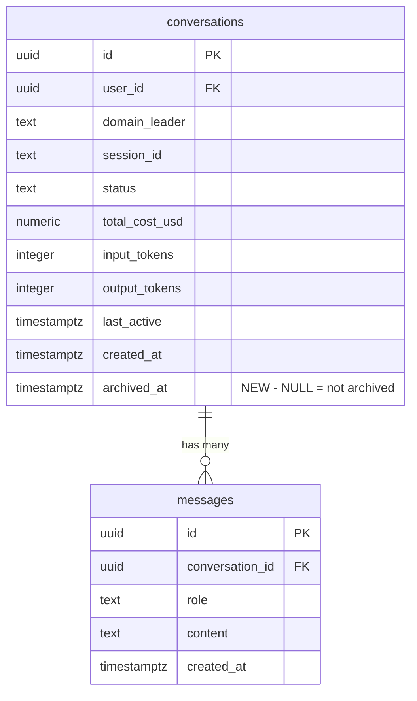

# feat: Archive Conversations in Command Center

## Overview

Add conversation archiving to the command center so users can declutter their active list without losing data. V1 supports single archive/unarchive with an "Archived" filter tab. Bulk archive, auto-archive (pg_cron), and auto-unarchive trigger are deferred — ship the core, add automation if users need it.

## Problem Statement / Motivation

The command center conversation list grows unbounded. Users with many conversations (power users running multiple domain agents daily) have no way to remove stale or completed conversations from the active view. The only option today is to scroll past them. This creates friction when finding active work.

Issue: #1990

## Proposed Solution

Add an `archived_at timestamptz` column to the `conversations` table. This is orthogonal to the existing `status` field — a `completed` conversation can be archived while preserving its functional status for analytics. The UI gets archive/unarchive actions on each conversation row and an "Archived" filter tab.

## Technical Approach

### Data Model

```sql
-- Migration 019: Add archived_at column
ALTER TABLE public.conversations
ADD COLUMN archived_at timestamptz DEFAULT NULL;

CREATE INDEX idx_conversations_user_archived
ON public.conversations (user_id, archived_at);
```

**Why `archived_at` over adding to status enum:**

- Orthogonal to functional status — preserves `active`/`completed`/`failed` for analytics
- Timestamp provides "when was it archived" metadata for free
- Simpler query: `WHERE archived_at IS NULL` vs managing a compound status

### Deferred: Auto-Unarchive Trigger and Auto-Archive (pg_cron)

Auto-unarchive (database trigger on message INSERT) and auto-archive (pg_cron daily job for 30-day inactive conversations) are deferred from V1. See #1992 and #1990 for tracking. These will be added as a pair if users need automation beyond manual archive/unarchive.

### ERD Changes



### Implementation Phases

#### Phase 1: Database Migration

- `apps/web-platform/supabase/migrations/019_add_archived_at.sql`
  - Add `archived_at timestamptz DEFAULT NULL` column
  - Add index on `(user_id, archived_at)`

**Learnings to apply:**

- Always destructure `{ error }` from Supabase JS queries (learning: supabase-silent-error-return-values)
- Nullable column addition is non-blocking — no table scan needed

#### Phase 2: Type and Hook Updates

- `apps/web-platform/lib/types.ts`
  - Add `archived_at: string | null` to `Conversation` interface (L81-92)

- `apps/web-platform/hooks/use-conversations.ts`
  - Add `archiveFilter: "active" | "archived" | null` parameter to hook options
  - Default query: `.is("archived_at", null)` to exclude archived (when `archiveFilter` is `"active"` or null)
  - Archived query: `.not("archived_at", "is", null)` when `archiveFilter` is `"archived"`
  - Add `archiveConversation(id)` function: updates `archived_at = new Date().toISOString()`
  - Add `unarchiveConversation(id)` function: updates `archived_at = null`
  - Update Realtime handler (L144-176) to also patch `archived_at` field
  - **Important (Kieran review):** Realtime handler must conditionally **remove** the conversation from local state when `archived_at` transitions — not just patch the field. Check `archiveFilter` and splice accordingly.
  - Destructure `{ error }` on every Supabase call

#### Phase 3: UI — Archive Actions and Filter Tab

- `apps/web-platform/components/inbox/conversation-row.tsx`
  - Add archive icon button (e.g., `ArchiveBoxIcon` from Heroicons) with `e.stopPropagation()` to prevent row click navigation
  - Show "Archive" button on non-archived rows, "Unarchive" on archived rows
  - Add subtle "Archived" visual indicator (muted opacity or badge) when viewing archived conversations
  - Button calls `archiveConversation(id)` or `unarchiveConversation(id)` from hook

- `apps/web-platform/app/(dashboard)/dashboard/page.tsx`
  - Add archive toggle above or alongside the existing status filter (L445-487)
  - Options: "Active" (default) | "Archived" — separate from status filter
  - Update `STATUS_OPTIONS` (L78-84): no change needed — status filter remains orthogonal

#### Phase 4: Tests

- `apps/web-platform/test/command-center.test.tsx`
  - **Pre-step (Kieran review):** Update mock conversation data (L13-41) to include `total_cost_usd`, `input_tokens`, `output_tokens` fields from migration 017 — currently stale
  - Test: archived conversations hidden from default view
  - Test: switching to Archived tab shows archived conversations
  - Test: archive button removes conversation from active list
  - Test: unarchive button removes conversation from archived list

- `apps/web-platform/test/components/conversation-row.test.tsx`
  - Test: archive button renders with correct icon
  - Test: archive button click does not trigger row navigation (stopPropagation)
  - Test: "Archived" visual indicator shown when `archived_at` is set
  - Use existing `makeConversation()` factory (L10-29) with `archived_at` override

- Follow existing test patterns: Vitest + React Testing Library, thenable query builder mock, dynamic imports

## Alternative Approaches Considered

| Approach | Why Rejected |
|----------|-------------|
| Add `"archived"` to status CHECK constraint | Loses original functional status. A "completed" conversation becomes "archived" with no record of its prior state. Worse data model. |
| Separate `archived_conversations` table | Over-engineered. Adds join complexity for no benefit. Complicates Realtime subscriptions. |
| `is_archived boolean` column | Works, but `archived_at timestamptz` provides the same semantics plus "when was it archived" for free. |
| Soft-delete pattern (`deleted_at`) | Conflates archiving (user intent to hide) with deletion (user intent to remove). Different semantics. |

## Acceptance Criteria

- [ ] User can archive a single conversation from the active list
- [ ] User can unarchive a conversation from the Archived tab
- [ ] Archived conversations disappear from the active (default) view
- [ ] Archived conversations appear in the Archived filter tab
- [ ] Original conversation status preserved after archive/unarchive round-trip
- [ ] Realtime updates correctly remove/add conversations when archive state changes
- [ ] All Supabase JS calls destructure `{ error }` (per learnings)
- [ ] Test mock data updated to include cost fields from migration 017 (per Kieran review)

## Domain Review

**Domains relevant:** Product, Marketing

Carried forward from brainstorm (2026-04-12).

### Product (CPO)

**Status:** reviewed
**Assessment:** Good Phase 3 fit. Unarchive non-negotiable from day one. Auto-unarchive on new activity prevents buried responses. No validation gate needed.

### Marketing (CMO)

**Status:** reviewed
**Assessment:** Table-stakes UX. No dedicated marketing action. Note in release notes. Auto-archive is the differentiating angle.

### Product/UX Gate

**Tier:** advisory
**Decision:** auto-accepted — modifies existing UI with well-defined patterns (adding a button and filter tab to an existing list)
**Agents invoked:** none
**Skipped specialists:** none

## Test Scenarios

### Acceptance Tests (RED phase targets)

- Given an active conversation, when user clicks the archive button, then the conversation disappears from the active list and `archived_at` is set in the database
- Given an archived conversation, when user clicks unarchive, then it reappears in the active list with its original status and `archived_at` is NULL
- Given a conversation with status `completed` that is archived and then unarchived, when checking its status, then it is still `completed`
- Given the active view is open, when a Realtime event sets `archived_at` on a conversation, then the conversation is removed from the list (not just patched)

### Edge Cases

- Given zero conversations in the active list (all archived), when viewing the dashboard, then show an appropriate empty state
- Given a conversation being archived while another tab views it, when Realtime fires, then both tabs update correctly

## Dependencies and Risks

| Risk | Mitigation |
|------|-----------|
| Migration on production conversations table | `ADD COLUMN ... DEFAULT NULL` is non-blocking in PostgreSQL — no table rewrite |
| Realtime subscription doesn't fire for `archived_at` changes | Test Realtime filter; may need to update channel subscription to include `archived_at` in listened columns |
| Prior NOT NULL constraint issue on `domain_leader` | Verify migration applies cleanly (learning: unapplied-migration-command-center-chat-failure) |

## References and Research

### Internal References

- Hook: `apps/web-platform/hooks/use-conversations.ts` (query L71-87, Realtime L144-176)
- Row component: `apps/web-platform/components/inbox/conversation-row.tsx` (StatusBadge L10-28)
- Types: `apps/web-platform/lib/types.ts:81-101`
- Dashboard: `apps/web-platform/app/(dashboard)/dashboard/page.tsx` (STATUS_OPTIONS L78-84, filter bar L445-487)
- Schema: `apps/web-platform/supabase/migrations/001_initial_schema.sql:46-65`
- Tests: `apps/web-platform/test/command-center.test.tsx`, `apps/web-platform/test/components/conversation-row.test.tsx`
- Next migration number: **019**

### Learnings Applied

- `2026-03-20-supabase-silent-error-return-values.md` — destructure `{ error }` from all queries
- `2026-03-20-supabase-trigger-boolean-cast-safety.md` — use text comparison in triggers
- `2026-03-28-unapplied-migration-command-center-chat-failure.md` — verify migration applies to production
- `2026-03-20-supabase-column-level-grant-override.md` — column-level grants silently ignored with table-level grants

### Related Issues

- #1990 — Parent issue
- #1992 — Deferred: user-configurable auto-archive threshold

## Plan Review Feedback [Updated 2026-04-12]

Three reviewers (DHH, Kieran, Simplicity) reviewed this plan. Changes applied:

- **Scope trimmed:** Removed bulk selection, pg_cron auto-archive, and auto-unarchive trigger from V1. Core = migration + single archive/unarchive + filter tab.
- **SECURITY DEFINER removed** from trigger function (deferred with trigger, but noted for future implementation — use SECURITY INVOKER)
- **Realtime handler clarified:** Must splice/remove from array on archive state transitions, not just patch field
- **Test data staleness:** command-center.test.tsx mock data must be updated to include cost fields from migration 017 before adding `archived_at`
