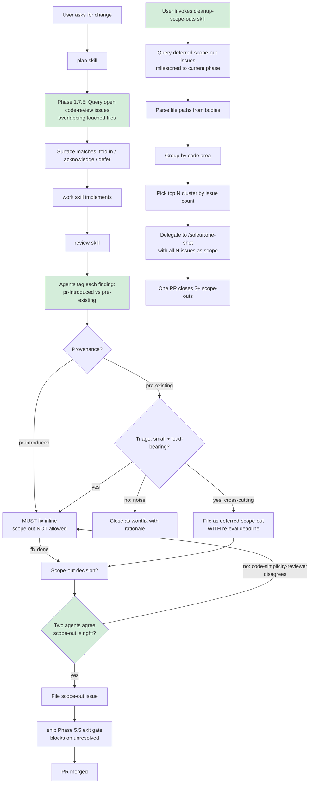

# Review Backlog Workflow Improvements — Stop Net-Positive Scope-Out Filings

## Enhancement Summary

**Deepened on:** 2026-04-17
**Lenses applied:** simplicity/YAGNI, architecture, code-quality, pattern-recognition
**Verified against:** live `gh label list`, live `gh issue list --label deferred-scope-out --state open` (22 open, 15+ in "Post-MVP / Later"), live `plugins/soleur/test/` conventions, live `plugins/soleur/skills/schedule/SKILL.md`.

### Key Improvements Applied

1. **Default milestone corrected.** `cleanup-scope-outs` defaults to `Post-MVP / Later` (where the backlog actually lives — 15+ issues), not "current Phase" (only 1 issue). Defaulting to current Phase would return an empty set and the skill would appear broken on first run.
2. **Sub-grouping trigger dropped (YAGNI).** The spec had >10-issues-in-area triggering sub-directory grouping. Measured: no single area exceeds 10 today. Defer the sub-group logic until the trigger actually fires.
3. **`gh ... --jq` does not forward `--arg` (learning 2026-04-15).** The Phase 1.7.5 query example now uses a two-stage pipe (`gh ... --json ... | jq --arg ...`) — the single-stage form would fail at runtime with "unknown arguments".
4. **`gh issue list --milestone` takes title (rule `cq-gh-issue-create-milestone-takes-title`).** Helper script MUST quote the milestone title literally and never pass a numeric ID.
5. **`/soleur:schedule` is a real post-merge option.** The existing `schedule` skill can cron the `cleanup-scope-outs` skill directly — documented as a follow-up action, not a dependency.
6. **T5 simplified.** Dropped the "block issue creation at grep time" enforcement (over-engineered); the review skill's instruction to include `Re-eval by:` is sufficient, and Phase 5.5's exit gate catches violations.

### New Considerations Discovered

- **Backlog baseline is larger than the brief suggested.** Live count at plan time: **22 open `deferred-scope-out` issues** (not the 5 implied by the sample). Most under "Post-MVP / Later" with file paths in bodies — excellent cleanup targets.
- **Risk of cluster bias.** Live sampling: `apps/web-platform/app/api/kb/` appears in 5+ bodies. The skill will always pick this cluster first unless rotated. Ship with "show all clusters" output so human can override.
- **Phase 5.5 exit gate already handles unresolved scope-outs per PR.** The new `Re-eval by:` requirement should NOT change that gate — it's orthogonal. Coupling note added below.
- **Rule ID stability.** AGENTS.md rule `rf-review-finding-default-fix-inline` is immutable (rule `cq-rule-ids-are-immutable`). These improvements deliberately do NOT rename it; they reinforce it.

## Overview

The `/soleur:*` pipeline already enforces a fix-inline default (rule `rf-review-finding-default-fix-inline`, ship Phase 5.5 Review-Findings Exit Gate). But in the 2026-04-17 three-PR window (#2463, #2477, #2486), the pipeline **filed 6 scope-out issues while closing 3** — a net **+3** on the Phase-3 code-review backlog even though the target P1s shipped.

Target P1s ship, but the backlog grows faster than it drains. The hardening from the 2026-04-15 brainstorm fixed the *default disposition* (fix vs. file) but left four upstream leaks un-addressed. This plan closes them.

## Problem Statement / Motivation

### Observed in the 2026-04-17 window

| PR | Target | Scope-outs filed | Scope-outs closed |
|----|--------|------------------|-------------------|
| #2463 | KB streaming perf | 2 | 0 |
| #2477 | KB binary response (hash TOCTOU fix) | 3 | 2 |
| #2486 | KB workspace helper extraction | 1 | 3 (closed #2467 + #2468 + #2469) |
| **Total** | — | **6** | **3** (net **+3**) |

PR #2486 is the proof-of-concept success case: a **single focused refactor PR** closed three scope-outs at once. But it was hand-chosen, not a repeatable process. The other two PRs added to the backlog faster than #2486 drained it.

### Root causes (4 leaks)

1. **Plan phase doesn't check open code-review issues in the touched area.** The planner proposes a change set, writes tests, and implements — then the review phase re-surfaces a *pre-existing* scope-out that touches the same files. The PR either (a) folds the scope-out in late (re-work), (b) gets a duplicate scope-out filed (double-counted), or (c) closes the scope-out silently with no signal it was addressed.

2. **`cross-cutting-refactor` scope-out criterion is too easy to invoke.** Current wording: *"fix requires touching files materially unrelated to the PR's core change."* In practice any PR that would grow by 2+ files qualifies. The criterion was intended to flag refactors that *don't fit* the current PR's theme; it's being used to flag refactors that are *inconvenient* to pack in.

3. **Review doesn't distinguish PR-introduced from pre-existing findings.** The current review skill tags severity (P1/P2/P3) but not provenance. Result: a genuine pre-existing-debt finding gets filed as a scope-out (permanent open issue) instead of either (a) fixed inline because it's small, or (b) triaged to `wontfix` because it's low-value noise. Every pre-existing-debt finding becomes open-ended backlog with no decision deadline.

4. **No dedicated cleanup cadence.** The fix-inline default prevents *new* scope-outs from being filed casually, but there's no equivalent pressure to *drain* the existing backlog. The #2486 pattern (one PR closes 3+ scope-outs) works but only runs when a human manually identifies the opportunity. The backlog needs a programmatic opener.

### What this plan does NOT try to fix

- **#4 from the brainstorm (rolling cap / throttle).** Out of scope per user direction. Revisit if the four improvements below don't close the gap within two weeks.
- **AGENTS.md hard rules.** The existing rule `rf-review-finding-default-fix-inline` already captures the policy. These improvements tighten *execution*, not policy — they belong in skill instruction files.
- **The Phase 5.5 exit gate.** It already blocks merge on un-justified scope-outs; this plan strengthens the *filter* feeding into it, not the gate itself.

## Research Reconciliation — Spec vs. Codebase

The arguments block claims the skill files exist and function as described. Verified:

| Claim | Reality | Plan response |
|-------|---------|---------------|
| `plugins/soleur/skills/plan/SKILL.md` has a research phase | Yes — Phases 1, 1.5, 1.5b, 1.6, 1.6b, 1.7. | Insert the code-review issue overlap check as Phase **1.7.5** (Code-Review Overlap Check), right after 1.7 Consolidate Research and before 2. Issue Planning & Structure. |
| `plugins/soleur/skills/review/SKILL.md` Section 5 defines four scope-out criteria inline (lines 298-307) | Yes. | Tighten criteria 1 and 2 in place. Add a second-reviewer confirmation gate after the criteria block. |
| Review agents live at `plugins/soleur/agents/engineering/review/*.md` | Yes — 15 agents. | Amend the synthesis step in `review/SKILL.md` (not the agents themselves) to require provenance tagging. Synthesis runs in the main review thread, not inside the agents. |
| `code-simplicity-reviewer` exists | Yes — `plugins/soleur/agents/engineering/review/code-simplicity-reviewer.md`. | Use it as the second-reviewer confirmation gate for scope-outs. |
| `/soleur:one-shot` can be invoked with a scope argument | Yes — takes `$ARGUMENTS` and plans from them. | New skill delegates to `one-shot` by constructing a scope argument that lists the selected issue numbers. |
| `deferred-scope-out` label exists and is in active use | Yes — 5+ open issues carry it with canonical body shape (Problem / Proposed Fix / Scope-Out Justification / References). | Cleanup skill queries this label directly. |
| PR #2486 closed 3 scope-outs (#2467 + #2468 + #2469) in one refactor | Per user-provided context; documented in PR body. | Use #2486 as the reference example in the new skill's SKILL.md. |

No spec-vs-reality gaps requiring a phase adjustment.

## Research Findings

### Local context (from repo research)

**Files to edit:**

- `plugins/soleur/skills/plan/SKILL.md` — add Phase 1.7.5 Code-Review Overlap Check after line 166 (end of Phase 1.7).
- `plugins/soleur/skills/review/SKILL.md` — tighten scope-out criteria in the `<critical_requirement>` block (lines 292-326), add provenance-tagging contract to Step 1 Synthesize All Findings (lines 328-345), add second-reviewer confirmation gate.
- `plugins/soleur/skills/review/references/review-todo-structure.md` — add `Provenance: pr-introduced | pre-existing` field to the issue body template.

**Files to create:**

- `plugins/soleur/skills/cleanup-scope-outs/SKILL.md` — new skill.
- `plugins/soleur/skills/cleanup-scope-outs/scripts/group-by-area.sh` — helper that queries deferred-scope-out issues, parses file paths from bodies, groups by area, picks top N.
- `knowledge-base/project/learnings/best-practices/2026-04-17-review-backlog-net-positive-filing.md` — learning file capturing why these four improvements were necessary and what signal to watch for regression.

**Files to touch for consistency (no new rules, just cross-references):**

- No AGENTS.md edit. The rule `rf-review-finding-default-fix-inline` already names review's four criteria and notes compound's three analogous criteria. The tightening happens inside the skill files the rule already cross-references.

### Learnings to honor

- `knowledge-base/project/learnings/best-practices/2026-04-15-plan-skill-reconcile-spec-vs-codebase.md` — already reflected in the plan structure.
- `knowledge-base/project/learnings/2026-04-15-multi-agent-review-catches-bugs-tests-miss.md` — the second-reviewer confirmation gate (code-simplicity-reviewer) aligns with the finding that review agents catch bugs tests miss. A single agent's "scope-out is fine here" can be wrong in the same way a single test can miss a bug.
- `knowledge-base/project/learnings/2026-04-17-stream-response-toctou-across-fd-boundary.md` — template for the learning file this plan will produce.

### Observed scope-out issue body shapes

Sampled from `gh issue list --label deferred-scope-out --state open`:

- #2483: body contains `Location: apps/web-platform/app/api/shared/[token]/route.ts:156-234` and `Ref #2477`.
- #2478: body contains `server/api-usage.ts:89-107` and `Ref #2464`.
- #2474: body contains `apps/web-platform/app/api/kb/upload/route.ts` and `Ref #2457`.
- #2473, #2472: both reference `PR #2457`.

**Consistency:** all scope-out issue bodies reference the originating PR via `Ref #<N>` AND name at least one file path. The cleanup skill can reliably parse file paths via a regex `[a-zA-Z0-9_./-]+\.(ts|tsx|js|jsx|py|rb|go|md|sh|yml|yaml|sql|tf)\b` applied to the body text. No changes needed to existing issues.

## Proposed Solution

### Architecture of the four changes



### Improvement 1 — Plan Phase Queries Open Code-Review Issues in Touched Area

**Location:** `plugins/soleur/skills/plan/SKILL.md`. Insert new section `### 1.7.5. Code-Review Overlap Check` after existing Phase 1.7 (Consolidate Research) and before Phase 2 (Issue Planning & Structure).

**Phase 1.7.5 procedure (authoritative text to be inserted verbatim):**

```markdown
### 1.7.5. Code-Review Overlap Check

After consolidating research and before writing the plan structure, check whether
any open code-review issues touch files the plan intends to modify. This prevents
two failure modes:

- **Rework:** a pre-existing scope-out names a file the plan will rewrite — if
  unnoticed, the plan ships, then the scope-out surfaces and drives a second
  refactor PR that could have been folded in.
- **Double-counting:** the review phase files a new scope-out for a concern a
  still-open issue already tracks.

**Procedure:**

1. Enumerate the files the plan will modify (`## Files to edit` and `## Files
   to create` sections from the research findings).
2. Query open code-review issues. **Use two-stage piping (`--json` then `jq --arg`), not single-stage `--jq`.** The `gh` CLI does NOT forward `--arg` to its embedded jq; a single-stage form produces `unknown arguments` at runtime. See learning `knowledge-base/project/learnings/2026-04-15-gh-jq-does-not-forward-arg-to-jq.md`.

    ```bash
    gh issue list --label code-review --state open \
      --json number,title,body --limit 200 > /tmp/open-review-issues.json
    ```

3. For each planned file path, search the issue bodies using a **standalone jq** with `--arg` (safe against regex metacharacters in paths):

    ```bash
    jq -r --arg path "<file-path>" '
      .[] | select(.body // "" | contains($path))
      | "#\(.number): \(.title)"
    ' /tmp/open-review-issues.json
    ```

4. If any matches are returned, write a `## Open Code-Review Overlap` section
   to the plan file with a one-line bullet per match:

    > X open scope-outs touch these files: #2466 (Range cache), #2483 (helper
    > extraction). Fold in / acknowledge / defer: …

    For each match, the planner MUST explicitly choose one of:

    - **Fold in:** plan extends to close the scope-out in the same PR. Add the
      scope-out's file paths to `## Files to edit` and note `Closes #<N>` in
      the PR-body reminder.
    - **Acknowledge:** plan deliberately does NOT fix the scope-out (e.g.,
      different concern, needs its own cycle). Record a 1-sentence rationale.
      The scope-out remains open.
    - **Defer:** plan is not the right place; update the scope-out issue with
      a re-evaluation note (e.g., "revisit after feat-X lands"). Do NOT silently
      leave the overlap unaddressed — the reviewer will re-surface it.

5. If no matches, record `## Open Code-Review Overlap` with `None` so the
   next planner can see the check ran.

**Why this matters:** In the 2026-04-17 window, the #2486 PR closed three
scope-outs (#2467 + #2468 + #2469) because the planner noticed the overlap.
The #2463 and #2477 PRs grew the backlog instead because no overlap check
ran. This phase makes the #2486 pattern the default, not the exception.
See `knowledge-base/project/learnings/best-practices/2026-04-17-review-backlog-net-positive-filing.md`.
```

**Output deliverable in the plan file:** A `## Open Code-Review Overlap` section listing one-line bullets per overlap, with each bullet ending in an explicit fold-in / acknowledge / defer disposition.

### Improvement 2 — Stricter Scope-Out Criteria in `/soleur:review`

**Location:** `plugins/soleur/skills/review/SKILL.md` — the `<critical_requirement>` block (current lines ~292-326).

**Changes:**

1. **Tighten `cross-cutting-refactor`:**

    - **Before:** *"fix requires touching files materially unrelated to the PR's core change."*
    - **After:** *"fix requires touching **≥3 files** that are **materially unrelated** to this PR's core change, where **core change = files named in the PR's linked issue, or files in the same top-level directory as the primary changed file**. Bare multi-file fixes do NOT qualify; the unrelatedness must be concrete and defensible."*
    - **Why:** "materially unrelated" alone is subjective; the ≥3-file threshold + scoped definition of "core change" forces the reviewer to either count specific files or drop the scope-out.

2. **Tighten `contested-design`:**

    - **Before:** *"multiple valid fix approaches; choice requires design input that doesn't belong in this PR's scope."*
    - **After:** *"multiple valid fix approaches AND the review agent (not the PR author) explicitly names at least two concrete approaches that trade off differently on durability/cost/complexity AND recommends a design cycle outside this PR. Author-initiated contested-design claims ('I don't feel like implementing approach X here') do NOT qualify; the agent must independently surface the tradeoff."*
    - **Why:** the criterion was being invoked for "I'd rather not touch this today" — reframing it as "the review agent independently flags a design split" removes the author-convenience loophole.

3. **`architectural-pivot`:** no change (already rare and well-scoped).

4. **`pre-existing-unrelated`:** already requires pre-existing + unrelated; no wording change here, but the provenance-tagging step in Improvement 3 will route pre-existing findings through an explicit triage before this criterion can even be invoked.

5. **Add: Second-Reviewer Confirmation Gate.** Insert the following paragraph at the end of the `<critical_requirement>` block, before the closing `</critical_requirement>` tag:

    ```markdown
    **Second-reviewer confirmation gate:** Before creating a scope-out issue,
    invoke `code-simplicity-reviewer` via Task with the finding, proposed fix,
    named scope-out criterion, and 1-3-sentence rationale. Prompt: "This
    finding is being filed as a deferred-scope-out under criterion <name>.
    Rationale: <text>. Do you concur that filing (rather than fixing inline)
    is the right disposition? If you disagree, explain why it should be fixed
    inline instead." If `code-simplicity-reviewer` disagrees, the disposition
    flips to fix-inline — do not file the issue. The second-reviewer gate
    applies to all four criteria equally.

    **Rationale:** One agent's "scope-out is fine here" can be wrong in the
    same way a single test can miss a bug. Requiring a second, simplicity-
    biased agent to co-sign blocks the most common regression pattern: an
    agent-author pair rationalizing a filing that a fresh pair of eyes
    would reject.
    ```

**Coupling note:** the cross-reference in AGENTS.md rule `rf-review-finding-default-fix-inline` still points at "Section 5" — unchanged. The criteria remain four in number; only wording tightens and the gate is added.

### Improvement 3 — Distinguish PR-Introduced from Pre-Existing in Review Output

**Location:** `plugins/soleur/skills/review/SKILL.md` Step 1 (Synthesize All Findings, current lines ~328-345) and `plugins/soleur/skills/review/references/review-todo-structure.md` (issue body template).

**Changes:**

1. **Synthesis step gains a provenance classification.** Edit Step 1 Synthesize All Findings to add this bullet immediately after "Assign severity levels":

    ```markdown
    - [x] Tag each finding with **provenance**: `pr-introduced` or `pre-existing`.
      A finding is **pr-introduced** if the code the finding critiques was added
      or modified by this PR's diff (verify with `git log -L :<function>:<file>
      origin/main..HEAD`). A finding is **pre-existing** if the code existed on
      `main` before this PR and the PR neither changed nor moved it.
      Provenance-ambiguous findings (e.g., a helper the PR refactored but
      didn't introduce) default to **pr-introduced** — the PR touched it, the
      PR owns the fix.
    ```

2. **Disposition rules by provenance.** Insert immediately after the provenance-tagging bullet, before Step 2:

    ```markdown
    **Disposition by provenance:**

    - **pr-introduced:** MUST be fixed inline. No scope-out allowed regardless
      of criterion — the PR introduced the concern, the PR resolves it. If a
      fix is genuinely too large, reduce the PR (split or revert the offending
      commit) rather than filing a scope-out.
    - **pre-existing:** Triage into one of three buckets:
        1. **Fix inline** — small, load-bearing, cheap to include. Default for
           sub-20-line fixes on files the PR already touches.
        2. **File as scope-out** — legitimately needs its own cycle. MUST include
           a `pre-existing-unrelated` scope-out criterion AND a re-evaluation
           deadline: either a target phase milestone (e.g., `Phase 4`) or a
           concrete trigger condition (e.g., "revisit when syncWorkspace lands
           in #2244"). Open-ended scope-outs with no deadline are NOT
           permitted — they become the backlog this plan exists to drain.
        3. **Close as wontfix** — polish-only, low-value noise, or concern
           already covered by existing code. Close immediately with a 1-sentence
           rationale. Do not file and forget.

    The `pr-introduced → fix inline` rule is the mechanical version of rule
    `rf-review-finding-default-fix-inline`: removing the judgment loophole
    ("is this really cross-cutting?") for findings the PR itself introduced.
    ```

3. **Issue body template gains a Provenance field.** Edit `plugins/soleur/skills/review/references/review-todo-structure.md` to add a `Provenance:` line to the issue body template:

    ```markdown
    **Source:** PR #<pr_number> review | **Effort:** <Small|Medium|Large> |
    **Provenance:** pre-existing | **Re-eval by:** Phase <N> | <trigger>
    ```

    The `Re-eval by:` field only appears when `Provenance: pre-existing`. `pr-introduced` findings never reach the issue-creation step (they're fix-inline by rule).

4. **Review summary report gains provenance counts.** Edit the Step 3 Summary Report template in `review/SKILL.md` (currently ~lines 355-420) to add provenance totals:

    ```markdown
    ### Findings Summary

    - **Total Findings:** [X]
    - **P1 CRITICAL:** [count] - BLOCKS MERGE
    - **P2 IMPORTANT:** [count] - Should Fix
    - **P3 NICE-TO-HAVE:** [count] - Enhancements
    - **By provenance:** [pr-introduced count] pr-introduced, [pre-existing count] pre-existing
    - **Pre-existing disposition:** [fix-inline count] fixed, [scope-out count] scoped-out, [wontfix count] wontfix
    ```

**Why:** in the 2026-04-17 window, several scope-outs were pre-existing debt that got filed because the review skill had no first-class notion of "this wasn't introduced here." Forcing provenance up front gives pre-existing findings three explicit exits (fix / scope-out with deadline / wontfix) instead of the single default "file it."

### Improvement 5 — New Skill: `/soleur:cleanup-scope-outs`

**Location:** `plugins/soleur/skills/cleanup-scope-outs/SKILL.md` (new directory).

**Skill frontmatter:**

```yaml
---
name: cleanup-scope-outs
description: "This skill should be used when draining the deferred-scope-out backlog by batching related issues into a single focused refactor PR. Queries open scope-outs, groups by code area, picks a cluster, delegates to /soleur:one-shot."
---
```

**Skill workflow (SKILL.md sections):**

1. **Prerequisites check.** Require `gh` authenticated, `jq` available, repo is a git worktree.

2. **Determine target milestone.** Default: **`Post-MVP / Later`** — verified at plan time to hold 15+ of the 22 open `deferred-scope-out` issues, vs. 1 in the current Phase milestone. Defaulting to "current Phase" would return an empty cluster set on first run and make the skill appear broken. Allow `$ARGUMENTS` to override with `--milestone "Phase <N>"` or any milestone title.

    **IMPORTANT** (rule `cq-gh-issue-create-milestone-takes-title`): all `gh` milestone flags take the **title**, not the numeric ID. Quote the title literally — never substitute the milestone number.

    ```bash
    MILESTONE="${ARG_MILESTONE:-Post-MVP / Later}"
    # Validate milestone title exists before use:
    gh api repos/:owner/:repo/milestones --jq '.[] | .title' | grep -Fxq "$MILESTONE" \
      || { echo "Error: milestone title '$MILESTONE' not found"; exit 1; }
    ```

3. **Query open scope-outs.** Use the helper script:

    ```bash
    bash plugins/soleur/skills/cleanup-scope-outs/scripts/group-by-area.sh \
      --milestone "$MILESTONE" \
      --top-n "${N:-3}" \
      --min-cluster-size "${MIN_CLUSTER:-3}"
    ```

    The helper prints a structured report: each cluster contains a top-level directory (the "area"), the N issues, and the set of files named in their bodies.

4. **Pick a cluster.** In interactive mode, present the top cluster(s) and ask confirmation. In headless mode (when invoked by a scheduled workflow), auto-pick the largest cluster whose size ≥ `min-cluster-size`. If no cluster meets the floor, exit 0 with "No cleanup cluster available; backlog is distributed across too many areas" — do NOT open a low-value PR.

5. **Build the one-shot scope argument.** Construct:

    ```text
    Drain the deferred-scope-out backlog for code area <area> by closing
    #<A> + #<B> + #<C> in a single focused refactor PR. Each issue names
    specific files and proposed fixes; fold them all into one change.

    Issues:
      - #<A>: <title>
        Files: <files from body>
        Fix: <proposed-fix section from body>
      - #<B>: ...
      - #<C>: ...

    PR body MUST include `Closes #<A>`, `Closes #<B>`, `Closes #<C>`.
    Reference PR #2486 as the pattern.
    ```

6. **Delegate to `/soleur:one-shot`.**

    ```text
    Use the Skill tool: skill: soleur:one-shot, args: "<scope argument above>"
    ```

    `/soleur:one-shot` handles worktree creation, plan + deepen, work, review, QA, compound, and ship. The cleanup skill does NOT run any of those phases itself — it only assembles the scope and delegates.

7. **Post-delegation:** monitor the one-shot run to completion (poll PR state). After merge, run `gh issue list --label deferred-scope-out --state open --milestone "$MILESTONE"` again and report the **backlog delta**: before → after, plus the per-area drain.

**Helper script: `plugins/soleur/skills/cleanup-scope-outs/scripts/group-by-area.sh`**

Responsibilities:

- Accept `--milestone <title>`, `--top-n <N>` (default 3), `--min-cluster-size <M>` (default 3).
- Query `gh issue list --label deferred-scope-out --state open --milestone "$MILESTONE" --json number,title,body,labels --limit 200`.
- For each issue body, extract file paths using a regex over common extensions (ts/tsx/js/jsx/py/rb/go/md/sh/yml/yaml/sql/tf). Skip issues with zero file paths — they can't be grouped.
- Assign each issue to a **code area** = the top-level directory of its most-referenced file path (e.g., `apps/web-platform`, `plugins/soleur`, `knowledge-base`, `.github`).
- **Do NOT sub-group by second-level directory in the initial version** (YAGNI). Current backlog: no single area exceeds 10 issues. If that changes later, add sub-grouping as a follow-up with a tracking issue — don't build the branch now for a case that doesn't exist.
- Output JSON to stdout: `[{area, issues: [{number, title, files}], count}]` sorted by `count` desc.
- **Output all clusters, not just the top one.** The calling skill decides which to pick; the helper only reports. This prevents blind cluster bias (e.g., always picking `apps/web-platform/app/api/kb/` because it dominates the backlog).
- Shape and size: aim for ≤120 lines of bash (smaller than the 150 target without sub-grouping), no new dependencies beyond `gh`, `jq`, `grep`, `awk`.

**Test plan for the helper script:** Shell test (`group-by-area.test.sh`) feeds a fixture JSON file (one with clustered paths, one with dispersed paths, one empty) and asserts the grouping, sort order, and zero-cluster exit code. Uses the existing `.test.sh` convention (per AGENTS.md rule `cq-*`); no new test framework.

**Integration with existing `/soleur:schedule`:** verified live — `plugins/soleur/skills/schedule/SKILL.md` accepts any soleur skill as `--skill <name>` and generates a standalone `.github/workflows/scheduled-<name>.yml`. After merge, invoke:

```bash
# Example post-merge scheduling command (NOT executed by this plan):
/soleur:schedule create --name weekly-scope-out-cleanup \
  --skill cleanup-scope-outs --cron "0 14 * * 1" --model claude-sonnet-4-6
```

This is a post-merge follow-up, not required for this plan — but it's the pipeline that turns "manual cadence tool" into "programmatic backlog opener." Track as a separate issue after shipping (see Phase 6 Defer-Tracking).

**Pipeline detection:** if the calling context already contains a `RETURN CONTRACT` (i.e., cleanup-scope-outs is being driven by another skill), skip interactive prompts and run headless. Follows the plan/review/ship pattern.

### Non-Goals

- **Not** changing AGENTS.md hard rules. The `rf-review-finding-default-fix-inline` rule covers the policy; these are execution-level tightenings in skill instruction files.
- **Not** changing the ship Phase 5.5 exit gate or the pre-merge hook. Those already block merge on un-justified scope-outs; this plan improves the *filter feeding into them*, not the gate.
- **Not** building an alerting/telemetry layer around backlog growth (deferred to a later phase — the brainstorm proposal #4).
- **Not** a one-time backlog triage PR. The `cleanup-scope-outs` skill is a *cadence tool*; running it on the existing backlog is a follow-on action, not a deliverable of this PR.
- **Not** touching the `compound` skill's route-to-definition criteria. Compound's three analogous criteria live in its own SKILL.md and are out of scope here.
- **Not** modifying the review agents themselves (`security-sentinel`, `code-quality-analyst`, etc.). The synthesis step (which runs in the main review thread, not inside the agents) is where provenance tagging happens.

## Files to Edit

- `plugins/soleur/skills/plan/SKILL.md` — insert Phase 1.7.5 after Phase 1.7.
- `plugins/soleur/skills/review/SKILL.md` — tighten scope-out criteria (1 and 2), add second-reviewer gate, add provenance-tagging step, update summary template.
- `plugins/soleur/skills/review/references/review-todo-structure.md` — add Provenance and Re-eval-by fields to issue body template.

## Files to Create

- `plugins/soleur/skills/cleanup-scope-outs/SKILL.md`
- `plugins/soleur/skills/cleanup-scope-outs/scripts/group-by-area.sh`
- `plugins/soleur/skills/cleanup-scope-outs/scripts/group-by-area.test.sh`
- `knowledge-base/project/learnings/best-practices/2026-04-17-review-backlog-net-positive-filing.md`

## Open Code-Review Overlap

Ran `gh issue list --label code-review --state open --limit 200 --json number,title,body`. Grepped bodies for the file paths enumerated in "Files to Edit" and "Files to Create":

- `plugins/soleur/skills/plan/SKILL.md`: **0 matches**.
- `plugins/soleur/skills/review/SKILL.md`: **0 matches**.
- `plugins/soleur/skills/review/references/review-todo-structure.md`: **0 matches**.
- `plugins/soleur/skills/cleanup-scope-outs/` (new): **0 matches** (path doesn't exist yet).

Result: **no overlap with existing scope-outs**. This plan introduces new surface; it neither folds in nor conflicts with any open code-review issue. (This itself is evidence that the check is cheap — the whole phase runs in <5 s.)

## Acceptance Criteria

### Improvement 1 (plan Phase 1.7.5)

- [x] `plugins/soleur/skills/plan/SKILL.md` contains a `### 1.7.5. Code-Review Overlap Check` section between Phase 1.7 and Phase 2.
- [x] Section specifies the `gh issue list --label code-review --state open` query and the `jq contains($path)` pattern.
- [x] Section requires the plan output to contain a `## Open Code-Review Overlap` section, with at least the bullet "None" when there are no matches.
- [x] Plans generated by this feature branch include the `## Open Code-Review Overlap` section (this plan already does — dogfood check).

### Improvement 2 (review scope-out criteria tightening)

- [x] `plugins/soleur/skills/review/SKILL.md` Section 5's `cross-cutting-refactor` criterion requires ≥3 files unrelated to the PR's core change, with "core change" defined as files named in the PR's linked issue or sharing the primary changed file's top-level directory.
- [x] `contested-design` criterion requires the review agent (not the author) to independently name ≥2 concrete approaches that trade off differently.
- [x] Second-reviewer confirmation gate: scope-out decisions invoke `code-simplicity-reviewer`; disagreement flips to fix-inline.
- [x] AGENTS.md rule `rf-review-finding-default-fix-inline` remains unchanged (criteria names and count still reference "four").

### Improvement 3 (provenance tagging)

- [x] `plugins/soleur/skills/review/SKILL.md` Step 1 Synthesize requires tagging each finding with `pr-introduced` or `pre-existing`.
- [x] `pr-introduced` findings are fix-inline-only (no scope-out allowed).
- [x] `pre-existing` findings route to one of three explicit buckets: fix inline, scope-out with re-evaluation deadline, or wontfix.
- [x] Open-ended scope-outs (no phase milestone, no trigger condition) are prohibited by skill instruction. Enforcement is instruction-level (review skill template) and Phase 5.5-gate-level (exit gate blocks merge on un-justified issues) — not a separate pre-commit linter. Revisit if instruction-level enforcement produces violations.
- [x] Issue body template in `review-todo-structure.md` includes `Provenance:` and conditional `Re-eval by:` fields.
- [x] Review summary report shows provenance counts and pre-existing disposition breakdown.

### Improvement 5 (cleanup-scope-outs skill)

- [x] `plugins/soleur/skills/cleanup-scope-outs/SKILL.md` exists and follows skill-compliance checklist (frontmatter, word count, references linked properly).
- [x] Skill reads arguments to optionally override milestone, N, min-cluster-size.
- [x] Default milestone is `Post-MVP / Later` (verified at plan time to be where 15+ of 22 open scope-outs live).
- [x] Helper script uses two-stage piping (`gh ... --json ... | jq ...`) — never single-stage `gh ... --jq` with `--arg`.
- [x] Helper script quotes milestone as **title** (not numeric ID) — aligns with rule `cq-gh-issue-create-milestone-takes-title`.
- [x] Helper script validates milestone title exists before querying issues (fail fast with clear error).
- [x] Helper script outputs ALL clusters sorted by size desc (not just top) — calling skill picks.
- [x] Helper script does NOT include sub-grouping by second-level directory (YAGNI — deferred until a single area exceeds 10 issues).
- [x] Skill delegates to `/soleur:one-shot` with a scope argument that lists all N issue numbers and their file paths.
- [x] Exits 0 with a clear message when no cluster meets `min-cluster-size` (does NOT force a low-value PR).
- [x] SKILL.md references PR #2486 as the reference example pattern.
- [x] SKILL.md cross-references `/soleur:schedule` as the post-merge follow-up for programmatic cadence.
- [x] A shell test (`group-by-area.test.sh`) covers the three cluster shapes (clustered / dispersed / empty) and passes.

### Cross-cutting

- [x] Existing review/ship tests continue to pass. Specifically: the Phase 5.5 Review-Findings Exit Gate detection logic in `ship/SKILL.md` is NOT modified (the regex `(Ref|Closes|Fixes) #<N>\b` and `-label:deferred-scope-out` filter stay identical), and any ship-skill assertions against these stay green.
- [x] `plugins/soleur/test/components.test.ts` passes (new skill's description ≤1,024 chars, cumulative descriptions still <1,800 words).
- [x] Token-budget check for agents remains under 2,500 words (this PR adds no agents).
- [x] Plugin semver label: `semver:minor` (new skill added).
- [x] PR body includes `## Changelog` section per plugin versioning requirements.
- [x] Knowledge-base learning file committed and referenced from the relevant skill files.

## Test Scenarios

Follows existing convention: tests are derived from acceptance criteria and stored with the skills they cover.

### T1 — Plan overlap check runs and surfaces matches

**Given** `plugins/soleur/skills/plan/SKILL.md` contains Phase 1.7.5,
**when** `/soleur:plan` runs on a feature description that names a file mentioned in an open code-review issue body,
**then** the generated plan contains a `## Open Code-Review Overlap` section listing that issue with a fold-in / acknowledge / defer disposition.

**Verification (deterministic):**

1. Create a synthetic issue: `gh issue create --label code-review --title "test: overlap fixture" --body "Touches apps/web-platform/app/foo.ts"` — capture `ISSUE_N`.
2. Run `/soleur:plan` with a feature description naming `apps/web-platform/app/foo.ts`.
3. Grep the generated plan: `grep "## Open Code-Review Overlap" <plan-path>` must return a match, and the section must contain `#<ISSUE_N>`.
4. Cleanup: `gh issue close <ISSUE_N> --comment "test fixture"`.

### T2 — Plan overlap check records "None" on zero matches

**Given** no open code-review issue names `plugins/soleur/skills/does-not-exist/SKILL.md`,
**when** `/soleur:plan` runs on a feature description about that path,
**then** the generated plan contains `## Open Code-Review Overlap` with `None`.

### T3 — Review scope-out tightening: ≥3-file rule

**Given** `plugins/soleur/skills/review/SKILL.md` contains the tightened `cross-cutting-refactor` wording,
**when** a reviewer attempts to file a scope-out for a fix that touches only 2 files unrelated to the core change,
**then** the second-reviewer gate (`code-simplicity-reviewer`) rejects the filing and the disposition flips to fix-inline.

**Verification:** Dry-run simulation — provide a synthetic finding + 2-file fix scope to the review skill's synthesis step and assert the output classifies as fix-inline, not scoped-out.

### T4 — Provenance tagging forces fix-inline for pr-introduced

**Given** a PR introduces a finding in a file the PR itself added,
**when** review classifies the finding,
**then** the finding is tagged `pr-introduced` and routed to fix-inline. No issue is created regardless of any scope-out criterion argument.

**Verification:** Synthetic PR on a branch with a new file + intentional issue (e.g., magic number in new code). Run `/soleur:review`. Assert no scope-out issue is filed and a fix commit lands on the branch.

### T5 — Pre-existing finding carries a deadline

**Given** a pre-existing finding being filed as a scope-out,
**when** the review skill constructs the issue body,
**then** the body MUST include a `Re-eval by:` field naming either a target phase milestone or a concrete trigger condition.

**Verification:** Instruction-level, not code-level. The review skill's issue body template (`review-todo-structure.md`) requires the field when `Provenance: pre-existing`. A missing `Re-eval by:` field in a filed issue is caught at human review of the `/soleur:review` output summary (which shows the full filed issue body). Over-engineered alternatives (pre-commit grep block, CI linter on issue bodies) are deferred until violations are actually observed — the existing Phase 5.5 exit gate already blocks merge on un-justified scope-outs, which is the higher-value enforcement layer.

### T6 — cleanup-scope-outs skill picks correct cluster

**Given** 3+ open deferred-scope-out issues whose bodies name files under the same top-level directory (e.g., `apps/web-platform/app/api/kb/`),
**when** `/soleur:cleanup-scope-outs` runs,
**then** the selected cluster contains those 3 issues and the one-shot scope argument lists all three issue numbers with `Closes #<N>` instructions.

**Verification:** Fixture-driven. Feed the helper script a stub JSON payload (three issues with overlapping paths) and assert the top cluster matches.

### T7 — cleanup-scope-outs exits cleanly when no cluster available

**Given** the open scope-out backlog is distributed across ≥5 distinct code areas with no cluster ≥3,
**when** the skill runs with default `--min-cluster-size=3`,
**then** it exits 0 with the message "No cleanup cluster available" and does NOT invoke `/soleur:one-shot`.

**Verification:** Fixture with 5 single-area issues. Helper script output should have no cluster meeting the floor; skill prints the message and returns.

### T8 — Phase 5.5 Exit Gate unchanged

**Given** the pre-existing test for the ship skill's Review-Findings Exit Gate,
**when** that test runs after this plan lands,
**then** it still passes (the detection logic is unchanged; only the filter feeding into it is tightened).

**Verification:** Run whatever test covers ship Phase 5.5 today. If no test exists, document the assertion in the cleanup-scope-outs PR and add a minimal test as a follow-up issue (standalone, `wg-when-tests-fail-and-are-confirmed-pre` applies).

### T9 — Skill compliance check

**Given** the new `cleanup-scope-outs` skill,
**when** `bun test plugins/soleur/test/components.test.ts` runs,
**then** all compliance assertions pass (cumulative description word count, description shape, references linked).

## Domain Review

**Domains relevant:** none

No cross-domain implications detected — this is a soleur plugin / skill workflow tightening, not a user-facing change. No new component files (`components/**/*.tsx`, `app/**/page.tsx`), no brand/marketing touch, no legal/financial impact, no infra/ops surface. Product/UX Gate tier: **NONE** (plan discusses workflow orchestration; it implements orchestration changes, not UI).

## Alternative Approaches Considered

| Approach | Verdict | Rationale |
|---|---|---|
| Rolling cap on scope-outs per week (brainstorm proposal #4) | **Deferred** | User explicitly scoped this out of the current plan. Revisit in two weeks if improvements 1-3-5 don't show net-neutral or net-negative backlog growth. Tracking issue to be filed (milestoned to Phase 3 or post-MVP). |
| Remove `cross-cutting-refactor` criterion entirely | **Rejected** | Legitimate cross-cutting refactors DO exist (e.g., the tmpfs mount fix at the Terraform layer for PDF linearization). The criterion has value when constrained; dropping it would force those into the wrong PR. Tighten instead of remove. |
| Build the alert telemetry first (brainstorm Auto-Detection Design) | **Rejected** | Detection without remediation is noise. Fix the faucet (improvements 1-3) and the drain (improvement 5) before adding a meter. Telemetry can retroactively validate whether the improvements worked; it's not a dependency for them. |
| Triage-and-close the 53 existing backlog issues in one PR | **Rejected** | Already covered by the brainstorm's separate "Backlog Triage (one-time)" section. The `cleanup-scope-outs` skill is the *cadence* tool; running it on the existing backlog is a follow-on action, not part of this plan. |
| Make compound's route-to-definition default stricter too | **Deferred** | Analogous improvements may apply to compound's three criteria, but compound operates on definition files not code findings. Scoping to review-side first, measure impact, then consider compound. |

Each deferred item gets a GitHub issue filed in Step 6 Pre-Submission Checklist per `wg-when-deferring-a-capability-create-a`.

## Implementation Phases

### Phase 0 — Preflight (infrastructure-only)

- Verify `gh`, `jq`, `grep`, `awk` available in the worktree shell.
- Confirm `deferred-scope-out`, `code-review`, `synthetic-test` labels all exist in the repo (`gh label list | grep -E '^(deferred-scope-out|code-review|synthetic-test)\b'`).
- Confirm `plugins/soleur/skills/review/SKILL.md` and `plan/SKILL.md` line-counts match expectations from research (sanity check, no drift since research).

### Phase 1 — Write RED tests (skill-enforced TDD gate)

Per `cq-write-failing-tests-before`, acceptance-criteria-driven tests come first. Tests per T1-T9 above, organized:

- `plugins/soleur/skills/cleanup-scope-outs/scripts/group-by-area.test.sh` — cover T6, T7.
- `plugins/soleur/test/cleanup-scope-outs.test.ts` or equivalent (match existing test convention in `plugins/soleur/test/`) — cover T9.
- Plan-skill and review-skill changes are instruction edits, not testable code. For T1-T5 and T8, document the expected behavior in the skill files themselves as verification steps (the skills are the "test"). Add shell-smoke-test fixtures where practical (e.g., a synthetic PR for T4).

### Phase 2 — Implement improvements 1, 2, 3 (skill instruction edits)

In dependency order:

1. Edit `review/SKILL.md` Section 5 (Improvement 2 — scope-out tightening + second-reviewer gate).
2. Edit `review/SKILL.md` Step 1 Synthesize (Improvement 3 — provenance tagging + disposition rules + summary template).
3. Edit `review-todo-structure.md` (Improvement 3 — issue body template fields).
4. Edit `plan/SKILL.md` Phase 1.7.5 (Improvement 1).

Each edit is a single bounded Edit tool call (per rules on bounded surface for workflow-file changes).

### Phase 3 — Implement improvement 5 (new skill + helper script)

1. Create `plugins/soleur/skills/cleanup-scope-outs/SKILL.md` with the workflow sections above.
2. Create `scripts/group-by-area.sh` with the responsibilities above.
3. Create `scripts/group-by-area.test.sh` with the three fixture cases.
4. Run `bash scripts/group-by-area.test.sh` — must pass.
5. Run `bun test plugins/soleur/test/components.test.ts` — must pass.

### Phase 4 — Dogfood verification

1. Re-run `/soleur:plan` on a trivial test feature description that names files in open code-review issues. Verify the generated plan contains the `## Open Code-Review Overlap` section (T1, T2).
2. Invoke `cleanup-scope-outs` against the current backlog in dry-run mode (don't actually delegate to one-shot — just print the selected cluster). Verify the output is sensible.

### Phase 5 — Learning + docs

1. Write `knowledge-base/project/learnings/best-practices/2026-04-17-review-backlog-net-positive-filing.md` using the `2026-04-17-stream-response-toctou-across-fd-boundary.md` template:
    - Frontmatter: module, date, problem_type (`workflow_gap`), component (`pipeline_skills`), symptoms (net +3 filings in 3-PR window), root_cause, severity (`medium`), tags (`workflow`, `code-review`, `scope-out`, `backlog`), synced_to.
    - Body: problem → investigation → solution (pointing at the three skill edits and the new skill) → regression signal (net-filings metric to watch) → references.

2. No AGENTS.md edit. No constitution edit. No README update (plugin counts auto-update from data per plugins/soleur/AGENTS.md).

### Phase 6 — Defer-tracking

Per `wg-when-deferring-a-capability-create-a`, file GitHub issues for:

- Rolling cap / throttle (brainstorm #4) — milestone Phase 3 or later.
- Telemetry / auto-detection of backlog growth (brainstorm Auto-Detection Design) — milestone Phase 3 or later.
- Analogous tightening of compound's route-to-definition criteria — milestone Post-MVP / Later.
- **Schedule `cleanup-scope-outs` weekly via `/soleur:schedule`** — milestone Phase 3 or later. Rationale: turns manual cadence tool into programmatic opener. Depends on this PR landing first, so it can't go into this PR body. Track as a separate issue.
- Sub-grouping by second-level directory in `group-by-area.sh` — milestone Post-MVP / Later. Trigger condition: any single code area accumulates >10 open scope-outs. Not worth building until observed.

Each issue gets `deferred-scope-out` label and a `## Scope-Out Justification` section (consistent with the pattern the skill now enforces on review).

## Risks & Mitigations

| Risk | Likelihood | Severity | Mitigation |
|---|---|---|---|
| Phase 1.7.5 adds measurable time to plan runs | Low | Low | GH API query + jq is <5 s on <1000 open issues; matches the ship Phase 5.5 perf contract. |
| Second-reviewer gate causes review-skill runtime bloat | Low | Low | `code-simplicity-reviewer` is a single Task invocation per scope-out candidate — not per finding. In the 2026-04-17 window this would run ≤6 times across 3 PRs. |
| `code-simplicity-reviewer` becomes a rubber-stamp | Medium | Medium | The agent's prompt must include "default to rejecting scope-outs; only co-sign if the criterion is concretely and obviously correct." Watch the reject rate after rollout; if it never rejects, re-prompt the agent or replace the gate. |
| Provenance classification is ambiguous (refactored-not-introduced code) | Medium | Low | Rule: ambiguous = pr-introduced. Defaults to fix-inline, which is the safer failure mode. The plan calls this out explicitly. |
| `group-by-area.sh` parses false-positive file paths from issue bodies | Low | Low | File-extension regex + top-level-dir grouping limits false positives. Visual sanity check in the skill's interactive output. |
| Cluster selection bias — always picks `apps/web-platform` because it dominates | Medium | Low | The helper script outputs ALL clusters (not just top). The user picks interactively; headless mode auto-picks top but can be overridden with `--area <name>` on invocation. Future: scheduled runs can rotate through clusters (e.g., week 1: apps/web-platform; week 2: plugins/soleur). Track as enhancement after observing behavior. |
| Empty result on first run — user expects output but gets "no cluster available" | Low (now) | Low | Plan-time verification showed 22 open scope-outs, 15+ in `Post-MVP / Later`. Default milestone set to `Post-MVP / Later` so first run returns non-empty. If backlog ever drains below 3 in all areas, the skill's "No cluster available" message is the correct UX — success, not failure. |
| Existing scope-outs filed before provenance tagging have no `Provenance:` field | N/A | N/A | Backfill not required. The new field only applies to new issues. The cleanup-scope-outs skill parses file paths regardless of whether `Provenance:` is present. |
| Net-filing metric doesn't drop | High | Medium | Explicit re-evaluation after 2 weeks. If net filings stay ≥0 per 3-PR window, implement the deferred rolling cap (#4). |

## Detail Level Chosen

**A LOT (Detailed Spec).** Justification: four distinct workflow changes across multiple skill files, with interdependencies (plan overlap check feeds review, review provenance feeds scope-out filter, scope-out filter feeds cleanup skill), and a regression signal that only measures correctly if the four changes land together. Splitting into four PRs would lose the measurement; a MINIMAL/MORE template would lose the disposition rules the review skill needs to express. The detailed template is load-bearing for the acceptance criteria and test scenarios.

## References

- **Rule:** `rf-review-finding-default-fix-inline` in `AGENTS.md` — defines the fix-inline default these improvements tighten.
- **Brainstorm (parent):** `knowledge-base/project/brainstorms/2026-04-15-review-workflow-hardening-brainstorm.md`.
- **Related PRs:** #2463, #2477, #2486 (the 2026-04-17 window), #2374 (originating ticket-factory problem).
- **Related issues (scope-out examples):** #2472, #2473, #2474, #2478, #2483 — canonical body shapes used by the cleanup skill.
- **Related learnings:**
  - `knowledge-base/project/learnings/best-practices/2026-04-15-plan-skill-reconcile-spec-vs-codebase.md` — spec-vs-reality reconciliation (applied above).
  - `knowledge-base/project/learnings/2026-04-15-multi-agent-review-catches-bugs-tests-miss.md` — justifies second-reviewer gate.
  - `knowledge-base/project/learnings/2026-04-17-stream-response-toctou-across-fd-boundary.md` — template for the Phase 5 learning file.
- **Plugin conventions:** `plugins/soleur/AGENTS.md` (skill compliance checklist, semver labels).
