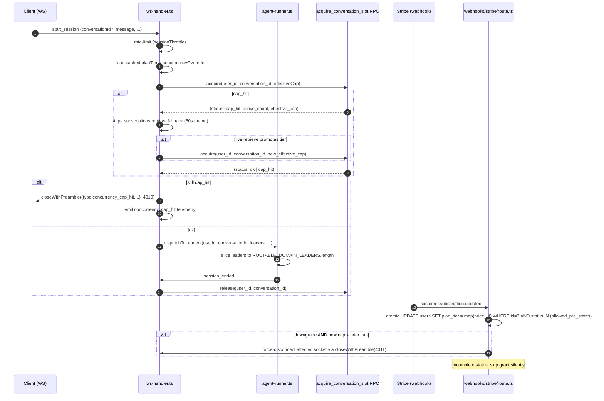
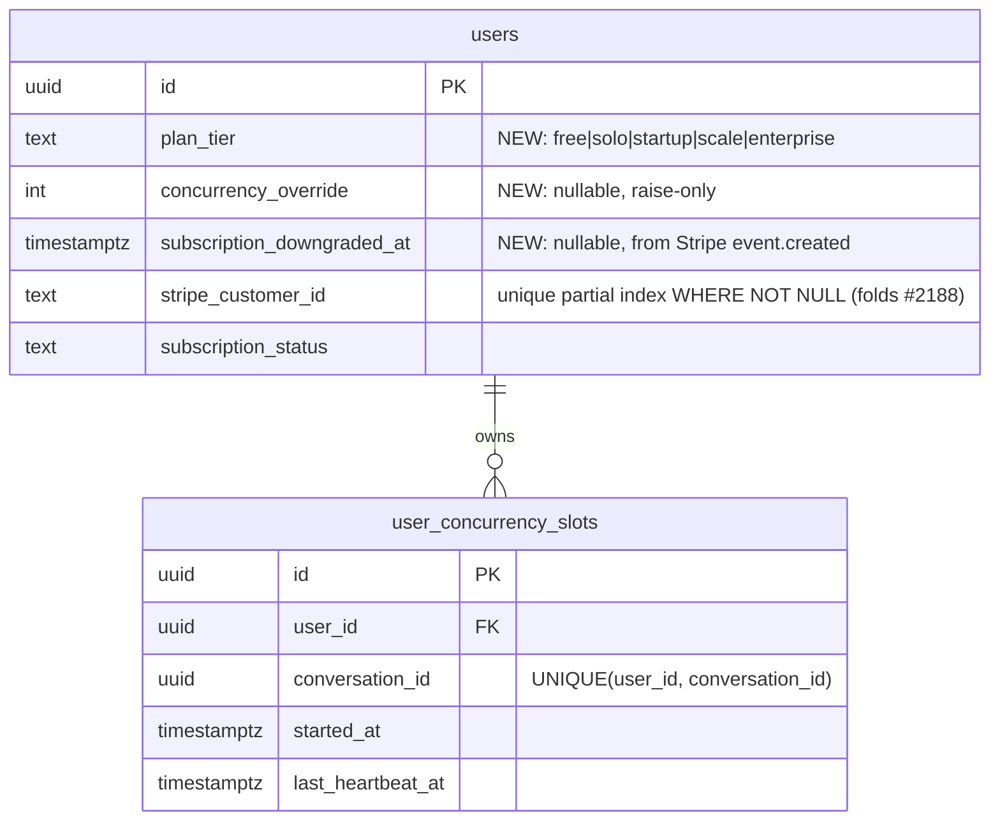

# Plan: Plan-Based Conversation Concurrency Enforcement

> **Canonicity:** the phase bodies below are the authoritative implementation specification. The "Research Reconciliation" table is indicative — read the phases if they disagree.

## Overview

Enforce the per-tier concurrent-conversation limits currently advertised on `soleur.ai/pricing` at the WebSocket session-start boundary, convert the at-capacity moment into an in-app Stripe Checkout upsell, rewrite the pricing page to remove the "Unlimited" liability, and ship proactive comms.

A **slot = one active conversation** (per brainstorm Amendment A). A conversation that fans out to N domain-leader specialists still counts as one slot. Fan-out is bounded by `ROUTABLE_DOMAIN_LEADERS.length` inline (no separate constant — leader count is already the ceiling). Close codes `4010 CONCURRENCY_CAP` and `4011 TIER_CHANGED` (4008 was already `RATE_LIMITED`).

Tier ladder: Free=1, Solo=2, Startup=5, Scale=50, Enterprise=50 (overridable via `users.concurrency_override`, raise-only).

### Plan-review consolidation (2026-04-19)

Three reviewers (DHH / Kieran / simplicity) converged on a lean-and-correct rescope. Applied cuts vs. the initial draft:

- **Dropped** Phase 8's circuit breaker + token bucket. Kept the single `stripe.subscriptions.retrieve()` + 60s memo cache on cap-hit (the minimum needed for FR6).
- **Dropped** `slot-counter.ts` wrapper — `supabase.rpc()` is called directly from `ws-handler.ts`.
- **Dropped** `PER_CONVERSATION_SPECIALIST_CAP` constant — `dispatchToLeaders` slices to `ROUTABLE_DOMAIN_LEADERS.length` inline.
- **Dropped** dedicated `downgrade-sweep.ts` module — replaced with a `pg_cron` scheduled SQL function (or whichever scheduler the app already uses; see Phase 2).
- **Dropped** `UpgradePendingBanner` v1 (Stripe `incomplete`) — webhook still ignores the state; client shows existing "Checkout didn't complete — try again" error. File follow-up if a real SCA user complains.
- **Collapsed** `AtCapacityBanner` + `DowngradeGraceBanner` into a single `AccountStateBanner` primitive with `variant` prop.
- **Deferred** 5 of 6 CFO-memo telemetry additions to `#2626` (per Kieran M5: their provenance — "prior 24h aggregate" — references materialized views the app does not have).
- **Corrected** Postgres lock-timeout semantics — use `PERFORM set_config('lock_timeout','500ms',true)` (txn-scoped) inside the RPC, not `SET LOCAL` which no-ops outside `BEGIN`.
- **Corrected** RPC return type — `RETURNS TABLE(status text, active_count int, effective_cap int)` not `jsonb`.
- **Reordered** phases so the `ClientSession` cache extension lands before the WS acquire path that reads from it.
- **Added** helper `closeWithPreamble(ws, code, preamble)` — raw `ws.close(4010, ...)` is banned by grep in pre-push.
- **Added** lazy-init `getPriceTier()` — module no longer throws at import time.
- **Added** Phase 0 live validation of each `STRIPE_PRICE_ID_*` via `stripe.prices.retrieve`.
- **Added** per-phase "Expected RED reason" so RED truly fails for the intended assertion (per `2026-04-18-red-verification-must-distinguish-gated-from-ungated`).
- **Collapsed** 18 phases → **10 phases**.

## Research Reconciliation — Spec vs. Codebase

This table is indicative; phases are canonical. Each row is a reality fact the implementer must hold.

| Spec claim / assumption | Codebase reality (2026-04-19) | Plan response |
|---|---|---|
| `WS_CLOSE_CODES.CONCURRENCY_CAP = 4008` (prior spec) | `4008 = RATE_LIMITED` in `apps/web-platform/lib/types.ts:17-27` | Use **4010** + **4011**; add both to `NON_TRANSIENT_CLOSE_CODES`. |
| `NON_TRANSIENT_CLOSE_CODES` lives in `ws-handler.ts` | Constant at `apps/web-platform/lib/ws-client.ts:66` | Edit `ws-client.ts`, not `ws-handler.ts`. |
| Modal primitive exists | No modal primitive — greenfield | Build `UpgradeAtCapacityModal.tsx` + `AccountStateBanner.tsx` from scratch. |
| `lib/plan-limits.ts` exists | Greenfield | Create per Phase 3. |
| `customer.subscription.updated` uses atomic `.in("status", [...])` idempotency | Applied **only to `invoice.paid`**; `updated` uses plain `.eq()` | Extend pattern to `updated` + `deleted`. Folds `#2190`. |
| `ClientSession` caches `tc_version` + `subscriptionStatus` | Only `subscriptionStatus` cached (`ws-handler.ts:55-70`) | Extend cache with `planTier` + `concurrencyOverride`. |
| `mock-supabase.ts` supports `FOR UPDATE` simulation | No FOR UPDATE simulation | Integration tests hit local Supabase; unit tests mock RPC response shape. |
| `CREATE INDEX CONCURRENTLY` is fine in migration | Supabase txn-wraps migrations — SQLSTATE 25001. Migrations 025/027/028 document the constraint | Plain `CREATE INDEX`; no CONCURRENTLY. |
| Both ws-handler and agent-runner lazily construct supabase client | Both call `createServiceClient()` at module scope | `vi.mock` factory returns a function; integration tests use real Supabase. |
| Single `STRIPE_PRICE_ID` env var | Referenced at `.env.example:22`, `app/api/checkout/route.ts:40`, `test/agent-env.test.ts:12` | Four new keys: `STRIPE_PRICE_ID_{SOLO,STARTUP,SCALE,ENTERPRISE}`. |
| Pricing copy is one block | Spans `pricing.njk` lines 184, 199, 214–217, 228–233, FAQ 253–256, JSON-LD 287–291 | Address every location; strings in copy artifact. |
| Wireframes finalized | `upgrade-modal-at-capacity.pen` copy says "agents"; needs re-render post-pivot | Phase 9 re-renders via `ux-design-lead`. |
| `dispatchToLeaders` fan-out has a bound | No cap — `Promise.allSettled` over all mentioned (`agent-runner.ts:1015-1025`) | Slice to `ROUTABLE_DOMAIN_LEADERS.length` before `Promise.allSettled`. |
| `sessionThrottle` gates `start_session` | Yes — `ws-handler.ts:345-355` | Slot acquire wires in after rate-limit, before `dispatchToLeaders`. |

## Goals / Non-Goals

See spec. Additions from the plan:

- Fold `#2188` (unique partial index on `users.stripe_customer_id WHERE NOT NULL`) and `#2190` (`customer.subscription.deleted` out-of-order guard) into the same migration/handler.
- Ship with spec FR9's original 5 telemetry fields. Defer the 6 CFO-memo additions to `#2626`.

## Architecture



Heartbeat (30s) touches `user_concurrency_slots.last_heartbeat_at`. A Supabase `pg_cron` job runs every 60s and evicts rows where `last_heartbeat_at < now() - interval '120 seconds'`. The acquire RPC also performs a lazy sweep inline.

## Data Model



RLS: `SELECT` owner-only. Writes go through service-role `SECURITY DEFINER` RPCs.

## Files to Edit

- `apps/web-platform/server/ws-handler.ts` — slot acquire at `start_session` (after `sessionThrottle`), extend `ClientSession` with `planTier` + `concurrencyOverride`, extend `pingInterval` heartbeat to touch `last_heartbeat_at`, call `closeWithPreamble(4011)` on downgrade force-disconnect, release slot on session_ended / ws close / abort.
- `apps/web-platform/server/agent-runner.ts` — in `dispatchToLeaders` (around line 1015), slice `leaders` to `ROUTABLE_DOMAIN_LEADERS.length` before `Promise.allSettled`; send `fanout_truncated` notice on slice.
- `apps/web-platform/app/api/webhooks/stripe/route.ts` — handle `customer.subscription.updated` + `customer.subscription.deleted` with atomic `.in("status", [...])` idempotency (folds `#2190`). Map `items[].price.id` via `getPriceTier()`. Skip grant on `status = "incomplete"`. Set `subscription_downgraded_at = event.created_at` on a tier reduction; clear it on a tier increase. On downgrade with new cap < prior cap, force-disconnect user WS with `4011`.
- `apps/web-platform/app/api/checkout/route.ts` — accept `targetTier` param → resolve via `getPriceTier()`; configure embedded Checkout (`ui_mode: "embedded"`, `return_url: /dashboard?upgrade=complete&session_id={CHECKOUT_SESSION_ID}`).
- `apps/web-platform/lib/types.ts` — add `WS_CLOSE_CODES.CONCURRENCY_CAP = 4010`, `WS_CLOSE_CODES.TIER_CHANGED = 4011`, `PlanTier` type.
- `apps/web-platform/lib/ws-client.ts` — add `4010` + `4011` to `NON_TRANSIENT_CLOSE_CODES` (line 66); on `4010` open `<UpgradeAtCapacityModal>`; on `4011` schedule reconnect after 500 ms and retry last queued action on reconnect.
- `apps/web-platform/lib/stripe.ts` — add `retrieveSubscriptionTier(userId, subId)` helper with 60s Map-based memo cache. No circuit breaker, no token bucket (cut).
- `apps/web-platform/test/helpers/mock-supabase.ts` — `.rpc()` surface for `acquire_conversation_slot` + `release_conversation_slot` returning the typed TABLE row shape.
- `plugins/soleur/docs/pages/pricing.njk` — exact strings from copy artifact at lines 184, 199, 214–217, 228–233, FAQ 253–256, JSON-LD 287–291.
- `.env.example` — document four new `STRIPE_PRICE_ID_*` keys; retain `STRIPE_PRICE_ID` with deprecation comment.

## Files to Create

- `apps/web-platform/supabase/migrations/029_plan_tier_and_concurrency_slots.sql` — users columns (`plan_tier`, `concurrency_override`, `subscription_downgraded_at`), unique partial index on `stripe_customer_id` (folds `#2188`), `user_concurrency_slots` table, RLS, two SECURITY DEFINER RPCs (`acquire_conversation_slot` with TABLE return, `release_conversation_slot`), `pg_cron`-scheduled sweep function.
- `apps/web-platform/lib/plan-limits.ts` — `PLAN_LIMITS`, `PLATFORM_HARD_CAP`, `effectiveCap(tier, override)` (raise-only), `nextTier(tier)`. No `PER_CONVERSATION_SPECIALIST_CAP` (redundant with `ROUTABLE_DOMAIN_LEADERS.length`).
- `apps/web-platform/lib/stripe-price-tier-map.ts` — exports `getPriceTier(priceId): PlanTier` (lazy init: reads env on first call; throws at first call if any of the four env vars is missing). Kept as a separate module because `app/api/checkout/route.ts` is a second consumer — fits Simplicity reviewer's extract-when-second-consumer rule.
- `apps/web-platform/lib/ws-close-helper.ts` — `closeWithPreamble(ws, code, preamble)` helper. Serializes preamble (≤2 KiB, warns over), sends, then closes. Banned raw pattern enforced by a pre-push grep: `rg 'ws\\.close\\(40[0-9]{2}' -g '!plugins'` must return zero hits outside this helper.
- `apps/web-platform/app/components/UpgradeAtCapacityModal.tsx` + sibling CSS module — 5 states (loading / default / error / admin-override / enterprise-cap) using copy artifact.
- `apps/web-platform/app/components/AccountStateBanner.tsx` — single primitive with `variant: "at-capacity" | "downgrade-grace"`. Takes the copy-artifact strings by variant.
- `apps/web-platform/test/helpers/synthetic-allowlist.ts` — exports `SYNTHETIC_EMAIL_RE = /^concurrency-test\+[0-9a-f-]+@soleur\.dev$/` + `assertSyntheticEmail(email)` that throws. `beforeAll` in destructive integration tests imports this.
- Unit tests alongside each new module. Integration tests in `apps/web-platform/test/integration/concurrency/*.test.ts`.
- Email template: `apps/web-platform/lib/email/templates/concurrency-enforcement-ship.ts` (per copy artifact §6).
- Changelog entry: appended to `CHANGELOG.md` (per copy artifact §7).

## Open Code-Review Overlap

Two open scope-outs touch files this plan will modify.

- **#2188** — unique partial index on `users.stripe_customer_id WHERE NOT NULL`. **Fold in** via Phase 2 migration. `Closes #2188` in PR body.
- **#2190** — guard `customer.subscription.deleted` against out-of-order events via `.in("status", [...])` atomic pattern. **Fold in** via Phase 5 webhook handler. `Closes #2190` in PR body.
- **#2191** — `clearSessionTimers` helper + reconnect jitter. **Acknowledge.** Orthogonal refactor; separate PR.
- **#2217** — `activeStreams` reducer refactor. **Acknowledge.** Different concern; separate PR.

Phase 0 preflight (ship-blocker):

```sql
SELECT stripe_customer_id, COUNT(*) FROM users
WHERE stripe_customer_id IS NOT NULL
GROUP BY 1 HAVING COUNT(*) > 1;
```

Expected: zero rows. If non-empty, either resolve duplicates manually or drop the unique partial index (track `#2188` separately — do NOT ship a migration that will fail).

## Implementation Phases

TDD-ordered. Each phase lists RED tests with the **expected RED failure reason** (per `2026-04-18-red-verification-must-distinguish-gated-from-ungated` — RED must fail for the intended assertion, not for a missing symbol). Infrastructure-only phases are exempt.

### Phase 0 — Preflight

Infrastructure only; TDD exempt.

- [ ] Fetch four Stripe price IDs from Dashboard (test + live modes). Confirm pricing $49 / $149 / $499 / Custom, monthly recurring.
- [ ] Write to Doppler `soleur/dev` and `soleur/prd`:

  ```bash
  for TIER in SOLO STARTUP SCALE ENTERPRISE; do
    doppler secrets set STRIPE_PRICE_ID_$TIER=price_xxx -p soleur -c dev
    doppler secrets set STRIPE_PRICE_ID_$TIER=price_xxx -p soleur -c prd
  done
  ```

- [ ] **Live validation** — resolve each configured price ID via `stripe.prices.retrieve` (test + live). Any 404 blocks the ship.

  ```bash
  doppler run -p soleur -c dev -- bun run scripts/verify-stripe-prices.ts
  doppler run -p soleur -c prd -- bun run scripts/verify-stripe-prices.ts
  ```

- [ ] Run the duplicate-stripe-customer-id preflight query against prd. Record result in PR body.
- [ ] Verify `@stripe/react-stripe-js` is at the correct `package.json` level (per `cq-before-pushing-package-json-changes`). Regenerate both `bun.lock` and `package-lock.json` if added.
- [ ] Verify lefthook + Doppler login for the worktree.

**Gate:** 4 Doppler keys present in both envs and resolve via Stripe API; duplicate query returns zero; deps installed at correct level.

### Phase 1 — WS close codes + `closeWithPreamble` helper + client routing

- [ ] **RED:** `lib/ws-close-helper.test.ts`
  - Calling `closeWithPreamble(mockWs, 4010, {type: "concurrency_cap_hit", ...})` calls `ws.send(JSON.stringify(preamble))` exactly once, then `ws.close(4010, "CONCURRENCY_CAP")`. Pin call order with `.toHaveBeenNthCalledWith`.
  - Preamble > 2 KiB logs warning via Sentry mirror.
  - **Expected RED reason:** assertion fails because helper does not exist (import resolves to `undefined`). Re-run after scaffold to hit behavior-level RED.
- [ ] **RED:** `lib/ws-client.test.ts` (extend)
  - `NON_TRANSIENT_CLOSE_CODES.includes(4010)` → `.toBe(true)`.
  - `NON_TRANSIENT_CLOSE_CODES.includes(4011)` → `.toBe(true)`.
  - On receiving preamble `{type: "concurrency_cap_hit", nextTier, activeCount, effectiveCap}` followed by close 4010, client emits `openUpgradeModal` event with the exact preamble payload.
  - On receiving close 4011, client schedules reconnect after 500 ms. Use manual `AbortController + setTimeout(...)` per `cq-abort-signal-timeout-vs-fake-timers` — never `AbortSignal.timeout`.
  - **Expected RED reason:** `NON_TRANSIENT_CLOSE_CODES` assertions fail because new codes are absent; preamble routing assertion fails because the handler does not dispatch to `openUpgradeModal`.
- [ ] **GREEN:**
  - `lib/types.ts` — add `CONCURRENCY_CAP: 4010, TIER_CHANGED: 4011` to `WS_CLOSE_CODES`.
  - `lib/ws-close-helper.ts` — implement helper. Size check. Sentry mirror on oversize via `reportSilentFallback()`.
  - `lib/ws-client.ts:66` — add 4010 + 4011 to `NON_TRANSIENT_CLOSE_CODES`. Extend close-handler to parse preamble and dispatch.
  - Pre-push grep (document as a lefthook snippet in the PR):

    ```bash
    rg 'ws\.close\(40[0-9]{2}' apps/web-platform --type ts -g '!lib/ws-close-helper.ts' && exit 1 || exit 0
    ```

**Gate:** close-code + helper tests GREEN. Grep returns zero hits outside the helper.

### Phase 2 — Migration `029_plan_tier_and_concurrency_slots.sql`

- [ ] **RED:** `test/integration/concurrency/slot-rpc.test.ts` — exercise the two RPCs against local Supabase. Destructive-path opens with `assertSyntheticEmail(user.email)` (Phase helper below).

  Scenarios (each pin exact post-state with `.toBe`):

  1. Acquire on fresh user → `{status: "ok", active_count: 1, effective_cap: 2}`.
  2. Second acquire same user, different `conversation_id` → `{status: "ok", active_count: 2}`.
  3. Third acquire over Solo cap → `{status: "cap_hit", active_count: 2, effective_cap: 2}`. Pre- and post-row-count on `user_concurrency_slots` both = 2 (insert rolled back).
  4. Reclaim own orphan: acquire → force expire `last_heartbeat_at` to 150s ago → re-acquire same `(user_id, conversation_id)` → `{status: "ok", active_count: 1}`. Row count remains 1 (Kieran S5 acquire-twice-idempotent).
  5. Sweep-and-reinsert in same lock window (Kieran C2): manually expire heartbeat, issue two concurrent acquires for the same user to different conversations under the per-user FOR UPDATE. Neither triggers spurious rollback. Pin the final `active_count` to `.toBe(2)`.
  6. Lazy sweep inside acquire removes any row older than 120s before counting. Seed 3 expired rows → new acquire returns `active_count: 1`.
  7. `release_conversation_slot` idempotency: release twice → no error, post-state row count `.toBe(0)`.

  **Expected RED reason:** `supabase.rpc("acquire_conversation_slot", ...)` fails with `function does not exist` on first run. Expected — confirm, then proceed to GREEN and re-run to hit behavior-level RED.

- [ ] Also write: `test/helpers/synthetic-allowlist.ts` exporting `SYNTHETIC_EMAIL_RE` + `assertSyntheticEmail()`. `beforeAll` in every destructive suite imports and asserts. Covers `cq-destructive-prod-tests-allowlist`.

- [ ] **GREEN:** write the migration. Structural highlights (full DDL below):

  ```sql
  ALTER TABLE users
    ADD COLUMN plan_tier text NOT NULL DEFAULT 'free'
      CHECK (plan_tier IN ('free','solo','startup','scale','enterprise')),
    ADD COLUMN concurrency_override integer NULL
      CHECK (concurrency_override IS NULL OR concurrency_override >= 0),
    ADD COLUMN subscription_downgraded_at timestamptz NULL;

  -- Folds in #2188
  CREATE UNIQUE INDEX users_stripe_customer_id_unique
    ON users (stripe_customer_id) WHERE stripe_customer_id IS NOT NULL;

  CREATE TABLE user_concurrency_slots (
    id uuid PRIMARY KEY DEFAULT gen_random_uuid(),
    user_id uuid NOT NULL REFERENCES users(id) ON DELETE CASCADE,
    conversation_id uuid NOT NULL,
    started_at timestamptz NOT NULL DEFAULT now(),
    last_heartbeat_at timestamptz NOT NULL DEFAULT now(),
    UNIQUE (user_id, conversation_id)
  );
  CREATE INDEX user_concurrency_slots_user_heartbeat_idx
    ON user_concurrency_slots (user_id, last_heartbeat_at);

  ALTER TABLE user_concurrency_slots ENABLE ROW LEVEL SECURITY;
  CREATE POLICY slots_owner_read ON user_concurrency_slots
    FOR SELECT USING (auth.uid() = user_id);

  -- Acquire RPC (Kieran C1: set_config txn-scoped; S1: TABLE return)
  CREATE OR REPLACE FUNCTION acquire_conversation_slot(
    p_user_id uuid,
    p_conversation_id uuid,
    p_effective_cap integer
  ) RETURNS TABLE (status text, active_count integer, effective_cap integer)
  LANGUAGE plpgsql
  SECURITY DEFINER
  SET search_path = public, pg_temp
  AS $$
  DECLARE
    v_count integer;
    v_was_insert boolean;
  BEGIN
    -- Txn-scoped lock timeout (set_config with is_local=true). SET LOCAL would
    -- no-op if the wrapping txn were absent; set_config is explicit.
    PERFORM set_config('lock_timeout', '500ms', true);

    PERFORM 1 FROM users WHERE id = p_user_id FOR UPDATE;

    DELETE FROM user_concurrency_slots
    WHERE user_id = p_user_id
      AND last_heartbeat_at < now() - interval '120 seconds';

    INSERT INTO user_concurrency_slots (user_id, conversation_id)
    VALUES (p_user_id, p_conversation_id)
    ON CONFLICT (user_id, conversation_id)
      DO UPDATE SET last_heartbeat_at = now()
    RETURNING (xmax = 0) INTO v_was_insert;

    SELECT COUNT(*) INTO v_count
      FROM user_concurrency_slots WHERE user_id = p_user_id;

    IF v_count > p_effective_cap AND v_was_insert THEN
      DELETE FROM user_concurrency_slots
      WHERE user_id = p_user_id AND conversation_id = p_conversation_id;
      status := 'cap_hit';
      active_count := v_count - 1;
      effective_cap := p_effective_cap;
      RETURN NEXT;
      RETURN;
    END IF;

    status := 'ok';
    active_count := v_count;
    effective_cap := p_effective_cap;
    RETURN NEXT;
  END;
  $$;

  CREATE OR REPLACE FUNCTION release_conversation_slot(
    p_user_id uuid,
    p_conversation_id uuid
  ) RETURNS void
  LANGUAGE sql
  SECURITY DEFINER
  SET search_path = public, pg_temp
  AS $$
    DELETE FROM user_concurrency_slots
    WHERE user_id = p_user_id AND conversation_id = p_conversation_id;
  $$;

  REVOKE ALL ON FUNCTION acquire_conversation_slot(uuid,uuid,integer) FROM PUBLIC;
  REVOKE ALL ON FUNCTION release_conversation_slot(uuid,uuid) FROM PUBLIC;
  GRANT EXECUTE ON FUNCTION acquire_conversation_slot(uuid,uuid,integer) TO service_role;
  GRANT EXECUTE ON FUNCTION release_conversation_slot(uuid,uuid) TO service_role;

  -- pg_cron sweep. Falls through if pg_cron extension is not enabled in
  -- the target project — wrap with a DO-block so the migration itself
  -- does not fail. Ops task: confirm pg_cron on prd.
  DO $$
  BEGIN
    IF EXISTS (SELECT 1 FROM pg_extension WHERE extname = 'pg_cron') THEN
      PERFORM cron.schedule(
        'user_concurrency_slots_sweep',
        '* * * * *',
        $sweep$
          DELETE FROM user_concurrency_slots
          WHERE last_heartbeat_at < now() - interval '120 seconds';
        $sweep$
      );
    END IF;
  END $$;
  ```

- [ ] Apply locally: `doppler run -p soleur -c dev -- supabase migration up`.
- [ ] Run RED tests. Confirm GREEN.

**Sibling precedent check:** re-read migrations 025, 027, 028 before committing — same no-CONCURRENTLY convention, same RLS-owner-read pattern.

**Gate:** migration applies cleanly; all 7 RPC scenarios GREEN.

### Phase 3 — `lib/plan-limits.ts` + `lib/stripe-price-tier-map.ts` + `ClientSession` cache

- [ ] **RED:** `lib/plan-limits.test.ts`
  - `PLAN_LIMITS.free === 1`, `.solo === 2`, `.startup === 5`, `.scale === 50`, `.enterprise === 50` — each `.toBe`.
  - `PLATFORM_HARD_CAP === 50`.
  - `effectiveCap("solo", null)` → `.toBe(2)`.
  - `effectiveCap("solo", 100)` → `.toBe(100)`.
  - `effectiveCap("solo", 0)` → `.toBe(2)` (raise-only).
  - `effectiveCap("enterprise", 200)` → `.toBe(200)`.
  - `nextTier("free")` → `.toBe("solo")`, `"enterprise"` → `.toBe(null)`.
  - **Expected RED reason:** module does not exist; test imports fail. Scaffold, then re-run for behavior-level RED.
- [ ] **RED:** `lib/stripe-price-tier-map.test.ts`
  - With all four env vars mocked, `getPriceTier(process.env.STRIPE_PRICE_ID_SOLO!)` → `.toBe("solo")`.
  - With one env var cleared, `getPriceTier("price_xxx")` throws `Error("STRIPE_PRICE_ID_* missing: STRIPE_PRICE_ID_STARTUP")` on **first call** (lazy init, not at import — Kieran M3).
  - Unknown price id → `.toBe("free")` + Sentry warning dispatched once via `reportSilentFallback()`.
  - Repeated calls within a process: env is read once, cached (no repeated throw for same missing var).
  - **Expected RED reason:** `getPriceTier` not exported; assertions fail on import resolution.
- [ ] **RED:** `ws-handler.test.ts` (extend existing)
  - After auth success, `session.planTier` matches the seeded user's `plan_tier`.
  - On subscription refresh timer tick, both `subscriptionStatus` AND `planTier` are re-read from DB in one query.
  - **Expected RED reason:** `session.planTier` is `undefined` because the select does not include the column yet.
- [ ] **GREEN:**
  - `lib/plan-limits.ts` — pure constants + `effectiveCap` + `nextTier`. No env reads.
  - `lib/stripe-price-tier-map.ts` — lazy init pattern:

    ```ts
    let cached: Record<string, PlanTier> | null = null;
    function loadMap(): Record<string, PlanTier> {
      const need = ["STRIPE_PRICE_ID_SOLO","STRIPE_PRICE_ID_STARTUP","STRIPE_PRICE_ID_SCALE","STRIPE_PRICE_ID_ENTERPRISE"];
      for (const k of need) if (!process.env[k]) throw new Error(`STRIPE_PRICE_ID_* missing: ${k}`);
      return {
        [process.env.STRIPE_PRICE_ID_SOLO!]: "solo",
        [process.env.STRIPE_PRICE_ID_STARTUP!]: "startup",
        [process.env.STRIPE_PRICE_ID_SCALE!]: "scale",
        [process.env.STRIPE_PRICE_ID_ENTERPRISE!]: "enterprise",
      };
    }
    export function getPriceTier(priceId: string): PlanTier {
      if (!cached) cached = loadMap();
      return cached[priceId] ?? "free";
    }
    ```

  - `ws-handler.ts:55-70` — extend `ClientSession` with `planTier?: PlanTier; concurrencyOverride?: number | null;`. Auth block (~line 840) selects `plan_tier` + `concurrency_override` + existing `subscription_status` in one query; assign to session. Refresh timer body mirrors.

**Gate:** all three test files GREEN; `tsc --noEmit` clean; importing the price-map module in a test without env vars does NOT crash.

### Phase 4 — Stripe webhook: write `plan_tier` authoritatively (folds #2190)

- [ ] **RED:** `test/integration/concurrency/stripe-webhook.test.ts` — against local Supabase + stubbed Stripe webhook builder.
  - Seed user at `plan_tier = "free"`. POST a fabricated `customer.subscription.updated` event with `items[0].price.id = STRIPE_PRICE_ID_STARTUP`, `status = "active"`. DB `plan_tier` → `.toBe("startup")`.
  - Replay the same event twice — second `UPDATE … .in("status", allowed_pre_states)` is a no-op (count unchanged).
  - Send `status = "incomplete"` → DB unchanged; no grant.
  - Send `customer.subscription.deleted` out of order after a later `updated` — guard prevents regression to `free`. Folds `#2190`.
  - Send `invoice.paid` event — DB `plan_tier` unchanged (dunning-only).
  - Send a downgrade (scale → solo). `subscription_downgraded_at` is set to the Stripe event's `created_at` (Kieran S4). WS is force-disconnected on the user via `closeWithPreamble(4011)`.
  - Send a subsequent upgrade back (solo → scale). `subscription_downgraded_at` is cleared to NULL.
  - **Expected RED reason:** the `customer.subscription.updated` handler does not exist / does not update `plan_tier`; `plan_tier` remains `"free"` after the event.
- [ ] **GREEN:**
  - Webhook route — add branches for `customer.subscription.updated` + `customer.subscription.deleted`.
  - `stripe.webhooks.constructEventAsync(await req.text(), sig, secret)` — `req.text()`, not `arrayBuffer`.
  - Map `event.data.object.items.data[0].price.id` via `getPriceTier()`.
  - On `status === "incomplete"` — push typed WS message `{type: "upgrade_pending"}` via `sendToClient`, do NOT update `plan_tier`. (Banner deferred — FR7 handling is webhook-side only in v1.)
  - Else atomic update: `supabase.from("users").update({ plan_tier, subscription_downgraded_at }).eq("id", userId).in("status", allowed_pre_states)`.
  - Compute old vs new `effectiveCap`. On reduction, set `subscription_downgraded_at = new Date(event.created * 1000)` and force-disconnect via `closeWithPreamble(4011)`. On increase or equal, clear `subscription_downgraded_at`.
  - Invalidate `retrieveSubscriptionTier` memo for this user.
  - NO `config` export (per `cq-nextjs-route-files-http-only-exports`).
  - Mirror any deny/fallback branch to Sentry via `reportSilentFallback()`. Exempt: `incomplete` as intended state.
- [ ] **After every edit** to the route file, run `next build --no-lint` against the app (Kieran M1).

**Gate:** integration tests GREEN; `next build` clean; `gh pr view` body Closes `#2190`.

### Phase 5 — WS start_session slot acquire/release + heartbeat + fan-out slice + Stripe fallback

This phase merges the three originally-separate concerns (slot lifecycle, fan-out cap, stripe-retrieve fallback) — they all live in the same WS start_session code path.

- [ ] **RED:** `test/integration/concurrency/start-session-cap.test.ts`
  - Seed user at `plan_tier = "solo"`. Start 2 conversations via fresh WS clients; both receive `session_started`.
  - Open a 3rd client; send `start_session`. Assertions:
    - Preamble `{type: "concurrency_cap_hit", nextTier: "startup", activeCount: 2, effectiveCap: 2}` received before close.
    - WS closes with 4010.
    - `concurrency_cap_hit` telemetry emitted with `path: "start_session"`.
  - Complete conversation 1; retry on 3rd client succeeds.
  - **Expected RED reason:** no preamble is sent; WS closes with 1000 or times out (cap check not wired yet).
- [ ] **RED:** `test/integration/concurrency/reconnect-reclaim.test.ts`
  - Start a conversation on Solo user. Abrupt close. Reconnect within 120s; resume same `conversationId`. `user_concurrency_slots` row count `.toBe(1)`.
  - **Expected RED reason:** reconnect currently produces a second row (leader_id-based key) or fails entirely.
- [ ] **RED:** `test/integration/concurrency/fanout-single-slot.test.ts`
  - Free user (cap = 1). Start 1 conversation. `@all` message fans out. `user_concurrency_slots` row count for this conversation `.toBe(1)`. No `concurrency_cap_hit` emitted.
  - **Expected RED reason:** without fan-out-as-one-slot semantics, the test expects a single row; current code does not create any rows yet.
- [ ] **RED:** `agent-runner.fanout-slice.test.ts`
  - With a stub `ROUTABLE_DOMAIN_LEADERS.length === 8`, monkey-patch `startAgentSession` to a spy. `dispatchToLeaders(userId, convId, [10 leaders], ...)` → spy called 8 times. `sendToClient` called with `{type: "fanout_truncated", dispatched: 8, dropped: 2}`.
  - With 8 or fewer leaders → no slice, no notice.
  - **Expected RED reason:** no slice happens; spy called 10 times.
- [ ] **RED:** `lib/stripe-retrieve-tier.test.ts`
  - Mock `stripe.subscriptions.retrieve` returns `items.data[0].price.id = STRIPE_PRICE_ID_STARTUP`, `status = "active"`. Seed DB `plan_tier = "solo"`. Call `retrieveSubscriptionTier(userId, subId)` → `.toBe({tier: "startup", status: "active"})`.
  - Second call within 60s → cache hit; `stripe.subscriptions.retrieve` not invoked again.
  - Webhook invalidation clears cache.
  - No circuit breaker; no token bucket (explicitly deferred).
  - **Expected RED reason:** helper does not exist.
- [ ] **GREEN:**
  - **Stripe fallback.** `lib/stripe.ts` adds:

    ```ts
    const memo = new Map<string, { tier: PlanTier; status: string; at: number }>();
    export async function retrieveSubscriptionTier(userId: string, subId: string) {
      const cached = memo.get(userId);
      if (cached && Date.now() - cached.at < 60_000) return cached;
      const sub = await stripe.subscriptions.retrieve(subId);
      const tier = getPriceTier(sub.items.data[0].price.id);
      const out = { tier, status: sub.status, at: Date.now() };
      memo.set(userId, out);
      return out;
    }
    export function invalidateTierMemo(userId: string) { memo.delete(userId); }
    ```

    Phase 4 webhook handler calls `invalidateTierMemo` on any `customer.subscription.*`.

  - **Fan-out slice.** `agent-runner.ts` top of `dispatchToLeaders`:

    ```ts
    const ceiling = ROUTABLE_DOMAIN_LEADERS.length;
    if (leaders.length > ceiling) {
      sendToClient(userId, {
        type: "fanout_truncated",
        dispatched: ceiling,
        dropped: leaders.length - ceiling,
      });
      leaders = leaders.slice(0, ceiling);
    }
    ```

  - **Acquire path.** `ws-handler.ts` `start_session` (after `sessionThrottle.isAllowed`, before `dispatchToLeaders`):

    1. `const cap = effectiveCap(session.planTier, session.concurrencyOverride);`
    2. `const { data: rows, error } = await supabase.rpc("acquire_conversation_slot", { p_user_id: userId, p_conversation_id, p_effective_cap: cap });`
    3. On `error` — retry up to 3× with ±100 ms jitter on SQLSTATE `40P01`/`55P03`; final failure → `reportSilentFallback()` + close with 4010 (fail-closed).
    4. On `rows[0].status === "cap_hit"`:
       - Call `retrieveSubscriptionTier(userId, session.subId)` once. If result `tier` gives higher `effectiveCap` than cached, update `session.planTier` and retry `acquire` once.
       - If still `cap_hit`, call `closeWithPreamble(ws, 4010, {type: "concurrency_cap_hit", nextTier, activeCount, effectiveCap})` + emit telemetry with `path: "start_session"`.
    5. On `rows[0].status === "ok"`: proceed into existing validation + `dispatchToLeaders` flow.

  - **Heartbeat.** `ws-handler.ts:860` `pingInterval` — when `session.conversationId` is set, also `supabase.rpc("acquire_conversation_slot", ...)` with the same cap (acquire is idempotent via `ON CONFLICT DO UPDATE`). Simpler than a separate `touch_heartbeat` RPC — piggybacks on the upsert semantics.

  - **Release.** On `session_ended` callback from `dispatchToLeaders`, on `abortActiveSession`, on `ws.on("close")` — call `supabase.rpc("release_conversation_slot", { p_user_id, p_conversation_id })`. Errors swallowed with a Sentry mirror (sweep is the correctness guarantee).

**Gate:** all five test files GREEN. No regression in existing `ws-handler.test.ts`.

### Phase 6 — Checkout route for embedded + return_url

- [ ] **RED:** `app/api/checkout/route.test.ts`
  - POST `{targetTier: "startup"}` with valid auth → Stripe Checkout session created with `price = STRIPE_PRICE_ID_STARTUP`, `ui_mode = "embedded"`, `return_url` containing the placeholders `{CHECKOUT_SESSION_ID}`. Response contains `clientSecret`.
  - Unknown `targetTier` → 400.
  - Missing auth → 401.
  - **Expected RED reason:** route currently only accepts the single legacy `STRIPE_PRICE_ID` — request with `targetTier` is ignored or 400s before the session is created.
- [ ] **GREEN:** refactor route to read price via `getPriceTier()` reverse-lookup by `targetTier` param (expose `priceIdForTier()` helper in `stripe-price-tier-map.ts`). Legacy `STRIPE_PRICE_ID` code path retained with a `logger.warn` deprecation.
- [ ] Handle `/dashboard?upgrade=complete&session_id=...` — on page mount, force-reconnect WS (re-reads `plan_tier`) and replay the last queued user action if present.
- [ ] **After every edit** to the route file, run `next build --no-lint`.

**Gate:** route tests GREEN; end-to-end Checkout → webhook → cap re-check succeeds with stub webhook.

### Phase 7 — Frontend: `UpgradeAtCapacityModal` + `AccountStateBanner`

- [ ] **RED:** `app/components/UpgradeAtCapacityModal.test.tsx`
  - Given `{state: "loading"}` → renders exact loading copy (data-hook: `[data-state="loading"]`).
  - Given `{state: "default", currentTier: "solo", nextTier: "startup", activeCount: 2}` → renders exact Solo→Startup default-variant strings from copy artifact. Pin with `.toBe(exactString)` per `cq-mutation-assertions-pin-exact-post-state`.
  - Given `{state: "error"}` → renders error copy; primary CTA re-opens Checkout.
  - Given `{state: "admin-override", cap: 200, activeCount: 200}` + `{state: "enterprise-cap", cap: 50, activeCount: 50}` → tier-specific copy.
  - Default variant has no "Maybe later" button.
  - Primary CTA calls `/api/checkout` with `targetTier` and mounts `<EmbeddedCheckoutProvider>`.
  - **No layout-gated assertions** per `cq-jsdom-no-layout-gated-assertions` — use `data-*` attribute hooks.
  - Sweep `global.fetch` mocks per `cq-preflight-fetch-sweep-test-mocks`.
  - **Expected RED reason:** component does not exist; import resolves `undefined`.
- [ ] **RED:** `app/components/AccountStateBanner.test.tsx`
  - `variant="at-capacity"` renders the 2-week post-ship copy from artifact §3.
  - `variant="downgrade-grace"` renders the downgrade copy from artifact §4.
  - **Expected RED reason:** component does not exist.
- [ ] **GREEN:** implement both. `UpgradeAtCapacityModal` uses `@stripe/react-stripe-js` `<EmbeddedCheckoutProvider>` + `<EmbeddedCheckout>`. Wire a top-level layout listener to the `openUpgradeModal` event emitted by `ws-client.ts` (Phase 1).

**Gate:** all component tests GREEN. Visual QA deferred to `/soleur:qa` run pre-ship.

### Phase 8 — Pricing page rewrite + wireframe re-render

- [ ] Apply exact strings from copy artifact §2 to `pricing.njk` at lines 184, 199, 214–217, 228–233, FAQ 253–256, JSON-LD 287–291.
- [ ] **Ship-prep flag:** copy artifact's "Up to 25 seats" for Scale tier is provisional. Confirm number with CMO/CPO before ship. If unresolved at ship-prep, revert to "Custom seat count".
- [ ] Grep check (all three must return zero in `pricing.njk`):

  ```bash
  rg -i "concurrent agent" plugins/soleur/docs/pages/pricing.njk
  rg -i "agents in parallel" plugins/soleur/docs/pages/pricing.njk
  rg -i "unlimited" plugins/soleur/docs/pages/pricing.njk
  ```

- [ ] Run `npx markdownlint-cli2 --fix` on changed `.md` files with specific paths only (per `cq-markdownlint-fix-target-specific-paths`).
- [ ] Eleventy build clean; JSON-LD validates against schema.org Offer.
- [ ] **Wireframe re-render.**
  - Pre-flight: `cq-pencil-mcp-silent-drop-diagnosis-checklist` — verify `PENCIL_CLI_KEY`, adapter-drift check.
  - Open committed `.pen` via `mcp__pencil__open_document` (path is already tracked — `cq-before-calling-mcp-pencil-open-document`).
  - Invoke `ux-design-lead` with: "Re-render 5 states using exact copy from `knowledge-base/marketing/copy/2026-04-19-concurrency-enforcement-conversation-slot.md`. Replace every 'agents' with 'conversations'. Re-export PNG screenshots."
  - Post-save `stat -c %s` must be > 0.
  - Grep the saved `.pen` JSON for `"agents"` substring — must return zero in customer-copy fields.
- [ ] Commit regenerated `.pen` + screenshots.

**Gate:** all three greps return zero; Eleventy build clean; `.pen` file > 0 bytes with no "agents" substring.

### Phase 9 — Telemetry

- [ ] **RED:** `server/telemetry.concurrency-cap-hit.test.ts`
  - On cap-hit, event emitted with fields `tier`, `active_conversation_count`, `effective_cap`, `action` (default `"abandoned"` if no client follow-up within 30s), `path` (one of `"start_session" | "downgrade_sweep" | "hard_cap_24h"`). All pinned with `.toBe`.
  - No extra fields present (spec FR9's original 5 only).
  - **Expected RED reason:** telemetry emission does not exist on the cap-hit path.
- [ ] **GREEN:** emit `concurrency_cap_hit` at each deny site in `ws-handler.ts` (start_session) and in the pg_cron-fed `downgrade_sweep` path (Phase 2's cron closure pushes an event via a dedicated RPC or in-app job).
- [ ] **Deferred to `#2626`:** the 6 CFO-memo additions (`specialist_fan_out_count`, `conversation_duration_seconds`, `tokens_in_total`, `tokens_out_total`, `model_mix`, `conversation_id_hash`). Plan §References documents the deferral. `#2626` will add the materialized views the fields depend on.

**Gate:** telemetry test GREEN; staging cap-hit appears in analytics dashboard within 30s with all 5 fields.

### Phase 10 — Ship + post-merge verification

- [ ] Pre-ship: run the 30-day count query on prd Supabase:

  ```sql
  SELECT u.id, u.email, COUNT(*) AS peak_conversations
  FROM conversations c
  JOIN users u ON u.id = c.user_id
  WHERE c.created_at > now() - interval '30 days'
  GROUP BY u.id, u.email
  HAVING COUNT(*) > 2;
  ```

  Record result in PR body. If zero: skip email (per FR8). If non-zero: enqueue the template from copy artifact §6.
- [ ] Append changelog entry from copy artifact §7 to `CHANGELOG.md`. Per `cq-prose-issue-ref-line-start`, no line starts with `#NNNN`.
- [ ] `/ship` — enforces review + compound + domain gates. Semver label: `minor` (new feature, backward-compatible: existing rows get `plan_tier='free'` default).
- [ ] PR body: `Closes #1162`, `Closes #2188`, `Closes #2190`. Reference `#2624`, `#2625`, `#2626`.

**Post-merge operator checklist** — see separate section below.

## Domain Review

**Domains relevant:** Engineering (CTO), Product (CPO), Marketing (CMO), Finance (CFO), Operations (COO).

Brainstorm carry-forward per skill Phase 2.5 — all findings captured in brainstorm `## Domain Assessments` and Amendment A. Re-consults completed this session:

- **CFO re-consult:** memo at `knowledge-base/finance/memos/2026-04-19-conversation-slot-economics-cfo-reconsult.md`. Five of six additional telemetry fields deferred to `#2626` (Kieran M5: provenance dependent on materialized views not in scope here).
- **CMO re-consult (via copywriter):** artifact at `knowledge-base/marketing/copy/2026-04-19-concurrency-enforcement-conversation-slot.md`. All strings committed.

### Engineering (CTO)

**Status:** reviewed
**Assessment:** Postgres row-lock RPC is the right primitive. Post-review correctness fixes: `PERFORM set_config` replaces `SET LOCAL` (C1); RPC returns `TABLE` not `jsonb` (S1); `closeWithPreamble` helper is ban-enforced (M2); `next build` is a per-edit gate on route files (M1). No new infra.

### Product (CPO)

**Status:** reviewed (brainstorm carry-forward)
**Assessment:** Conversation-slot framing resolves the "1 message → 8 agents" UX objection. Free-tier = 1 added. In-app Stripe Checkout remains the highest-intent upgrade surface.

### Marketing (CMO)

**Status:** reviewed (brainstorm carry-forward + copywriter re-take)
**Assessment:** "Concurrent conversations" is the public noun. All pricing / modal / banner / email copy committed. Scale "Up to 25 seats" flagged for ship-prep confirmation.

### Finance (CFO)

**Status:** reviewed (brainstorm carry-forward + reconsult memo)
**Assessment:** Do NOT adjust pricing in this PR. Ship with original 5 telemetry fields; defer 6 additions to `#2626`. 24h downgrade leakage bounded ~$10–15/user — acceptable. Sales can raise `concurrency_override` up to 2× tier default without contract amendment.

### Operations (COO)

**Status:** reviewed (inline — no agent invoked)
**Assessment:** Four new Doppler keys. One ongoing operational touchpoint: pg_cron sweep health (fold into existing Supabase monitoring). No new vendor procurement. Runbook note filed as follow-up (not in this PR).

### Product/UX Gate

**Tier:** blocking (new `components/**/*.tsx` files trip the mechanical-escalation rule).
**Decision:** reviewed
**Agents invoked:** spec-flow-analyzer (spec phase — 15 flow gaps resolved inline); cpo (via brainstorm); ux-design-lead (wireframes committed; re-render in Phase 8); copywriter (artifact committed).
**Skipped specialists:** none.
**Pencil available:** yes.

#### Findings

- Wireframes cover 5 states; copy needs re-render (Phase 8).
- No dead-end flows. Stripe `incomplete` is silent in v1 (SCA banner deferred); `cancel_url` N/A with embedded; `return_url` lands at `/dashboard?upgrade=complete` which force-reconnects and re-reads tier.
- Cap-hit flow: single primary CTA; no "Maybe later" by design.

### Brainstorm-recommended specialists

All specialists named in brainstorm `## Domain Assessments` are covered by the pipeline (`ux-design-lead`, `copywriter`, `spec-flow-analyzer`) or invoked this session (`cfo` memo, `copywriter` artifact). No silent skips.

## Acceptance Criteria

### Pre-merge (PR)

- [ ] Free user with 1 active conversation: 2nd start rejected with 4010.
- [ ] Solo user with 2 active conversations: 3rd start rejected with 4010.
- [ ] Startup user with 5 active conversations: 6th start rejected with 4010.
- [ ] Scale user at 50: 51st rejected (platform hard cap).
- [ ] `concurrency_override=100`: 51st start succeeds (raise-only, override > default).
- [ ] `concurrency_override=0` on Solo: 3rd start still rejected (raise-only, override < default ignored).
- [ ] `@all` fan-out inside one conversation: single row in `user_concurrency_slots`; cap count is 1.
- [ ] Conversation with 9+ `@mention`ed leaders: dispatches to `ROUTABLE_DOMAIN_LEADERS.length`; `fanout_truncated` event emitted.
- [ ] Downgrade Startup → Solo with 4 active conversations: all 4 continue, 5th blocked. `subscription_downgraded_at` = Stripe event `created`. WS force-disconnect via 4011.
- [ ] Stripe lag: DB = Solo, retrieve = Startup — 3rd start succeeds. 60s memo cache.
- [ ] Stripe `incomplete`: DB unchanged; no banner in v1 (generic error only).
- [ ] Task completion decrements slot count within 5s.
- [ ] Abrupt disconnect: slot freed within 130s via sweep.
- [ ] Reconnect mid-conversation: single row reclaimed (no double-count).
- [ ] Modal renders 5 states with exact copy-artifact strings.
- [ ] `concurrency_cap_hit` emits with 5 fields (tier, active_conversation_count, effective_cap, action, path).
- [ ] `pricing.njk`: zero "Unlimited", zero "concurrent agents", zero "agents in parallel".
- [ ] All `ws.close(40XX)` calls use `closeWithPreamble()` — pre-push grep returns zero raw calls.
- [ ] PR body: `Closes #1162`, `Closes #2188`, `Closes #2190`.
- [ ] Changelog entry appended.
- [ ] Wireframes re-rendered; screenshots regenerated.

### Post-merge (operator)

- [ ] Migration `029` applied to prd Supabase. Verify columns + index + table + policy via REST read-back. Runbook: `knowledge-base/engineering/ops/runbooks/supabase-migrations.md`.
- [ ] All four `STRIPE_PRICE_ID_*` in Doppler `prd`; each resolves via `stripe.prices.retrieve`.
- [ ] Real Stripe test-mode webhook end-to-end: subscribe test account to Startup; DB `plan_tier` flips within 30s.
- [ ] Real cap-hit on prd via test account: event in analytics with all 5 fields.
- [ ] `AccountStateBanner variant="at-capacity"` visible on a logged-in prd session.
- [ ] Email from Phase 10 pre-ship query dispatched if non-zero users.
- [ ] `pg_cron` sweep alive: confirm via `SELECT * FROM cron.job_run_details WHERE jobname='user_concurrency_slots_sweep' ORDER BY start_time DESC LIMIT 5` — at least one recent success.
- [ ] `gh pr view`: `#1162`, `#2188`, `#2190` auto-closed.
- [ ] Sentry: watch 24h for `reportSilentFallback` events tagged `feature="concurrency"`.
- [ ] Follow-up issues filed: Scale-tier seat-number confirmation (if unresolved), legacy `STRIPE_PRICE_ID` deprecation, banner sunset at ship + 14 days, `UpgradePendingBanner` re-evaluation, `#2626` telemetry expansion (materialized views).

## Risks & Mitigations

- **Stripe webhook / `start_session` race.** Cache can hold stale `planTier` when a cap is enforced. Mitigation: single `retrieveSubscriptionTier` fallback on cap-hit (60s memo) + webhook invalidation on any `customer.subscription.*`. Fail-closed on both-deny.
- **Per-user row lock contention.** `FOR UPDATE` on `users.id` serializes same-user acquires. At ≤50 concurrent users pre-GA, contention negligible. Revisit at >100 sessions/s.
- **Module-scope Supabase client + `vi.mock` factory.** Integration tests use real local Supabase; unit tests mock RPC response shape only. Per `cq-test-mocked-module-constant-import`.
- **Cloudflare idle-timeout vs heartbeat.** 120s sweep threshold, 100s Cloudflare idle, 30s ping. Worst-case stale slot ~130s. `ON CONFLICT DO UPDATE` reclaim covers common reconnect.
- **Migration duplicate stripe_customer_id.** Phase 0 preflight. If non-zero: resolve manually or drop the unique partial index sub-task. Do NOT ship a failing migration.
- **Pencil MCP silent drop.** Phase 8 adapter-drift pre-flight; post-save `stat -c %s` > 0 and grep `"agents"` returns zero.
- **`cq-nextjs-route-files-http-only-exports`.** `next build --no-lint` runs after every route-file edit (Kieran M1). Only `next build` catches non-HTTP exports.
- **Scale-tier "Up to 25 seats" provisional.** Phase 8 ship-prep fallback to "Custom seat count".
- **pg_cron extension absent on prd.** Phase 2 migration DO-block is no-op if pg_cron missing. Phase 10 post-merge confirms the job exists; if absent, file issue and run the sweep from application code as a fallback (≤5 lines).
- **Dependency drift on `@stripe/react-stripe-js`.** Pin exact version; Phase 0 preflight validates.
- **Preamble lost under TCP reset.** Clean-close code delivery is best-effort. Preamble carries the authoritative payload; close-code is secondary. `closeWithPreamble` helper enforces the contract.
- **`customer.subscription.deleted` with active sessions.** Treat as paid-tier downgrade: grace + 24h sweep. Covered by Phase 5 release + pg_cron.
- **Stripe `incomplete` UX gap in v1.** No dedicated banner; generic error only. File follow-up issue if a real SCA user reports confusion.
- **Circuit breaker intentionally absent.** At 0 paying users + Stripe 99.99% SLA, expected outage exposure is effectively zero. Add the breaker when `concurrency_cap_hit` telemetry shows measurable false-deny rate.

## Rollout Plan

No flag — pricing-page ladder has been public for months. Zero beta users as of 2026-04-19.

1. PR merges → migration applies → existing users default to `plan_tier='free'`.
2. Webhook writes `plan_tier` for any active subscription within minutes (Doppler keys set pre-deploy).
3. `AccountStateBanner variant="at-capacity"` for 2 weeks.
4. Email (if any) in a batch post-deploy.
5. 7-day monitoring: cap-hit rate, fallback frequency, pg_cron sweep activations.

**Rollback:** `supabase migration down` drops new columns + table; server code gates on column presence for partial-rollback safety. PR revert removes WS-level enforcement without data loss.

## Test Strategy

- **Unit:** `plan-limits`, `stripe-price-tier-map`, `stripe-retrieve-tier`, `ws-close-helper`, `UpgradeAtCapacityModal`, `AccountStateBanner`, `agent-runner.fanout-slice`. Pin exact post-state with `.toBe`.
- **Integration (local Supabase, real RPCs):** `slot-rpc`, `start-session-cap`, `reconnect-reclaim`, `fanout-single-slot`, `stripe-webhook`, `downgrade-grace`, `checkout-route`.
- **Destructive tests:** gate on `assertSyntheticEmail()` from `test/helpers/synthetic-allowlist.ts` in every `beforeAll`.
- **Runner:** in worktree, `cd apps/web-platform && ./node_modules/.bin/vitest run` (never `npx vitest`).
- **`next build --no-lint`** is a gate after every edit to `apps/web-platform/app/api/**/route.ts`.
- **QA (`/soleur:qa`):** Playwright MCP drive of all 5 modal states + Stripe Checkout round-trip + `return_url` replay. Screenshots in PR.

## Deferrals / Scope-outs

Tracked via GitHub issues per `wg-when-deferring-a-capability-create-a`:

- `#2624` — observe-only telemetry re-eval after ship.
- `#2625` — Solo cap A/B (2 vs 3 vs metered).
- `#2626` — CFO cost model **expanded to cover** the 6 deferred telemetry fields (`specialist_fan_out_count`, `conversation_duration_seconds`, `tokens_in_total`, `tokens_out_total`, `model_mix`, `conversation_id_hash`) with required materialized views.

Additional post-ship follow-up issues (file at ship):

- `UpgradePendingBanner` for Stripe `incomplete` (reassess if SCA user complains).
- Slot-count UI in workspace header.
- "Wait for current slot" secondary modal action (if telemetry supports demand).
- `STRIPE_PRICE_ID` legacy-var deprecation.
- Banner sunset calendar entry at ship + 14 days.
- Scale-tier seat-number confirmation (if unresolved at ship-prep).
- Stripe fallback circuit breaker + token bucket (when telemetry shows measurable false-deny rate).

## References

### Internal

- Spec: `knowledge-base/project/specs/feat-plan-concurrency-enforcement/spec.md`
- Brainstorm (Amendment A): `knowledge-base/project/brainstorms/2026-04-19-plan-concurrency-enforcement-brainstorm.md`
- CFO memo: `knowledge-base/finance/memos/2026-04-19-conversation-slot-economics-cfo-reconsult.md`
- Copy artifact: `knowledge-base/marketing/copy/2026-04-19-concurrency-enforcement-conversation-slot.md`
- Wireframes: `knowledge-base/product/design/upgrade-modal-at-capacity.pen` (re-render in Phase 8)

### Learnings applied

- `2026-03-27-websocket-close-code-routing-reconnect-loop.md` → Phase 1.
- `2026-04-14-atomic-webhook-idempotency-via-in-filter.md` → Phase 4.
- `2026-04-13-ws-session-cache-subscription-status.md` → Phase 3 cache extension.
- `2026-04-18-destructive-test-allowlist-regex-must-pin-exact-shape.md` → `synthetic-allowlist.ts`.
- `2026-04-18-red-verification-must-distinguish-gated-from-ungated.md` → every RED step.
- `2026-04-18-supabase-migration-concurrently-forbidden.md` → Phase 2.
- `2026-04-13-stripe-status-mapping-check-constraint.md` → Phase 4.
- `2026-04-18-rls-for-all-using-applies-to-writes.md` → Phase 2 RLS.
- AGENTS rules: `cq-mutation-assertions-pin-exact-post-state`, `cq-silent-fallback-must-mirror-to-sentry`, `cq-destructive-prod-tests-allowlist`, `cq-nextjs-route-files-http-only-exports`, `cq-docs-cli-verification`, `cq-jsdom-no-layout-gated-assertions`, `cq-abort-signal-timeout-vs-fake-timers`, `cq-test-mocked-module-constant-import`, `cq-preflight-fetch-sweep-test-mocks`, `cq-code-comments-symbol-anchors-not-line-numbers`, `cq-in-worktrees-run-vitest-via-node-node`.

### External (versions anchored in spec)

- `stripe@17.7.0` (API `2025-02-24.acacia`).
- `@supabase/supabase-js@2.99.2`.
- `next@15.5.12`.
- `bun@1.3.11`.

### Related

- Parent: `#673` (Phase 4 / roadmap 4.7).
- Shipped: `#1078` Stripe subscription management.
- Separate: `#1046` per-IP WS rate limiting.
- Folds: `#2188`, `#2190`.
- Acknowledges (separate PRs): `#2191`, `#2217`.
- Defers to: `#2624`, `#2625`, `#2626`.
