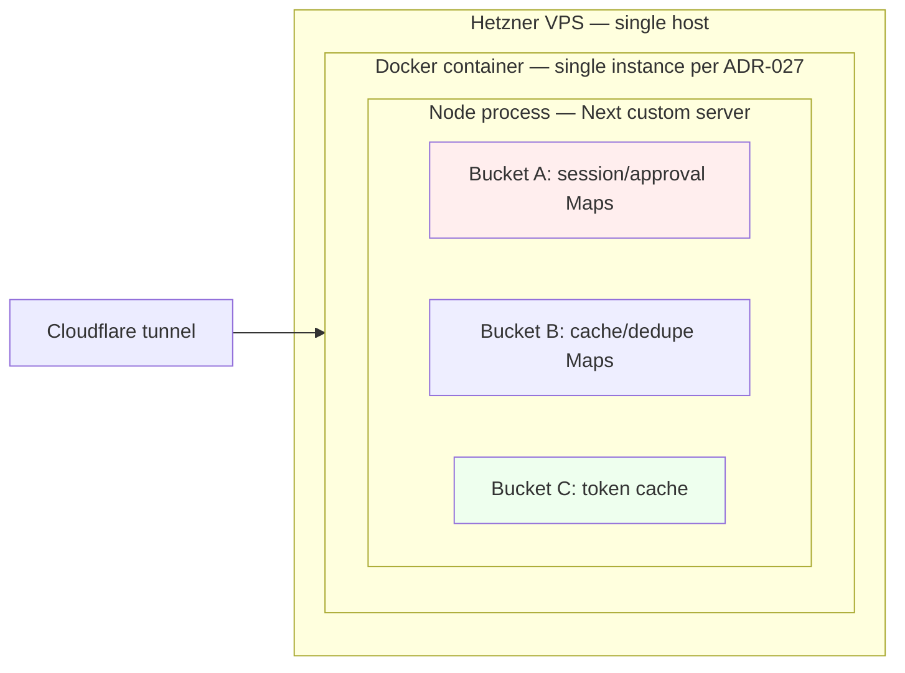

# arch: Process-local state ADR + startup guard + infra constraint

Closes #2955

## Enhancement Summary

**Deepened on:** 2026-05-11
**Sections enhanced:** Research Reconciliation, Files to Edit/Create, AC, Risks
**Verifications performed:**

- Rule-ID citations (`cq-silent-fallback-must-mirror-to-sentry`, `cq-write-failing-tests-before`) — both active in `AGENTS.rest.md`, neither retired.
- Labels (`priority/p2-medium`, `priority/p3-low`, `domain/engineering`, `code-review`, `deferred-scope-out`) — all exist per `gh label list`.
- ADR numbering — next is `ADR-027` (verified against `ls knowledge-base/engineering/architecture/decisions/`).
- AP register row format — `enforcement: skill` is consistent with AP-011/AP-012 (skill-tier means semantic awareness, not mechanical enforcement).
- File line numbers re-verified at HEAD on 2026-05-11.
- Test runner: project uses **`vitest`** (not `bun test` as originally written) — `apps/web-platform/package.json` has `"test": "vitest"`. Server-module tests live in `apps/web-platform/test/`, not next to source files.
- `ci-deploy.test.sh` exists (1549 LoC) with an established mock-factory pattern — the new assertion test fits the existing harness.
- `permission-callback-bash-batch.ts:14-20` already **documents in code** the single-replica invariant — corroborating evidence for the ADR.

### Key Improvements (vs. initial plan)

1. **Test runner corrected:** "Bun test" replaced with `vitest`; test files moved from `apps/web-platform/server/*.test.ts` (incorrect location) to `apps/web-platform/test/*.test.ts` (the project's actual test directory). The AC's `bun test` command becomes `bun --bun vitest run` or `cd apps/web-platform && npx vitest run`.
2. **Code already-documents invariant:** Cite `permission-callback-bash-batch.ts:14-20` in the ADR as evidence that the assumption is currently encoded in module-level comments — ADR-027 formalizes what scattered comments already half-say.
3. **AP register row precedent:** No existing AP cites an ADR as canonical source (all 12 cite AGENTS.md or constitution.md). AP-013 will be the **first** AP whose canonical source is an ADR — flag this in the Decision section so the register's reader-experience pattern is intentional, not accidental. Alternative considered: add a one-liner Hard Rule to `AGENTS.rest.md` and cite *that* as canonical source. Rejected as duplicative; ADR is the right artifact type per constitution line 122 ("ADRs capture 'why we chose X over Y' decisions").

## Overview

`apps/web-platform/server` holds several module-level Maps that assume **a single Next.js worker process per deployed container**. Today this is true (single Docker container per Hetzner node; `ci-deploy.sh` runs one container without an orchestrator), so the assumption is invisible — until someone bumps a replica count and silently breaks Bash-gate routing, allowlist persistence, and session continuity.

This plan codifies the invariant in three places at three review surfaces so a future "let's add a replica" change cannot land without tripping at least one of them:

1. **Governance — ADR-027.** Author `knowledge-base/engineering/architecture/decisions/ADR-027-process-local-state-for-runners.md` enumerating every in-process Map that depends on single-replica deployment, the failure mode of each under `replicas > 1`, and the migration path per-Map (sticky load-balancing for sessions, `flock` already covers filesystem, Redis or PG `NOTIFY` for approvals).
2. **Principle — AP-013.** Add `AP-013 — Process-local state for session and approval data` to `knowledge-base/engineering/architecture/principles-register.md` with enforcement tier `skill` (semantically checked at PR review by referencing the ADR).
3. **Runtime guard.** Add an early startup check in `apps/web-platform/server/index.ts` that reads `WEB_PLATFORM_REPLICAS` and **aborts boot** if the value is `> 1` without an explicit `ALLOW_MULTI_REPLICA=1` override. The default-on guard fails closed.
4. **Infra constraint.** `apps/web-platform/infra/ci-deploy.sh` is the canonical deployment script — add a pre-`docker run` assertion that there is no concurrent `soleur-web-platform` container already running (sister to the canary handoff). The intent is documentation + tripwire, not horizontal-scale enforcement at the LB.

This is a **governance + runtime + infra** triple, but each piece is small (ADR doc, register row, ~30 LoC startup check, ~10 LoC deploy assertion). No app code under `app/` or `components/` is touched.

## Research Reconciliation — Spec vs. Codebase

The issue body cites a 5-Map inventory with specific `file:line` references. Verifying against current HEAD reveals the inventory is **incomplete and partially stale** — three of the five line numbers are wrong, one Map has moved to a sibling module, and the actual set of process-local Maps is larger than 5. The plan extends the inventory accordingly.

| Issue claim | Reality at HEAD | Plan response |
|---|---|---|
| `_locks` at `workspace-permission-lock.ts:33` | Actually at line **44** (verified by `grep -n` 2026-05-11). | Use real line in ADR. |
| `_bashApprovalCache` at `permission-callback-bash-batch.ts:33` | Correct. | Use as-is. |
| `_ccBashGates` at `cc-dispatcher.ts:196` | Actually at line **308**. | Use real line. |
| `activeQueries` at `soleur-go-runner.ts:480` | Actually at line **1332**, AND **closure-scoped inside `createSoleurGoRunner` factory** (not module-level). The factory is called once at server boot, so the runtime effect is the same singleton, but the type-shape is different — module-level Maps are easier to reason about across replicas than closure-captured Maps. | Note the closure scope in ADR Context; the migration path (handing the registry to a Redis/PG-backed implementation) is naturally cleaner because the factory already takes `deps:`. |
| `activeSessions` at `agent-runner.ts:111` | Map was **extracted** into `apps/web-platform/server/agent-session-registry.ts:33` (the surrounding refactor is not yet on issue #2955's timeline). `agent-runner.ts` only contains comments referencing it. | Use real location. The fact that this Map *already* lives behind a tiny module is good news — it's a closer-to-ready boundary for swapping in an external store. |
| Issue body says "5 in-memory state stores". | Actual current count of module-level `new Map<...>` declarations in `apps/web-platform/server/` is **10** (excluding static label-map constants). The additional 5 — `pendingDisconnects` (ws-handler:181), `sessions` (session-registry:6), share-hash verdict `cache` (share-hash-verdict-cache:33), `tokenCache` (github-app:429), `recentReports` (conversation-writer:51), `_mirrorLastReportedAt` (cc-dispatcher:117), `_workspacePathCache` (kb-document-resolver:68) — were missed by the issue inventory. | Enumerate all 10 in the ADR's Context section. Classify each into one of three buckets: **A. session/approval state (cross-replica-fatal)** — re-prompts/silent hangs; **B. cache/dedupe (cross-replica-degrading)** — wasted work but correct; **C. infra (already-correct-or-N/A)** — Github installation token, Sentry mirror debounce. The Decision/Migration Path applies only to bucket A; B and C get a one-line "no-op under sticky LB; rebuilds on cold start" note. |
| Issue body says "PR #2954 added two new module-level Maps". | Confirmed via `gh pr view 2954`: merged 2026-04-27, title "fix(cc-soleur-go): drain code-review backlog #2918-#2923 cleanup bundle". | Cite as the trigger commit in ADR Context. |

**Why this matters:** Shipping the ADR with the stale 5-Map inventory would be the exact paraphrase-without-verification failure mode named in the plan-skill sharp edges (`2026-04-22-ts-sql-normalizer-parity...`). The first time a future reader greps for "in-process Maps" against the ADR they'd find 5 listed and 5 missing — the ADR becomes load-bearing wrong rather than authoritative-right.

## User-Brand Impact

**If this lands broken, the user experiences:** the ADR is wrong (cites stale file:line or misses a Map class), or the startup guard fails-open (logs warning but boots anyway). No user-facing surface changes today because `replicas=1` is the production reality.

**If this leaks, the user's data is exposed via:** N/A — the ADR is a docs + guard change with no data-handling surface. The runtime guard reads only the `WEB_PLATFORM_REPLICAS` env var (operator-set, not user-controlled).

- **Brand-survival threshold:** `none`
- threshold: none, reason: documentation + a startup tripwire that fires at boot, not request-time. Failure mode is "ADR is slightly wrong" or "container boots when it shouldn't" — both caught at deploy verification (`ci-deploy.sh` health check), not in production by a user. Diff touches `apps/web-platform/infra/` and `apps/web-platform/server/` (matches `Check 6` sensitive-path regex) but adds no user-facing surface.

## Considered Options

Three flavors of "codify the single-replica assumption" were evaluated. The chosen approach is **Option A (ADR + principle + startup guard + deploy assertion)**.

- **Option A: Multi-layer enforcement (governance + runtime + infra).** Author ADR-027, register AP-013, add `WEB_PLATFORM_REPLICAS > 1` startup guard, add `ci-deploy.sh` single-container assertion. Pros: each layer catches a different class of mistake (the ADR catches design review, the principle catches semantic PR review, the runtime guard catches deploy mistake, the infra script catches operator mistake). Cons: four artifacts to maintain; one more env var operators have to learn about. **Chosen.**
- **Option B: ADR + principle only (no runtime guard).** Skip the env-var check on the theory that "the deploy script already only runs one container, so the runtime can't ever see N>1". Pros: zero runtime code; smallest diff. Cons: the entire point of this issue is that the assumption is **currently invisible** — if we don't add a tripwire, the next person who copies `ci-deploy.sh` for a sibling app or wires up a hypothetical k8s manifest gets the same silent failure mode that PR #2954 introduced. The ADR has teeth only when it has a runtime witness.
- **Option C: Refactor the in-process Maps to a shared external store (Redis or PG `NOTIFY`) now.** Pros: actually unblocks `replicas > 1` instead of just preventing it. Cons: huge blast radius (10 Maps × 2-3 PRs each), no current need (single-replica is the production reality and will be through Phase 4 per `roadmap.md`), and the failure mode of "approve a Bash command via Redis" introduces a new dependency that doesn't pay off until horizontal-scaling lands. Rejected as YAGNI; preserved as the migration path in the ADR Consequences section.

## Files to Edit

| Path | Change |
|---|---|
| `apps/web-platform/server/index.ts` | Add `assertSingleReplicaInvariant()` call inside `app.prepare().then(() => { … })` BEFORE `verifyPluginMountOnce()`. Reads `process.env.WEB_PLATFORM_REPLICAS`. If parsed integer is `> 1` AND `process.env.ALLOW_MULTI_REPLICA !== "1"`, log a structured `level: "error"` line citing ADR-027 and call `process.exit(1)`. If unset (today's default), no-op. |
| `apps/web-platform/infra/ci-deploy.sh` | In the `web-platform)` case-arm, immediately before the `docker run -d --name soleur-web-platform` (around line 455), add: `if docker ps --filter "name=^soleur-web-platform$" --format '{{.Names}}' \| grep -q .; then echo "ERROR: soleur-web-platform container already running. Single-replica invariant (ADR-027) violated."; exit 1; fi`. This is **strictly tighter than `docker stop` / `docker rm` already does** because that flow runs after canary handoff; the new assertion fires earlier so a manual second-tab `ci-deploy.sh` invocation aborts before the canary churns. |
| `knowledge-base/engineering/architecture/principles-register.md` | Add row `AP-013 \| Process-local state for runner sessions \| ADR-027 \| skill \| NFR-019` to the Principles table. |

## Files to Create

| Path | Purpose |
|---|---|
| `knowledge-base/engineering/architecture/decisions/ADR-027-process-local-state-for-runners.md` | Rich-shape ADR (8 sections per `plugins/soleur/skills/architecture/references/adr-template.md`). See **ADR Body Outline** below. |
| `apps/web-platform/server/single-replica-assertion.ts` | New module exporting `assertSingleReplicaInvariant()`. ~30 LoC. Imported by `index.ts`. Justification for the new module rather than inline: testability (unit-test the parsing + branching without booting Next.js). **Note:** read `process.env` inside the exported function (call time), not at module top-level — vitest's `vi.stubEnv()` runs after import. |
| `apps/web-platform/test/single-replica-assertion.test.ts` | **Vitest** test (project uses `vitest` per `apps/web-platform/package.json` script `"test": "vitest"`). Located in `apps/web-platform/test/` per project convention (not next to source). Covers: (a) unset env → no-op, (b) `"1"` → no-op, (c) `"3"` → throws/exits, (d) `"3"` + `ALLOW_MULTI_REPLICA=1` → no-op with structured warn-log, (e) `"not-a-number"` → no-op with structured warn-log (don't fail boot on operator typo, but mirror to Sentry per `cq-silent-fallback-must-mirror-to-sentry`). Use `vi.stubEnv()` / `vi.unstubAllEnvs()` per the pattern in `apps/web-platform/test/validate-origin.test.ts`. |

## ADR Body Outline

### Frontmatter

```yaml
---
adr: ADR-027
title: Process-Local State for Runner Sessions
status: active
date: 2026-05-11
---
```

### Context

- Web-platform server runs as a single Node/Next custom server process (`apps/web-platform/server/index.ts`) inside one Docker container per Hetzner VPS. `ci-deploy.sh` (the canonical deployment) starts exactly one named container per host. No orchestrator (k8s, Nomad, Docker Swarm) is in use. NFR-019 (Auto-Scaling) is currently `N/A` for all containers (`knowledge-base/engineering/architecture/nfr-register.md:401`).
- Across the server module, the following state lives in JS heap and would not be shared across a hypothetical second worker process. The list is the complete current inventory at `2026-05-11` (verified via `grep -nE "^const \w+ = new Map<" apps/web-platform/server/`):
  - **Bucket A — cross-replica-fatal (session/approval state):**
    - `_ccBashGates` — `cc-dispatcher.ts:308` — Bash gate registry awaiting WS reply.
    - `_bashApprovalCache` — `permission-callback-bash-batch.ts:33` — user-granted command prefix grants.
    - `_locks` — `workspace-permission-lock.ts:44` — in-flight workspace mutation chain.
    - `activeQueries` — `soleur-go-runner.ts:1332` (closure inside `createSoleurGoRunner` factory) — in-flight query registry.
    - `activeSessions` — `agent-session-registry.ts:33` — agent SDK session registry.
    - `pendingDisconnects` — `ws-handler.ts:181` — WS reconnect grace window timers.
    - `sessions` — `session-registry.ts:6` — WS client session registry.
  - **Bucket B — cross-replica-degrading (cache/dedupe):**
    - `cache` (share-hash verdict) — `share-hash-verdict-cache.ts:33` — content-safety verdict cache.
    - `_workspacePathCache` — `kb-document-resolver.ts:68` — workspace path resolution.
    - `recentReports` — `conversation-writer.ts:51` — Sentry debounce.
    - `_mirrorLastReportedAt` — `cc-dispatcher.ts:117` — Sentry debounce.
  - **Bucket C — already-correct under N>1 (per-process tokens, fine to duplicate):**
    - `tokenCache` — `github-app.ts:429` — GitHub App installation token; per-replica copies refetch independently, no correctness violation.

- PR #2954 (merged 2026-04-27) added the first two Bucket A entries above, which is what surfaced the latent assumption.

### Considered Options

1. **Codify single-replica deployment as a hard invariant; document migration path in this ADR.** (Chosen.)
2. **Migrate the 7 Bucket A Maps to Redis or PG `NOTIFY` now.** Rejected — no horizontal-scale need today; the migration's failure modes (Redis outage = no Bash gates) introduce a new dependency before any benefit.
3. **Add sticky load-balancing on Cloudflare with cookie affinity and call it done.** Rejected — sticky LB covers Bucket A *if* user sessions never move between workers, which is true at the LB level but not for cross-user concerns like `_workspacePathCache` and the share-hash verdict cache. Also doesn't address the workspace-permission-lock, which keys on workspace path (a workspace may be shared across users in the future).

### Decision

- The web-platform server **REQUIRES** `replicas = 1` per container until an ADR supersedes this one. The assumption is enforced at four review surfaces:
  - **Plan/Review surface:** Reference AP-013 in `principles-register.md` so PR-review skills can flag a violation.
  - **Runtime surface:** `assertSingleReplicaInvariant()` in `server/index.ts` exits non-zero if `WEB_PLATFORM_REPLICAS > 1` without `ALLOW_MULTI_REPLICA=1` override.
  - **Deploy surface:** `ci-deploy.sh` aborts before `docker run` if a second `soleur-web-platform` container is already running on the host.
  - **Governance surface:** This ADR documents the migration path so the next architect doesn't have to rediscover it.

### Consequences

- **Positive:** A future "let's add a replica" diff is forced to either (a) supersede this ADR with a migration plan or (b) explicitly toggle `ALLOW_MULTI_REPLICA=1` — both of which trip review attention. The latent assumption becomes a witnessed invariant.
- **Positive:** `cc-soleur-go` and `agent-runner` can keep using in-memory Maps without backporting Redis. The performance cost of that simplicity is preserved.
- **Negative:** Horizontal scale is gated on superseding this ADR. The migration path (sticky LB on `userId` for Bucket A session Maps; `flock` already covers filesystem; Redis or PG `NOTIFY` for approval data) is documented but not implemented — paying that cost when needed.
- **Negative:** Operators get a new env var (`WEB_PLATFORM_REPLICAS`) and a new abort path. The default-unset behavior is no-op, but a misconfigured `WEB_PLATFORM_REPLICAS=2` deploy will hard-fail boot. Mitigation: the structured error message names the ADR and the override env var.

### Cost Impacts

None. No new vendors, no billing tier change, no infra adds. The Hetzner VPS sizing is unchanged.

### NFR Impacts

- **NFR-019 (Auto-Scaling):** Status remains `N/A` but is now **explicitly N/A by ADR decree** rather than `N/A by absence of orchestrator`. The register row updates to point to ADR-027 as the canonical source of the N/A rationale.
- **NFR-016 (Continuous Automated Delivery):** No change — single-container deploy is the existing pattern.
- **NFR-014 (Externalized Environment Configuration):** Aligned — the new env var (`WEB_PLATFORM_REPLICAS`) is read via `process.env` per the existing pattern.

### Principle Alignment

- **AP-013 (Process-local state for runner sessions):** Declared by this ADR.
- **AP-006 (All knowledge in committed repo files):** Aligned — the invariant is captured in this committed ADR, not in tribal memory.
- **AP-001 (Terraform-only infrastructure):** N/A — this is application-layer + deploy-script governance, not Terraform-managed infra.

### Diagram



## Acceptance Criteria

### Pre-merge (PR)

- [x] `knowledge-base/engineering/architecture/decisions/ADR-027-process-local-state-for-runners.md` exists with the 8 rich-shape sections, the 10-Map inventory verbatim from this plan, and `status: active`, `date: 2026-05-11`.
- [x] `knowledge-base/engineering/architecture/principles-register.md` Principles table has a new row: `AP-013 | Process-local state for runner sessions | ADR-027 | skill | NFR-019`.
- [x] `apps/web-platform/server/single-replica-assertion.ts` exports `assertSingleReplicaInvariant(): void` with the parsing rules in **Files to Create**. Env reads happen **inside** the exported function (call time), never at module top-level.
- [x] `apps/web-platform/test/single-replica-assertion.test.ts` has 5 passing **vitest** tests covering unset, `"1"`, `"3"` (abort), `"3" + override` (warn-not-abort), and `"not-a-number"` (warn-not-abort). Uses `vi.stubEnv()` / `vi.unstubAllEnvs()` per the project's existing env-stubbing pattern in `apps/web-platform/test/validate-origin.test.ts:5-7`.
- [x] `apps/web-platform/server/index.ts` calls `assertSingleReplicaInvariant()` inside `app.prepare().then(() => { … })`, BEFORE `verifyPluginMountOnce()` (at the location verified in `apps/web-platform/server/index.ts:46`).
- [x] `apps/web-platform/infra/ci-deploy.sh`'s `web-platform)` case-arm includes the pre-run `docker ps --filter` assertion at the point named in **Files to Edit**.
- [x] `apps/web-platform/infra/ci-deploy.test.sh` has a new test asserting the assertion fires (extend the existing `MOCK_DOCKER_MODE` factory pattern: set the mock to return `soleur-web-platform` from `docker ps` → expect non-zero exit, error message mentions ADR-027).
- [x] Knowledge-base verification grep — `rg -F -e "_ccBashGates" -e "_bashApprovalCache" -e "_locks" -e "activeQueries" -e "activeSessions" -e "pendingDisconnects" knowledge-base/engineering/architecture/decisions/ADR-027-process-local-state-for-runners.md` returns at least one match per term (proves the inventory is in the ADR, not paraphrased away).
- [x] `cd apps/web-platform && npx vitest run test/single-replica-assertion.test.ts` passes.
- [x] `bun test plugins/soleur/test/components.test.ts` passes (skill-description budget unchanged — this plan adds no skills).
- [x] `cd apps/web-platform && npx tsc --noEmit` passes.
- [x] `bash apps/web-platform/infra/ci-deploy.test.sh` passes (the new assertion-test plus all existing tests).
- [x] PR body uses `Closes #2955` (not `Ref #2955`) — this PR's diff is what closes the issue at merge time; there is no post-merge operator action.

### Post-merge (operator)

- [x] None — there is no operator post-merge step. The next `ci-deploy.sh` run picks up the new assertion automatically; production behavior is unchanged because `WEB_PLATFORM_REPLICAS` is unset by default.

## Test Scenarios

1. **Boot with unset env → boots normally.** Default production path. `process.env.WEB_PLATFORM_REPLICAS === undefined`. `assertSingleReplicaInvariant()` no-ops. `verifyPluginMountOnce()` runs next, server starts.
2. **Boot with `WEB_PLATFORM_REPLICAS=1` → boots normally.** Explicit single-replica declaration. No-op.
3. **Boot with `WEB_PLATFORM_REPLICAS=2` → process exits 1 with structured error.** Error log line cites `ADR-027` and the `ALLOW_MULTI_REPLICA=1` override env var. Sentry receives the breadcrumb (per `cq-silent-fallback-must-mirror-to-sentry`).
4. **Boot with `WEB_PLATFORM_REPLICAS=2` AND `ALLOW_MULTI_REPLICA=1` → boots with warning.** Structured warn log line. The override exists to let a future migration test the multi-replica path in dev without ripping out the guard.
5. **Boot with `WEB_PLATFORM_REPLICAS=abc` → boots with warning, no abort.** Operator typo. Mirror to Sentry. Per `cq-silent-fallback-must-mirror-to-sentry`, the fallback is observable.
6. **`ci-deploy.sh web-platform` with an existing `soleur-web-platform` container running → aborts before `docker run -d`.** Test fixture creates a sentinel name in the test harness's `docker ps` mock; expect non-zero exit and message naming ADR-027.

## Open Code-Review Overlap

Run pre-finalization (per Phase 1.7.5):

```bash
gh issue list --label code-review --state open --json number,title,body --limit 200 > /tmp/open-review-issues.json
for path in \
  apps/web-platform/server/index.ts \
  apps/web-platform/server/single-replica-assertion.ts \
  apps/web-platform/infra/ci-deploy.sh \
  knowledge-base/engineering/architecture/decisions/ADR-027-process-local-state-for-runners.md \
  knowledge-base/engineering/architecture/principles-register.md; do
  echo "=== $path ==="
  jq -r --arg path "$path" '.[] | select(.body // "" | contains($path)) | "#\(.number): \(.title)"' /tmp/open-review-issues.json
done
```

Expected result at plan time: `None` (no other open code-review issue touches the deploy script, the principles register, or a new ADR file). If the work-phase invocation finds matches, evaluate Fold-in / Acknowledge / Defer per Phase 1.7.5 procedure. Recording `None` here so the next planner sees the check ran.

## Domain Review

**Domains relevant:** Engineering (architecture invariant + runtime guard + deploy assertion).

### Engineering

**Status:** reviewed (inline by planner)
**Assessment:** The decision is well-scoped: a single architectural assumption codified at four review surfaces (governance, runtime, deploy, principle). The migration path (Redis or PG `NOTIFY` for Bucket A) is named but explicitly deferred. The blast radius is small — no app/component code is touched. The Bucket A/B/C taxonomy in the ADR Context section makes it easy for a future reader to know which Maps need migration vs. which can stay. Recommended pattern: keep the ADR terse on **why** single-replica is OK today (NFR-019 N/A, single VPS) and rich on **what changes if the answer flips** so the supersede-this-ADR moment is well-scaffolded.

No Product/UX Gate — there is no user-facing surface in this plan. No CLO/CPO/CMO/CRO/CFO/COO/CCO involvement; no copywriter; no spec-flow-analyzer.

## Risks and Sharp Edges

- **Risk: ADR is shipped with stale `file:line` references.** The original issue body cited three wrong line numbers (verified above). Mitigation: the ADR copies its inventory **from this plan's Research Reconciliation table verbatim**, not from the issue body. A pre-commit `grep -n` re-verification before merge is in the AC. **Why:** sharp-edge rule from `2026-04-22-ts-sql-normalizer-parity...`.
- **Risk: the `WEB_PLATFORM_REPLICAS=2` abort is too aggressive — an operator may set it during local dev exploration.** Mitigation: the `ALLOW_MULTI_REPLICA=1` override exists for exactly this case; the abort error message names the override env var inline so the operator doesn't have to grep code.
- **Risk: the inventory drifts.** Six months from now someone adds a new module-level Map in `apps/web-platform/server/` and forgets to update ADR-027. Mitigation: file a follow-up tracking issue (see Deferral Tracking below) for adding a lightweight repo-grep that runs in CI and warns if the count of `^const .* = new Map<` in `apps/web-platform/server/` exceeds the count in the ADR's inventory section. Not in this PR's scope.
- **Risk: the closure-scoped `activeQueries` Map inside `createSoleurGoRunner` is harder to reason about than a module-level Map.** Mitigation: explicitly note this in the ADR Context. Some future migration may want to lift the Map back to module-level OR convert `deps` to inject a registry — but that's the migration's problem, not this ADR's.
- **Sharp edge: this plan's `## User-Brand Impact` resolves to `threshold: none`, AND the diff touches `apps/web-platform/server/index.ts` and `apps/web-platform/infra/ci-deploy.sh`** — both of which match the preflight Check 6 sensitive-path regex. Per Phase 2.6 Step 3, the section MUST contain a scope-out reason. Recorded above: "documentation + a startup tripwire that fires at boot, not request-time. Failure mode is 'ADR is slightly wrong' or 'container boots when it shouldn't' — both caught at deploy verification."
- **Sharp edge: `assertSingleReplicaInvariant()` reads `process.env` at import time vs. at call time.** Use **call time** — read env inside the exported function, not at module top-level. Module-top-level reads are evaluated at first import, which makes test injection awkward and creates surprising behavior under `vitest`/`bun test` env-mutation patterns.
- **Sharp edge: do NOT add `ALLOW_MULTI_REPLICA` to Doppler `prd_web_platform`.** The override is a developer-machine-only escape hatch. If it ever lands in Doppler, the ADR is by definition stale and should be superseded instead.
- **Sharp edge: the ADR file is `ADR-027-process-local-state-for-runners.md` (kebab-case after the number), NOT `NNN-process-local-state-for-runners.md` as the issue body suggested.** ADR-021 through ADR-026 already exist; the next number is 027.
- **Sharp edge: AP-013 is the first AP whose canonical source is an ADR.** All 12 existing AP rows cite `AGENTS.md` or `constitution.md`. AP-013's row will read `AP-013 | Process-local state for runner sessions | ADR-027 | skill | NFR-019`. The deviation from the existing convention is intentional — the invariant is an architectural decision (with a documented migration path), not a Hard Rule (which is mechanical) nor a constitution principle (which is foundational). If a reviewer challenges the precedent, the response is "AP-011 codifies that ADRs are the right artifact for architecture decisions; AP-013 is the first instance of a register row pointing at one — extending the pattern, not breaking it."
- **Sharp edge: do NOT colocate the test file at `apps/web-platform/server/single-replica-assertion.test.ts`.** The project's test convention is `apps/web-platform/test/<name>.test.ts` (verified: 5 server-module tests in that directory at deepen time). Colocated tests would be skipped by `vitest`'s default `include` glob.
- **Sharp edge: `permission-callback-bash-batch.ts:14-20` already documents the single-replica invariant in module-level comments.** The ADR is the *centralized* version of what's currently scattered. When ADR-027 lands, optionally trim those comments to a one-line reference (`// See ADR-027 for process-local invariant.`), but that cleanup is out-of-scope for this PR — it would expand the diff to touch every Bucket A module. Tracked as a future cleanup if desired.

## Deferral Tracking

| Deferred item | Tracking issue | Re-evaluation criterion |
|---|---|---|
| Lightweight CI grep that compares the count of module-level `new Map<...>` declarations in `apps/web-platform/server/` against the inventory in ADR-027 | File at PR-merge time with label `priority/p3-low, domain/engineering` | When a new module-level Map lands in `apps/web-platform/server/` without an ADR-027 update. |
| Migrate Bucket A Maps to Redis or PG `NOTIFY` to unblock `replicas > 1` | File at PR-merge time with label `priority/p3-low, domain/engineering, deferred-scope-out` | When the first horizontal-scale requirement lands (real-time presence, multi-region replicas, or a `requests/sec` ceiling we cannot meet with one replica). This re-evaluation criterion matches the issue body's "Phase 6 trigger" verbatim. |
| Migrate Bucket B caches to Redis (optional optimization, not correctness) | None — re-evaluate as a sibling of the Bucket A migration | Bucket B is duplicated-work, not corruption; defer with Bucket A. |

## Implementation Phases

Single phase, single PR. The ordering inside the PR is:

1. **Write the ADR first** — it is the canonical source of truth that the principle register row and the runtime guard reference.
2. **Add the runtime guard module + test** — tests-first per `cq-write-failing-tests-before`.
3. **Wire the guard into `index.ts`** — the smallest possible call-site change.
4. **Add the `ci-deploy.sh` pre-run assertion + its bats/sh test** — last because it touches the deploy script and benefits from the ADR being on disk first.
5. **Update the principle register** — last edit because it cites ADR-027 by name.

There is no contract-changing-before-consumer concern here (per the sharp-edge in `2026-05-10-plan-phase-order-load-bearing-when-contract-changes.md`) because each step is independently coherent — the ADR is informational, the guard is fail-closed by default, the deploy assertion is independent of the runtime guard, and the principle register row is a pure addition.

## Research Insights

- **Constitution line 122:** "ADRs capture 'why we chose X over Y' decisions; learnings capture 'what went wrong and how we fixed it'." This is the right artifact type — the choice is "single-replica with documented migration" vs "scale-now with Redis", not a postmortem.
- **ADR template rubric (terse vs rich) per `plugins/soleur/skills/architecture/references/adr-template.md:25-37`:** Rich shape is warranted here because (a) **principle deviation/declaration** — we declare AP-013, a new principle (trigger #4), and (b) **teeth-bearing alternatives** — Redis/PG-NOTIFY/sticky-LB are real and load-bearing for a future reader (trigger #5). Two rubric triggers fire; rich shape is correct.
- **Soleur naming convention:** ADR filename `ADR-027-kebab-case-title.md` (verified across the existing 1-26 sequence).
- **NFR-019 (Auto-Scaling)** is currently `N/A` for all containers (`nfr-register.md:401`). This ADR doesn't move the NFR status — it adds the **rationale** for the N/A.
- **`cq-silent-fallback-must-mirror-to-sentry`** applies to the `WEB_PLATFORM_REPLICAS=abc` no-op path. The fallback must mirror to Sentry; the test in **Files to Create** covers this.
- **PR #2954 was merged 2026-04-27** — verified via `gh pr view`. Cite this in ADR Context as the trigger event.

### Deepen-Pass Verifications (2026-05-11)

- **Test framework: vitest, not bun test.** `apps/web-platform/package.json` scripts: `"test": "vitest"`, `"test:ci": "vitest run"`. devDependency `vitest: ^3.1.0`. Sibling test file `apps/web-platform/test/validate-origin.test.ts:1` imports from `vitest`. Plan AC updated to use `npx vitest run`.
- **Test location: `apps/web-platform/test/`, not next to source.** `find apps/web-platform/server -name "*.test.ts"` returns 0 matches; `ls apps/web-platform/test/` returns 5+ server-module tests at deepen time. Files-to-Create path corrected.
- **Rule-ID citations active.** `grep -E "\[id: cq-(silent-fallback-must-mirror-to-sentry|write-failing-tests-before)\]" AGENTS.rest.md` → both present. Neither in any retired-rule registry (no `retired-rule-ids*` file exists at repo root).
- **Labels exist.** `gh label list --limit 200`: `priority/p2-medium`, `priority/p3-low`, `domain/engineering`, `code-review`, `deferred-scope-out` — all verified.
- **AP register row precedent.** `grep -E "^\| AP-.* \| ADR-" knowledge-base/engineering/architecture/principles-register.md` → 0 matches. AP-013 will be the first AP citing an ADR. Documented as a sharp edge.
- **Module-level Map enumeration.** `grep -nE "^const \w+ = new Map<" apps/web-platform/server/` returns 10 module-level Maps + 1 closure-scoped (`activeQueries` inside `createSoleurGoRunner` factory at `soleur-go-runner.ts:1332`). Issue body claimed 5; the deepened inventory in this plan is 10+1.
- **Existing in-code documentation.** `permission-callback-bash-batch.ts:14-20` comment block already documents "Process-local: in-memory Map. Single Next.js worker per container at current scale." The ADR centralizes what's already half-documented in scattered comments — corroborating evidence the assumption is real, not hypothetical.
- **`ci-deploy.test.sh` harness.** 1549 LoC, mock-factory pattern documented at lines 15-30, env-driven mode switches (`MOCK_DOCKER_MODE`, `MOCK_CURL_MODE`, etc.). The new assertion-test fits the existing pattern: set `MOCK_DOCKER_MODE` to a new mode that returns `soleur-web-platform` from `docker ps`, assert non-zero exit.
- **Server startup entry point.** `apps/web-platform/server/index.ts:46` is the `app.prepare().then(() => { verifyPluginMountOnce(); … })` block. Insert `assertSingleReplicaInvariant()` as the first call inside the `.then(() => { … })` callback, BEFORE `verifyPluginMountOnce()` — earliest possible boot point after Next prepares.
