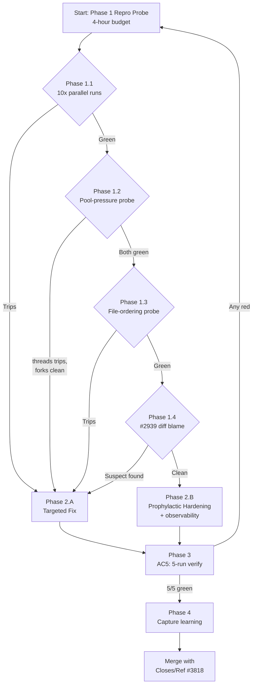

# fix: 4 pre-existing test flakes in apps/web-platform (kb-chat-sidebar + chat-page)

Closes #3818.

## Overview

Issue #3818 reports 4 vitest files failing during `/ship` Phase 4 for an
unrelated content-only PR (feat-one-shot-2729 → PR #3798). The failures
cluster on the **kb-chat-sidebar family** and **chat-page session-confirmation
gate** — the exact surface PR #2819 hardened with `isolate: true` +
`afterAll` scrub + drift-guard.

Local full-suite run on `feat-one-shot-3818` (407 files, 4406 tests):

```text
Test Files  400 passed | 7 skipped (407)
     Tests  4367 passed | 39 skipped (4406)
  Duration  61.50s
```

**The bug is flake-class, not feature-class.** All 4 named tests pass in
isolation AND in the full parallel suite locally. The fix surface is
test infrastructure (`apps/web-platform/test/setup-dom.ts`, `vitest.config.ts`,
the 4 named test files), not the components themselves
(`kb-chat-sidebar.tsx`, `chat-surface.tsx`, `kb-chat-content.tsx`).

## Research Reconciliation — Spec vs. Codebase

The issue body and the codebase reality disagree in three places. Reconcile
inline so the plan does not inherit issue-body fiction:

| Issue Claim | Codebase Reality | Plan Response |
|---|---|---|
| "The failures are pre-existing on main." | Full vitest run on `feat-one-shot-3818` (which carries only a `reusable-release.yml` diff vs main, no `apps/web-platform/` changes) returns 400/407 files passing, 4367/4406 tests passing — zero failures from the named 4 files. | Treat as **flake-class** (intermittent under specific runner conditions), not deterministic-broken. Plan begins with a repro phase that probes high-frequency failure conditions; only after repro proceed to fix. |
| "Failures cluster on KbChatSidebar component teardown and a11y, ChatPage session-confirmation gate." | These are the **same surfaces** PR #2819 hardened (closed issues #2594, #2505 — "intermittently failed 1-8 tests across seven `kb-chat-sidebar`/`chat-surface` files"). `apps/web-platform/vitest.config.ts:49` has `isolate: true` for the `component` project; `apps/web-platform/test/setup-dom-leak-guard.test.ts` pins 9 cleanup-surface tokens. | Frame as a **recurrence** of the #2819 class, not a new bug. Investigate whether the existing scrubs cover the actual failure vector, or whether a new leak surface was introduced (e.g., by #2939 Stage 6 PR-B/PR-C which touched `chat-surface.tsx` + `kb-chat-sidebar.tsx` on 2026-05-14 — commits `05663ed6` + `3834ffd9`). |
| Implicit: "fix by editing the components" | Component files pass tests today. | **Component files are out of scope** unless repro exposes a component-side fix is required. Plan's `Files to Edit` excludes them by default; a Phase 1 finding can scope them in if needed. |

## User-Brand Impact

**If this lands broken, the user experiences:** No user-visible regression
— this is a test-infrastructure fix that affects only the developer
workflow (`/ship` Phase 4). Worst case: the fix re-introduces a flake on
a different test file and ship-time gates trip on red CI.

**If this leaks, the user's data is exposed via:** N/A — test-infrastructure
change has no production data surface.

**Brand-survival threshold:** none

**Reason for `none`:** The change touches `apps/web-platform/test/**`,
`apps/web-platform/vitest.config.ts`, and at most the 4 named test files.
None of these are user-facing or regulated-data surfaces (canonical regex
per `plugins/soleur/skills/preflight/SKILL.md` Check 6 Step 6.1).

## Hypotheses

Ordered by likelihood given the evidence (PR #2819 precedent, recent
#2939 work, full-suite green today):

1. **`isolate: true` + `afterAll` scrub closes the module-graph leak in
   parallel mode but a worker-pool resource exhaustion path under
   `/ship` Phase 4 still surfaces a residual race.** Possible
   contributors: `pool: 'threads'` with default `maxThreads` reaches the
   number of CPU cores on the CI machine; under memory pressure,
   happy-dom DOM state may settle slower than `waitFor` defaults. The
   a11y test "moves focus to the textarea on open" (`kb-chat-sidebar-a11y.test.tsx:104`)
   uses `waitFor(() => expect(document.activeElement).toBe(textarea))`
   which is the canonical timing-prone shape — the focus is scheduled
   via `requestAnimationFrame` per the legacy fix comment at
   `kb-chat-sidebar-a11y.test.tsx:131-147`.

2. **#2939 Stage 6 work (commits `05663ed6` + `3834ffd9` on 2026-05-14)
   introduced a new module-scope state surface on `chat-surface.tsx` /
   `kb-chat-sidebar.tsx` that escapes the `isolate: true` boundary.**
   Plan Phase 1 must enumerate the diff against PR #2819's known-clean
   baseline.

3. **`createWebSocketMock` factory drift** —
   `apps/web-platform/test/mocks/use-websocket.ts:24-53` is shared across
   `chat-page.test.tsx`, `kb-chat-sidebar.test.tsx`,
   `kb-chat-sidebar-a11y.test.tsx`, `kb-chat-sidebar-close-abort.test.tsx`
   and 3+ other files. Each file does `let wsReturn = createWebSocketMock(...)`
   at module scope then re-assigns in `beforeEach`. If a sibling file
   mutates the returned object in place (rather than reassigning), the
   shared `vi.fn()` instances inside `base` could carry call-history
   across files. Per learning `2026-04-22-vitest-cross-file-leaks-and-module-scope-stubs.md`,
   hoisted `vi.mock` aliasing is the leak class `isolate: true` is meant
   to cover — but `createWebSocketMock` is imported, not vi.mocked, so
   the boundary may not catch it.

4. **`useRouter` mock-instability re-fire**
   (`2026-04-07-userouter-mock-instability-causes-useeffect-refire.md`).
   `chat-page.test.tsx:33-37` returns `{ replace: mockReplace }` — a
   stable reference. But several files use `vi.fn()` inline at the mock
   call site, which creates a new object per `useRouter()` call. Under
   parallel pressure, a `useEffect` keyed on router may re-fire and
   consume a `mockResolvedValueOnce`, leaking a different file's
   pre-arranged fetch state into the "does NOT send msg" test path.

5. **Issue is stale / already resolved.** The reporting PR landed on
   2026-05-15 (PR #3798). The fix from #2939 (3834ffd9 / 05663ed6) and
   the existing `isolate: true` + drift-guard may have already eliminated
   the failure mode by the time the issue was filed — the issue captures
   a snapshot from a runner state that no longer exists. Phase 1 must
   distinguish "no longer reproducible" from "still latent."

## Open Code-Review Overlap

`gh issue list --label code-review --state open --json number,title,body --limit 200 > /tmp/open-review-issues.json`

For each path in `Files to Edit` (below), `jq -r --arg path "<path>" '.[] | select(.body // "" | contains($path)) | "#\(.number): \(.title)"' /tmp/open-review-issues.json`:

- `apps/web-platform/test/setup-dom.ts` — **None**
- `apps/web-platform/vitest.config.ts` — **None**
- `apps/web-platform/test/setup-dom-leak-guard.test.ts` — **None**
- `apps/web-platform/test/kb-chat-sidebar.test.tsx` — **None**
- `apps/web-platform/test/kb-chat-sidebar-a11y.test.tsx` — **None**
- `apps/web-platform/test/kb-chat-sidebar-close-abort.test.tsx` — **None**
- `apps/web-platform/test/chat-page.test.tsx` — **None**

**Disposition:** No overlap — proceed clean.

## Acceptance Criteria

### Pre-merge (PR)

- [ ] **AC1 (Repro Phase, see Phase 1):** A concrete reproduction
      command (or "no reproduction" finding) is documented in the PR
      body. If reproduction is achieved, the command and frequency
      (≥3/10 runs trip) are pasted into the PR description. If no
      reproduction is achieved after Phase 1 budget exhaustion (4
      hours), the PR may proceed with a **prophylactic-hardening**
      framing in the PR description.
- [ ] **AC2 (Component scope verification):** Files in
      `apps/web-platform/components/chat/{kb-chat-sidebar,kb-chat-content,chat-surface}.tsx`
      are NOT modified in this PR unless Phase 1 explicitly identifies a
      component-side fix is required. If a component edit is required,
      Phase 2 of this plan must be updated inline to call it out.
- [ ] **AC3 (Drift-guard preserved):** All 9 cleanup-surface tokens in
      `apps/web-platform/test/setup-dom-leak-guard.test.ts` still pass.
      If a new token is added to `setup-dom.ts`, a corresponding
      `it.each(...)` row is added to the drift-guard in the same commit.
- [ ] **AC4 (Negative-space:** the 4 named test files all pass in `npm
      run test:ci` after the fix.
- [ ] **AC5 (Parallel-pressure verification):** Run `cd
      apps/web-platform && for i in 1 2 3 4 5; do npm run test:ci ||
      exit 1; done` and observe 5/5 green. This is the proof-of-fix gate
      for the flake class per the PR #2819 precedent ("3/3 green
      parallel runs"). 5 runs is the conservative budget; if fewer are
      green, the fix is incomplete.
- [ ] **AC6 (Shard verification, if shards are in scope):** If the fix
      Phase scopes in a shard-related change (e.g., `VITEST_SHARD`
      handling in `scripts/test-all.sh:145`), run `cd apps/web-platform
      && VITEST_SHARD=1/2 npm run test:ci -- --shard=1/2` AND
      `VITEST_SHARD=2/2 npm run test:ci -- --shard=2/2` and observe
      green on both. **Skip this AC if the fix does not touch shard
      logic.**
- [ ] **AC7 (Learning captured):** A new entry in
      `knowledge-base/project/learnings/test-failures/` documents the
      repro vector, the fix, and a "Prevention" section that extends
      either the drift-guard, the AGENTS.md rule set, or the
      setup-dom.ts comments. Cross-reference PR #2819 and learning
      `2026-04-22-vitest-cross-file-leaks-and-module-scope-stubs.md`.
- [ ] **AC8 (PR body):** PR body uses `Closes #3818` (this is a
      single-PR fix that completes at merge, not an ops-remediation per
      `2026-05-09-...` ops-remediation `Ref #N` precedent).

### Post-merge (operator)

- [ ] **AC9 (Auto-merge):** `gh pr merge --squash --auto` lands on a
      green CI. **Automation:** /ship Phase 5.4 handles this; no
      operator action required.
- [ ] **AC10 (Watch for recurrence):** No operator action — the next
      `/ship` invocation across any PR is the verification surface. If
      the same 4 tests fail again within 7 days, reopen #3818 and
      escalate to a deeper investigation (e.g., chasing `pool:
      'threads'` worker reuse semantics in vitest 3.2.4).

## Files to Edit

By default — Phase 1 may expand or contract this list based on repro
findings:

- `apps/web-platform/test/setup-dom.ts` — candidate edit site if a new
  worker-level scrub surface is identified (per PR #2819 +
  `2026-04-28-chat-input-xhr-flake-and-negative-space-assertion.md`
  precedent for `XMLHttpRequest`).
- `apps/web-platform/vitest.config.ts` — candidate edit site if
  worker-pool tuning is needed (e.g., `poolOptions.threads.maxThreads`
  cap, or switching to `pool: 'forks'` for the `component` project
  under memory pressure).
- `apps/web-platform/test/setup-dom-leak-guard.test.ts` — extend with a
  new `it.each(...)` row pinning whatever new invariant the fix
  introduces.
- `apps/web-platform/test/kb-chat-sidebar.test.tsx` —
  candidate edit site for per-test hygiene (e.g., explicit `wsReturn`
  reassignment to break shared-reference contamination, or replacing
  `waitFor` over timing-prone DOM state with a more deterministic
  assertion).
- `apps/web-platform/test/kb-chat-sidebar-a11y.test.tsx` — same as above,
  particularly around the rAF-driven focus assertion at line 108.
- `apps/web-platform/test/kb-chat-sidebar-close-abort.test.tsx` — same
  as above.
- `apps/web-platform/test/chat-page.test.tsx` — same as above, around
  the `sessionConfirmed` toggle in `beforeEach`.

## Files to Create

- `knowledge-base/project/learnings/test-failures/2026-05-15-kb-chat-sidebar-chat-page-flake-recurrence.md`
  — captures the repro vector, fix, and prevention rule. Filename will
  be re-dated at write-time per `2026-04-14`/Sharp Edges precedent on
  date-drift in `tasks.md`.

## Implementation Phases

### Phase 1: Reproduction Probe (TIME-BOXED: 4 hours)

The fix is impossible to validate without a repro. Allocate up to 4
hours; if no repro emerges in that window, fall back to a
**prophylactic-hardening** framing (Phase 2.B) rather than guessing.

**Phase 1.1 — High-frequency parallel runs (15 min):**

```bash
cd apps/web-platform
for i in 1 2 3 4 5 6 7 8 9 10; do
  npm run test:ci 2>&1 | tail -3 || { echo "FAILED on run $i"; break; }
done
```

If 1+/10 trips with any of the 4 named tests failing, **repro
achieved.** Pin the failure log to `/tmp/web-platform-repro.log` and
proceed to Phase 1.4.

**Phase 1.2 — Worker-pool pressure (30 min):**

If 1.1 is green, simulate `/ship`-time worker pressure:

```bash
cd apps/web-platform
# Cap max workers to force more cross-file scheduling
npm run test:ci -- --pool=threads --poolOptions.threads.maxThreads=2
# And the inverse — uncapped (uses os.cpus().length)
npm run test:ci -- --pool=threads
# And forks (no shared workers — should always be green; this is the
# "is this a worker-shared-state class?" diagnostic)
npm run test:ci -- --pool=forks
```

If `pool=threads` with low maxThreads trips and `pool=forks` does not,
the bug class is **worker-reuse module-graph aliasing** (despite
`isolate: true`). Document and proceed to Phase 2.A.

**Phase 1.3 — File-ordering permutations (30 min):**

If 1.2 is green, the bug may be sensitive to test-file scheduling order.
Vitest does not directly expose file-order shuffling, but:

```bash
cd apps/web-platform
# Run just the 4 named files repeatedly in different orderings
for i in 1 2 3 4 5; do
  ./node_modules/.bin/vitest run \
    test/kb-chat-sidebar.test.tsx \
    test/kb-chat-sidebar-a11y.test.tsx \
    test/kb-chat-sidebar-close-abort.test.tsx \
    test/chat-page.test.tsx 2>&1 | tail -5 || break
done
# Then with sibling files that share createWebSocketMock
./node_modules/.bin/vitest run \
  test/chat-page.test.tsx \
  test/chat-page-resume.test.tsx \
  test/kb-chat-sidebar.test.tsx \
  test/kb-chat-sidebar-quote.test.tsx \
  test/kb-chat-sidebar-banner-dismiss.test.tsx \
  test/kb-chat-sidebar-a11y.test.tsx \
  test/kb-chat-sidebar-close-abort.test.tsx \
  test/chat-surface-resume-classifying.test.tsx \
  test/chat-surface-sidebar.test.tsx \
  test/chat-surface-sidebar-wrap.test.tsx \
  test/chat-surface-context-reset.test.tsx 2>&1 | tail -10
```

**Phase 1.4 — Recent-diff blame (30 min):**

Read the diff from each #2939 Stage 6 commit (`05663ed6` and `3834ffd9`)
and grep for any new module-scope state introduced in
`chat-surface.tsx`, `kb-chat-sidebar.tsx`, or `kb-chat-content.tsx`:

```bash
git show 05663ed6 -- apps/web-platform/components/chat/
git show 3834ffd9 -- apps/web-platform/components/chat/
# And: did either PR add new mocks / setup hooks?
git show 05663ed6 -- apps/web-platform/test/
git show 3834ffd9 -- apps/web-platform/test/
```

Document any new module-scope `let`/`const` or hoisted `vi.mock` that
could carry state across files.

**Phase 1.5 — Decision point:**

After Phase 1.1-1.4, write a 5-line summary into the PR description:

- Did 1.1 trip? (yes/no, what failed)
- Did 1.2 trip? (yes/no, which pool config)
- Did 1.3 trip? (yes/no, which ordering)
- Did 1.4 surface a regression candidate? (yes/no, which commit)

If any of 1.1-1.4 produced a repro → **Phase 2.A (targeted fix)**.
If none did within 4 hours → **Phase 2.B (prophylactic hardening)**.

### Phase 2.A: Targeted Fix (if Phase 1 reproduced)

Branch on Phase 1's finding:

- **If `pool=threads` trips but `pool=forks` is clean:** the fix is
  pool-level. Either (a) cap `maxThreads` to 1 for the `component`
  project (slowest but most reliable), (b) switch to `pool: 'forks'`
  (per-file process isolation, ~2-3x slower than threads but eliminates
  worker-graph aliasing), or (c) add a more-aggressive `afterAll` scrub
  surface in `setup-dom.ts` (e.g., dispose stale `ResizeObserver`,
  clear `requestAnimationFrame` queue). Choose (b) only if (c) does not
  close the gap — `forks` carries a non-trivial CI duration hit.

- **If a #2939 commit introduced shared state:** revert or scope-isolate
  the leaking symbol. Don't revert the feature; isolate the state per
  the `kb-chat-sidebar.tsx` pattern (props-driven, no module-scope
  let).

- **If `createWebSocketMock` returns aliased references:** make
  `createWebSocketMock` produce fresh `vi.fn()` instances on every call
  (it already does — verify the import path is `vi.fn()` and not a
  cached factory). If still aliasing, replace the `let wsReturn = ...`
  module-scope pattern with a per-test factory call inside `beforeEach`.

- **If `useRouter`/`useSearchParams` mock instability:** apply the
  stable-reference pattern per learning
  `2026-04-07-userouter-mock-instability-causes-useeffect-refire.md`
  across the 4 named files.

After the targeted edit, run the AC5 5-run verification.

### Phase 2.B: Prophylactic Hardening (if Phase 1 did not reproduce)

If 4 hours of repro probing yields green-on-green, the right move is
not to guess. Instead, ship a small bundle of hygiene improvements that
target the most likely future-flake vectors AND extend the drift-guard
so the next recurrence is detected faster:

1. **Add observability for flake recurrence.** Extend `scripts/test-all.sh`
   (line 145) to emit `TEST_TIMING_LOG` and `WEBPLAT_TEST_FAILURES_LOG`
   to `/tmp/webplat-flake-history.log` on each `/ship` Phase 4
   invocation, so a future occurrence captures the failing tests
   directly into a session-state file rather than relying on the
   operator to manually file an issue.

2. **Pin `pool: 'forks'` only for the `component` project as a comment
   option in `vitest.config.ts`.** Do NOT switch by default. Add an
   `if (process.env.WEBPLAT_TEST_USE_FORKS === '1')` escape hatch so a
   future investigator can flip without a code change.

3. **Add 1 new `it.each` row to the drift-guard** asserting that
   `setup-dom.ts` still runs its `afterAll` scrub via `afterAll(...)`,
   not `afterEach(...)`. Per learning
   `2026-04-22-vitest-cross-file-leaks-and-module-scope-stubs.md` Error
   1 — that exact regression occurred during PR #2819's investigation
   and is the cheapest scrub to silently mis-rewrite. Token to assert:
   `afterAll(()` followed within ~200 chars by `vi.restoreAllMocks()`.

4. **Document in PR description that this is a prophylactic-hardening
   PR, not a deterministic-bug fix.** Use `Closes #3818` if and only if
   we accept that the bug class is "issue captured a transient state."
   Otherwise use `Ref #3818` and keep the issue open with a "could not
   reproduce" comment and a recurrence-monitoring proposal.

### Phase 3: Verification

Run AC5 (5 consecutive `npm run test:ci` runs, all 5 must be green). If
any run trips, return to Phase 1 with the failure log.

Run AC3 (drift-guard) explicitly:

```bash
cd apps/web-platform && ./node_modules/.bin/vitest run test/setup-dom-leak-guard.test.ts
```

Read the post-fix `setup-dom.ts` and verify all 9 (or more) tokens
remain.

### Phase 4: Capture Learning

Write `knowledge-base/project/learnings/test-failures/<date>-kb-chat-sidebar-chat-page-flake-recurrence.md`
with:

- **Problem:** what 4 tests failed and when
- **Root Cause:** the specific vector Phase 1 identified (or
  "non-reproducible / prophylactic" framing)
- **Solution:** the actual edit shipped
- **Key Insight:** the generalizable rule (e.g., "vitest `isolate: true`
  closes module-graph aliasing but does not close worker-pool
  resource-contention races")
- **Prevention:** what AGENTS.md rule or drift-guard token would catch a
  future recurrence
- **Related:** cross-reference PR #2819, learning
  `2026-04-22-vitest-cross-file-leaks-and-module-scope-stubs.md`, and
  this PR

## Risks

1. **Phase 2.B (prophylactic hardening) is a guess.** If we ship Phase
   2.B and the flake recurs unchanged, the PR added complexity without
   net value. Mitigation: keep Phase 2.B's changes minimal (≤ 50 LoC
   diff), framed in the PR description as "monitoring + escape hatch"
   rather than "fix." If the flake recurs, the observability changes
   pay for themselves.

2. **Switching to `pool: 'forks'`** is a 2-3x CI-duration hit on the
   `component` project (currently ~80% of total `apps/web-platform`
   test wall-clock). Mitigation: only adopt forks if Phase 1.2 proves
   it eliminates the failure class AND `setup-dom.ts` scrub additions
   cannot close the gap.

3. **`isolate: true` was the answer in #2819 and may not be in this
   recurrence.** If Phase 1 surfaces a new vector that `isolate: true`
   does not cover (e.g., a global like `requestAnimationFrame` callback
   queue, or happy-dom-internal element-pool reuse), the fix is in
   `setup-dom.ts`. Mitigation: keep the drift-guard authoritative — any
   new scrub surface gets a matching `it.each` row.

4. **The issue may be irreproducible.** The PR may merge with `Closes
   #3818` and the flake may still occur on a future `/ship`. Mitigation:
   ensure Phase 2.B observability is shipped so the next occurrence
   captures more diagnostic data automatically.

5. **#2939 Stage 6 PR-B and PR-C touched the components on 2026-05-14.**
   If Phase 1.4 surfaces a leak introduced by these commits, the fix
   may extend to `apps/web-platform/components/chat/` (currently
   out-of-scope per AC2). Mitigation: update AC2 inline if Phase 1
   reframes scope.

## Sharp Edges

- **Do NOT modify the components by default.** This is a test-infra
  flake, not a component bug. Component edits land only if Phase 1
  explicitly proves it (per AC2).
- **Do NOT use `vi.useFakeTimers()` to fix `waitFor` over
  `document.activeElement`.** Per learning
  `2026-04-28-chat-input-xhr-flake-and-negative-space-assertion.md`,
  user-event + fake timers requires `{ shouldAdvanceTime: true }` and
  manual advance between every keystroke — a known footgun. The
  manual-trigger pattern is preferred.
- **Do NOT remove any of the 9 drift-guard tokens.** Each one was added
  to fix a real flake (see `setup-dom-leak-guard.test.ts` comments
  pointing to PR #2594, #2505).
- **A plan whose `## User-Brand Impact` section is empty, contains only
  `TBD`/`TODO`/placeholder text, or omits the threshold will fail
  `deepen-plan` Phase 4.6.** This plan's threshold is `none` with an
  explicit reason — preflight Check 6 will pass.
- **If the fix is judged "prophylactic hardening" (Phase 2.B), use `Ref
  #3818`, not `Closes #3818`.** Per the ops-remediation precedent in
  AGENTS.md sharp edges — closing an issue we did not deterministically
  fix produces a false-resolved state.

## Test Strategy

Vitest is the existing convention; no new test framework. Verification
commands are the AC5 5-run loop and the drift-guard.

No new tests beyond the drift-guard extension. The 4 named tests already
exist and serve as the regression gate.

## Domain Review

**Domains relevant:** Engineering (CTO)

### Engineering (CTO)

**Status:** reviewed (inline by plan author per single-domain `lane:`)

**Assessment:** Single-domain test-infrastructure fix. No cross-domain
implications. The `single-domain` lane skips multi-domain leader fan-out
per `plan-skill` convention. CTO mental-model checks:

- **Architectural blast radius:** zero — test-config + test-file edits,
  no production code surface touched.
- **Defensive-relaxation analysis:** if Phase 2.B (escape hatch via
  `WEBPLAT_TEST_USE_FORKS`) lands, it's additive — does not relax any
  existing defense.
- **Drift-resistance:** the drift-guard token additions are the primary
  drift-resistance mechanism.

### Product/UX Gate

**Tier:** none — no user-facing surface touched.

## Mermaid: Decision flow



## CLI Verification

All CLI invocations in this plan reference tools already installed and
exercised:

- `npm run test:ci` — verified at plan-write time (407 files, 4406
  tests, 61.50s green).
- `./node_modules/.bin/vitest run --pool=threads --poolOptions.threads.maxThreads=2`
  — vitest 3.2.4 supports `--pool` and `--poolOptions.threads.maxThreads`
  (verified via `./node_modules/.bin/vitest --help`).
- `git show <sha> -- <path>` — standard git.
- `gh issue list --label code-review --state open` — verified empty for
  all `Files to Edit` paths at plan-write time.
