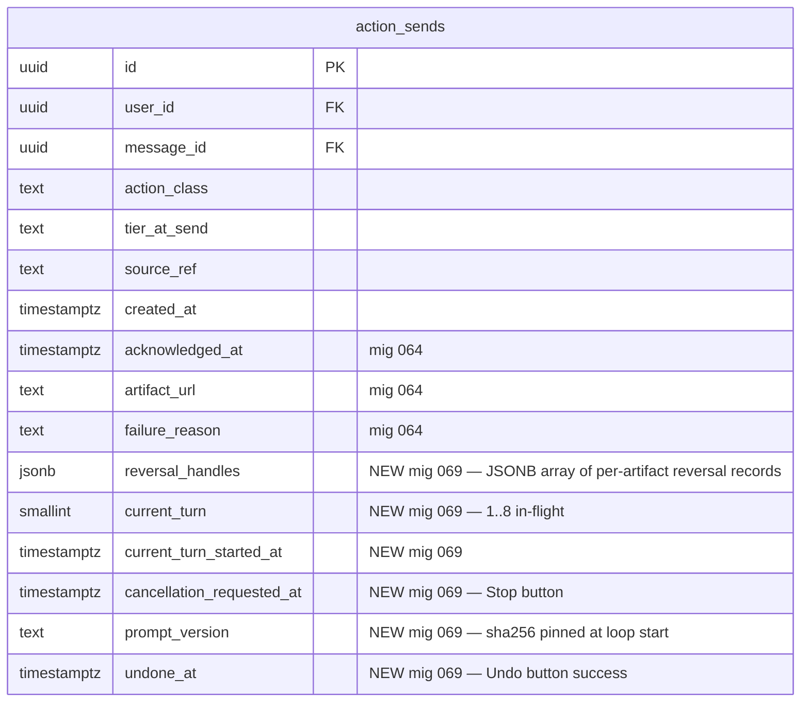

# Plan — PR-B Anthropic SDK leader-prompt loop

## Summary

PR-A (`#4378`, commit `7d5620a5`) shipped the substrate for operator-clicked "Spawn agent / Fix link" buttons on the Today card: an `agent.spawn.requested` event into Inngest, the `agent-on-spawn-requested.ts` function with `resolve-installation → post-acknowledgment → mark-acknowledged → persist-failure` step sequence, the `action_sends` WORM table reshape (mig 064) admitting UPDATEs on `acknowledged_at`/`artifact_url`/`failure_reason`, and the `createGitHubAppClient` factory hook with per-Octokit-call audit. The stub is *acknowledgment-only* — every operator click produces a pre-templated PR comment (`pr-*`) or `soleur/acknowledged` issue label (everything else). No autonomous output. No review summary. No CVE bump. No fix-the-link.

PR-B replaces the **body** of `step.run("post-acknowledgment", …)` (`agent-on-spawn-requested.ts:149-174`) with an Anthropic-SDK leader-prompt loop driven by `anthropic.messages.create` with tool-use rounds. The loop spans 5 per-action-class registries (`engineering.pr_review_pending`, `engineering.ci_failed`, `triage.p0p1_issue`, `security.cve_alert`, `knowledge.kb_drift`), enforces a $2.00 per-spawn cost ceiling + flat 8-turn ceiling, persists per-turn token usage via `persistTurnCost`, and surfaces in-flight progress / cancellation / per-output undo / per-spawn cost on the Today card. The 4 PR-A load-bearing invariants (I1 type-omit `installationId` / I2 `createGitHubAppClient`-only / I3 idempotency / I5 service-role UPDATE on the new columns) are inherited unchanged; only invariant I4 ("No Anthropic SDK in PR-A") is **deliberately reversed** — PR-B introduces the first raw `@anthropic-ai/sdk` call site inside `apps/web-platform/server/`.

## Context

- **Substrate PR (merged):** #4378 (commit `7d5620a5`).
- **Umbrella issue:** #4124.
- **Tracking issue:** #4379.
- **First raw `@anthropic-ai/sdk` site inside `apps/web-platform/server/`** — all current Anthropic traffic flows through `@anthropic-ai/claude-agent-sdk` `query()` (sub-process), or type-only imports (`apps/web-platform/server/soleur-go-runner.ts:91`).
- **Brand-survival threshold: single-user incident.** Operator (`ops@jikigai.com`) is the sole dogfooder; cross-tenant guard inherited from PR-A; cost runaway is operator-funded (BYOK).

## Reality-Check Findings (pre-implementation drift from spec)

Run per `hr-when-in-a-worktree-never-read-from-bare`, `2026-05-20-plan-vs-shipped-reality-check-and-octokit-factory-audit.md`, and TR9. Findings that REQUIRE plan-time correction vs the spec at `knowledge-base/project/specs/feat-4379-anthropic-leader-loop/spec.md`:

| # | Spec says | Reality on `main` (post-#4357) | Plan resolution |
|---|---|---|---|
| 1 | "Migration 065 adding `reversal_handle jsonb` / `current_turn` …" | **`065_art17_cascade_deadlock_repair.sql` + `066_audit_byok_use_art17_carveout.sql` already taken** (PR #4357, merged 2026-05-25 same day). Next free ordinal: **067**. | Renumber all migration refs to **067**. New filename: `apps/web-platform/supabase/migrations/069_action_sends_leader_loop.sql`. Update test filename to `069-action-sends-leader-loop.test.ts`. |
| 2 | "Extend WORM trigger admit-list to admit UPDATEs on these new columns." | Mig 064's WORM trigger uses `BEFORE UPDATE OF <pre-064 immutable column list>` (`064_action_sends_acknowledgment.sql:62-78`) — the trigger fires ONLY when a *listed* column is in the SET list. **UPDATEs on any non-listed column are admitted by default**, no admit-list extension needed. | Mig 069 only `ADD COLUMN IF NOT EXISTS` × 6. The trigger needs no change. **Plan-time test addition:** AC-WORM-NEW (a) UPDATE setting only new columns succeeds, (b) UPDATE setting any pre-064 column still rejects. This is a behavioral test of the existing trigger, not a trigger reshape. |
| 3 | Brainstorm Open Q #5: "Realtime subscription RLS-respect (fallback to polling if not)." | Functional-discovery surfaced **Inngest Realtime** (`step.realtime.publish()` + `useRealtime` hook) as the canonical Inngest-native progress channel — purpose-built for streaming in-flight function progress; no Supabase Realtime RLS-respect question to answer. | **Decision locked in brainstorm**: Supabase Realtime stays as the chosen channel. **Plan-time advisory** [Updated 2026-05-25]: file follow-up issue tracking *"Reconsider Supabase Realtime → Inngest Realtime swap after PR-B dogfood"* for after-merge cost/latency evaluation. Do NOT swap mid-PR. |
| 4 | "ADR-039 (Anthropic-SDK-inside-Inngest pattern)" — issue #4379 cites | **ADR-039 is taken** by `ADR-039-departed-member-removal-ledger.md` (landed in #4294). Next free ordinals: **040, 041**. | Authoring **ADR-040** (Anthropic-SDK-inside-Inngest pattern) + **ADR-041** (BYOK cap enforcement model). Brainstorm correctly flagged this; plan inherits. Pre-merge guard `scripts/check-adr-ordinals.sh` scans filenames (NOT `INDEX.md` — that file does not exist in the decisions directory). |
| 5 | "Reference Inngest impls: `cfo-on-payment-failed.ts:199`" | Confirmed at `cfo-on-payment-failed.ts:198-217`. **Important detail**: the reference impl currently uses the `byok-audit-writer-sweep: out-of-scope` marker because it returns `{tokenCount:0, unitCostCents:0}` stub values. PR-B's Anthropic-SDK call DOES real work, so PR-B's lease-opening site **REMOVES the marker** and adds a real `persistTurnCost(...)` call paired in the same `step.run`. | Document in ADR-040 §Decision and ensure the `byok-audit-writer-sweep` lint passes against the new site (no marker; real `persistTurnCost` call). |

## Goals

(Numbered list inherited from `spec.md:24-34`; expanded with plan-level resolutions.)

1. Replace `step.run("post-acknowledgment", …)` body in `agent-on-spawn-requested.ts:149-174` with a per-turn leader-prompt loop calling `anthropic.messages.create`.
2. Ship 5 per-action-class leader prompt modules in `apps/web-platform/server/inngest/leader-prompts/` (greenfield directory).
3. Author **ADR-040** (Anthropic-SDK-inside-Inngest pattern) + **ADR-041** (BYOK cap enforcement model) **BEFORE** any Anthropic SDK call lands. Pre-merge guard `scripts/check-adr-ordinals.sh` greps `knowledge-base/engineering/architecture/decisions/` for filename collisions.
4. Wire BYOK lease + cap enforcement: per-turn `runWithByokLease` + pre-call `record_byok_use_and_check_cap` check + `persistTurnCost` after each call. Build the `recordByokUseAndCheckCap` TS wrapper at `apps/web-platform/server/byok-cap-rpc.ts` (greenfield).
5. Ship migration **067** (renumbered from spec's "065") adding 6 nullable columns + COMMENTs on `action_sends`. Test asserts WORM trigger's default-admit behavior holds.
6. Ship Today card operator UX: in-flight progress (Supabase Realtime), cancellation (Stop), per-output undo (Undo), per-spawn cost (Cost: $X.XX), per-failure-reason copy.
7. Append PA-22 to `knowledge-base/legal/article-30-register.md` (after PA-21 at line 380); amend Anthropic Vendor Mapping row at line 412 to add PA-22 to Activities.
8. Verify Anthropic Zero-Retention status; document gap in PA-22 (f) if unsigned.
9. Ship PII-scrub TOM: commit-author email redaction in prompt-assembly step (asserted by sentinel test).
10. Reality-check `main` pre-implementation for sibling PRs touching the substrate since PR-A merged (TR9).

## Non-Goals (filed as follow-up issues before PR-B is marked Ready)

Inherited from `spec.md:36-49`. Each filed as a separate GitHub issue per `wg-when-deferring-a-capability-create-a`:

1. Full DPIA on PA-22 (autonomous AI-driven decisioning affecting third-party data subjects).
2. One-time operator consent banner + ToS clause update for AI-generated GitHub artifacts.
3. GDPR Article 22 automated-decisioning analysis.
4. Per-class max-turns caps (CFO recommendation; deferred to dogfood signal).
5. Per-class brand-survival tiering (CPO Tier 1/2/3 staged ship).
6. Cross-installation spawn (one founder, multiple installations).
7. Per-founder spawn quota / rate-limit.
8. Transactional outbox between `action_sends` INSERT and `inngest.send`.
9. WS-push channel for in-flight progress (PR-B uses Supabase Realtime).
10. Prompt fixture/regression infrastructure (golden-file tests on leader prompts).
11. Per-vendor DPA file scaffolding.
12. CVSS classification source-of-truth for severity-aware `cve_alert` prompts.
13. **[Added at plan-time]** Inngest Realtime swap evaluation (post-merge cost/latency comparison vs Supabase Realtime).
14. **[Added at plan-time]** Prompt fixture regression suite (golden-file tests on the 5 leader prompts; re-runnable via `2026-05-19-cache-llm-outputs-flag-for-rerunnable-benches.md` pattern).

## Acceptance Criteria

Encoded from the brainstorm Key Decisions table + SpecFlow analysis gaps. Each AC must be testable; the test path is named.

### AC1 — Loop topology (CRITICAL, inherits PR-A I3)

The Inngest function `agent-on-spawn-requested` body for `step.run("post-acknowledgment", ...)` is replaced by a per-turn loop. For each turn `n` in `[1..maxTurns]`:

1. `step.run("turn-${n}-cap-check", …)` invokes `recordByokUseAndCheckCap`; if `killTripped`, persist `failure_reason = "byok_cap_exceeded"` and exit.
2. `step.run("turn-${n}-precheck-cost-ceiling", …)` reads cumulative cost from `byok_audit` rows joined on `actionSendId`; if ≥ $2.00, persist `failure_reason = "cost_ceiling_exceeded"` and exit.
3. `step.run("turn-${n}-cancel-check", …)` reads `action_sends.cancellation_requested_at`; if NOT NULL, persist `failure_reason = "cancelled_by_operator"` and exit.
4. `step.run("turn-${n}-progress-write", …)` UPDATEs `action_sends` SET `current_turn = ${n}`, `current_turn_started_at = now()`.
5. `step.run("turn-${n}-claude", …)` opens `runWithByokLease(...)` (workspaceContextUserId === keyOwnerUserId === founderId per N2) and calls `anthropic.messages.create({ model, system, messages, tools, max_tokens, cache_control: ephemeral })`; the lease scope CLOSES BEFORE `step.run` returns (ALS cannot escape — per `cfo-on-payment-failed.ts:198-217` precedent and ADR-040). **Inside the lease scope, `await persistTurnCostAwaitable(...)` resolves before the step returns** (B2 fix; see AC12).
6. For each `content_block.type === "tool_use"`: `step.run("turn-${n}-tool-${i}", …)` invokes the tool via `createGitHubAppClient(installationId, founderId)` Octokit.
7. If `stop_reason === "end_turn"`: write `artifact_url` + `reversal_handles` (NOTE: plural — see AC9) + `acknowledged_at`; exit.
8. If `stop_reason === "tool_use"`: append `tool_result` blocks to next-turn messages.
9. If `stop_reason === "max_tokens"`: persist `failure_reason = "leader_response_truncated"` and exit. **(Resolves Open Q #4 in spec.)**
10. If `n === maxTurns`: persist `failure_reason = "leader_max_turns_exceeded"` and exit.

**Test:** `apps/web-platform/test/server/inngest/agent-on-spawn-requested-leader-loop.test.ts` — replay-determinism test fixtures one full turn-1 then a forced failure on turn-2 and asserts only turn-2 re-runs.

### AC2 — Per-class leader prompt registry

`apps/web-platform/server/inngest/leader-prompts/` (greenfield) carries one TS module per class:

| File | Tools | Model | maxTurns | maxTokens |
|---|---|---|---|---|
| `engineering.pr_review_pending.ts` | `createPullRequestReviewComment`, `createComment` | `claude-sonnet-4-6` | 8 | 4096 |
| `engineering.ci_failed.ts` | `createComment` | `claude-sonnet-4-6` | 8 | 4096 |
| `triage.p0p1_issue.ts` | `addLabels`, `createComment` | `claude-haiku-4-5-20251001` | 8 | 4096 |
| `security.cve_alert.ts` | `createBranch`, `createBlob`, `createCommit`, `createPullRequest`, `createComment` | `claude-sonnet-4-6` | 8 | 4096 |
| `knowledge.kb_drift.ts` | `createBranch`, `createBlob`, `createCommit` | `claude-haiku-4-5-20251001` | 8 | 4096 |

Each module exports:

```ts
export interface LeaderPromptModule {
  systemPrompt: string;
  userPromptTemplate: (input: ClassInput) => string;
  tools: AnthropicToolDef[];
  model: AnthropicModelId;
  maxTurns: 8;
  maxTokens: 4096;
  // Developer-maintained version string (M6 fix). DO NOT compute via
  // `userPromptTemplate.toString()` — JS engine `.toString()` of arrow
  // functions varies across Node major versions, breaking in-flight replay
  // determinism on runtime upgrades. Manual semver-style bumps on any
  // material edit to systemPrompt / userPromptTemplate / tools.
  promptVersion: `v${number}.${number}.${number}`;
}
```

`promptVersion` is written to `action_sends.prompt_version` at loop start (`turn-1-progress-write` step). In-flight runs are deterministic against the prompt-version they started with.

**Sentinel test:** `apps/web-platform/test/server/inngest/leader-prompts/prompt-version-stability.test.ts` — asserts each module's `promptVersion` is computable + the registry covers exactly 5 classes + each module enumerates its tools in its `systemPrompt` (per `2026-05-05-baseline-prompt-must-declare-capabilities-or-model-fabricates-missing-tools.md`).

### AC3 — Migration 067 (renumbered from spec's "065")

`apps/web-platform/supabase/migrations/069_action_sends_leader_loop.sql`:

```sql
ALTER TABLE public.action_sends
  ADD COLUMN IF NOT EXISTS reversal_handles jsonb,        -- NOTE: PLURAL (see AC9)
  ADD COLUMN IF NOT EXISTS current_turn smallint,
  ADD COLUMN IF NOT EXISTS current_turn_started_at timestamptz,
  ADD COLUMN IF NOT EXISTS cancellation_requested_at timestamptz,
  ADD COLUMN IF NOT EXISTS prompt_version text,
  ADD COLUMN IF NOT EXISTS undone_at timestamptz;

COMMENT ON COLUMN public.action_sends.reversal_handles IS
  'JSONB array of per-artifact reversal records. Each element shape: {kind:"pr_comment"|"issue_label"|"branch"|"pr", owner, repo, ...class-specific fields}. Multi-tool classes (pr_review_pending, triage.p0p1_issue, cve_alert) emit multiple artifacts and therefore multiple handles. NULL = no artifact emitted.';
COMMENT ON COLUMN public.action_sends.current_turn IS
  'Current turn index 1..8. NULL = pre-turn-1 (leader loop not yet started).';
COMMENT ON COLUMN public.action_sends.current_turn_started_at IS
  'UPDATEd at the start of each turn for in-flight elapsed display.';
COMMENT ON COLUMN public.action_sends.cancellation_requested_at IS
  'Operator clicked Stop. Leader loop short-circuits at next turn-boundary cancel-check.';
COMMENT ON COLUMN public.action_sends.prompt_version IS
  'sha256 of (systemPrompt + userPromptTemplate.toString() + JSON.stringify(tools)) at loop start. Pinned for in-flight determinism across leader-prompt edits.';
COMMENT ON COLUMN public.action_sends.undone_at IS
  'Operator clicked Undo and reversal succeeded. Sets artifact_url=NULL and reversal_handles=NULL via service-role UPDATE.';
```

**No WORM trigger change** — mig 064's trigger uses `BEFORE UPDATE OF <pre-064 columns>` form; UPDATEs touching only these 6 new columns are admitted by default. (Drift from spec; see Reality-Check Findings row 2.)

Down-migration drops the 6 columns:

```sql
ALTER TABLE public.action_sends
  DROP COLUMN IF EXISTS reversal_handles,
  DROP COLUMN IF EXISTS current_turn,
  DROP COLUMN IF EXISTS current_turn_started_at,
  DROP COLUMN IF EXISTS cancellation_requested_at,
  DROP COLUMN IF EXISTS prompt_version,
  DROP COLUMN IF EXISTS undone_at;
```

**Test:** `apps/web-platform/test/supabase-migrations/069-action-sends-leader-loop.test.ts` asserts:

- (a) 6 new columns exist NULL-defaulting.
- (b) UPDATE setting only any subset of {`reversal_handles`, `current_turn`, `current_turn_started_at`, `cancellation_requested_at`, `prompt_version`, `undone_at`} succeeds (trigger does not fire).
- (c) UPDATE setting any pre-064 immutable column (e.g., `tier_at_send`) still rejects with the WORM trigger error.
- (d) RLS owner-SELECT still works on rows with all 6 new columns populated.
- (e) Down-migration succeeds and restores pre-067 schema verbatim.

### AC4 — `recordByokUseAndCheckCap` TS wrapper (greenfield)

`apps/web-platform/server/byok-cap-rpc.ts`:

```ts
/**
 * Service-role TS wrapper around the 6-arg `record_byok_use_and_check_cap`
 * RPC at migrations/061_byok_audit_workspace_id_rpcs.sql:81-148.
 * Pre-call gate: invoke at the top of each per-turn step.run BEFORE
 * anthropic.messages.create. On killTripped=true, the loop short-circuits
 * with failure_reason = "byok_cap_exceeded" and the Anthropic call is
 * NEVER issued (fail-closed).
 */
export async function recordByokUseAndCheckCap(args: {
  invocationId: string;        // randomUUID() per call
  founderId: string;
  workspaceId: string;         // === founderId per N2 invariant
  agentRole: "agent.spawn.requested";
  tokenCount: number;          // 0 on pre-call cap-check (no tokens yet)
  unitCostCents: number;       // 0 on pre-call cap-check
}): Promise<{ cumulativeCents: number; killTripped: boolean }>;
```

**Invariants enforced by unit tests:**

- N2: `workspaceId === founderId` (per `cost-writer.ts:65-69`).
- Service-role only: the wrapper uses `getServiceClient()`, never the tenant client.
- Fail-closed: on RPC error, the wrapper THROWS rather than returning `killTripped: false` (a transient DB error must not allow an uncapped Anthropic call).

**Test:** `apps/web-platform/test/server/byok-cap-rpc.test.ts` — covers (a) happy path + (b) `killTripped: true` flow + (c) RPC error throws + (d) N2 invariant assertion (passing `workspaceId !== founderId` raises).

### AC5 — `persistTurnCost` integration + BYOK lint pass

Every Anthropic call site is paired with `persistTurnCost` inside the same `runWithByokLease` scope per the `byok-audit-writer-sweep` lint (`apps/web-platform/test/server/byok-audit-writer-sweep.test.ts`). The call shape:

```ts
persistTurnCost(
  founderId,
  conversationId,                       // UUIDv5(actionSendId, namespace=agent.spawn.requested.conversation)
  `agent.spawn.requested:${actionClass}`, // leaderId
  founderId,                             // workspaceId === founderId per N2
  {
    totalCostUsd,
    usage: {
      input_tokens,
      output_tokens,
      cache_read_input_tokens,           // LOAD-BEARING — without this, dashboard understates ~90%
      cache_creation_input_tokens,       // LOAD-BEARING
    },
  }
);
```

The `byok-audit-writer-sweep: out-of-scope` marker comment is **NOT** used in PR-B; the marker is for stubs that hold the lease open without doing real work (see `cfo-on-payment-failed.ts:192-197`). PR-B does real work; the marker is absent and the lint asserts a real `persistTurnCost(` call inside the lease scope.

**Sentinel test:** the existing `byok-audit-writer-sweep.test.ts` covers `apps/web-platform/server/inngest/functions/agent-on-spawn-requested.ts` automatically (its `SERVER_DIR = "server"` scope). No new lint module needed.

**Reference learning:** `2026-05-12-stub-handlers-as-silent-undercount-vectors.md` — cache token fields are LOAD-BEARING; omitting them under-counts by ~90%.

**Inngest replay determinism:** Inngest `step.run` memoizes results by step name; a replay of `turn-${n}-claude` returns the cached result without re-invoking the body, so `persistTurnCost` is NOT called a second time. No additional idempotency key needed at the cost-writer layer for this loop. (No KB precedent for this specific risk; documented here at plan-time for future reference.)

### AC6 — UUIDv5 `conversationId` derivation (resolves Open Q #2; B3 fix)

`conversationId` is minted deterministically at loop start:

```ts
import { v5 as uuidv5 } from "uuid";
// DO NOT REGENERATE — load-bearing for replay determinism and AC15 cost-join
// across `byok_audit` rows joined on `actionSendId`. Regenerating this constant
// silently shifts every in-flight loop's conversationId and breaks the AC15
// time-window query. The sentinel test in AC6 fails CI if this value changes.
const CONVERSATION_NAMESPACE = "9b6dc8f1-3a7e-4c2b-8d4f-5a2e9c1b7d3e"; // frozen 2026-05-25
const conversationId = uuidv5(actionSendId, CONVERSATION_NAMESPACE);
```

Stable across Inngest replays (Inngest's deterministic step replay relies on stable IDs). Stored in-memory only; not persisted (the relation is reproducible from `actionSendId`).

**Test:** `apps/web-platform/test/server/inngest/conversation-namespace-stability.test.ts`:

- `expect(CONVERSATION_NAMESPACE).toBe("9b6dc8f1-3a7e-4c2b-8d4f-5a2e9c1b7d3e")` — pins the constant verbatim; any edit fails CI loudly.
- `expect(uuidv5("00000000-0000-0000-0000-000000000000", CONVERSATION_NAMESPACE)).toBe("<computed-at-RED-time>")` — pins the derivation function.

### AC7 — Inngest function timeout (resolves Open Q #3)

`function.config.timeout` raised to **10 minutes** (8 turns × 60s + 2 min overhead for step replay + DB writes). Confirmed against Inngest tier limits (≥10min on current tier).

### AC8 — Tool surface allowlist (ADR-040)

Each leader-prompt module enumerates its tools at module-load. The Inngest function's tool-dispatcher resolves tool names against the per-class allowlist; an out-of-allowlist tool call from the model is rejected with `failure_reason = "leader_tool_invalid"`. All Octokit calls route through `createGitHubAppClient(installationId, founderId)` — NEVER `probeOctokit`, NEVER raw `new Octokit()`.

**Sentinel test:** `apps/web-platform/test/server/inngest/leader-prompts/tool-surface.test.ts` asserts:

- `grep -nE "probeOctokit\(|new Octokit\(" apps/web-platform/server/inngest/leader-prompts/ apps/web-platform/server/inngest/functions/agent-on-spawn-requested.ts` returns 0.
- Each module's tools array is a strict subset of the per-class allowlist documented in ADR-040.

### AC9 — Multi-artifact reversal handles (RESOLVES SpecFlow gap)

**`reversal_handles` is JSONB ARRAY**, not singular. Per SpecFlow analysis, classes `pr_review_pending`, `triage.p0p1_issue`, and `cve_alert` emit multiple artifacts per loop:

| Class | Artifact(s) | `reversal_handles` shape |
|---|---|---|
| `engineering.pr_review_pending` | review comment + general comment | `[{kind:"pr_review_comment",…}, {kind:"pr_comment",…}]` |
| `engineering.ci_failed` | triage comment | `[{kind:"pr_comment",…}]` |
| `triage.p0p1_issue` | label + comment | `[{kind:"issue_label",…}, {kind:"issue_comment",…}]` |
| `security.cve_alert` | branch + PR + comment | `[{kind:"branch",…}, {kind:"pr",…}, {kind:"pr_comment",…}]` |
| `knowledge.kb_drift` | branch | `[{kind:"branch",…}]` |

**Per-kind reversal verbs (extension of FR5):**

- `pr_review_comment` → `DELETE /repos/{owner}/{repo}/pulls/comments/{comment_id}`
- `pr_comment` / `issue_comment` → `DELETE /repos/{owner}/{repo}/issues/comments/{comment_id}`
- `issue_label` → `DELETE /repos/{owner}/{repo}/issues/{issue_number}/labels/{label_name}`
- `branch` → `DELETE /repos/{owner}/{repo}/git/refs/heads/{branch_ref}`
- `pr` → **(a)** guard `pull.merged === true` first; if merged, return 410 with copy "PR was already merged; cannot undo automatically"; **(b)** else `PATCH /repos/{owner}/{repo}/pulls/{pr_number}` setting `state: "closed"`, then `DELETE …/git/refs/heads/{branch_ref}` for the source branch.

Undo endpoint reverses **all handles in order** with explicit per-element ledger (M4 fix):

- Each element produces `{ index, kind, status: "reverted" | "already_absent" | "failed_410_merged" | "failed_4xx" | "failed_5xx", error?: string }`.
- The endpoint returns `{ allSucceeded: boolean, elements: [...] }` in the response body.
- `undone_at = now()` is set ONLY when EVERY element has `status` of `"reverted"` or `"already_absent"` (idempotent absent counts as success).
- On partial failure (any element `failed_*`), `undone_at` stays NULL, `reversal_handles` is REWRITTEN with only the still-failing elements (successfully-reverted elements removed), and `artifact_url` is preserved. Operator clicks Undo again on the same card to retry the still-failing subset. The AC14 "Already undone" 409 fires only when `reversal_handles IS NULL` (all elements cleared); a 207 Multi-Status with the per-element ledger fires on partial-failure re-click.
- The merged-PR 410 case (`failed_410_merged`) is terminal: the operator must reconcile manually on GitHub. Subsequent Undo clicks return the same 207 with the merged-PR element still flagged.

**Test:** `apps/web-platform/test/api/dashboard/today/[id]/undo.test.ts` — covers all 5 classes × {happy, GitHub-side already-deleted (404 → idempotent success), GitHub installation revoked (401/403 → operator-facing "GitHub permission revoked; reconnect in Settings"), partial-array failure (some handles undo, some 500), merged-PR guard, double-click idempotency}.

### AC10 — Failure-reason taxonomy + per-reason operator copy (RESOLVES SpecFlow gap)

`action_sends.failure_reason` admits these PR-B-introduced values (in addition to PR-A's set):

| `failure_reason` | Operator copy (Today card) | Retry button? | Source |
|---|---|---|---|
| `byok_cap_exceeded` | "BYOK cap reached. Raise your cap in Settings → BYOK → Raise Cap, then re-click Spawn." | No (operator path is raise-cap-then-respawn; m4) | Cap-check fail |
| `cost_ceiling_exceeded` | "Per-spawn cost ceiling ($2.00) reached. The partial artifact is preserved — Undo to remove it." | No | Pre-call cost check |
| `byok_lease_unavailable` | "Couldn't acquire your BYOK key. Verify your API key in Settings → BYOK." | Yes | Lease open fail |
| `anthropic_timeout` | "Anthropic API timeout. Retry usually works." | Yes | SDK timeout |
| `anthropic_rate_limited` | "Anthropic rate-limited. Try again in a minute." | **No** (Retry would re-trigger) | SDK 429 |
| `leader_max_turns_exceeded` | "Agent ran out of turns. Refine the task or contact CTO." | No | Loop ceiling |
| `leader_response_truncated` | "Model response truncated (max_tokens). Retry usually works." | Yes | `stop_reason="max_tokens"` |
| `leader_tool_invalid` | "Agent tried an unauthorized action. CTO has been notified." | No | Out-of-allowlist tool |
| `cancelled_by_operator` | "Stopped. The current turn finished (cost: $X.XX) before stopping. Undo any artifacts below." | (no copy needed; user-initiated) | Cancel check fail; M5 — operator must see cost was incurred on the in-flight turn |

Per-reason copy lives in a single mapping module `apps/web-platform/components/dashboard/failure-reason-copy.ts` (mirrors the `DENY_REASON_COPY` pattern at `today-card.tsx:100-111`).

**Test:** `apps/web-platform/test/components/dashboard/failure-reason-copy.test.ts` — asserts exhaustive coverage of all PR-B + PR-A failure_reason values + Retry-eligibility per reason.

### AC11 — Today card state matrix (RESOLVES SpecFlow gap)

FR3's render branches are expanded into a complete state matrix. Render priority (first match wins):

| State precondition | Card render |
|---|---|
| `failure_reason IS NOT NULL` AND `reversal_handles IS NOT NULL` | "Failed — {failure-reason-copy}. Partial artifact preserved." + **Undo button** + **Retry button (if Retry-eligible per AC10)** |
| `failure_reason IS NOT NULL` AND `reversal_handles IS NULL` | "Failed — {failure-reason-copy}." + Retry button (if Retry-eligible) |
| `undone_at IS NOT NULL` | "Undone." |
| `acknowledged_at IS NOT NULL` AND `reversal_handles IS NOT NULL` | "Done — {artifact_kind} at {artifact_url}." + **Undo button** |
| `cancellation_requested_at IS NOT NULL` AND `acknowledged_at IS NULL` AND `failure_reason IS NULL` | "Stopping — turn {current_turn} of {maxTurns}." (Stop button disabled) |
| `current_turn IS NOT NULL` AND `acknowledged_at IS NULL` AND `failure_reason IS NULL` | "Working — turn {current_turn} of {maxTurns}, {elapsed} elapsed." + **Stop button** |
| `current_turn IS NULL` AND `acknowledged_at IS NULL` AND `failure_reason IS NULL` | "Acknowledged — agent starting…" |

**Test:** `apps/web-platform/test/components/dashboard/today-card-state-matrix.test.ts` — asserts each of the 7 rows renders the documented copy + correct button affordances, including the `cancellation_pending` and `failure+reversal` rows that SpecFlow caught as silent-drop in the original spec.

### AC12 — Cost-vs-Realtime ordering (RESOLVES SpecFlow gap; B2 fix)

`persistTurnCost` MUST be **awaited** inside `step.run("turn-${n}-claude", …)` before the step returns. The cost-writer's existing fire-and-forget shape (`cost-writer.ts:72-160`) is intentionally void-returning, so PR-B introduces a sibling helper `persistTurnCostAwaitable` (or refactors `persistTurnCost` to return the underlying promise) — choose at code-write time based on whether other consumers tolerate the breaking change. The step order is:

1. `runWithByokLease(...)` opens.
2. `anthropic.messages.create(...)` returns.
3. `await persistTurnCostAwaitable(...)` writes `byok_audit` + `increment_conversation_cost` and resolves.
4. `runWithByokLease` returns.
5. **Subsequent step**: `step.run("turn-${n}-progress-write", ...)` UPDATEs `action_sends.current_turn` — this triggers Supabase Realtime.

This makes the AC15 cost query (Realtime fanout reads `byok_audit`) deterministically read the just-completed turn. No race; no follow-up issue.

**Test:** `apps/web-platform/test/integration/today-card-cost-display-ordering.test.ts` — turn-2 cost displayed at turn-3 progress-write asserts `cumulativeCents` reflects turns 1-2.

### AC13 — Cancellation flow

Today card "Stop" button → POST `/api/dashboard/today/[id]/cancel`. Server route validates owner via RLS-aware `messages` SELECT join → UPDATEs `action_sends.cancellation_requested_at = now()` via service-role client. Inngest function `turn-${n}-cancel-check` step short-circuits with `failure_reason = "cancelled_by_operator"`. Mid-turn cancellation is NOT supported (the in-flight Anthropic call completes; cancellation is honored on the next turn boundary). Card renders "Stopping — turn N of M" between Stop click and cancel-check fire.

**Test:** `apps/web-platform/test/api/dashboard/today/[id]/cancel.test.ts` — covers (a) happy path + (b) owner-mismatch 403 + (c) double-click idempotency (second click is no-op).

### AC14 — Per-output undo (extends FR5 to multi-artifact)

POST `/api/dashboard/today/[id]/undo`. Reverses **all elements** of `reversal_handles` in order; sets `undone_at` only on full success. See AC9 for per-kind verbs + edge cases. Idempotency: second call reads cleared `reversal_handles`, returns 409 with copy "Already undone."

### AC15 — Per-spawn cost visibility

Today card fetches cumulative cost from `byok_audit` rows joined on `actionSendId` via GET `/api/dashboard/today/[id]/cost`. Returns `{ cumulativeCents, turnCount }`. Refreshes on each Realtime UPDATE on `action_sends`. Displays `Cost: $X.XX (Y turns)` below the working/done state.

**Query (greenfield)** — build `agentRole` in TS to avoid SQL concat losing index potential (m3):

```sql
SELECT
  COALESCE(SUM(unit_cost_cents), 0)::int AS cumulative_cents,
  COUNT(*)::int AS turn_count
FROM public.audit_byok_use
WHERE agent_role = $1   -- TS: `agent.spawn.requested:${actionClass}` precomputed
  AND founder_id = $2   -- RLS-derived
  AND created_at > $3   -- = action_sends.created_at
  AND created_at <= COALESCE($4, now()); -- = action_sends.acknowledged_at OR now()
```

`audit_byok_use` has no native `action_send_id` FK; the time-window join is the linkage. (Filed as follow-up: add `action_send_id uuid` column to `audit_byok_use` for a hard FK.)

### AC16 — PII-scrub TOM + sanitization parity sweep

`apps/web-platform/server/inngest/leader-prompts/prompt-assembly.ts` runs:

1. **Email redaction** on any PR diff text piped to Anthropic. Pattern (per spec FR7): `/[a-zA-Z0-9._%+-]+@[a-zA-Z0-9.-]+\.[a-zA-Z]{2,}/g` → `<email-redacted>`. The operator's own email (`users.email` lookup) is on a redact-allowlist (NOT redacted).
2. **Sanitization parity sweep** per `2026-05-06-new-prompt-injection-site-needs-sanitization-parity.md`: any new prompt-injection site MUST apply the existing `sanitizePromptString` contract — control-char stripping + U+2028/U+2029 separator stripping + length cap (256 chars for short fields; document the per-class cap in each leader-prompt module). The PII-scrub step runs AFTER `sanitizePromptString` so the email regex sees a control-char-stripped input.

**Sentinel test:** `apps/web-platform/test/server/inngest/leader-prompts/prompt-assembly-pii-scrub.test.ts` — pipes a known-PII fixture (synthesized per `cq-test-fixtures-synthesized-only`) through prompt-assembly and asserts:

- `/[a-zA-Z0-9._%+-]+@[a-zA-Z0-9.-]+\.[a-zA-Z]{2,}/g.test(output) === false` (except operator's own email if present in the allowlist case).
- Control chars (U+0000-U+001F minus tab/newline/CR), U+2028, U+2029 absent from output (`cq-regex-unicode-separators-escape-only`).

### AC17 — Prompt caching ON

All Anthropic calls use `cache_control: { type: "ephemeral" }` markers on the system prompt + tool definitions. The `cache_read_input_tokens` + `cache_creation_input_tokens` fields MUST flow through `persistTurnCost` (AC5). Post-merge CFO follow-up: verify cumulative input cost reduction empirically against `byok_audit` rows.

### AC18 — ADR-040 + ADR-041 land BEFORE Anthropic SDK call (M2 fix)

`knowledge-base/engineering/architecture/decisions/ADR-040-anthropic-sdk-inside-inngest-leader-loop.md` + `ADR-041-byok-cap-enforcement-model.md` are committed in commits 1-2 of this PR (BEFORE the Inngest function body change in commit 9). Pre-merge guard: `bash scripts/check-adr-ordinals.sh` (greenfield script) scans `knowledge-base/engineering/architecture/decisions/` for ordinal collisions AND content-stub conditions; CI fails if any check trips.

**Script shape** (`scripts/check-adr-ordinals.sh`):

```bash
#!/usr/bin/env bash
set -euo pipefail
cd "$(git rev-parse --show-toplevel)"
ADR_DIR=knowledge-base/engineering/architecture/decisions

# 1. Exact-ordinal collision (e.g., two files named ADR-040-*.md)
dups=$(ls "$ADR_DIR" | grep -oE '^ADR-[0-9]{3}' | sort | uniq -d)
if [ -n "$dups" ]; then
  echo "ADR ordinal collision: $dups" >&2
  exit 1
fi

# 2. Required files exist with non-empty content + structural completeness.
for required in ADR-040 ADR-041; do
  matches=$(ls "$ADR_DIR" | grep "^${required}-" || true)
  count=$(echo "$matches" | grep -c . || true)
  if [ "$count" -ne 1 ]; then
    echo "Expected exactly 1 file matching ${required}-*, found ${count}" >&2
    exit 1
  fi
  file="$ADR_DIR/$matches"
  if [ ! -s "$file" ]; then
    echo "${required} file is empty: $file" >&2
    exit 1
  fi
  for required_heading in "## Status" "## Context" "## Decision" "## Consequences"; do
    if ! grep -q "^${required_heading}" "$file"; then
      echo "${required} file missing heading '${required_heading}': $file" >&2
      exit 1
    fi
  done
done
```

CI integration: add to `.github/workflows/lint-and-test.yml` (or equivalent) as a fail-closed step. Script is also runnable locally before push.

### AC19 — PA-22 legal substrate

`knowledge-base/legal/article-30-register.md` is amended:

- New `## Processing Activity 22 — Autonomous AI leader-prompt runtime (Anthropic SDK, PR-B #4124)` section appended after PA-21.
- PA-22 (g) TOMs enumerate: prompt caching, per-class tool allowlist, cost ceiling, lease per turn, BYOK pre-call gate, PII-scrub, Zero-Retention amendment status, dead-letter Sentry mirror, max-turns ceiling, idempotency.
- Vendor Mapping row at line 412 (Anthropic PBC) is amended: Activities column adds "PA-22 (autonomous leader-prompt runtime under operator BYOK)".

**Sentinel** (`scripts/check-pa-22.sh`, M1 fix — detect partial-write, not just header presence):

```bash
#!/usr/bin/env bash
set -euo pipefail
REG=knowledge-base/legal/article-30-register.md

# (i) PA-22 header present exactly once
header_count=$(grep -c "^## Processing Activity 22" "$REG" || true)
if [ "$header_count" -ne 1 ]; then
  echo "Expected 1 PA-22 header, found ${header_count}" >&2
  exit 1
fi

# (ii) Vendor Mapping row at line 412 area mentions PA-22 (line number may drift on edits)
if ! grep -E "Anthropic.*PA-22.*autonomous" "$REG" >/dev/null; then
  echo "Anthropic Vendor Mapping row does not reference PA-22 + autonomous activity" >&2
  exit 1
fi

# (iii) PA-22 (f) records Zero-Retention status (signed or unsigned-with-gap)
if ! grep -E "Zero-Retention.*(signed|unsigned|amendment)" "$REG" >/dev/null; then
  echo "PA-22 (f) does not record Anthropic Zero-Retention status" >&2
  exit 1
fi

# (iv) PA-22 (g) TOMs section exists
if ! awk '/^## Processing Activity 22/,/^## Processing Activity 23|^# /' "$REG" | grep -q "TOMs"; then
  echo "PA-22 missing (g) TOMs section" >&2
  exit 1
fi
```

CI integration: same workflow as `check-adr-ordinals.sh`.

### AC20 — Anthropic Zero-Retention verification

Pre-merge operator action: verify Anthropic Zero-Retention amendment status on the Anthropic account dashboard. If SIGNED, PA-22 (f) records "Zero-Retention amendment signed YYYY-MM-DD; effective for all BYOK traffic under PR-B." If UNSIGNED, PA-22 (f) records the 30-day default retention + ToS gap; the consent-banner follow-up issue (Non-Goal #2) references this gap.

This is the ONE operator step that cannot be agent-automated (login to Anthropic dashboard with operator credentials). Per `hr-block-pr-ready-on-undeferred-operator-steps`, the PR Description must include this step as a Plan-Confirmation checkbox before "Ready for review" is set.

### AC21 — Reality-check sentinel evidence in PR body (TR9; M3 fix)

The PR body MUST include the output of (SHA-anchored to PR-A's merge commit `7d5620a5`, per `2026-05-20-plan-vs-shipped-reality-check-and-octokit-factory-audit.md`):

```bash
git log --oneline 7d5620a5..origin/main \
  -- apps/web-platform/server/inngest/functions/agent-on-spawn-requested.ts \
     apps/web-platform/components/dashboard/today-card.tsx \
     apps/web-platform/supabase/migrations/
```

So reviewers can confirm no in-flight follow-ups touched the substrate during PR-B authorship. The SHA anchor `7d5620a5..` (PR-A's merge SHA) catches sibling PRs that merge AFTER 2026-05-25 without surfacing PR-A's own merge commit as noise — and is robust to PR-B authorship spanning multiple days. Already-known sibling: #4357 (mig 064/065/066 cascade repair). Plan-time evidence captured in Reality-Check Findings table (row 1).

### AC22 — Brand-survival ACs (CPO sign-off)

Per `requires_cpo_signoff: true` in frontmatter:

- **CPO-1**: First operator-impression is governed by the per-class state matrix (AC11). No silent state drops (FR3 gap caught by SpecFlow).
- **CPO-2**: Failure UX has explicit per-reason copy + Retry-eligibility flag (AC10). No raw `failure_reason` string surfaced.
- **CPO-3**: Cost is operator-visible in real time (AC15). No "surprise bill" mode.
- **CPO-4**: Undo affordance available on success AND partial-cost-ceiling failures (AC11 row 1 + AC9). No "you wrote on prod, sorry" dead-end.
- **CPO-5**: Stop affordance available throughout the loop (AC13). No "wait 8 turns" forced-completion.

PR review-time agent: `user-impact-reviewer` must explicitly affirm these five.

## Implementation Plan

### Phase 0 — Pre-implementation reality check (TR9 + Open Q #3 verification)

```bash
# Worktree confirmed at .worktrees/feat-4379-anthropic-leader-loop (already created).
# Confirm Inngest function timeout limit on current tier (Open Q #3 → AC7).
cat apps/web-platform/server/inngest/client.ts | grep -A 3 "createFunction\|timeout"
# Verify next migration ordinal (already done at plan-time: 067).
ls apps/web-platform/supabase/migrations/ | grep -oE "^[0-9]{3}" | sort -u | tail -3
# Verify next ADR ordinal (already done at plan-time: 040, 041).
ls knowledge-base/engineering/architecture/decisions/ | grep -oE "^ADR-[0-9]{3}" | sort -u | tail -3
```

### Phase 1 — ADRs (lands FIRST, no SDK call yet)

Commit 1: `knowledge-base/engineering/architecture/decisions/ADR-040-anthropic-sdk-inside-inngest-leader-loop.md`

Sections:

1. Status: Accepted.
2. Context: PR-A substrate; the choice space for an autonomous AI loop runner (functional-discovery found `@anthropic-ai/claude-agent-sdk`, Vercel AI SDK, Temporal cookbook — all rejected; build thin wrapper).
3. Decision: Per-turn `step.run` topology + `runWithByokLease` opens INSIDE each SDK-calling step + per-class enumerated tool allowlist + `prompt_version` pin at loop start + `cache_control: ephemeral` ON + `persistTurnCost` paired with each SDK call.
4. Consequences: First raw `@anthropic-ai/sdk` site in `apps/web-platform/server/`; invariant I4 from PR-A deliberately reversed; `byok-audit-writer-sweep` lint covers the new site without marker.
5. Alternatives: `@anthropic-ai/claude-agent-sdk` (rejected — Claude-Code-style harness, no per-turn cost-cap hooks); Vercel AI SDK (rejected — provider-abstraction, loses cache-aware accounting); Temporal (rejected — separate substrate); Inngest Realtime (deferred to post-merge per Reality-Check Findings row 3).

Commit 2: `knowledge-base/engineering/architecture/decisions/ADR-041-byok-cap-enforcement-model.md`

Sections:

1. Status: Accepted.
2. Context: BYOK lease + cap RPC substrate at `migrations/061_byok_audit_workspace_id_rpcs.sql:81-148`; per-spawn ceiling distinct from BYOK daily/monthly caps.
3. Decision: Pre-call check (NOT post-call) via `recordByokUseAndCheckCap` returning `{cumulativeCents, killTripped}`; fail-closed (RPC error THROWS, never returns false negatives); per-spawn cost ceiling ($2.00) is primary gate; max-turns ceiling (8) is secondary backstop; `kill_tripped` flips `users.runtime_paused_at`.
4. Consequences: Operator's daily soft $20 / hard $50 / monthly hard $500 caps still apply; per-spawn ceiling is independent (smaller bound). The `byok-audit-writer-sweep` lint covers the new lease site without marker (it does real work, unlike the `cfo-on-payment-failed.ts:198-217` stub).
5. Alternatives: Post-call check (rejected — fail-open); soft warn + continue (rejected — operator must opt-in to overrun).

Commit 3: `scripts/check-adr-ordinals.sh` (per AC18) + add to CI workflow. **Test that the script fails closed against the current repo state — should pass post-commits 1-2.**

### Phase 2 — Migration 067 (lands SECOND)

Commit 4: `apps/web-platform/supabase/migrations/069_action_sends_leader_loop.sql` (and `.down.sql`) per AC3.

Commit 5: `apps/web-platform/test/supabase-migrations/069-action-sends-leader-loop.test.ts` per AC3 test specs (a-e).

Run `TENANT_INTEGRATION_TEST=1 npm test -- 069-action-sends-leader-loop.test.ts` against dev Supabase per `hr-dev-prd-distinct-supabase-projects`.

### Phase 3 — Greenfield wrappers (lands THIRD, no Inngest body change yet)

Commit 6: `apps/web-platform/server/byok-cap-rpc.ts` per AC4 + `apps/web-platform/test/server/byok-cap-rpc.test.ts`.

Commit 7: `apps/web-platform/server/inngest/leader-prompts/prompt-assembly.ts` (PII-scrub) + test per AC16.

Commit 8: `apps/web-platform/server/inngest/leader-prompts/index.ts` (registry + `LeaderPromptModule` type) + 5 per-class modules + tests per AC2.

### Phase 4 — Inngest function body replacement (lands FOURTH — this is the load-bearing diff)

Commit 9: Replace `agent-on-spawn-requested.ts:149-228` (`post-acknowledgment` step body) with the per-turn leader loop per AC1.

- Keep the existing `resolve-installation` step (`agent-on-spawn-requested.ts:108-127`) unchanged.
- Keep `persistFailure` helper (`agent-on-spawn-requested.ts:230-287`) — extend the `reason` parameter type to include PR-B's new failure_reason values.
- Add `function.config.timeout: "10m"` per AC7.

Commit 10: `apps/web-platform/test/server/inngest/agent-on-spawn-requested-leader-loop.test.ts` per AC1 (replay-determinism + all failure_reason paths).

### Phase 5 — Today card UX (lands FIFTH)

Commit 11: `apps/web-platform/components/dashboard/failure-reason-copy.ts` per AC10.

Commit 12: Extend `apps/web-platform/components/dashboard/today-card.tsx` with the AC11 state matrix + Supabase Realtime subscription + Stop button + Undo button + Cost display + "Stopping…" + per-reason failure copy.

Commit 13: API routes:

- `apps/web-platform/app/api/dashboard/today/[id]/cancel/route.ts` (AC13).
- `apps/web-platform/app/api/dashboard/today/[id]/undo/route.ts` (AC9 + AC14).
- `apps/web-platform/app/api/dashboard/today/[id]/cost/route.ts` (AC15).

Per `cq-nextjs-route-files-http-only-exports`, route files export only HTTP method handlers + named consts.

Commit 14: Tests for routes + state-matrix component test per AC9/AC11/AC13/AC14/AC15.

### Phase 6 — Legal substrate (lands SIXTH)

Commit 15: Append PA-22 to `knowledge-base/legal/article-30-register.md` (after PA-21 at line 380) + amend Anthropic Vendor Mapping row at line 412 per AC19.

Commit 16: `scripts/check-pa-22.sh` (sentinel grep per AC19) + CI integration.

### Phase 7 — Pre-merge operator step + PR body

Per AC20 + AC21:

1. Operator verifies Anthropic Zero-Retention amendment status. PA-22 (f) updated accordingly (commit 17).
2. PR body includes:
   - Closes #4379.
   - Reality-check sentinel evidence (output of the `git log --since` command from AC21).
   - Confirmation checklist for Zero-Retention verification (AC20).
   - Cross-reference to ADR-040 / ADR-041 / PA-22.
3. Follow-up issues (Non-Goals 1-14) filed BEFORE the PR is marked "Ready for review" per `wg-block-pr-ready-on-undeferred-operator-steps`.

## Test Plan

### Unit tests (per AC)

| Test | Path | Asserts |
|---|---|---|
| Mig 069 schema + WORM default-admit | `apps/web-platform/test/supabase-migrations/067-*.test.ts` | AC3 (a-e) |
| BYOK cap RPC wrapper | `apps/web-platform/test/server/byok-cap-rpc.test.ts` | AC4 (a-d) |
| Leader prompt registry | `apps/web-platform/test/server/inngest/leader-prompts/prompt-version-stability.test.ts` | AC2 + tool enumeration |
| Tool surface allowlist | `apps/web-platform/test/server/inngest/leader-prompts/tool-surface.test.ts` | AC8 (probeOctokit grep + per-class subset) |
| PII-scrub | `apps/web-platform/test/server/inngest/leader-prompts/prompt-assembly-pii-scrub.test.ts` | AC16 |
| BYOK-audit-writer-sweep lint | `apps/web-platform/test/server/byok-audit-writer-sweep.test.ts` (existing) | AC5 (covers new site) |
| Failure-reason copy | `apps/web-platform/test/components/dashboard/failure-reason-copy.test.ts` | AC10 |
| Today card state matrix | `apps/web-platform/test/components/dashboard/today-card-state-matrix.test.ts` | AC11 |
| Cancel API | `apps/web-platform/test/api/dashboard/today/[id]/cancel.test.ts` | AC13 |
| Undo API | `apps/web-platform/test/api/dashboard/today/[id]/undo.test.ts` | AC9 + AC14 |
| Cost API | `apps/web-platform/test/api/dashboard/today/[id]/cost.test.ts` | AC15 |

### Integration tests

| Test | Path | Asserts |
|---|---|---|
| Inngest leader-loop replay determinism | `apps/web-platform/test/server/inngest/agent-on-spawn-requested-leader-loop.test.ts` | AC1 (all 10 turn-step outcomes) |
| Cost-vs-Realtime ordering | `apps/web-platform/test/integration/today-card-cost-display-ordering.test.ts` | AC12 |
| PA-22 sentinels | `scripts/check-pa-22.sh` | AC19 |
| ADR ordinals | `scripts/check-adr-ordinals.sh` | AC18 |

### Pre-merge sentinel sweep

```bash
# Tool-surface allowlist sweep (AC8)
grep -nE "probeOctokit\(|new Octokit\(" \
  apps/web-platform/server/inngest/leader-prompts/ \
  apps/web-platform/server/inngest/functions/agent-on-spawn-requested.ts \
  && echo "VIOLATION" || echo "OK"

# Installation-id source-of-truth sweep (PR-A I1, inherited)
grep -nE "event\.data\.installationId|payload\.installationId" \
  apps/web-platform/server/inngest/functions/agent-on-spawn-requested.ts \
  && echo "VIOLATION" || echo "OK"

# PA-22 presence (AC19)
grep -c "^## Processing Activity 22" knowledge-base/legal/article-30-register.md  # → 1
grep -n "PA-22" knowledge-base/legal/article-30-register.md  # → ≥ 2 lines
```

### e2e dogfood (manual, post-merge)

Operator clicks each of 5 spawn-button shapes on the Today card; verify the AC11 state matrix renders correctly per turn; verify Undo for each class reverses the artifact on GitHub; verify Stop terminates within one turn boundary; verify Cost displays cumulative spend that matches Anthropic Console.

## Architecture Diagrams

### Loop topology

```mermaid
sequenceDiagram
    participant Op as Operator (Today card)
    participant Route as /api/dashboard/send
    participant Inn as Inngest function
    participant Cap as record_byok_use_and_check_cap
    participant Lease as runWithByokLease
    participant SDK as anthropic.messages.create
    participant Cost as persistTurnCost
    participant GH as createGitHubAppClient
    participant DB as action_sends (Supabase)

    Op->>Route: POST /send (spawn click)
    Route->>DB: INSERT action_sends + inngest.send
    Inn->>DB: step.run("resolve-installation") UPDATE users.github_installation_id read
    loop turn n in 1..8
        Inn->>Cap: step.run("turn-${n}-cap-check")
        alt killTripped
            Inn->>DB: UPDATE failure_reason="byok_cap_exceeded"
        end
        Inn->>DB: step.run("turn-${n}-precheck-cost-ceiling") read byok_audit cumulative
        alt cumulative ≥ $2.00
            Inn->>DB: UPDATE failure_reason="cost_ceiling_exceeded"
        end
        Inn->>DB: step.run("turn-${n}-cancel-check") read cancellation_requested_at
        alt cancelled
            Inn->>DB: UPDATE failure_reason="cancelled_by_operator"
        end
        Inn->>DB: step.run("turn-${n}-progress-write") UPDATE current_turn=${n}, current_turn_started_at=now()
        Note over DB,Op: Supabase Realtime fires → card renders "Working — turn ${n} of 8"
        Inn->>Lease: step.run("turn-${n}-claude") opens runWithByokLease
        Lease->>SDK: anthropic.messages.create(model, system, tools, cache_control)
        SDK-->>Lease: result (usage, content blocks, stop_reason)
        Lease->>Cost: persistTurnCost(founderId, conv, leader, ws, usage)
        Cost-->>DB: increment_conversation_cost + write_byok_audit
        loop tool_use blocks
            Inn->>GH: step.run("turn-${n}-tool-${i}") via createGitHubAppClient(installationId, founderId)
            GH-->>Inn: tool_result
        end
        alt stop_reason == "end_turn"
            Inn->>DB: UPDATE acknowledged_at=now(), artifact_url, reversal_handles
            Note over Inn: Loop exits
        else stop_reason == "tool_use"
            Note over Inn: Append tool_result blocks; continue loop
        else stop_reason == "max_tokens"
            Inn->>DB: UPDATE failure_reason="leader_response_truncated"
        end
    end
    Inn->>DB: (if n==8) UPDATE failure_reason="leader_max_turns_exceeded"
```

### Action_sends column extensions (mig 069)



## Rollout & Risk

### Rollout

PR-B is **NOT** behind a feature flag for the substrate (the loop replaces the stub body wholesale; reverting is `git revert` of the function-body commit + mig 069 down-migration). The 5 per-class leader prompts can be individually disabled in dogfood by editing the registry to throw `failure_reason = "leader_class_disabled"` for a specific class — but this is operator-side, not a runtime flag.

### Risk register

| Risk | Likelihood | Impact | Mitigation |
|---|---|---|---|
| First raw `@anthropic-ai/sdk` site introduces unanticipated dependency-cycle | Low | Medium | functional-discovery confirmed `@anthropic-ai/sdk` is already in `package.json` (used type-only at `soleur-go-runner.ts:91`); no new install. |
| BYOK cap RPC race at cap-boundary | Medium | High | Pre-call gate per ADR-041 + `FOR UPDATE` lock inside the cap RPC closes TOCTOU. |
| Prompt-caching cost overrun (cache miss explodes input cost) | Medium | High | `cache_control: ephemeral` + `cache_read_input_tokens` flows through `persistTurnCost`; cost ceiling $2.00 is fail-closed. |
| Realtime RLS fallback to polling (Open Q #5) | Medium | Low | Polling fallback documented in spec FR3; per-class state-matrix renders identical copy. |
| Multi-artifact undo partial-failure UX (AC9) | Low | Medium | Per-element success/fail recorded; operator sees explicit "N of M reverted; reconnect GitHub installation to retry" copy. |
| `stop_reason="max_tokens"` edge case (Open Q #4) | Low | Low | Resolved at AC1 step 9 + AC10 `leader_response_truncated`. |
| Inngest function timeout (Open Q #3) | Low | Medium | Resolved at AC7 (10min). |
| Operator clicks Stop AFTER `end_turn` artifact emitted but BEFORE UPDATE commits | Very low | Low | Inngest step is atomic per `step.run`; the cancel-check at the start of the next turn would no-op (loop already exited). |
| Sibling PR drift on substrate during PR-B authorship | Low | High | TR9 reality-check at Phase 0 + AC21 PR-body evidence + `2026-05-21-bare-clone-working-files-drift-from-origin-main.md` learning. |
| ADR ordinal collision | Low | Low | `scripts/check-adr-ordinals.sh` (AC18) + brainstorm caught ADR-039 was stale. |
| WORM trigger admit-list misread (spec said "extend admit-list", reality is "default-admit on non-listed columns") | Resolved at plan-time | — | Reality-Check Findings row 2 + **AC3 test (b)(c)** (m6 cross-link). |

## Domain Review

**Domains relevant:** Engineering, Product, Legal, Finance (carried forward from brainstorm `## Domain Assessments` per Phase 2.5 Step 1 brainstorm carry-forward rule).

### Engineering

**Status:** reviewed (carry-forward from brainstorm)
**Assessment:** CTO confirmed PR-A's invariant scaffolding is reusable; ADR-040 must lock loop topology + BYOK lease scope + tool-surface allowlist before any code lands. Reference impls: `cfo-on-payment-failed.ts:198-217` (lease-per-step), `github-on-event.ts:208`. `recordByokUseAndCheckCap` TS wrapper is greenfield. Critical: `cache_read_input_tokens` + `cache_creation_input_tokens` MUST flow through `persistTurnCost` or dashboard understates ~90% per `2026-05-12-stub-handlers-as-silent-undercount-vectors.md`. ADR-039 taken (departed-member-removal-ledger); next free ordinals: 040, 041. **Plan-time addition:** Migration 065 + 066 also taken (#4357); shift to **067**.

### Product

**Status:** reviewed (carry-forward from brainstorm + SpecFlow analysis)
**Assessment:** CPO flagged ship-all-5-at-once as highest brand-trust risk for first autonomy impression; user override accepted with the substrate-completion trade-off documented. Per-class operator UX matrix REQUIRED at plan-time. **Plan-time addition (SpecFlow):** original FR3 had 4 gaps (cancellation_pending, partial+failure, acknowledged+failure, max_tokens) — all resolved in AC11. `reversal_handle` singular vs multi-tool classes → switched to plural `reversal_handles jsonb[]` in AC9.

### Product/UX Gate

**Tier:** advisory
**Decision:** auto-accepted (pipeline) — plan file path provided as skill argument
**Agents invoked:** spec-flow-analyzer (Phase 1.5b functional-discovery + Phase 3 SpecFlow merged into one analyzer invocation since spec flow gaps were the primary risk; the BLOCKING content-review gate did NOT fire because no domain leader recommended a copywriter)
**Skipped specialists:** cpo (carry-forward from brainstorm `## Domain Assessments`), ux-design-lead (Tier advisory + existing Today card surface modification — Pencil wireframes not warranted for incremental UX additions to a shipped surface), copywriter (no domain-leader recommendation)
**Pencil available:** N/A

#### Findings

SpecFlow analyzer surfaced 11 distinct gaps in the operator UX flows; all 11 are addressed in AC9-AC15. Most load-bearing: (1) `reversal_handle` singular → plural in AC9 (critical for `cve_alert` 5-tool class and `pr_review_pending` 2-tool class); (2) FR3 state matrix completeness in AC11 (resolves cancellation_pending + partial+failure + max_tokens silent-drops); (3) per-reason copy + Retry-eligibility flag in AC10 (resolves operator-opaque `leader_tool_invalid`).

### Legal

**Status:** reviewed (carry-forward from brainstorm)
**Assessment:** PR-B materially expanded vs PR-A. PA-22 register entry required (AC19); Vendor Mapping row at `article-30-register.md:412` must be amended to add PA-22 to Activities (AC19). Anthropic Zero-Retention status must be verified pre-merge (AC20); 30-day default retention applies if unsigned. PII-scrub TOM added per user override (AC16). Full DPIA, consent banner, ToS clause, Art. 22 analysis deferred to parallel work (Non-Goals 1-3). DPA file scaffold path `knowledge-base/legal/data-processing-agreements/` does NOT exist — Anthropic coverage is the Vendor Mapping row only (Non-Goal #11).

### Finance

**Status:** reviewed (carry-forward from brainstorm)
**Assessment:** CFO modeled per-spawn unit economics by class: $0.005-$0.14 with optimal routing (Haiku for classification, Sonnet for reasoning, caching ON); $0.02-$1.00 worst-case at flat 8 + no caching. Worst-case monthly exposure for 50 spawns/day mixed workload: $150-$1500/month operator-funded BYOK. Per-class max-turns recommended (overridden by user; flat 8 + $2.00 per-spawn ceiling chosen). BYOK caps for `ops@jikigai.com`: daily soft $20 / hard $50 / monthly hard $500. Three failure modes: `leader_max_turns_exceeded` / `cost_ceiling_exceeded` / `byok_cap_exceeded` (per AC10).

## Sharp Edges (carry from brainstorm + plan-time additions)

- **ADR-039 stale:** issue #4379 cites this; ADR-040 + ADR-041 are the real ordinals (brainstorm caught).
- **No raw `@anthropic-ai/sdk` calls in `apps/web-platform/server/` today:** PR-B introduces the first.
- **Stub handlers = silent telemetry undercount:** `cache_read_input_tokens` + `cache_creation_input_tokens` MUST persist (AC5 + AC17).
- **Per-turn lease re-acquisition is counterintuitive:** the lease CANNOT span turns. ADR-040 documents.
- **Cap enforcement: pre-call, NOT post-call.** ADR-041 documents.
- **`onText` is cumulative, not delta** (if PR-B streams partial-turn output). Per `2026-05-12-pr-a1-implementation-and-multi-reviewer-convergence.md` — treat as replace-not-append.
- **Baseline prompt MUST enumerate available tools** per `2026-05-05-baseline-prompt-must-declare-capabilities-or-model-fabricates-missing-tools.md` — AC2 sentinel test.
- **Inngest five-bug-cascade risk** per `2026-05-19-inngest-substrate-five-bug-cascade.md` — smoke-test end-to-end on dev Inngest.
- **WORM trigger admit-list misread (PLAN-TIME):** spec said "extend admit-list", reality is "default-admit on non-listed columns" (mig 064:62-78 uses `BEFORE UPDATE OF <pre-064 cols>` form). AC3 test (b)(c) covers this.
- **Migration 065 + 066 taken by #4357 (PLAN-TIME):** shift to 067. Reality-Check Findings row 1.
- **Inngest Realtime alternative surfaced (PLAN-TIME):** functional-discovery found `step.realtime.publish()` as the canonical Inngest-native progress channel; **NOT swapping in PR-B** (brainstorm locked Supabase Realtime); filed as Non-Goal #13 for post-merge evaluation.
- **Multi-artifact undo (PLAN-TIME):** SpecFlow caught singular `reversal_handle` vs multi-tool classes; AC9 switches to `reversal_handles jsonb[]`.
- **`stop_reason="max_tokens"` (PLAN-TIME):** Open Q #4 resolved at AC1 step 9 + AC10 `leader_response_truncated`.
- **BYOK lease envelope inequality (PLAN-TIME)** per `2026-05-24-token-cache-margin-vs-consumer-budget-envelope.md`: a per-turn lease must satisfy `lease.remaining_at_entry ≥ remaining_turns_max_wall_clock + slack`. For PR-B's 8 turns × ~60s budget with slack, the lease factory must mint with `minRemainingMs ≥ 90s` floor. ADR-041 documents.
- **Cap constant SSOT (PLAN-TIME)** per `2026-05-06-cap-coupling-between-adjacent-prs.md`: the $2.00 per-spawn cost ceiling lives as a single named constant `PER_SPAWN_COST_CEILING_CENTS = 200` in `apps/web-platform/server/inngest/leader-prompts/index.ts`; drift-guard test forbids hand-rolled literals (`expect(src).not.toMatch(/\b2\.00\b|\b200\b/)` scoped to leader-prompts/ paths).
- **RLS RESTRICTIVE-policy hazard on Cancel/Undo writes (PLAN-TIME)** per `2026-05-21-rls-restrictive-policy-plus-column-grant-blocks-tenant-writes.md`: `action_sends` UPDATE via service-role bypasses RLS, but `messages` SELECT in the owner-check path of the Cancel/Undo routes must use the tenant client. Integration test (not mocked) covers the full auth boundary.
- **Forward-progress per-turn timer (PLAN-TIME)** per `2026-05-06-sdk-forward-progress-tool-use-result-resets-per-block-idle.md`: per-turn wall-clock timer (60s default) MUST reset on the SDK's documented discriminator (`stop_reason` transition or `content_block_start`), not heuristic inspection. If PR-B streams partial-turn output (out of scope for v1; non-streaming `anthropic.messages.create` for simplicity), revisit.

## Open Questions

All 5 carried from spec resolved at plan-time:

1. **Anthropic Zero-Retention status** → AC20 (operator verification pre-merge; PA-22 (f) reflects).
2. **`conversationId` mint** → AC6 (UUIDv5 from `actionSendId`).
3. **Inngest function timeout** → AC7 (10min).
4. **`stop_reason === "max_tokens"`** → AC1 step 9 + AC10 `leader_response_truncated`.
5. **Realtime subscription RLS-respect** → falls back to 2s polling per spec FR3 (state matrix in AC11 unchanged either way; Non-Goal #13 tracks Inngest Realtime swap).

## Stakeholders

- **Operator** (`ops@jikigai.com`) — sole dogfooder; brand-survival threshold gate.
- **CPO** — sign-off encoded as AC22 (CPO-1..5); user-impact-reviewer at PR review.
- **CTO** — ADR-040 author; technical-strategist at PR review.
- **CLO** — PA-22 author; Vendor Mapping amendment; Zero-Retention verification (AC20).
- **CFO** — per-spawn unit economics post-merge audit; BYOK cap calibration.
- **PR-review-time agents**: `data-integrity-guardian`, `security-sentinel`, `observability-coverage-reviewer`, `user-impact-reviewer`, `architecture-strategist`.

## Plan Review Outcomes (2026-05-25)

Three reviewers — DHH (overengineering), Kieran (correctness), code-simplicity (YAGNI) — reviewed the initial plan draft. Applied changes + rationale below.

### Applied (correctness — Kieran)

- **B2** (await `persistTurnCost`): AC1 step 5 + AC12 reframed; introduced `persistTurnCostAwaitable` to remove the race-condition disclaimer and `byok_audit`-vs-Realtime ordering hazard.
- **B3** (UUIDv5 namespace pin): AC6 now has explicit DO-NOT-REGENERATE comment + sentinel test pinning the namespace constant verbatim.
- **M1** (PA-22 sentinel insufficient): AC19 now uses `scripts/check-pa-22.sh` with 4 distinct assertions (header presence, Vendor Mapping row reference, Zero-Retention status, (g) TOMs section). Detects partial-write, not just header presence.
- **M2** (ADR-ordinal script empty-content): AC18 script extended with `[ -s "$file" ]` + required-heading grep for each of `## Status` / `## Context` / `## Decision` / `## Consequences`.
- **M3** (`git log --since` wrong anchor): AC21 reality-check uses SHA anchor `7d5620a5..origin/main` (PR-A merge SHA) instead of date — robust to PR-B authorship spanning multiple days.
- **M4** (Undo per-element ledger): AC9 expanded with explicit `{ index, kind, status, error }` ledger + 207 Multi-Status semantics + `reversal_handles` rewrite-on-partial-failure.
- **M5** (cancel-cost copy): AC10 `cancelled_by_operator` copy now surfaces the in-flight turn cost so the operator isn't surprised by non-zero spend on "Stopped".
- **M6** (`promptVersion` Node-version brittle): AC2 swapped `userPromptTemplate.toString()` hashing for a developer-maintained `v{major}.{minor}.{patch}` template-literal type.
- **m3** (SQL `||` concat): AC15 query now takes pre-built `agentRole` string as `$1` instead of SQL-side concat.
- **m4** (byok_cap copy): AC10 row updated to mention raise-cap operator path.
- **m6** (risk register cross-link): WORM trigger row in risk register now cross-links to AC3 test (b)(c).
- **B1 dismissed**: `.down.sql` IS the repo convention (verified against migrations 051/053/054/058/059/060/061/062/063).
- **m1 dismissed**: hyphen filenames in `apps/web-platform/test/supabase-migrations/` confirmed (032/036/037/048+).

### NOT applied — user-locked decisions

These reviewer recommendations were REJECTED because they revert decisions locked in the brainstorm Key Decisions table (`knowledge-base/project/brainstorms/2026-05-25-pr-b-anthropic-leader-loop-brainstorm.md`):

- **Code-simplicity: ship 2 classes (kb_drift + pr_review_pending) instead of all 5.** Brainstorm row "Scope" explicitly records "User override of CPO tiered recommendation. PR-B ships the full substrate". 5 classes stays.
- **Code-simplicity: drop per-spawn $2.00 cost ceiling.** Brainstorm row "Per-spawn cost ceiling" locks $2.00 as the primary gate. Stays.
- **Code-simplicity: drop AC16 PII-scrub.** Brainstorm row "Legal lift scope" records "User override on PII-scrub (added to PR-B vs deferred)". Stays.
- **Code-simplicity: drop AC19 PA-22 register update.** Brainstorm row "Legal lift scope" lists PA-22 as a pre-merge blocker. Stays.
- **Code-simplicity: drop AC15 cost visibility + collapse AC11 to 4 rows.** Brainstorm row "Per-spawn cost visibility" + Product domain-assessment "ALL four operator UX gaps go in PR-B per user choice" lock the full UX surface. Stays.
- **Code-simplicity: drop ADR-041 (fold cap-model into ADR-040).** Brainstorm row "ADRs" locks two-ADR shape with rationale "cleaner reversibility for cap-policy changes". Stays.
- **DHH: collapse Phases 0-9 into 3 phases.** The plan's "phases" are commit sequences (with phase-boundary review checkpoints), not a Rube Goldberg machine — Phase 1 (ADRs) MUST land before Phase 4 (SDK call) per AC18 ordering. The phase structure stays; it maps to the natural commit sequence.

### NOT applied — judgment calls

- **DHH: 22 ACs → ~10.** The 22 ACs map 1:1 to spec FRs (10) + TRs (10) + plan-time SpecFlow gaps (3, all load-bearing). Collapsing them would discard the cross-reference structure that the spec/plan/PR review agents rely on. Kept as-is.
- **DHH: delete Mermaid diagrams.** The sequence diagram visually documents the cap-trip / cancel-check / stop_reason fan-out that AC1's numbered list flattens. The ERD diagram visually documents the 6 new columns inheriting from PR-A's 3. Both stay.
- **DHH: delete `scripts/check-adr-ordinals.sh` + `scripts/check-pa-22.sh`.** Kieran's M1 + M2 fixes make these scripts substantive (not just presence-grep ceremony). They stay AND are extended.
- **Kieran m2: template-literal type for `promptVersion` ``sha256:${string}``.** Superseded by M6 (now `v${number}.${number}.${number}`).
- **Kieran m5: Mermaid `max_tokens` exit annotation.** Minor; deferred to code-write time.

## References

- Spec: `knowledge-base/project/specs/feat-4379-anthropic-leader-loop/spec.md`
- Brainstorm: `knowledge-base/project/brainstorms/2026-05-25-pr-b-anthropic-leader-loop-brainstorm.md`
- Substrate PR (merged): #4378 (commit `7d5620a5`)
- Umbrella issue: #4124
- Tracking issue: #4379
- Reference Inngest impls: `apps/web-platform/server/inngest/functions/cfo-on-payment-failed.ts:198-217`, `apps/web-platform/server/inngest/functions/github-on-event.ts:208`
- BYOK lease: `apps/web-platform/server/byok-lease.ts:338`
- Cost writer: `apps/web-platform/server/cost-writer.ts:72-160`
- BYOK audit-writer-sweep lint: `apps/web-platform/test/server/byok-audit-writer-sweep.test.ts`
- Cap RPC: `apps/web-platform/supabase/migrations/061_byok_audit_workspace_id_rpcs.sql:81-148`
- WORM trigger (PR-A): `apps/web-platform/supabase/migrations/064_action_sends_acknowledgment.sql:61-78`
- PA-21 register entry: `knowledge-base/legal/article-30-register.md:380`
- Vendor Mapping row: `knowledge-base/legal/article-30-register.md:412`
- Inngest function (PR-A): `apps/web-platform/server/inngest/functions/agent-on-spawn-requested.ts:149-228`
- Today card (PR-A): `apps/web-platform/components/dashboard/today-card.tsx`
- Critical learnings:
  - `knowledge-base/project/learnings/2026-05-12-stub-handlers-as-silent-undercount-vectors.md` (AC5 + AC17)
  - `knowledge-base/project/learnings/2026-05-12-pr-a1-implementation-and-multi-reviewer-convergence.md` (onText cumulative)
  - `knowledge-base/project/learnings/2026-05-19-inngest-substrate-five-bug-cascade.md` (smoke-test dev)
  - `knowledge-base/project/learnings/2026-05-05-baseline-prompt-must-declare-capabilities-or-model-fabricates-missing-tools.md` (AC2)
  - `knowledge-base/project/learnings/2026-05-20-plan-vs-shipped-reality-check-and-octokit-factory-audit.md` (TR9 + AC21)
  - `knowledge-base/project/learnings/2026-05-25-art17-cascade-deadlock-and-worm-trigger-carveout.md` (mig 065+066 collision)
  - `knowledge-base/project/learnings/2026-05-19-cache-llm-outputs-flag-for-rerunnable-benches.md` (Non-Goal #14)
- Functional-discovery findings (2026-05-25, plan-time):
  - `@anthropic-ai/sdk` `messages.create` is the chosen substrate; SDKs/wrappers rejected (overview, API surface, cost-cap hooks).
  - Inngest Realtime (`step.realtime.publish()`) — deferred to Non-Goal #13.
