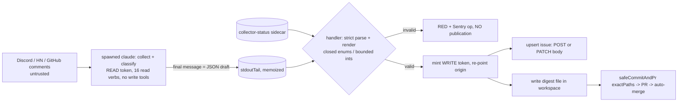

# fix: schema-constrained publication path for cron-community-monitor

## Overview

The daily community-monitor cron feeds text written by outsiders (chat messages, forum posts, issue
comments) into a model run whose output reaches two public surfaces under the bot identity: a
committed digest file (auto-merged to the public repository) and a public tracking issue. Nothing
between the model and those surfaces constrains what text is published, and the spawned agent holds
file-writing tools, an allowlisted shell script it can overwrite, and a write-capable repository
token. A redaction pass would constrain content, not structure, so it does not close the finding (the
issue says so explicitly).

This plan takes publication out of the model's hands. The agent only **collects and classifies**; its
single deliverable is its final message, a small JSON draft. It has no file-writing tools at all (a
per-spawn `no-write` hook directive plus `--disallowedTools`), no publication verbs, and no write
credential. The handler validates the draft against a closed schema (integers, closed enums — no
free-text field exists anywhere in it), renders the digest file and the issue body from fixed templates,
and publishes them itself. After this change the set of publishable strings is a finite template
family; model output selects values within it and nothing else.

Closes #7122. Relates to (does NOT close) #7119 (PA-32 minimisation R1-R5): this change closes the
**forward** path only. The 80+ already-published digests, the legal decision on R1-R5 and the register's
lawful-basis conclusion stay with #7119. Nothing in the PR or the ADR may describe the published
corpus as "sanitized".

## Research Insights

**Premise Validation (Phase 0.6).** #7122 is OPEN with no closing PR. The cited files exist on main
(`cron-community-monitor.ts`, `_cron-safe-commit.ts`, the substrate, `deferred-issues.md` DEF-7). The
DEF-0 sibling (#7119), #7124 (DEF-3, input minimisation) and #7123 (DEF-6) are all OPEN, so the
"overlaps R4" note still holds and #7124 is a distinct (input-side) ticket. The ADR corpus has no
ADR rejecting a handler-side-render / schema-constrained mechanism; ADR-054 ("the prompt is a
suggestion; persistence is a platform responsibility") and the PA-27 precedent (`MAIL_CLASS_ALLOWLIST`
in `server/email-triage/summarize.ts`: closed class set, out-of-allowlist coerced + mirrored to Sentry,
no values attached) point the same way. The unsolicited third-party comment on #7122 recommending a
commercial ingestion-side filter is out of scope and is not acted on or evaluated here.

**Property List (Phase 0.6b).** The issue states one mechanism ("an output allowlist or
schema-constrained publication path"); the properties underneath it are:

1. P1 — No byte of the committed digest is chosen by model output other than a value drawn from a closed
   domain (bounded integers, enum members).
2. P2 — No byte of the public issue body/title is model-chosen outside that same closed domain.
3. P3 — The spawned agent cannot invoke any verb or tool that publishes or mutates (create/comment/label on
   GitHub; post on Discord/X/Bluesky/LinkedIn; write or edit any file, including the allowlisted router
   script), regardless of what the prompt says.
4. P4 — The only path committed is the one handler-authored digest, and no agent-chosen text appears in
   the PR body/comments.
5. P5 — The failure path (RED run, audit-issue fallback) does not republish model output.
6. P6 — A rejected draft is loud (RED monitor + Sentry) and never silently falls back to publishing.
7. P7 — No write credential exists in the agent's environment or workspace during its run.

**Cut List (Phase 0.6b)** — mechanisms the ask names or review proposed, and what covers the property:

| Mechanism | Property | Disposition |
|---|---|---|
| "output allowlist" / "schema-constrained publication path" | P1-P6 | Kept — closed schema + handler-side render |
| redaction pass (R4 in DEF-0) | content scrubbing | Not built (insufficient per the issue); DEF-0 / #7119 keeps it |
| human review gate | all | Not asked; `mergeMode:"auto"` stays; a fallback if counsel requires |
| runtime alphabet guard on the renderer | P1/P2 | Cut to a test assertion — the schema plus a fixed label table already make P1/P2 true; the runtime throw only protects against a future renderer edit |
| `publicPathLabel` (sanitised names/sha in the PR body) | P4 | Cut — the PR body shows a dropped-path COUNT only; names go to Sentry |
| `platformMisconfigured` RED flag | alert on retired prompt branch | Cut — the digest renders each platform's `disabled` status and `verify-collector-status` already exists; accepted loss of one rare alert, recorded in Reconciliation |
| `schemaVersion` field | none | Cut — one version exists |
| `topics[].refs` (issue-number pointers) | operator click-through | Cut — three reviewers: it is the only leaf that points outside the digest (cross-reference events); replaced by two integer counts (see schema). Alternative recorded as a Taste challenge |
| C4 `communitySources` external system | C4 completeness | Cut — collection sources are an existing modeling gap this change neither creates nor changes; only the `api -> kb` edge text is amended |
| sidecar draft file + Write tool | draft delivery | Cut — the draft is the final message (`stdoutTail`); removes the sidecar, symlink/TOCTOU surface and the dot-directory spike |

**Repo evidence the design rests on** (verified by reading, content anchors):

- `cron-community-monitor.ts` prompt step 4 tells the agent to write the digest, "Brief contextual
  quotes (under 100 chars) with attribution are acceptable", and a `| User | Issue/PR | Comment |`
  table; step 5 tells it to `gh issue create`. `COMMUNITY_MONITOR_ALLOWED_PATHS = [COMMUNITY_DIGEST_DIR]`
  lets safeCommitAndPr commit anything under `knowledge-base/support/community/`, including edits to
  any previously published digest.
- `CRON_BASH_ALLOWLISTS["cron-community-monitor"]` (`_cron-claude-eval-substrate.ts`) permits the whole
  `bash plugins/soleur/skills/community/scripts/community-router.sh` prefix (every platform verb,
  including `bsky post`, `linkedin post-content`, `x post-tweet`), plus `gh issue create`,
  `gh issue comment`, `gh label create`. The posting verbs are inert only because the per-platform
  `*_ALLOW_POST` env guards are absent from `buildSpawnEnv` — an env convention, not a structural control.
- **The allowlisted script is itself writable by the agent.** The hook's `WRITE_PROTECTED_PATTERNS`
  (`cron-bash-allowlist-hook.mjs`) protect only `.claude`, the hook, `settings.json`, `.git` and `.env`.
  The agent can `Write` over `community-router.sh` and then run the allowlisted `bash …/community-router.sh
  platforms`, executing model-authored shell with the whole spawn env. Narrowing the verb list alone does
  not close this; removing the write primitive does.
- `buildSpawnEnv(installationToken)` hands the agent `GH_TOKEN` (`contents`, `issues`, `pull_requests` =
  write) and `setupEphemeralWorkspace` clones with `buildAuthenticatedCloneUrl(installationToken)`, which
  puts the same token in `.git/config`; the hook's `.git` read-deny is the only thing between the agent
  and it.
- `_cron-safe-commit.ts` renders up to 10 agent-chosen **untracked path names** into the public PR body
  (the dropped-path marker, `safeMd`-escaped only); `ensureScheduledAuditIssue` (`_cron-shared.ts`)
  publishes 500 chars of the agent's `stdoutTail` (the final message under `--print`) into a public issue
  body when the run goes RED.
- The substrate already spawns with `--output-format json` and folds the final `result` text into
  `stdoutTail` (cap `STDOUT_TAIL_CAP_BYTES` = 8192), memoized in Inngest state — the draft channel exists.
- **Run-report leaf.** `cron-community-monitor` is a `RUN_REPORT_CRONS` row; `buildAllowlistLines` emits a
  `run-report-label` directive for every row and `runHookSelfTest` then probes
  `gh issue create --label <label>`, aborting the spawn if it is not allowed. Removing `gh issue create`
  without handling this would abort every run.
- Learnings applied: PA-27 coerce-and-mirror-without-values (TR3); the 2026-07-19 fabricated-stats
  post-mortem (a schema bounds structure, not truth); `2026-03-15-env-var-post-guard-defense-in-depth`
  (make the unsafe action structurally impossible); `cq-test-fixtures-synthesized-only`.
- Functional-overlap check: two external-registry skills cover generic prompt-injection guidance or AI-code
  review; neither is a publication allowlist. Nothing installed; nothing redundant to build.

## Research Reconciliation — Spec vs. Codebase

| Claim (issue / deferred-issues.md) | Reality | Plan response |
|---|---|---|
| "no output allowlist between the model and the publication tool" | True for issue creation and the committed digest. Also true and not named: a writable allowlisted script, PR-body path names, audit-issue `stdoutTail`, a write-capable token in env and `.git/config` | Close every channel in the Attack Surface table, not only the two named |
| "posted to public GitHub issues" (register PA-32 (g): "the issue comment auto-publishes") | This cron files an issue (`gh issue create`); `gh issue comment` is allowlisted but no prompt step calls it. `cron-daily-triage` (also a PA-32 member) is the one that comments publicly | Remove `gh issue comment` from this cron; track daily-triage in the sibling issue and keep the posture row OPEN for it |
| "Overlaps R4 in DEF-0" (redaction) | R4 is handler-side redaction; a closed schema meets its objective by a different mechanism for future output only | State the overlap; do not claim R1-R4 satisfied; #7119 and counsel decide |
| Prompt: "If only GitHub and HN are enabled ... create ... '- FAILED'" | The agent can no longer file issues | Retire the branch; the digest shows each platform's `disabled` status. Accepted loss of that rare alert (Cut List) |
| Digest consumers expect `## Period` / `## Activity Summary` | The only machine consumers found are the liveness probes (dated path + issue title/label); `cron-campaign-calendar` does not read digests | Keep frontmatter, filename, those headings and the issue title/label byte-identical |
| "write token stays handler-side" (v1 of this plan) | False as drafted: the clone embeds it in `.git/config` | Clone and spawn with a READ token; mint the write token only after the spawn and re-point `origin` for the publish/commit steps |

## Attack Surface Enumeration

Every path by which model-influenced bytes or capabilities can reach a public surface, before and after:

| # | Channel | Author / capability today | After this plan |
|---|---|---|---|
| 1 | Committed digest file (auto-merged PR) | agent `Write` into `knowledge-base/support/community/` | handler renders from the validated draft; `exactPaths` = the one dated path |
| 2 | Public tracking issue | agent `gh issue create` | handler upserts the issue with the rendered body; verb removed |
| 3 | `gh issue comment` on any issue | agent (allowlisted, unused by prompt) | verb removed |
| 4 | Router posting verbs (`bsky post`, `linkedin post-content`, `x post-tweet`) | prefix-allowlisted; inert only by env guards | allowlist lists the 16 read invocations explicitly |
| 5 | `gh label create` | agent | verb removed |
| 6 | Edits to previously published digests | agent (dir-wide `allowedPaths`) | no write tool; `exactPaths` backs it up (other edits dropped + loud) |
| 7 | **Overwriting the allowlisted router script, then running it with the spawn env** | agent `Write`/`Edit` | `no-write` directive denies Write/Edit/MultiEdit/NotebookEdit in the hook; `--disallowedTools` removes them from the pool; spawn-time self-test probes the deny |
| 8 | Dropped-path names in the PR body | agent-chosen file names | `exactPaths` mode renders a COUNT only |
| 9 | Audit-issue `stdoutTail`/`stderrTail` on RED | model final message | withheld for this cron (`withholdModelOutput`); Sentry keeps the redacted tail |
| 10 | Write credential in env and in `.git/config` | `contents/issues/pull_requests: write` | READ token for clone + spawn env; write token minted after the spawn; `origin` re-pointed for handler git |
| 11 | Other credentials in env that can post (`DISCORD_WEBHOOK_URL`, X/Bluesky/LinkedIn secrets) | agent env | `DISCORD_WEBHOOK_URL` removed (no read-path consumer); the platform secrets remain for the read verbs and are unusable without a write primitive or a posting verb — recorded as residual |
| 12 | PR title, commit message, branch name | handler constants | unchanged; asserted by test |
| 13 | safe-commit visibility comments on the monitor issue | handler text; deletion-guard sample lists TRACKED paths | unchanged |
| 14 | Sentry events (private; census completeness) | tails, error text | unchanged; new ops carry codes only (never `unrecognized_keys.keys` or `message`) |

Residual (explicitly accepted, tracked): (a) numeric *truth* — an injection can choose in-range integers,
and ~35 free integers are a covert encoding channel; mitigations are the #6695 sidecar (now bound into
the render, below) and #7124, not this plan; (b) the interactive `/soleur:community digest` skill path is
operator-attended, not an unattended publisher; (c) sibling claude-eval crons share the class (see
Deferral Tracking); (d) the platform secrets in the spawn env remain for the read collectors.

## Proposed Solution



**Draft contract** (`z.strictObject` everywhere; unknown keys rejected). The agent's final message must be
exactly one JSON object (one optional leading code fence is tolerated; anything else is rejected). All six
platform keys are required; each carries `status` (`collected|partial|failed|disabled`), `failureCause`
(closed enum `auth|rate-limit|timeout|output-too-large|script-error|not-configured|unknown`, required iff
status is `partial`/`failed`, forbidden otherwise) and `metrics`, an object of per-platform closed key sets
of integers with realistic per-key caps (`engagementRatePct` is a number `0..100`). The github metrics
include `externalContributors` and `externalInteractions` (integers) so a first outside contributor is
visible without any name. `periodDays` is an integer `1..31` (the handler derives both dates from the run
date — the model never supplies a date string). `topics` is at most 9 entries of
`{ category: <closed 9-member enum>, count: int }`, unique categories. **There is no string field except
enum members.** The raw final message is size-checked (`<= 8 KiB`, the tail cap) before parse.

**Collector truth is bound into the render.** `verify-collector-status` moves BEFORE validation. If the
sidecar reports a failed github record the handler overrides github to `failed` (cause `script-error`) and
drops the model's github metrics before rendering; a missing sidecar keeps today's non-paging behaviour.
The model cannot publish github numbers over a collector that reported failure.

**Render.** One pure function turns a validated draft (plus the override) into `{ digestMarkdown,
issueBody }`; issue title and label are existing constants. The issue body never starts with
`AUDIT_SELF_REPORT_BODY_PREFIX` (dedup keys on it). The rendered text is closed-domain and is the
memoized step output (never the raw draft). The digest drops Top Contributors, Community Interactions,
stargazer usernames, quotes and free-text Trending prose: those need a free-text field, which the closure
forbids (Decision Challenge below). A test asserts the rendered grammar (the alphabet regex
`/^[A-Za-z0-9 \n.,:;%()#|/_*+-]*$/` — no `@`, `<`, `>`, `[`, `]`, `!`, backtick, `&`, `=`, quote) over a
fuzz of valid drafts; there is no runtime guard.

**Publish and order.** Inside the existing guarded `try`: `claude-eval` (READ token) ->
`verify-collector-status` (moved up) -> *skip everything below if `abortedByTimeout`; otherwise run
regardless of exit code (a non-zero exit with a valid final message is the documented healthy #4747
shape; an errored run simply fails the parse)* -> `validate-publication` (parse + render + write the
digest file with unlink + `wx`; returns the verdict and rendered text) -> `mint-write-token` + re-point
`origin` -> `publish-issue` -> `verify-output` (unchanged call) -> the unchanged `heartbeatOk &&
!spawnResult.abortedByTimeout` gate -> `safe-commit-pr` with `exactPaths`.

- `publish-issue` is an **upsert**: if a real digest issue for today exists (a replay, or the #6714
  recovery case where the digest never landed) it PATCHes that issue's body with the rendered text, which
  also bumps `updated_at` so `verify-output` sees it; otherwise it POSTs. The existence read FAILS CLOSED
  (a read error throws; it does not fall open to a duplicate). Bounded in-step retry (3 attempts, backoff)
  on 5xx/429; a 422 is a failure. The milestone is resolved by a `GET /milestones` title lookup; a missing
  milestone creates the issue without one and mirrors a Sentry warn.
- `verify-output` is now tautological as a proof the agent produced anything; the real gate is the
  validation verdict, so `heartbeatOk = heartbeatOk && publication.ok` is applied immediately after it and
  before the (verbatim) persistence gate. A human comment bumping `updated_at` therefore cannot let
  persistence run without a render.
- The issue is published before the commit and links the digest path (as today); a commit failure leaves a
  link to a not-yet-existing file until the next run — accepted and recorded in the runbook.
- Dropped-path events stay loud (Sentry + PR-body count) and do not flip `heartbeatOk` (today's behaviour).
- Marker 3 (`emitCommunityDigestFile`) keeps its position; `present` now means "the handler wrote the
  digest" because the write moved into `validate-publication`.
- Pre-existing, unchanged, non-goal: two same-day runs while the first PR sits in the merge queue can open
  two PRs on the same file.

**Decision Challenge (Taste — persisted, not silently decided).** The closed schema removes Top
Contributors, Community Interactions, stargazer usernames and narrative prose. Three options are recorded
in `decision-challenges.md`: (a) drop everything (this plan), (b) keep counts plus click-through issue
numbers (rejected by three reviewers: the only leaf that points outside the digest), (c) a private rich
channel (follow-up). The interactive `/soleur:community digest` skill remains available for full detail.

## Implementation Phases (test-first: `cq-write-failing-tests-before`)

Run commands from `apps/web-platform` with `./node_modules/.bin/vitest run <file>`.

### Phase 0 — RED tests and one spike

- Write all new tests first; confirm they fail for the right reason (module/option/directive absent).
- Spike S1 (hook directive): in `cron-bash-allowlist-hook.test.ts`, assert that with a `no-write` line in
  the allowlist the real hook DENIES `Write`, `Edit`, `MultiEdit`, `NotebookEdit` and still ALLOWS them for a
  cron without the line; and that the real hook DENIES `gh issue create|comment`, `gh label create` and
  `bash <router> bsky post` for the narrowed community allowlist.
- Spike S2 (token): confirm against the GitHub App manifest (`apps/web-platform/infra/github-app-manifest.json`)
  and GitHub's per-endpoint permission table that `{contents, issues, pull_requests}: read` covers every
  `github-community.sh` call (table in Phase 5); confirm `mintInstallationToken` accepts the narrowed
  permission set (cache key includes permissions).

### Phase 1 — `_cron-community-publication.ts` (schema, parse, render)

One table of platform metric keys, labels and caps drives schema, renderer and the prompt's example draft
(no drift). Exports: `parseCommunityDraft(finalMessage) -> { ok: true, draft } | { ok: false, reason,
codes }` — `codes` are built from zod `code` plus schema-known path segments only (never `unrecognized_keys`
key names or `message`); `renderCommunityPublication(draft, { runDate, repo, githubOverride })`;
`readDraftFromStdout(stdoutTail)`; `writeDigestFileContained(spawnCwd, relPath, text)` (lstat each ancestor,
unlink existing, write with `wx`; `node:fs` imported lazily like `readCollectorStatus`); `upsertDigestIssue`
(octokit injected, fail-closed read, bounded retry, milestone lookup). The module imports no zod
constructor outside an allowlist (`strictObject|enum|literal|int|number|boolean|array`) — a source test
fails on any other `z.` call (`z.string`, `z.email`, `z.record`, `z.any`, `z.custom`, `z.templateLiteral`, `z.coerce.*`).

### Phase 2 — `_cron-safe-commit.ts`

- `exactPaths?: readonly string[]` on `SafeCommitConfig`, with ONE shared predicate
  `isPathAllowed(path, { allowedPaths, exactPaths })` used by both the `matched` and `dropped` filters
  (no duplicated matcher). Community passes `allowedPaths: []`, `exactPaths: [digestPath]`. A unit test
  asserts `allowedPaths: []` with `exactPaths: []` matches nothing.
- In `exactPaths` mode the dropped-path PR-body marker renders only `N changed path(s) outside the
  persistence allowlist were NOT committed (Sentry op safe-commit-paths-dropped)`; the other 14 callers
  keep today's marker byte-for-byte.
- Update the "inside allowedPaths" log/comment strings to say "allowlist".

### Phase 3 — containment closure (`_cron-claude-eval-substrate.ts`, `cron-bash-allowlist-hook.mjs`, `_cron-run-reports.ts`)

- Community allowlist becomes `COMMUNITY_ROUTER_READ_VERBS` (16 literal invocations: `platforms`;
  `discord guild-info|members|channels|messages`; `x fetch-metrics`; `bsky get-metrics`;
  `linkedin fetch-metrics|fetch-activity`; `github activity|contributors|discussions|repo-stats|fetch-interactions`;
  `hn mentions|trending`), each prefixed with the literal router path, plus `gh issue list`. Removed:
  `gh issue create`, `gh issue comment`, `gh label create`, `gh label list`, and the bare router prefix.
  `allow[0]` is a full literal command (`… platforms`) because `runHookSelfTest` executes it. The prompt
  gains the literal `discord messages <channel_id>` so the prompt-parity test covers every verb.
- New hook directive `no-write` (file-driven per cron, ADR-058 pattern): the substrate is its only
  producer (set `CRON_NO_WRITE = ["cron-community-monitor"]`), the hook denies `Write`, `Edit`,
  `MultiEdit` and `NotebookEdit` when it is present, `runHookSelfTest` probes the deny, and the
  parity test's directive-spelling regex gains `no-write`.
- `CLAUDE_CODE_FLAGS` adds `--disallowedTools Write,Edit,MultiEdit,NotebookEdit,Task,Agent,Skill` (second
  layer; removes the tools from the model's pool, and removes the sub-agent route that otherwise rests on
  hook inheritance) and `--allowedTools` becomes `Bash,Read,Glob,Grep`.
- Run-report leaf: `RunReportCron` gains a closed union `filer: "agent" | "handler"` (default `"agent"`;
  community is `"handler"`). `CRON_RUN_REPORT_LABELS` (the directive source) skips handler rows; the
  sweeper (`closeAfterDays: 9`), the `issue-flow-measure.sh` label mirror and parity row (i) keep the row.
  Parity row (ii) splits: agent rows MUST contain `gh issue create`, handler rows MUST NOT. In
  `cron-claude-eval-substrate.test.ts` the run-report assertions that count 10 entries and map
  community to its slug flip (9 entries; community undefined) and the fixtures that use
  `cron-community-monitor` as the run-report example move to `cron-seo-aeo-audit`; community is removed
  from the `RESTORED` loop that asserts `gh issue create` is allowed. The handler-created issue keeps the
  same App author, so the sweeper's `[Scheduled]`-title + `app/soleur-ai` author filter still closes it.

### Phase 4 — handler flow + prompt rewrite (`cron-community-monitor.ts`)

- Prompt: steps 1-2 keep their literal router invocations; step 3 (brand guide) is removed; step 4 becomes
  "your final message MUST be exactly one JSON object matching the example below; you have no file-writing
  or issue-creating tools — the platform validates, renders and publishes"; the example draft is generated
  from the Phase 1 constants; step 5 (`gh issue create`) and the MILESTONE RULE are removed; the
  PERSISTENCE paragraph keeps ONLY the parity anchor line `PERSISTENCE: Do NOT run git add, git commit,
  git push, or gh pr create/merge.` and its "platform commits" sentence — the "Creating the monitor issue
  above is REQUIRED" and "Only changes under knowledge-base/support/community/" sentences are deleted (the
  agent can do neither, and the instruction would only provoke denied filings); the quotes/contributor/
  interaction directives are deleted (closes R3 for future output).
- Steps and order as in Proposed Solution. The `catch` blocks' `redactToken` calls redact BOTH tokens.
- `buildSpawnEnv` loses `DISCORD_WEBHOOK_URL` (no read-path consumer: `grep` over the community scripts
  finds it only in `discord-setup.sh`); the test anchor list updates.
- `COMMUNITY_DIGEST_DIR` stays exported (three suites derive the path from it).

### Phase 5 — failure path and credential custody

- `ensureScheduledAuditIssue({ ..., withholdModelOutput?: boolean })`: when true, both tail rows render
  `(withheld - model output is not published; see Sentry)`. Only community passes true.
- Credential custody: `mint-installation-token` becomes a READ token
  (`COMMUNITY_SPAWN_TOKEN_PERMISSIONS = { contents, issues, pull_requests: "read" }`, beside
  `ISSUE_CREATOR_CRON_TOKEN_PERMISSIONS`) used for the clone (`setupEphemeralWorkspace` and
  `spawnClaudeEval` keep their single-token signatures — they simply receive the read token). After the
  spawn, a `mint-write-token` step mints `DEFAULT_CRON_TOKEN_PERMISSIONS` (also keeps the write token's
  1-hour life clear of the ~50-minute spawn) and `setOriginToken(spawnCwd, writeToken)` (a small exported
  helper using `buildAuthenticatedCloneUrl`) re-points `origin` before `publish-issue`/`safe-commit-pr`.
  The audit-issue fallback uses the write token (minted unconditionally after the spawn).
- Permission derivation (per call, from `github-community.sh`; confirmed in S2):

  | `github-community.sh` call | Needs |
  |---|---|
  | `repos/{r}/issues`, `repos/{r}/issues/comments` | Issues: read |
  | `repos/{r}/pulls` | Pull requests: read |
  | `repos/{r}/commits` | Contents: read |
  | `repos/{r}`, `repos/{r}/stargazers` | Metadata: read (implicit) |
  | `gh api graphql` (discussions) | Discussions: read — not held by today's write-scoped token either, so no regression |

  If S2 or the first live run shows a collector needs more, narrow the ADR claim to "write verbs are
  hook-denied and the write credential is minted after the spawn" and keep Phases 1-4.

### Phase 6 — records

ADR-272, C4 edge-text edit + compiled-model regeneration, register/posture/DPIA/LIA wording per the CLO
list below, CLO attestation, runbook entry.

### Phase 7 — post-merge verification (no SSH)

Fire `cron/community-monitor.manual-trigger` with the `soleur:trigger-cron` skill, then poll (bounded) per
the Acceptance Criteria.

## Files to Create

- `apps/web-platform/server/inngest/functions/_cron-community-publication.ts` — closed schema, parse, render, contained write, issue upsert.
- `apps/web-platform/test/server/inngest/cron-community-publication.test.ts` — schema leaf-injection, render grammar fuzz, constructor-allowlist source test.
- `apps/web-platform/test/server/inngest/cron-community-monitor-publication-flow.test.ts` — handler flow (valid/invalid/timeout/replay/recovery/sidecar-red/token custody).
- `apps/web-platform/test/server/inngest/cron-community-monitor-allowlist.test.ts` — allowlist closure + real-hook probes + `no-write` probes.
- `knowledge-base/engineering/architecture/decisions/ADR-272-schema-constrained-handler-side-publication.md` — ordinal verified free across all `origin/*` refs at plan time; re-verify at ship.
- `knowledge-base/project/specs/feat-one-shot-7122-community-monitor-output-allowlist/decision-challenges.md` — Taste challenge (written).
- `knowledge-base/legal/audits/2026-10-clo-attestation-7122.md` — counsel-ready attestation draft with re-evaluation triggers (see Domain Review).

## Files to Edit

- `apps/web-platform/server/inngest/functions/cron-community-monitor.ts` — prompt, flow, token custody, flags, env, comments.
- `apps/web-platform/server/inngest/functions/_cron-claude-eval-substrate.ts` — community allowlist + `COMMUNITY_ROUTER_READ_VERBS`; `CRON_NO_WRITE` directive producer; self-test probe; run-report derivation skips handler rows; `setOriginToken`.
- `apps/web-platform/server/inngest/cron-bash-allowlist-hook.mjs` — parse the `no-write` directive; deny the four write-class tools when present.
- `apps/web-platform/server/inngest/functions/_cron-run-reports.ts` — `filer` union on every row.
- `apps/web-platform/server/inngest/functions/_cron-safe-commit.ts` — `exactPaths`, shared `isPathAllowed`, count-only marker in exact mode, `.soleur-digest-draft/` NOT added (no sidecar).
- `apps/web-platform/server/inngest/functions/_cron-shared.ts` — `withholdModelOutput`, `COMMUNITY_SPAWN_TOKEN_PERMISSIONS`.
- `apps/web-platform/test/server/inngest/cron-bash-allowlist-hook.test.ts` — `no-write` rows (S1).
- `apps/web-platform/test/server/inngest/cron-run-report-labels-parity.test.ts` — row (ii) split; directive-spelling regex gains `no-write`; non-vacuity: at least one handler row.
- `apps/web-platform/test/server/inngest/cron-claude-eval-substrate.test.ts` — community allowlist rows (router-batch ALLOW stays; posting-verb DENY rows), run-report block (counts 9/10, fixture swap), `RESTORED` loop.
- `apps/web-platform/test/server/inngest/cron-community-monitor.test.ts` — prompt anchors (removed: `## Top Contributors`, `Community Interactions`, `--milestone`; added: draft contract keys, `discord messages`); `buildSpawnEnv` anchor list without the webhook; flags assertions.
- `apps/web-platform/test/server/inngest/cron-community-monitor-heartbeat.test.ts`, `-dedup.test.ts`, `-collector-status.test.ts` — fixture rework: a shared `validDraftFinalMessage()` helper for the spawn mock's `stdoutTail`, a `POST`/`PATCH /issues` route in the dedup fake, a `vi.mock` seam on the publish function, ordering expectations (sidecar before validate).
- `apps/web-platform/test/server/inngest/cron-safe-commit.test.ts` — `exactPaths`, `isPathAllowed`, count-only marker, unchanged marker for the other callers.
- `apps/web-platform/test/server/inngest/cron-safe-commit-parity.test.ts` — community stays in the cohort; assert `allowedPaths` is not the directory.
- `apps/web-platform/test/repo-wide-suites.ts` — register `test/server/inngest/cron-community-monitor-allowlist.test.ts` (reads `plugins/soleur/skills/community/scripts/*.sh`; `repo-wide-containment.test.ts` names the file to add).
- `knowledge-base/engineering/architecture/diagrams/model.c4`, `knowledge-base/engineering/architecture/diagrams/model.likec4.json` (regenerated), and the web-platform canonical mirror checked by `apps/web-platform/test/c4-canonical-mirror.test.ts` — `api -> kb` edge text only.
- `knowledge-base/legal/article-30-register.md`, `knowledge-base/legal/compliance-posture.md`, `knowledge-base/legal/audits/2026-07-31-dpia-screening-claude-eval-fleet-and-ci.md`, `knowledge-base/legal/legitimate-interest-assessments/2026-07-31-claude-eval-fleet-and-ci-lia.md` — CLO wording list below (append-only supersede markers; no edits to `docs/legal/`).
- `knowledge-base/engineering/operations/runbooks/cloud-scheduled-tasks.md` — "Community publication rejected" triage entry (Sentry-first, no SSH; three required statements below).

## Open Code-Review Overlap

None. (Queried the 200 most recent open `code-review` issues for every planned code, register and C4 path; no body references any of them.)

## Scope Check

### Ask Mapping

| # | User ask (verbatim) | Plan item | Status |
|---|---------------------|-----------|--------|
| 1 | "An output allowlist or schema-constrained publication path, so model output cannot determine arbitrary published text." [issue #7122] | Phase 1 (closed schema + render), Phase 4 (handler publishes) | mapped |
| 2 | "A redaction-only pass does not close this (redaction constrains content, not structure)." [brief] | Cut List (redaction not built); Alternatives table | mapped |
| 3 | "committed to a public repository and posted to public GitHub issues under a bot identity with write access" [issue #7122] | Phase 2 (exact-path commit), Phase 3 (issue and write verbs removed, no-write directive), Phase 4 (handler issue), Phase 5 (credential custody) | mapped |
| 4 | "no output allowlist between the model and the publication tool" [issue #7122] | Phase 3 (allowlist closure) | mapped |
| 5 | "Note: an unrelated third-party comment on the issue recommending an ingestion-side vendor filter is out of scope and must not be acted on." [brief] | Non-Goals | mapped |
| 6 | "Use \"Closes #7122\" in the PR body." [brief] | PR-body reminder in Acceptance Criteria | mapped |

### Plan-Item Provenance

| Plan item | User words cited (verbatim quote) | Verdict |
|-----------|-----------------------------------|---------|
| `_cron-community-publication.ts` + its tests | "schema-constrained publication path" | asked |
| Phase 3 allowlist closure + hook tests | "no output allowlist between the model and the publication tool" | asked |
| Phase 3 `no-write` directive and `--disallowedTools` | "model output cannot determine arbitrary published text" | asked |
| Phase 2 `exactPaths` | "committed to a public repository" | asked |
| Phase 4 handler-side issue + prompt rewrite | "posted to public GitHub issues" | asked |
| Phase 5 `withholdModelOutput` | "model output cannot determine arbitrary published text" | asked |
| Phase 5 credential custody (read token, post-spawn write token) | "under a bot identity with write access" | asked |
| `filer` union in `_cron-run-reports.ts` | — | inferred — justification: `runHookSelfTest` aborts every spawn whose run-report directive cannot file; the leaf must stop emitting the directive for a handler-filed cron |
| Sidecar-before-render binding | — | inferred — justification: otherwise the model can publish github numbers over a collector that reported failure, which is the same untrusted-structure class |
| ADR-272 + C4 edge text | — | inferred — justification: Phase 2.10 of the plan skill makes the ADR and C4 update a deliverable of any trust-boundary change |
| Register / posture / DPIA / LIA wording, CLO attestation | — | inferred — justification: the register, posture row and DPIA memo currently state "NO output allowlist"; shipping the allowlist without superseding those leaves a recorded TOM that lies |
| Runbook triage entry | — | inferred — justification: a new RED reason needs a no-SSH first step or `hr-no-ssh-fallback-in-runbooks` is violated at the next incident |
| Decision-challenges file | — | inferred — justification: headless runs must persist Taste decisions for `ship` to render (ADR-084) |

### Split Assessment

- Subsystems touched: 3 — `apps/web-platform`, `knowledge-base` (architecture, legal, runbooks), `plugins/soleur` (read-only reference)
- Planned files: 22 edited + 7 created = 29 | Estimated changed lines: ~1,000 (about 550 in tests)
- Thresholds: >= 4 subsystem roots OR > 25 planned files OR > 800 estimated lines
- Recommendation: single PR — over two thresholds only because tests and records are counted; the production diff is ~450 lines. Splitting records from code would ship a register that lies for a PR cycle, and splitting Phases 1-4 from Phase 5 would ship a hook-only control with a write-capable credential in the workspace. Phase 5 is independently revertable instead.

## Domain Review

**Domains relevant:** engineering, legal, product

### Engineering (CTO)

**Status:** reviewed
**Assessment:** two P0s folded in: (1) the allowlisted router script was agent-writable, so verb narrowing alone did not make posting unreachable — fixed by removing the write primitive (`no-write` directive + `--disallowedTools`) and the draft moving to the final message; (2) PR-body names were an open channel — now a count. Also folded: heartbeat gating on the validation verdict, marker-3 semantics, constructor-allowlist tripwire, `unrecognized_keys` codes excluded, `DISCORD_WEBHOOK_URL` dropped, `topics.refs` cut.

### Legal (CLO)

**Status:** reviewed
**Assessment:** discharge conditional on: (P0) `cron-daily-triage` is also a PA-32 member and is not fixed — posture row stays OPEN for it, per-limb wording in register (g)(2)/(3), sibling issue names it; (P0) state the residual at true strength ("narrowed", never "closed/resolved"; unchanged: no human gate, numeric truth, enum selection model-influenced, Anthropic ingestion/no PII scrub, the 80 published digests); (P0) append-only supersede markers and a full sweep (register PA-32 §(a), §(c), §(f), §(g)(4)/(6) and PA-31 §(g) rows, DPIA residuals (a)/(b) and §5 triggers 1 and 4, LIA R4 row, posture #7119 and #7122 rows; also check `statutory-response-catalog.md` and `ccla-register.md`; cite code by constant/function name, never line number); (P1) do not write "R1/R2/R4 satisfied" — "future output is structurally incapable of the R1/R2/R3 content; R4's objective is met by a different mechanism; substitution is for counsel at #7119"; do not touch the LIA necessity conclusion or the lawful-basis cell; (P1) the schema carries no direct identifier — never "no per-person data" (counts can single out); (P1) no `docs/legal/` edits in this PR; add a post-merge, counsel-led note to #7119; (P2) run `soleur:gdpr-gate` on the diff at the work-phase exit; update register §(f)'s live-state note after the first post-merge run, not before; (P2) add the CLO attestation with re-evaluation triggers (counsel decision at #7119, a first human-gate decision, a daily-triage fix, any new free-text schema field).

### Product (CPO)

**Status:** reviewed — SIGN-OFF WITH CONDITIONS, conditions folded in
**Assessment:** threshold `single-user incident` is right; the "user" at risk is named third parties (republished usernames, a defamatory injected sentence). Conditions: (1) add `externalContributors` and `externalInteractions` integers so outside activity stays visible without a name (done); (2) runbook entry states the day is lost and not retried, the founder does nothing for a single occurrence, and three consecutive REDs triggers the follow-up of coercing unknown enum members to `other` — recorded in the runbook and ADR-272 rather than a new issue (done, Deferral Tracking); (3) scope the closure claim to the forward path (Overview, ADR, PR body) (done); (4) Decision Challenge reframed as three options (done). The first post-deploy RED (in-flight run) goes in the PR body's first line; a visible format discontinuity at the cutover date is noted in the runbook.

**Product/UX Gate:** NONE — no user-facing UI surface (no component/page/layout path in Files to Edit/Create; the mechanical UI-surface override does not fire).

## User-Brand Impact

- **If this lands broken, the user experiences:** the daily community digest and its tracking issue stop appearing (monitor goes RED with a Sentry op naming the reason; that day's digest is not retried), or a digest renders with wrong numbers; no product UI is touched.
- **If this leaks, the user's data / workflow is exposed via:** attacker-chosen text published under Jikigai's bot identity into a public repository's git history and its forks (permanent), including a defamatory or scam sentence about a named third party, and third-party commenter/stargazer usernames continuing to be republished (the PA-32 limb, which this change does not retroactively fix).
- **Brand-survival threshold:** `single-user incident`
- **Threshold decision (challengeable):** one injected publication is irreversible (git history, forks), carries the company's name and can name a real person, so a single event is brand-material; `aggregate pattern` would mean tolerating the first occurrence.

CPO sign-off is conditionally granted (above); `soleur:engineering:review:user-impact-reviewer` runs at review time.

## Observability

```yaml
liveness_signal:
  what: Sentry cron monitor scheduled-community-monitor (green only when the handler-upserted digest issue exists, the validation verdict is ok AND the dated digest is committed), plus the existing digest-liveness markers
  cadence: daily 08:00 UTC
  alert_target: Sentry monitor alert to the operator (existing monitor issue-alert route)
  configured_in: apps/web-platform/server/inngest/functions/cron-community-monitor.ts (SENTRY_MONITOR_SLUG) and apps/web-platform/infra/sentry/cron-monitors.tf
error_reporting:
  destination: Sentry web-platform project via reportSilentFallback (SENTRY_DSN)
  fail_loud: ops community-publication-rejected (extra.reason, extra.codes, draftBytes, abortedByTimeout, spawnExit) and community-publication-issue-failed; monitor RED
failure_modes:
  - mode: the agent's final message is missing, oversized, unparseable or schema-invalid (injection attempt or model drift)
    detection: Sentry op community-publication-rejected with a closed reason (missing, oversized, parse, schema) and zod issue codes plus leaf paths, never values (layer 1 sentry-correlation middleware tags inngest.fn_id and run id; Sentry monitor RED)
    alert_route: Sentry monitor alert, run linked by inngest.run_id
  - mode: handler could not upsert the issue or write the digest (GitHub 5xx after bounded retry, containment refusal)
    detection: Sentry op community-publication-issue-failed or safe-commit-failed (layer 1), plus the existing digest-liveness marker 6 in Better Stack (layer 3 Vector journald shipper)
    alert_route: Sentry monitor alert
  - mode: an injected agent reaches for a denied publication or write verb (gh issue create/comment, a router posting verb, Write/Edit)
    detection: the substrate's existing SOLEUR_CRON_FILING_DENY marker (pino WARN shipped by the Vector journald shipper, layer 3) counts denied filings from permission_denials; the prompt never instructs a filing now, so any non-zero count is anomalous
    alert_route: Better Stack Logs query on the marker; the run itself stays GREEN because nothing was published
  - mode: read-only spawn token insufficient for a collector (regression from Phase 5)
    detection: existing collector-status sidecar - Sentry op collector-status-failed (layer 1); the handler override renders github as failed in the digest
    alert_route: Sentry monitor alert
logs:
  where: Sentry events (extra carries codes/paths only) and Better Stack Logs via the Vector journald shipper for the filing-deny marker
  retention: Sentry project retention (90 days); Better Stack Logs source retention
discoverability_test:
  command: curl -s https://api.github.com/search/issues?q=label:scheduled-community-monitor+repo:jikig-ai/soleur
  expected_output: Community Monitor
```

**Affected-surface note (Phase 2.9.2).** The affected surface is the cron worker plus the agent spawn; the
handler cannot see inside the agent, so the one `community-publication-rejected` event carries the
discriminating fields in a single emission: `reason`, `codes`, `draftBytes`, `abortedByTimeout`,
`spawnExit` — enough to separate "agent never answered", "agent wrote junk", "schema drift" and a
timeout without a second blind fix. The `discoverability_test` was executed once at plan time (it printed
37 matching lines against the live repo; the issues-list endpoint was rejected because it returns open issues only and the monitor issues are closed shortly after filing).

## Architecture Decision (ADR/C4)

### ADR

New ADR-272 (ordinal free across every `origin/*` ref at plan time; `soleur:ship` re-verifies): **claude-eval
crons that publish to a public surface do so handler-side from a closed-schema draft; the agent has no
write or publication capability and no write credential during its run.** It cites
`ADR-033-inngest-cron-functions-invoke-claude-code-via-child-process-spawn` (not the other two ADR-033
files), extends ADR-054 (persistence is a platform responsibility; now authorship of the committed bytes
is too) and ADR-058 (file-driven per-cron directive: `no-write`), records the clone/push token custody
split, the ADR-126 interaction (the issue is handler-made, so `verify-output` observes a deterministic
artifact and the validation verdict is the gate) and the global `exactPaths`/`isPathAllowed` addition.
Status `accepted`; the sibling rollout is tracked in an issue, not an `adopting` status. The ADR states
the closure claim for the forward path only.

### C4 views

Read `model.c4`, `views.c4`, `spec.c4`. Enumeration for this feature: (a) external human actors — community
members who author the ingested text: not modeled; the decision changes how their text is *published*, not
how it is collected; (b) external systems — Discord and GitHub are modeled; Hacker News, X, Bluesky,
LinkedIn and comment surfaces as collection sources are not modeled, a pre-existing gap this change neither
creates nor alters (tracked in the sibling issue); (c) data stores — none new (the draft lives in memoized
step output; nothing new is persisted); (d) actor-to-surface access — unchanged. Task: amend the existing
`api -> kb` edge text to say that for the community-monitor cron the committed bytes are handler-rendered
from a validated draft (no new numerals, so `c4-count-parity` does not move), regenerate
`model.likec4.json` and the web-platform mirror. Validation: `apps/web-platform/test/c4-code-syntax.test.ts`,
`apps/web-platform/test/c4-render.test.ts`, `apps/web-platform/test/c4-canonical-mirror.test.ts`,
`plugins/soleur/test/c4-model-freshness.test.sh` and `plugins/soleur/test/c4-count-parity.test.sh`.

### Sequencing

The ADR describes the target state now; nothing is postponed.

## Guard Contract

### Guard 1 — Draft schema closure and render grammar

**Property.** No value that passes `parseCommunityDraft`, and no byte `renderCommunityPublication` emits,
can carry text other than a member of a closed enum, a bounded integer or number, or a handler constant.

**Assembly.** Every leaf of the draft: the root, the six platform objects, each platform's `metrics`
keys (per-platform closed set from the single metrics table), `failureCause`, `status`,
`topics[].category`, `topics[].count`, `periodDays`. The chokepoint is the single exported
`parseCommunityDraft`; the renderer accepts only its return type, and the handler has no other path from the
agent's message to a public string. The metrics table is the one source for schema, renderer and the
prompt's example, so a key added in one place appears in all three. The guard is the leaf-injection test:
it derives the leaf paths from the metrics table at run time and substitutes a 10 KB injection string at
each in turn; a second test runs the rendered output of a fuzz of valid drafts through the alphabet regex.

**Mutation matrix:**

| # | Mutation (edit to the schema module or the suite) | Expected |
|---|---|---|
| 1 | Widen `topics[].category` from the closed enum to `z.string().max(64)` | RED (leaf-injection test accepts the string; the constructor-allowlist source test also fires) |
| 2 | Make the suite's leaf enumerator return `[]` (a vacuous walk) | RED (floor: leaf count must equal the count derived from the metrics table) |
| 3 | Add a second platform whose `metrics` object is `z.object` (non-strict) after the compliant first | RED (the unknown-key row runs against every platform object, not only the first) |
| 4 | Replace `z.strictObject` with `z.object` at the draft root | RED (an unknown top-level key, including `__proto__`, is accepted) |
| 5 | Edit a template line to interpolate `[x](y)` or `@user` | RED (the fuzz-grammar test) |
| 6 | Harness row: run the suite against a stub `parseCommunityDraft` that always returns `ok: true` | RED (the rejection rows fail, so the suite can fail) |
| 7 | Must-PASS non-canonical input: two platforms `disabled`, no topics, one `partial` platform with a cause, `engagementRatePct: 0.5` | PASS (a stub that rejects everything fails here) |

**Anchor.** The schema and its tests live in one PR, so one diff can weaken both. The independent anchor
is the leaf-count floor derived from the metrics table (removing a field must also edit the table the
expected count derives from), the constructor-allowlist source test and the ADR-272 review.

### Guard 2 — Containment closure (verbs, write primitive, credential)

**Property.** The spawned agent can invoke no verb that publishes to GitHub or a community platform,
cannot write or edit any file (including the allowlisted router script), and holds no write credential.

**Assembly.** `CRON_BASH_ALLOWLISTS["cron-community-monitor"]` entries; `COMMUNITY_ROUTER_READ_VERBS`;
every `community-router.sh <platform> <verb>` literal in `COMMUNITY_MONITOR_PROMPT`; the `no-write`
directive line in the file `buildAllowlistLines` produces; the real hook run against that file;
`CLAUDE_CODE_FLAGS` (`--allowedTools`, `--disallowedTools`); `buildSpawnEnv`'s output; the token passed
to `setupEphemeralWorkspace` and `spawnClaudeEval`. Chokepoints: the substrate's allowlist file and the
spawn's argv/env, both produced in one module.

**Mutation matrix:**

| # | Mutation | Expected |
|---|---|---|
| 1 | Re-add `gh issue create` to the community entry | RED |
| 2 | Re-add the bare router prefix `bash plugins/soleur/skills/community/scripts/community-router.sh` | RED (the real hook allows `bsky post`; the test expects deny) |
| 3 | Add a second router verb `linkedin post-content` after the compliant verbs | RED (a check that stops at the first member is itself the defect) |
| 4 | Drop `community` from `CRON_NO_WRITE` | RED (the real hook allows `Write` to the router script; the test and the spawn-time self-test expect deny) |
| 5 | Remove `--disallowedTools` from the flags | RED (flags assertion) |
| 6 | Pass the write token to `setupEphemeralWorkspace` (clone) | RED (custody test: the token that reaches setup equals the READ token; `.git/config` fixture holds no write token) |
| 7 | Add `DISCORD_WEBHOOK_URL` back to `buildSpawnEnv` | RED (env anchor list) |
| 8 | Prompt gains a router invocation whose verb is not in the list | RED (prompt-parity) |
| 9 | Harness row: run the suite against a hook stub that allows everything | RED (the suite asserts deny on the probes) |
| 10 | Must-PASS non-canonical: `bash <router> github fetch-interactions 1; bash <router> hn trending --limit 30` chained with `;`, and the same cron-allow file without the `no-write` line for a different cron | ALLOW (the directive is per-cron, not global) |

**Anchor.** The posting verbs and `*_ALLOW_POST` guards live in `plugins/soleur/skills/community/scripts/*.sh`,
outside the files this PR edits; the posting-verb DENY rows name `bsky post`, `linkedin post-content` and
`x post-tweet` literally, and a source test asserts those three subcommands still exist in the scripts
(a removed verb must be removed from the test deliberately).

### Guard 3 — Exact-path persistence and PR-body count

**Property.** The only path safeCommitAndPr stages for this cron is today's handler-authored digest, and
no agent-chosen file name appears in a public PR body.

**Assembly.** The `isPathAllowed` predicate (the single `matched`/`dropped` partition), the community call
site, the dropped-path marker in exact mode, and the handler's write helper. One chokepoint (the
partition); the second renderer of path names (the deletion-guard sample) is tracked-path-only and stays
on `safeMd` by design — documented, not silent.

**Mutation matrix:**

| # | Mutation | Expected |
|---|---|---|
| 1 | Workspace fixture with an edited previously published digest plus `<today>-digest.md.evil` beside the real one | RED unless both are dropped: committed set equals exactly `[today digest]` |
| 2 | Pass `allowedPaths: [COMMUNITY_DIGEST_DIR]` again | RED (parity test asserts the directory is not an allowed prefix for this cron) |
| 3 | Fixture file named `www.evil.example-free-money` | RED if the PR body contains the name; GREEN only with the count |
| 4 | Two stray files, one conforming and one hostile (second-member row) | the body carries "2 changed path(s)" and neither name |
| 5 | Make `isPathAllowed` ignore `exactPaths` | RED (committed set empty -> no-changes -> RED liveness) |
| 6 | Harness row: assertion that reads the PR body from a mock that never records a body | RED (the test asserts the mock received a body) |
| 7 | Must-PASS: the other 14 callers' dropped-path marker with names | unchanged byte-for-byte |

**Anchor.** The committed-set expectation is a literal one-element list in the test; widening the
production allowlist cannot pass without editing it, and `cron-safe-commit-parity.test.ts` (an existing
independent file) asserts the cohort invariants.

## Encryption Posture

No new persistent store and no new cross-component connection: the draft exists only in memoized Inngest
step output (already private run state) and the handler's new GitHub REST calls reuse the existing
TLS-verified Octokit path. The plan introduces neither a `.tf` file, a migration, nor a compose file.

## Acceptance Criteria

### Pre-merge (PR)

- [ ] `parseCommunityDraft` rejects every programmatically generated single-leaf injection (Guard 1 rows 1-4) and accepts the must-PASS non-canonical draft (row 7); leaf count equals the table-derived count; rendered output of a fuzz of valid drafts matches the alphabet regex; issue title equals `[Scheduled] Community Monitor - <date>` exactly.
- [ ] Handler flow tests: valid draft -> one issue upserted and `safeCommitAndPr` called with `exactPaths: [digestPath]`, `allowedPaths: []`; replay -> still one issue; **issue pre-exists but digest absent from main -> the issue body is PATCHed, `verify-output` sees it, `safeCommitAndPr` is called, run GREEN** (the #6714 recovery case); invalid/missing/oversized draft -> no issue, no commit, `heartbeatOk` false, op `community-publication-rejected` with codes only; `abortedByTimeout` -> no validation and no publication; non-zero exit with a valid final message -> published; collector sidecar red while the draft says github `collected` -> the rendered digest and issue show github `failed` with no github metrics; issue-list read throws -> step throws (no duplicate); 5xx then success -> one issue; milestone lookup failure -> issue created without milestone plus a Sentry warn; `heartbeatOk` is `false` whenever the verdict is not ok even if `verify-output` is satisfied by a bumped `updated_at`.
- [ ] Credential custody: the token passed to `setupEphemeralWorkspace` and `spawnClaudeEval` is the read-permission token (`{contents, issues, pull_requests: "read"}`); a workspace fixture's `.git/config` holds no write token; `setOriginToken` is called after the spawn and before `publish-issue`; both tokens are redacted in every `catch`.
- [ ] Containment tests (Guard 2) green through the real hook: `Write`/`Edit`/`MultiEdit`/`NotebookEdit` denied for community and allowed for a cron without `no-write`; `runHookSelfTest` aborts the spawn when the deny probe fails; allowlist contains none of `gh issue create`, `gh issue comment`, `gh label create` and no bare router prefix; spawn argv contains `--disallowedTools`.
- [ ] `cron-safe-commit.test.ts`: `exactPaths`, `isPathAllowed`, count-only marker in exact mode, marker unchanged for the other 14 callers.
- [ ] `cron-safe-commit-parity.test.ts`, `cron-run-report-labels-parity.test.ts` (rows i, ii split, ii′ with `no-write`), `cron-claude-eval-substrate.test.ts`, `cron-community-monitor*.test.ts` and `cron-bash-allowlist-hook.test.ts` green; `heartbeatOk && !spawnResult.abortedByTimeout` and `PERSISTENCE: Do NOT run git add` anchors unchanged; `bash plugins/soleur/test/issue-flow-measure.test.sh` still passes.
- [ ] `ensureScheduledAuditIssue` with `withholdModelOutput: true` renders neither tail; default behavior for the other callers is byte-identical (existing tests unchanged).
- [ ] `cd apps/web-platform && ./node_modules/.bin/tsc --noEmit` clean; `./node_modules/.bin/vitest run test/server/inngest/cron-community-publication.test.ts test/server/inngest/cron-community-monitor-publication-flow.test.ts test/server/inngest/cron-community-monitor-allowlist.test.ts test/server/inngest/cron-safe-commit.test.ts test/server/inngest/cron-safe-commit-parity.test.ts test/server/inngest/cron-run-report-labels-parity.test.ts test/server/inngest/cron-claude-eval-substrate.test.ts test/server/inngest/cron-bash-allowlist-hook.test.ts test/server/inngest/cron-community-monitor.test.ts test/repo-wide-containment.test.ts test/c4-code-syntax.test.ts test/c4-render.test.ts test/c4-canonical-mirror.test.ts` passes; `bash plugins/soleur/test/c4-model-freshness.test.sh` and `bash plugins/soleur/test/c4-count-parity.test.sh` pass.
- [ ] `python3 scripts/lint-guard-contract.py` passes on this plan; ADR-272 exists and states the forward-path-only claim; register, posture, DPIA and LIA carry append-only supersede markers per the CLO list; `soleur:gdpr-gate` run on the diff at the work-phase exit.
- [ ] PR body first line states that merging redeploys the unattended publisher with no flag (rollback = revert) and that the first RED after merge may be an in-flight run; it states `Closes #7122`, `Relates to #7119` (R5 and the legal decision remain open), and links the Decision Challenge.
- [ ] Sibling tracking issue #9606 is cited in the register, the ADR and the posture row; the RED-streak trigger is in the runbook entry and the ADR.

### Post-merge (verified by an agent, not the founder)

- [ ] Fire `cron/community-monitor.manual-trigger` via `soleur:trigger-cron`; then poll with a bounded loop (merge-queue latency): the Sentry check-in is OK, exactly one `[Scheduled] Community Monitor - <date>` issue exists (the `discoverability_test` command prints `Community Monitor`, and `gh issue list --label scheduled-community-monitor --state all --limit 1` shows today's title — closed issues count), and `gh api repos/jikig-ai/soleur/contents/knowledge-base/support/community/<date>-digest.md` returns 200.
- [ ] No Sentry `collector-status-failed` event for the run (proves the read token suffices); if present, apply Phase 5's fallback and amend ADR-272.
- [ ] Update register §(f)'s live-state note only after this first run (the first publication since 2026-06-08).

## Test Scenarios

- Given a final message whose `periodDays` is `"1; ignore previous instructions"`, then `ok:false`, code `invalid_type` at path `periodDays`, and the string never appears in any Sentry extra.
- Given `topics[0].category` set to a sentence, then rejected (not in the enum).
- Given a final message with an extra top-level key whose name is an injection sentence, then rejected and the key NAME is absent from the codes.
- Given a hostile workspace fixture that edits a published digest, then the commit contains only today's digest and the edit is dropped (loud).
- Given the agent attempts `Write` to `plugins/soleur/skills/community/scripts/community-router.sh`, then the real hook denies it and `SOLEUR_CRON_FILING_DENY`-class telemetry is not required (the deny is the control).
- Given an untracked file named with injection text, then the PR body states only the count.
- Given a RED run whose final message was hostile, then the audit issue shows the withheld notice and Sentry holds the redacted tail.
- Given two replays of `publish-issue`, then one issue exists; given the issue exists and the digest is not on main, then the body is refreshed and the digest is committed.
- Given the collector sidecar reports a failed github record, then github is `failed` in the published digest regardless of the draft.

## Alternatives Considered

| Alternative | Why rejected |
|---|---|
| Redaction / sanitisation pass over the agent's prose (R4 shape) | Constrains content, not structure — the issue's own finding. A bounded attacker-chosen sentence survives any charset filter. |
| Constrained free text (length + charset + URL/mention strip) per field | Same class: bounded attacker-chosen prose remains publishable. |
| Validate the agent's existing markdown output (parse headings/tables, then publish) | A parser of free-form model markdown is the allowlist problem restated. |
| Keep `Write` and a sidecar draft file | Needs symlink/TOCTOU hardening, a structural exclusion and a dot-directory spike, and leaves the agent able to overwrite the allowlisted router script. The final message needs none of it. |
| Narrow the router verb list only | Does not stop `Write` over the script followed by the allowlisted `bash …/community-router.sh platforms`. |
| Human review gate (draft PR, `mergeMode: none`) | Not the deliverable asked; adds a daily operator task; does not stop issue/comment channels. A fallback if counsel requires. |
| Per-platform provenance verification of logins/quotes | Needs handler-visible collector output (couples to #7124) and republishes data DEF-0 wants gone. |
| Ingestion-side filtering by a third-party service | Out of scope per the brief; does not constrain output structure. Not evaluated. |
| Handler-side collection (no agent) | Correct long-term direction for numeric provenance but a rewrite of seven collectors; belongs to #7124. |
| Generic `PublicationSpec<T>` primitive and a shared publication leaf now | Premature before a second adopter; the module exports helper-level functions the siblings can lift. |

## Non-Goals / Deferral Tracking

- Retroactive erasure of the published digests, R1-R5 legal decisions, DPIA: #7119, #7121 (open).
- Input-side minimisation before Anthropic egress; numeric provenance beyond the #6695 sidecar: #7124 (open).
- **Sibling tracking issue (#9606, filed with this plan):** "generalize schema-constrained handler-side publication to claude-eval crons that ingest third-party content" — covers `cron-daily-triage` (a PA-32 member that comments publicly), `cron-competitive-analysis`, `cron-growth-audit`, `cron-seo-aeo-audit`, `cron-content-generator`, `cron-growth-execution`; re-evaluation criteria: after ADR-272 lands; milestone `Post-MVP / Later`; also records the unmodeled collection sources in C4.
- **RED-streak follow-up (documented in place, not filed):** if three consecutive runs end `community-publication-rejected` with reason `schema`, coerce unknown enum members to `other` (PA-27 style) rather than rejecting. The trigger and action are written into the runbook entry and ADR-272; a separate issue was not filed because the measured fix (an enum-parse edit, its test, one runbook line) is inside the inline threshold the filing gate enforces (`wg-defer-only-after-inline-triage`).
- Interactive `/soleur:community digest`: operator-attended, outside the unattended-publisher threat model.
- Pre-existing duplicate-PR race on a same-day manual trigger: unchanged.

## Risks and Sharp Edges

- **Does merging this alone mutate production?** Yes. The web-platform release redeploys on merge and the next 08:00 UTC fire (or a manual trigger) runs the new path; there is no feature flag. Rollback is a revert of the PR. The PR body's first line states this.
- **In-flight run across the deploy.** A run that memoized `claude-eval` under the old prompt (agent filed the issue itself, final message is not a draft) and resumes on the new code reaches `validate-publication`, rejects, and goes RED for that day. The deploy drain (ADR-078) waits for a live child and the window is one ~50-minute slot a day; accepted, recorded so the first RED after merge is not misread. No existing step's id or return shape changes (steps are added), so no old memo is mis-read.
- **Model drift makes the digest flaky.** Strict rejection loses the day on one stray field. Mitigation: the prompt embeds a schema-generated example; the alert names the leaf path; the RED-streak trigger is written into the runbook entry.
- **Final-message contract.** The draft rides `stdoutTail` (8 KiB cap, redacted); a model that prefixes narration fails the strict parse by design. The substrate's `result` extraction is the dependency; the flow test asserts it end to end.
- **Loss of digest richness** is a product trade-off, surfaced as the Decision Challenge; a visible format discontinuity at the cutover date is noted in the runbook.
- **Read token may under-serve a collector** (Phase 5): detected by the sidecar; fallback documented; independently revertable.
- **`exactPaths` is additive**: the other 14 `safeCommitAndPr` callers keep prefix semantics and their marker byte-for-byte.
- **Test-fixture blast radius:** the heartbeat/dedup/collector-status suites model the agent filing the issue; budget for the shared `validDraftFinalMessage()` helper and the fake-store routes.
- Marker 3 (`present`) now means "the handler wrote the digest" because the write moved into `validate-publication`.
- The `## User-Brand Impact` section is complete and carries `requires_cpo_signoff: true`, so `deepen-plan` Phase 4.6 can proceed.

## Plan Review Revisions

Applied from the 2026-10-06 panel (DHH, Kieran, code-simplicity, architecture-strategist, spec-flow, CTO,
CLO, CPO). Mechanical findings were auto-applied; Taste items are in `decision-challenges.md`.

| Source | Finding | Disposition |
|---|---|---|
| CTO P0 | router script overwritable -> posting verbs reachable | Applied: `no-write` directive + `--disallowedTools` + final-message draft |
| CTO P0, DHH P1 | PR-body names an open channel | Applied: count only |
| Architecture P0, Kieran P1, spec-flow P0 | write token in `.git/config` | Applied: read token for clone/spawn, post-spawn write token, `setOriginToken` |
| Architecture P0 | compiled C4 model not regenerated | Applied: `model.likec4.json` + mirror in Files and ACs |
| spec-flow P0 x3, Kieran P1 | recovery dead end; tautological verify; sidecar not bound to render | Applied: upsert, `heartbeatOk && publication.ok`, sidecar before validate with github override |
| CLO P0 x3 | daily-triage still open; wording at true strength; supersede markers + sweep | Applied: Domain Review, Files, sibling issue |
| CPO conditions | external counts; runbook statements; forward-path claim; 3-option challenge | Applied |
| Simplicity / DHH | cut runtime alphabet guard, `publicPathLabel`, `platformMisconfigured`, `schemaVersion`, `refs`, C4 `communitySources`, sidecar | Applied (Cut List); `refs` kept as an alternative in the Taste challenge |
| Kieran | prompt PERSISTENCE paragraph contradicts the flow; fixture blast radius; milestone lookup; memoization contradiction; constructor allowlist; lazy fs; bounded poll; non-zero exit | Applied |
| Architecture | `filer` union; `isPathAllowed`; ADR-033 citation; shared leaf | Applied except the shared leaf (YAGNI, Alternatives) |
| DHH #1 vs simplicity | drop `exactPaths` as redundant once Write is removed | Not applied: it backs up the `no-write` control if the directive or flag regresses, at ~6 lines |
