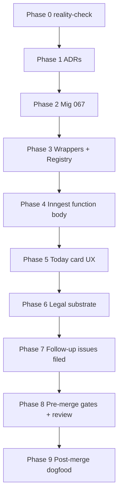

# Tasks — PR-B Anthropic SDK leader-prompt loop

Sequenced for `/work`. Phase order is load-bearing: ADRs land BEFORE SDK call (AC18); mig 067 BEFORE function-body change (AC3 columns must exist); wrappers BEFORE Inngest body (AC4/AC5 must be importable); Today card UX AFTER Inngest function (AC11 reads from the new columns).

## Phase 0 — Pre-implementation reality check

- [ ] **0.1** Re-confirm next free migration ordinal: `ls apps/web-platform/supabase/migrations/ | grep -oE "^[0-9]{3}" | sort -u | tail -3` should still show `065 066 067` (067 is next free). If `067_*` already exists in `origin/main`, abort and re-plan.
- [ ] **0.2** Re-confirm next free ADR ordinals: `ls knowledge-base/engineering/architecture/decisions/ | grep -oE "^ADR-[0-9]{3}" | sort -u | tail -3` should still show through `ADR-039`. If `ADR-040-*` or `ADR-041-*` already exists, abort and re-plan.
- [ ] **0.3** Reality-check sentinel (AC21): capture `git log --oneline --since="2026-05-25" origin/main -- apps/web-platform/server/inngest/functions/agent-on-spawn-requested.ts apps/web-platform/components/dashboard/today-card.tsx apps/web-platform/supabase/migrations/` for PR body. Already-known sibling: #4357.
- [ ] **0.4** Confirm Inngest function timeout cap on current tier supports 10min (AC7). Read `apps/web-platform/server/inngest/client.ts` for current `createFunction` defaults; raise to `"10m"` in commit 9.

## Phase 1 — ADRs (must land BEFORE any SDK call, AC18)

- [x] **1.1** Author `knowledge-base/engineering/architecture/decisions/ADR-040-anthropic-sdk-inside-inngest-leader-loop.md` per plan Phase 1 commit 1 spec (Context / Decision / Consequences / Alternatives sections).
- [x] **1.2** Author `knowledge-base/engineering/architecture/decisions/ADR-041-byok-cap-enforcement-model.md` per plan Phase 1 commit 2 spec.
- [x] **1.3** Create `scripts/check-adr-ordinals.sh` per AC18 script body. Make executable. Test locally — should pass against post-1.1/1.2 repo state. **[Done — pre-existing collisions on ADR-027/030/031/033/038 allowlisted in script; cleanup follow-up filed in Phase 7.]** Also created `scripts/check-pa-22.sh` for use in Phase 6.
- [x] **1.4** Wire `scripts/check-adr-ordinals.sh` into the lint/test workflow. **[Done — added `adr-ordinals` job to `.github/workflows/ci.yml`.]**
- [ ] **1.5** Commit ADRs + script in two commits (ADRs in one, script + CI wire in another for atomic revert).
- [ ] **1.6** Push to `feat-4379-anthropic-leader-loop` (`rf-before-spawning-review-agents-push-the` — push before any review or downstream work).

## Phase 2 — Migration 067 (AC3)

- [x] **2.1** Author `apps/web-platform/supabase/migrations/067_action_sends_leader_loop.sql` (up) per AC3 SQL body. NO outer BEGIN/COMMIT (Supabase runner wraps).
- [x] **2.2** Author `apps/web-platform/supabase/migrations/067_action_sends_leader_loop.down.sql` (down — drop 6 columns).
- [x] **2.3** Author `apps/web-platform/test/supabase-migrations/067-action-sends-leader-loop.test.ts` per AC3 (a-e) test specs. **[Done — 13 shape assertions, all green. Tests are static-shape (read SQL as text), not live-DB integration. Live-DB integration deferred to Phase 8 (TENANT_INTEGRATION_TEST).]**
- [ ] **2.4** Run `TENANT_INTEGRATION_TEST=1 npm test -- 067-action-sends-leader-loop.test.ts` against dev Supabase per `hr-dev-prd-distinct-supabase-projects`. RED first (test passes only after up-migration runs). **[Deferred to Phase 8 pre-merge — current test is static shape; live DB roundtrip is its own task.]**
- [ ] **2.5** Apply migration to dev Supabase via the standard runner. Verify schema diff against an existing dev row. **[Deferred to Phase 8 pre-merge.]**
- [x] **2.6** Commit + push.

## Phase 3 — Greenfield wrappers (AC4 / AC16 / AC2)

- [ ] **3.1** Author `apps/web-platform/server/byok-cap-rpc.ts` per AC4 signature + implementation (service-role + N2 invariant assertion).
- [ ] **3.2** Author `apps/web-platform/test/server/byok-cap-rpc.test.ts` per AC4 (a-d).
- [ ] **3.3** Run tests RED first; implement until GREEN.
- [ ] **3.4** Author `apps/web-platform/server/inngest/leader-prompts/prompt-assembly.ts` (PII-scrub + sanitization-parity sweep per AC16). Export `assemblePrompt(input: ClassInput, allowlistEmail: string | null): string`.
- [ ] **3.5** Author `apps/web-platform/test/server/inngest/leader-prompts/prompt-assembly-pii-scrub.test.ts` per AC16 sentinel.
- [ ] **3.6** Author `apps/web-platform/server/inngest/leader-prompts/index.ts` exporting `LeaderPromptModule` type + `PER_SPAWN_COST_CEILING_CENTS = 200` constant + 5 per-class registry imports.
- [ ] **3.7** Author the 5 per-class prompt modules per AC2 table:
  - **3.7.a** `engineering.pr_review_pending.ts` — Sonnet, tools `[createPullRequestReviewComment, createComment]`, system prompt enumerating both tools (AC2 sentinel requirement).
  - **3.7.b** `engineering.ci_failed.ts` — Sonnet, tools `[createComment]`.
  - **3.7.c** `triage.p0p1_issue.ts` — Haiku, tools `[addLabels, createComment]`.
  - **3.7.d** `security.cve_alert.ts` — Sonnet, tools `[createBranch, createBlob, createCommit, createPullRequest, createComment]`.
  - **3.7.e** `knowledge.kb_drift.ts` — Haiku, tools `[createBranch, createBlob, createCommit]`.
- [ ] **3.8** Author `apps/web-platform/test/server/inngest/leader-prompts/prompt-version-stability.test.ts` per AC2 sentinel (registry covers exactly 5 classes + each system prompt enumerates its tools).
- [ ] **3.9** Author `apps/web-platform/test/server/inngest/leader-prompts/tool-surface.test.ts` per AC8 sentinel (probeOctokit/new Octokit grep + per-class allowlist subset).
- [ ] **3.10** Commit + push.

## Phase 4 — Inngest function body replacement (AC1, AC5, AC6, AC7, AC8, AC10, AC17)

- [ ] **4.1** Edit `apps/web-platform/server/inngest/functions/agent-on-spawn-requested.ts`:
  - **4.1.a** Replace `step.run("post-acknowledgment", …)` body (lines 149-174) with the per-turn loop per AC1 steps 1-10.
  - **4.1.b** Keep `resolve-installation` step unchanged (I1).
  - **4.1.c** Mint `conversationId` via UUIDv5 per AC6.
  - **4.1.d** Use `runWithByokLease(...)` per-turn per AC1 step 5; lease scope closes BEFORE `step.run` returns.
  - **4.1.e** Call `persistTurnCost(...)` inside lease scope per AC5; cache_read + cache_creation tokens passed through.
  - **4.1.f** Resolve tool calls via per-class allowlist; out-of-allowlist → `failure_reason = "leader_tool_invalid"` per AC8 + AC10.
  - **4.1.g** Handle `stop_reason` switch: `end_turn` / `tool_use` / `max_tokens` per AC1 steps 7-9.
  - **4.1.h** Add `function.config.timeout: "10m"` per AC7.
  - **4.1.i** Extend `persistFailure` reason type to admit PR-B's new failure_reason values per AC10.
- [ ] **4.2** Author `apps/web-platform/test/server/inngest/agent-on-spawn-requested-leader-loop.test.ts` per AC1 (RED first):
  - **4.2.a** Replay determinism: turn-1 completes, turn-2 forced-fail, retry replays only turn-2.
  - **4.2.b** All 5 failure_reason outcomes covered (byok_cap_exceeded, cost_ceiling_exceeded, cancelled_by_operator, leader_max_turns_exceeded, leader_response_truncated, leader_tool_invalid, byok_lease_unavailable, anthropic_timeout, anthropic_rate_limited).
  - **4.2.c** Per-class happy path: one fixture per action class produces the expected `reversal_handles` shape per AC9.
  - **4.2.d** `cache_read_input_tokens` + `cache_creation_input_tokens` flow through `persistTurnCost` (mock the SDK call to return cache fields; assert RPC call args).
- [ ] **4.3** Implement until GREEN.
- [ ] **4.4** Run the `byok-audit-writer-sweep` lint (`apps/web-platform/test/server/byok-audit-writer-sweep.test.ts`) — must pass without the `byok-audit-writer-sweep: out-of-scope` marker on the new lease site (AC5).
- [ ] **4.5** Commit + push.

## Phase 5 — Today card UX (AC9, AC10, AC11, AC13, AC14, AC15)

- [ ] **5.1** Author `apps/web-platform/components/dashboard/failure-reason-copy.ts` per AC10 table.
- [ ] **5.2** Author `apps/web-platform/test/components/dashboard/failure-reason-copy.test.ts` (exhaustive coverage + Retry-eligibility per reason).
- [ ] **5.3** Extend `apps/web-platform/components/dashboard/today-card.tsx`:
  - **5.3.a** Add Supabase Realtime subscription on `action_sends` row (RLS-scoped).
  - **5.3.b** Implement state matrix per AC11 (7 rows, priority order).
  - **5.3.c** Stop button (AC13) — POST `/api/dashboard/today/[id]/cancel`.
  - **5.3.d** Undo button (AC14) — POST `/api/dashboard/today/[id]/undo`.
  - **5.3.e** Cost display (AC15) — GET `/api/dashboard/today/[id]/cost`; refresh on Realtime UPDATE.
  - **5.3.f** Polling fallback at 2s if Realtime subscription fails (spec FR3).
- [ ] **5.4** Author API routes per `cq-nextjs-route-files-http-only-exports`:
  - **5.4.a** `apps/web-platform/app/api/dashboard/today/[id]/cancel/route.ts` (AC13).
  - **5.4.b** `apps/web-platform/app/api/dashboard/today/[id]/undo/route.ts` (AC9 + AC14 — multi-handle reversal with per-element error handling + merged-PR guard).
  - **5.4.c** `apps/web-platform/app/api/dashboard/today/[id]/cost/route.ts` (AC15 — time-window join on `audit_byok_use`).
- [ ] **5.5** Author tests:
  - **5.5.a** `apps/web-platform/test/components/dashboard/today-card-state-matrix.test.ts` per AC11 (all 7 rows).
  - **5.5.b** `apps/web-platform/test/api/dashboard/today/[id]/cancel.test.ts` per AC13.
  - **5.5.c** `apps/web-platform/test/api/dashboard/today/[id]/undo.test.ts` per AC9 (all 5 classes × 6 edge cases).
  - **5.5.d** `apps/web-platform/test/api/dashboard/today/[id]/cost.test.ts` per AC15.
  - **5.5.e** `apps/web-platform/test/integration/today-card-cost-display-ordering.test.ts` per AC12.
- [ ] **5.6** Implement RED → GREEN. Integration test in 5.5.e validates the AC12 ordering invariant.
- [ ] **5.7** Commit + push.

## Phase 6 — Legal substrate (AC19)

- [ ] **6.1** Append `## Processing Activity 22 — Autonomous AI leader-prompt runtime (Anthropic SDK, PR-B #4124)` to `knowledge-base/legal/article-30-register.md` AFTER PA-21 (line 380). Sections (a)-(g) per existing PA-template; (g) TOMs enumerate the 10 controls listed in AC19.
- [ ] **6.2** Amend the Anthropic Vendor Mapping row at line 412: add `PA-22 (autonomous leader-prompt runtime under operator BYOK)` to the Activities column.
- [ ] **6.3** Author `scripts/check-pa-22.sh` (sentinel grep per AC19) and wire to CI.
- [ ] **6.4** Verify Anthropic Zero-Retention amendment status (AC20 — operator step). Update PA-22 (f) with: SIGNED date OR UNSIGNED gap note + reference to consent-banner Non-Goal #2.
- [ ] **6.5** Commit + push.

## Phase 7 — Follow-up issues (Non-Goals 1-14)

Per `wg-block-pr-ready-on-undeferred-operator-steps` + `wg-when-deferring-a-capability-create-a`: file each Non-Goal as a separate GitHub issue BEFORE marking the PR Ready.

- [ ] **7.1** Non-Goal 1: full DPIA on PA-22.
- [ ] **7.2** Non-Goal 2: consent banner + ToS clause update.
- [ ] **7.3** Non-Goal 3: GDPR Art. 22 automated-decisioning analysis.
- [ ] **7.4** Non-Goal 4: per-class max-turns caps.
- [ ] **7.5** Non-Goal 5: per-class brand-survival tiering.
- [ ] **7.6** Non-Goal 6: cross-installation spawn.
- [ ] **7.7** Non-Goal 7: per-founder spawn quota / rate-limit.
- [ ] **7.8** Non-Goal 8: transactional outbox between `action_sends` INSERT and `inngest.send`.
- [ ] **7.9** Non-Goal 9: WS-push channel.
- [ ] **7.10** Non-Goal 10: prompt fixture/regression infrastructure.
- [ ] **7.11** Non-Goal 11: per-vendor DPA file scaffolding.
- [ ] **7.12** Non-Goal 12: CVSS classification source-of-truth.
- [ ] **7.13** Non-Goal 13 (plan-time): Inngest Realtime swap evaluation.
- [ ] **7.14** Non-Goal 14 (plan-time): prompt fixture regression suite (golden-file tests).

## Phase 8 — Pre-merge gates & review

- [ ] **8.1** Run full pre-merge sentinel sweep per plan "Pre-merge sentinel sweep" section.
- [ ] **8.2** Run review agents (PR-time): `data-integrity-guardian`, `security-sentinel`, `observability-coverage-reviewer`, `user-impact-reviewer`, `architecture-strategist`. `user-impact-reviewer` must explicitly affirm AC22 CPO-1..5.
- [ ] **8.3** Resolve all review findings inline per `rf-review-finding-default-fix-inline`.
- [ ] **8.4** Update PR body: Closes #4379 + reality-check sentinel output (AC21) + Zero-Retention checkbox (AC20) + ADR-040/041/PA-22 cross-references + Non-Goal issue list.
- [ ] **8.5** Run `skill: soleur:ship` — enforces Phase 5.5 + lifecycle checklist.
- [ ] **8.6** Mark Ready for review only after all Non-Goal issues are filed (per Phase 7) and operator has verified Zero-Retention (AC20).

## Phase 9 — Dogfood + post-merge

- [ ] **9.1** Operator clicks each of 5 spawn-button shapes on Today card (e2e dogfood per plan Test Plan §e2e).
- [ ] **9.2** Verify each AC11 state matrix row renders correctly.
- [ ] **9.3** Verify Undo for each class reverses the artifact on GitHub.
- [ ] **9.4** Verify Stop terminates within one turn boundary.
- [ ] **9.5** Verify Cost displays cumulative spend matching Anthropic Console.
- [ ] **9.6** Capture learnings via `/compound` if any surprises (especially `stop_reason="max_tokens"` real-world behavior, prompt-caching cost reduction, Realtime RLS subscription behavior).

## Dependencies

