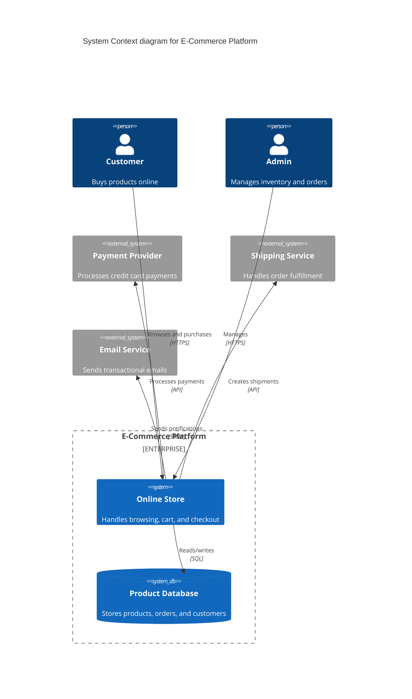

# C4 Model — Mermaid Syntax Reference

Mermaid supports native C4 diagram types. Use these instead of generic `graph` diagrams for architecture documentation.

## Diagram Types

| Level | Keyword | Purpose |
|-------|---------|---------|
| 1 — Context | `C4Context` | Who uses the system and what other systems it interacts with |
| 2 — Container | `C4Container` | Applications, data stores, and services inside the system boundary |
| 3 — Component | `C4Component` | Internal components within a single container |
| Dynamic | `C4Dynamic` | Runtime interaction sequences (numbered steps) |
| Deployment | `C4Deployment` | Infrastructure mapping (nodes, environments) |

## Element Syntax

### Persons

```text
Person(alias, "Label", "Description")
Person_Ext(alias, "Label", "Description")
```

### Systems (Level 1)

```text
System(alias, "Label", "Description")
System_Ext(alias, "Label", "Description")
SystemDb(alias, "Label", "Description")
SystemDb_Ext(alias, "Label", "Description")
SystemQueue(alias, "Label", "Description")
```

### Containers (Level 2)

```text
Container(alias, "Label", "Technology", "Description")
Container_Ext(alias, "Label", "Technology", "Description")
ContainerDb(alias, "Label", "Technology", "Description")
ContainerDb_Ext(alias, "Label", "Technology", "Description")
ContainerQueue(alias, "Label", "Technology", "Description")
```

### Components (Level 3)

```text
Component(alias, "Label", "Technology", "Description")
Component_Ext(alias, "Label", "Technology", "Description")
ComponentDb(alias, "Label", "Technology", "Description")
ComponentQueue(alias, "Label", "Technology", "Description")
```

## Boundaries

```text
Enterprise_Boundary(alias, "Label") { ... }
System_Boundary(alias, "Label") { ... }
Container_Boundary(alias, "Label") { ... }
Boundary(alias, "Label", "type") { ... }
```

## Relationships

```text
Rel(from, to, "Label")
Rel(from, to, "Label", "Protocol/Technology")
Rel_Back(from, to, "Label")
Rel_Neighbor(from, to, "Label")
BiRel(from, to, "Label")
```

## Styling

```text
UpdateElementStyle(alias, $fontColor="red", $bgColor="grey", $borderColor="red")
UpdateRelStyle(from, to, $textColor="blue", $lineColor="blue", $offsetX="10", $offsetY="-40")
UpdateLayoutConfig($c4ShapeInRow="3", $c4BoundaryInRow="1")
```

## Complete Example (System Context)



## C4 Level Guidelines

- **Level 1 (Context)**: Show the system as a single box. Focus on external actors and systems.
- **Level 2 (Container)**: Zoom into the system. Show applications, databases, message queues.
- **Level 3 (Component)**: Zoom into one container. Show internal classes/modules. Use sparingly — these rot fast.
- **Avoid Level 4 (Code)**: Class diagrams at this level are better served by IDE tools.
